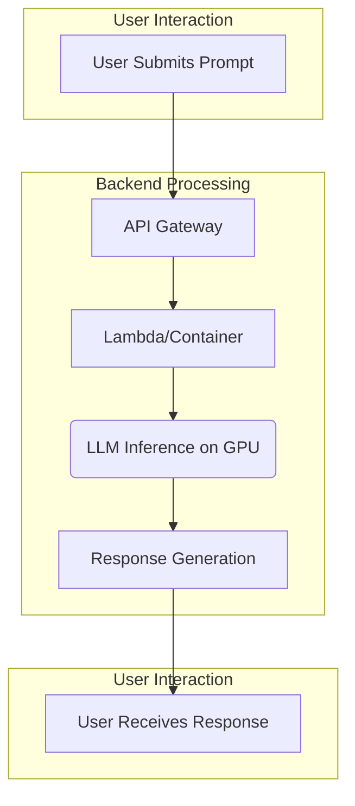
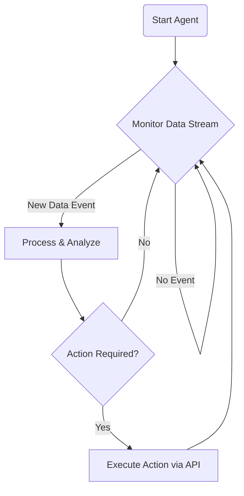
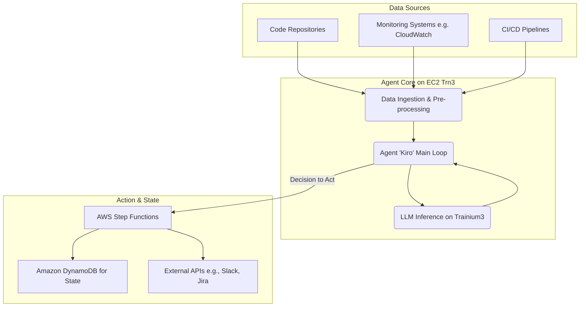

# Beyond Chatbots: The Economics of Deploying Agent Fleets on AWS Trainium3

The AI landscape has been dominated by the user-driven, conversational model of chatbots. We ask, it answers. This "burst" compute model, while powerful, is only the beginning. The next frontier is the deployment of persistent, autonomous AI agents—systems that continuously monitor, reason, and act on our behalf. However, their "sustained" compute requirements have made them prohibitively expensive at scale. This is where custom silicon, specifically AWS's anticipated Trainium3, is set to rewrite the rules of AI economics.

This article dissects the fundamental shift in compute paradigms from chatbots to agents and analyzes how purpose-built hardware like Trainium3 will make large-scale "agent fleets" economically viable, heralding a new era of autonomous enterprise AI by 2026.

### What You’ll Get

*   **Core Concepts:** A clear distinction between the "burst" compute of chatbots and the "sustained" compute of AI agents.
*   **Economic Analysis:** How purpose-built chips like AWS Trainium3 can drastically lower the Total Cost of Ownership (TCO) for persistent AI workloads.
*   **Technical Architecture:** A high-level blueprint for deploying an agent fleet on AWS, leveraging Trainium3-powered instances.
*   **Forward-Looking Insights:** A data-driven argument for why 2026 will be the inflection point for the widespread adoption of agent fleets.

---

## The Tale of Two Workloads: Burst vs. Sustained Compute

Not all AI inference is created equal. The workload profile of a user-facing chatbot is fundamentally different from that of an autonomous agent operating in the background. Understanding this difference is key to grasping the economic challenge.

### The Chatbot: A Sprinter

A chatbot's life is a series of short, intense sprints. It remains idle until a user submits a query, then springs into action to generate a response as quickly as possible.

*   **Workload Pattern:** Transactional and event-driven.
*   **Key Metric:** Low latency (time-to-first-token).
*   **Resource Utilization:** Spiky and unpredictable.
*   **Cost Driver:** Paying for powerful, often underutilized, GPUs to be on standby for instant response.

This flow is optimized for responsiveness, often at the expense of sustained throughput.



### The AI Agent: A Marathon Runner

An autonomous agent, like a hypothetical code monitor named *Kiro*, runs a marathon. It is *always on*, continuously ingesting data streams, maintaining context, and deciding when to act.

*   **Workload Pattern:** Persistent and continuous.
*   **Key Metric:** High throughput and low TCO.
*   **Resource Utilization:** Stable and predictable.
*   **Cost Driver:** The sheer volume of constant processing. Running a high-end GPU 24/7 for this task is an economic non-starter.

The agent's "thought loop" is a constant cycle of observation and action, making cost-per-inference the most critical economic factor.



---

## Enter AWS Trainium3: The Economic Game-Changer

General-purpose GPUs are brilliant for a wide range of tasks but are not always the most cost-effective solution for sustained, high-volume inference. AWS developed its custom silicon—Inferentia for inference and Trainium for training—to address this. The anticipated third generation, Trainium3, is poised to unlock the agent fleet by directly targeting the economics of sustained workloads.

While Trainium chips are designed for training, their architecture is also exceptionally efficient for high-throughput inference tasks, a pattern AWS has established with its silicon portfolio. The performance metrics projected for such a chip completely change the economic equation.

> **Info:** While AWS has officially announced Trainium2, this article's analysis projects forward to a "Trainium3" by 2026, building on the established trajectory of performance and cost improvements seen with AWS's custom silicon. The core argument rests on the impact of purpose-built hardware.

### Taming Inference Costs

The core value proposition is simple: dramatically better performance per dollar and performance per watt for specific AI workloads. Based on the trajectory of AWS silicon, a future Trainium3 chip could deliver:

*   **A 4.4x Performance Boost:** For high-throughput inference, purpose-built hardware can process tokens far more efficiently than general-purpose hardware by optimizing data paths and instruction sets.
*   **A 50% Cost Reduction:** This comes from a combination of lower hardware costs, significantly better energy efficiency, and higher density (more performance in a smaller physical and power footprint).

This isn't magic; it's the result of specialization. By focusing solely on accelerating ML models, custom silicon sheds the overhead of a general-purpose GPU. This is all integrated through the **AWS Neuron SDK**, which compiles and optimizes models to run on Trainium and Inferentia hardware.

### Comparison: GPU vs. Trainium3 for Agent Workloads

| Metric | General-Purpose GPU (e.g., NVIDIA H100) | AWS Trainium3 (Projected) | Advantage for Agent Fleets |
| :--- | :--- | :--- | :--- |
| **Primary Use Case** | Versatile (Training, HPC, Graphics, Inference) | Optimized for Training & High-Throughput Inference | Specialization drives efficiency. |
| **Cost Model** | High acquisition and operational cost. | Lower TCO through power efficiency & price. | **Dramatic cost reduction.** |
| **Performance Profile** | Excellent low-latency for single requests. | Optimized for massive parallel throughput. | Aligns perfectly with agent workloads. |
| **Energy Consumption**| High (e.g., 700W TDP) | Significantly lower power per inference. | **Lower opex and better sustainability.** |

---

## Architecting an Agent Fleet on AWS

With the economics solved, the architectural patterns for deploying agent fleets become practical. An agent like *Kiro*, tasked with monitoring a fleet of microservices, would fit into a larger ecosystem.

### Core Components

A robust agent architecture on AWS would likely involve these services:

*   **Data Ingest:** Amazon Kinesis or S3 Events to capture real-time logs, metrics, or code commits.
*   **Agent Core:** An Amazon EC2 instance powered by Trainium3 (e.g., a future `Trn2` or `Trn3` instance type) running the agent's main logic and the LLM.
*   **State Management:** Amazon DynamoDB or ElastiCache to maintain the agent's long-term memory and context.
*   **Action Orchestration:** AWS Step Functions or Lambda to execute tasks, call external APIs, or trigger alerts based on the agent's decisions.

Here is a high-level view of the architecture:



The agent's logic itself could be a persistent process running on the Trainium3 instance, executing a continuous loop.

```python
# Simplified pseudo-code for an agent's main loop
import agent_llm
import data_stream

def main():
    # Initialize the model on the Trainium3 device
    model = agent_llm.load_model(device="trn3")
    
    while True:
        # 1. Observe: Non-blocking check for new data
        events = data_stream.get_new_events()
        
        if not events:
            continue
            
        # 2. Orient: Use the LLM to analyze the situation
        context = "Current system state is stable. Analyzing new events."
        analysis = model.infer(events, context)
        
        # 3. Decide: Determine if an action is needed
        if analysis.requires_action:
            # 4. Act: Trigger an external workflow
            execute_action(analysis.action_plan)

if __name__ == "__main__":
    main()
```

## The 2026 Prediction: The Rise of the Agent Fleet

The transition from single chatbots to collaborative agent fleets is not a question of *if*, but *when*. The primary barrier has been economic. Running hundreds of persistent agents on today's leading-edge GPUs would be financially unsustainable for most organizations.

> By fundamentally altering the cost-per-inference for sustained workloads, custom silicon like AWS Trainium3 removes this economic barrier. This paves the way for 2026 to become the year of the **Agent Fleet**, where organizations deploy swarms of specialized agents to automate and optimize complex business processes.

Imagine fleets of agents dedicated to:
*   **Cybersecurity:** Continuously monitoring network traffic for anomalies.
*   **Supply Chain:** Adjusting logistics in real-time based on weather and demand signals.
*   **Software Development:** Reviewing code commits, identifying potential bugs, and managing deployments.

This is the future that cost-effective, high-throughput inference unlocks.

## Summary: The Path Forward

The dominance of the chatbot paradigm has shaped our initial understanding of AI's operational costs. However, the future lies with persistent, autonomous agents that demand a different economic and architectural approach.

*   **Agents are marathon runners, not sprinters.** Their sustained compute profile makes TCO, not just latency, the critical metric.
*   **General-purpose GPUs are not the optimal tool for the job.** They are too expensive and power-hungry for continuous, at-scale agent workloads.
*   **Custom silicon is the key.** AWS Trainium3 and similar hardware are engineered to deliver the performance-per-dollar needed to make agent fleets economically viable.

By preparing for this shift, organizations can move beyond simple conversational AI and begin building the autonomous systems that will define the next decade of technological advantage. The hardware is arriving, and the economics are finally making sense.


## Further Reading

- https://www.webpronews.com/aws-ceo-unveils-ai-agents-at-reinvent-2025-amid-enterprise-push/
- https://www.techi.com/amazon-stock-growth-forecast-aws-reinvent/
