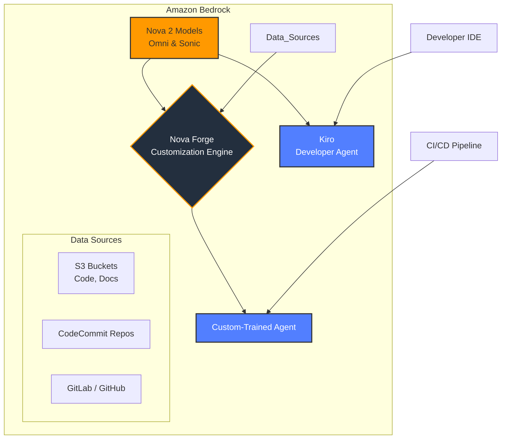
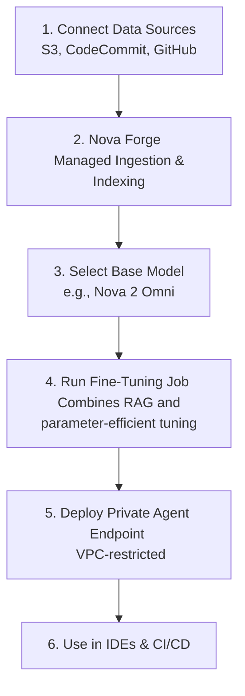

# Meet Kiro and Nova: Inside AWS's New Frontier Agent Ecosystem

AWS re:Invent 2025 has concluded, and the standout announcement was not just a new model or service, but a complete, vertically integrated ecosystem for building and deploying AI agents. The "Frontier Agent" initiative, built on Amazon Bedrock, introduces **Kiro**, a sophisticated AI developer agent, and the **Nova 2** series of foundation models.

This new ecosystem signals a clear shift in strategy from foundational models as a service (FMaaS) to purpose-built, autonomous agents that can reason, plan, and execute complex tasks. For developers and enterprises, this means moving from prompting models to collaborating with agents.

### What You’ll Get

This article breaks down the key components of the AWS Frontier Agent ecosystem. Here’s what you'll learn:

- **Ecosystem Overview**: A high-level look at how Kiro, Nova 2, and Nova Forge fit together.
- **Kiro Deep Dive**: The capabilities and workflow of AWS's new AI software development agent.
- **Nova 2 Models**: A comparison of the powerhouse `Omni` model and the low-latency `Sonic` model.
- **Nova Forge Explained**: How enterprises can securely customize these agents with proprietary data.
- **Practical Workflow**: A step-by-step example of using the ecosystem for a real-world task.

## The Frontier Agent Ecosystem: A Paradigm Shift

The Frontier Agent ecosystem is designed as a cohesive stack within Amazon Bedrock. It provides the models, tools, and agents needed to move beyond simple text generation and into automated task completion.

The core components are:

1.  **Nova 2 Models**: The foundational intelligence layer.
2.  **Nova Forge**: The customization and fine-tuning engine.
3.  **Kiro (and Custom Agents)**: The application layer where agents perform tasks.

This architecture allows organizations to build on powerful, general-purpose models and securely adapt them for highly specific, proprietary workflows.



## Kiro: Your AI Software Development Partner

**Kiro** is an AI agent designed to function as a full-fledged member of a development team. It's not just a code completion tool; it's an autonomous agent with access to a sandboxed environment, including a file system, terminal, and AWS SDKs. It integrates directly into VS Code, JetBrains IDEs, and AWS CodeCatalyst.

### Core Capabilities

- **Multi-File Context**: Kiro can read, understand, and modify entire codebases, not just the active file.
- **Autonomous Debugging**: Given a failing test or a bug report, Kiro can form a hypothesis, write debugging code, inspect logs, and propose a fix with a corresponding pull request.
- **Test Generation**: Kiro can analyze existing code (e.g., `main.py`) and generate a comprehensive test suite (`test_main.py`) covering edge cases and happy paths.
- **Refactoring and Modernization**: It can execute complex refactoring tasks, like converting a monolith's data access layer into a separate microservice or upgrading a codebase from Python 3.8 to 3.11.
- **Architectural Planning**: You can provide Kiro a high-level goal, and it will generate a plan, stub out the necessary AWS infrastructure using CDK, and create skeleton code for Lambda functions and API Gateway endpoints.

> **Info Block:** Kiro's key differentiator is its ability to _plan and execute_. It creates a task list, validates each step, and can self-correct if it encounters an error, mimicking a human developer's workflow.

### Example: Generating a Lambda Function

A developer might prompt Kiro directly in their IDE:

> "Create a Python Lambda function using the AWS SDK (Boto3) that takes an S3 object key from an event, reads the object's content, and logs the first 500 characters. Include type hints, logging, and error handling."

Kiro would not only generate the code but also create the file (`s3_logger/app.py`) and a basic `requirements.txt`.

```python
# s3_logger/app.py

import boto3
import logging
from typing import Dict, Any

# Configure logging
logger = logging.getLogger()
logger.setLevel(logging.INFO)

s3_client = boto3.client('s3')

def lambda_handler(event: Dict[str, Any], context: object) -> Dict[str, Any]:
    """
    Handles an S3 event, reads the specified object, and logs its initial content.
    """
    try:
        # Extract bucket and key from the event record
        s3_record = event['Records'][0]['s3']
        bucket_name = s3_record['bucket']['name']
        object_key = s3_record['object']['key']

        logger.info(f"Processing object {object_key} from bucket {bucket_name}")

        # Get the S3 object
        response = s3_client.get_object(Bucket=bucket_name, Key=object_key)

        # Read and decode the content
        content = response['Body'].read().decode('utf-8')

        # Log the first 500 characters
        log_preview = content[:500]
        logger.info(f"Object content preview:\n{log_preview}")

        return {
            'statusCode': 200,
            'body': f"Successfully processed {object_key}"
        }

    except Exception as e:
        logger.error(f"Error processing S3 object: {e}")
        # Re-raise the exception to trigger Lambda retries if configured
        raise e
```

## The Powerhouse Models: Nova 2 Omni and Sonic

Underpinning the entire ecosystem are two new flagship foundation models in the Nova family. Enterprises can choose the right model for their agent's specific needs, balancing performance, cost, and capability.

| Feature              | Nova 2 Omni                                   | Nova 2 Sonic                                   |
| -------------------- | --------------------------------------------- | ---------------------------------------------- |
| **Primary Use Case** | Complex reasoning, planning, multi-step tasks | Low-latency, high-throughput interactions      |
| **Modality**         | Text, Code, Image, Audio, Video (input)       | Text, Code                                     |
| **Context Window**   | 2 Million tokens                              | 256,000 tokens                                 |
| **Speed / Latency**  | Optimized for accuracy and depth              | Optimized for real-time responses (p99 <500ms) |
| **Best For**         | Kiro, strategic planning agents, R&D          | Chatbots, RAG, code completion, API agents     |

**Nova 2 Omni** is the brain behind Kiro, capable of understanding vast codebases and complex problem descriptions. **Nova 2 Sonic** is built for speed, making it ideal for interactive tools and customer-facing agents where response time is critical.

## Nova Forge: Customizing Agents with Your Data

The most powerful generic agent is useless if it doesn't understand your company's unique context—internal APIs, legacy codebases, and proprietary business logic. **Nova Forge** is the managed service within Bedrock that solves this problem.

Nova Forge allows you to create specialized versions of agents like Kiro by fine-tuning them on your own data without that data ever leaving your AWS environment.

### The Fine-Tuning Process

The process is designed for security and simplicity, abstracting away the complex MLOps.



The key security feature is that the entire process, from data ingestion to endpoint deployment, can be contained within your VPC. The base Nova 2 model is customized with your data through a combination of Retrieval Augmented Generation (RAG) for factual recall and parameter-efficient fine-tuning (PEFT) for stylistic and behavioral adaptation.

### Example Use Case

A large e-commerce company has a 15-year-old monolithic Perl backend and a complex set of internal fulfillment APIs.

1.  They connect their private Git repositories and internal API documentation (stored in S3) to **Nova Forge**.
2.  They run a tuning job on **Nova 2 Omni**, creating a new agent model named `ecom-agent-v1`.
3.  This new agent understands their specific database schemas, API authentication methods, and coding conventions.
4.  Their developers can now ask their custom Kiro agent: _"Refactor the `process_order` module from Perl into a TypeScript microservice using our internal `Fulfillment-v3` API."_
5.  The agent, armed with the custom knowledge, can perform this task accurately, something a generic model could never do.

## Key Takeaways and Future Outlook

The AWS Frontier Agent ecosystem is a bold step towards a future where AI agents are first-class citizens in software development and enterprise automation.

- **It’s an Ecosystem, Not a Model**: The true power lies in the integration of Kiro (the agent), Nova 2 (the brain), and Nova Forge (the customizer).
- **Autonomy is the Goal**: AWS is providing tools for building agents that can plan, act, and solve problems independently, reducing developer toil.
- **Enterprise-Grade Security**: With Nova Forge, AWS directly addresses the core enterprise concern of data privacy, ensuring proprietary information can be used for customization without being exposed.

Announced at re:Invent 2025, the Frontier Agent ecosystem is currently in private preview for select customers, with a public release expected in Q2 2026. This is one of the most significant developments to come out of AWS in years, and it has the potential to fundamentally change how we build and maintain software.

## Further Reading

- https://www.eweek.com/news/aws-reinvent-2025-roundup-neuron/
- https://aws.amazon.com/blogs/aws/top-announcements-of-aws-reinvent-2025/
