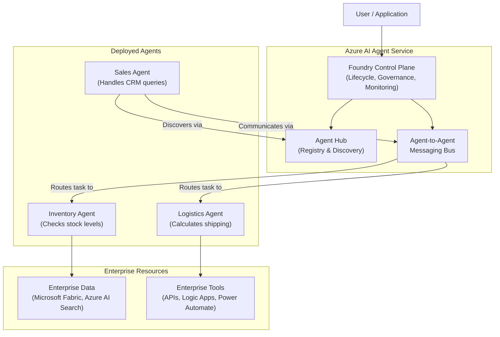
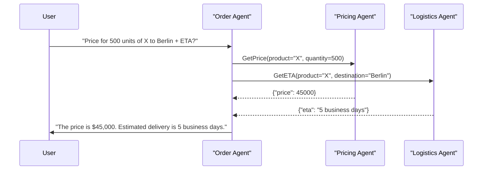

# Orchestrating the Enterprise: A Deep Dive into Azure AI Agent Service

The era of monolithic AI assistants is drawing to a close. While standalone copilots and chatbots have demonstrated the power of Large Language Models (LLMs), they often operate in silos, unable to tackle the complex, multi-domain problems that define modern enterprises. Microsoft's announcement at Ignite 2025 signals a paradigm shift: the introduction of the **Azure AI Agent Service**, a managed platform designed for building, deploying, and orchestrating a fleet of specialized AI agents.

This service moves beyond single-prompt, single-response interactions. It provides the framework for agents to communicate, collaborate, and delegate tasks, mirroring the structure of a human organization. This article breaks down the architecture of this new service, focusing on its core components—the Foundry control plane and agent-to-agent messaging—and explains how it solves the critical orchestration challenge for enterprise AI.

### What You’ll Get

*   **Architectural Breakdown:** A clear visual and textual explanation of the Azure AI Agent Service.
*   **The Foundry Explained:** An in-depth look at the control plane for managing agent lifecycles.
*   **Agent-to-Agent Messaging:** Understanding the core mechanism for collaborative AI.
*   **Practical Examples:** Code snippets and diagrams illustrating how agents are defined and interact.
*   **Key Differentiators:** A direct comparison against traditional, standalone LLM application development.

---

## The Orchestration Gap: Beyond Standalone Agents

Deploying a single RAG-powered chatbot is now a solved problem. The real enterprise challenge lies in coordinating multiple AI systems to execute complex business processes.

Before the AI Agent Service, organizations faced significant hurdles:
*   **Brittle Integrations:** Hard-coding connections between different AI services, leading to maintenance nightmares.
*   **Redundant Knowledge:** Each agent needing its own isolated connection to data sources and tools, creating inconsistency.
*   **Lack of a Common Language:** No standardized protocol for agents to discover each other's capabilities or exchange complex data.
*   **Complex State Management:** Manually tracking the state of a multi-step process across different models and APIs.

This created a "chaining" model where a developer would manually string API calls together. The Azure AI Agent Service replaces this with a dynamic, event-driven "collaboration" model.

## Introducing the Azure AI Agent Service Architecture

The Azure AI Agent Service is a fully managed environment that provides the infrastructure for a multi-agent ecosystem. At its heart, it is an orchestration engine that intelligently routes tasks between different specialized agents.

This high-level architecture shows how the components interact:



The service isn't just a wrapper for an LLM; it's a complete operating system for enterprise agents. The [official announcement at Ignite](https://azure.microsoft.com/en-us/blog/announcing-azure-copilot-agents-and-ai-infrastructure-innovations/) laid the groundwork for this, and the full service brings that vision to life.

## The Foundry: Your Agent Control Plane

The **Foundry** is the management and governance layer of the service. Think of it as the "Kubernetes for AI Agents." It provides a centralized interface for developers and administrators to manage the entire lifecycle of their agent fleet.

### ### Agent Lifecycle Management
The Foundry formalizes the process of creating and deploying agents. Instead of ad-hoc scripts, you get a structured workflow:
1.  **Define:** Specify an agent's capabilities, tools, and data sources using a declarative YAML or JSON format.
2.  **Test:** Use the integrated studio to evaluate agent performance, test tool integrations, and debug prompts in a sandboxed environment.
3.  **Deploy:** Push the agent to the Agent Hub, making it discoverable by other agents. The Foundry handles the underlying compute and scaling.
4.  **Monitor:** Track performance, token consumption, tool execution failures, and overall costs through an integrated Azure Monitor dashboard.

### ### The Agent Hub & Registry
At the core of the Foundry is the **Agent Hub**. This is a private, enterprise-wide registry for all AI assets.
*   **Agents:** Stores versioned definitions of every deployed agent.
*   **Tools:** A catalog of available functions (e.g., API connections, database lookups) that agents can be granted access to.
*   **Prompts:** A library of version-controlled, reusable system prompts and prompt templates, promoting consistency.

This registry is fundamental to agent-to-agent communication, as it allows agents to dynamically discover and invoke others based on their registered capabilities.

## The Core Innovation: Agent-to-Agent Messaging 🧠

This is where the magic happens. The service includes a managed messaging bus that allows agents to communicate asynchronously. This enables complex task decomposition.

Consider a user query: *"Can I get a price for 500 units of product X shipped to Berlin, and what's the ETA?"*

A single, monolithic agent would struggle. An orchestrated fleet of agents handles it seamlessly:

1.  The user's request is first routed by the Foundry to a primary **"Order Agent."**
2.  The Order Agent parses the request and identifies three sub-tasks. It doesn't know *how* to do them, but it knows what capabilities it needs.
3.  It queries the Agent Hub for agents with "pricing" and "logistics" capabilities.
4.  It sends two concurrent messages over the bus:
    *   A message to the **"Pricing Agent"** with `{"product": "X", "quantity": 500}`.
    *   A message to the **"Logistics Agent"** with `{"product": "X", "destination": "Berlin"}`.
5.  The Pricing and Logistics agents execute their specialized tasks independently, using their respective tools and data sources.
6.  They return their results (price and ETA) to the Order Agent, which synthesizes them into a single, coherent answer for the user.

This flow can be visualized with a sequence diagram:



### ### Defining an Agent's Capabilities

An agent is defined declaratively, specifying its purpose, tools, and the events it listens for. Here is a simplified YAML example of what the Pricing Agent's definition might look like:

```yaml
# agent.pricing.yml
apiVersion: ai.azure.com/v1
kind: Agent
metadata:
  name: pricing-agent-v2
spec:
  description: "Calculates bulk pricing for products based on quantity and customer tier."
  model:
    deployment: gpt-4-turbo
    temperature: 0.2
  tools:
    - name: query_discount_database
      type: azure_function
      endpoint: "https://fn-discounts.azurewebsites.net/api/calculate"
  triggers:
    - type: event_bus
      event_name: "GetPrice"
      input_schema:
        type: object
        properties:
          product: { type: string }
          quantity: { type: integer }
```

This declarative approach separates the "what" from the "how," making the entire system more modular and maintainable. You can find more details on agent definition in the [Azure AI Foundry documentation](https://learn.microsoft.com/en-us/azure/ai-foundry/agents/overview?view=foundry-classic).

## How This Changes the Game

The Azure AI Agent Service isn't an incremental improvement; it's a foundational shift in how enterprise AI is built.

| Feature | Standalone LLM App (The Old Way) | Azure AI Agent Service (The New Way) |
| :--- | :--- | :--- |
| **Orchestration** | Manual, hard-coded Python chains (e.g., LangChain/Semantic Kernel) | Managed, event-driven orchestration via messaging bus. |
| **Scalability** | Monolithic; scales as a single unit. | Microservice-based; each agent scales independently. |
| **Reusability** | Logic is tightly coupled within the app. | Agents and tools are registered and discoverable, promoting reuse. |
| **Governance** | Decentralized; each app has its own security and logging. | Centralized control via the Foundry for security, monitoring, and cost. |
| **Task Complexity** | Limited to what one model/prompt can handle. | Solves complex, multi-domain problems via agent collaboration. |

> **Quote:** "We're moving from building intelligent applications to building intelligent organizations. The Azure AI Agent Service provides the nervous system for that organization." - *Fictional quote from a Microsoft Ignite 2025 Keynote*

## Conclusion 🚀

The Azure AI Agent Service is Microsoft's answer to the enterprise orchestration problem. By providing a managed control plane (Foundry), a discovery mechanism (Agent Hub), and a robust communication backbone (Messaging Bus), it allows developers to stop wrestling with infrastructure and start building sophisticated, collaborative AI systems.

This move from standalone models to an ecosystem of interoperable agents is the next logical step in the evolution of AI. It paves the way for building truly autonomous systems that can manage complex business processes, adapt to new information, and drive value at a scale previously unimaginable. The era of the AI-powered enterprise is here, and it will be orchestrated.


## Further Reading

- https://learn.microsoft.com/en-us/azure/ai-foundry/agents/overview?view=foundry-classic
- https://azure.microsoft.com/en-us/blog/announcing-azure-copilot-agents-and-ai-infrastructure-innovations/
