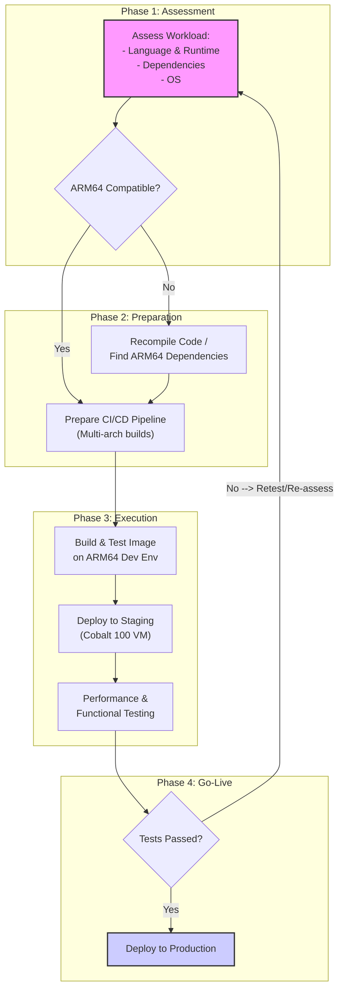

# ARM in the Cloud: Migrating Workloads to Azure Cobalt 100 VMs

The cloud computing landscape is undergoing a fundamental shift. For years, the x86 architecture has been the undisputed king of the data center. Now, ARM-based processors are making a powerful entrance, promising unprecedented efficiency and performance-per-watt. At the forefront of this evolution is Microsoft's Azure Cobalt 100, a custom-built 64-bit ARM CPU designed to power a new generation of Azure Virtual Machines.

This guide provides a practitioner-focused playbook for understanding, evaluating, and migrating your workloads to Azure's Cobalt 100 VMs. We'll cut through the hype to deliver actionable insights on a technology that is reshaping cloud infrastructure, cost models, and sustainability practices.

### What You’ll Get

- **Core Benefits:** A clear breakdown of why Cobalt 100 is a game-changer for performance, cost, and energy efficiency.
- **Migration Playbook:** A step-by-step process for assessing and moving your applications to ARM64 on Azure.
- **Practical Code Examples:** Actionable Azure CLI and Docker commands to get you started.
- **Visualized Workflow:** A Mermaid diagram illustrating the end-to-end migration path.
- **Key Challenges:** A realistic look at potential hurdles and how to navigate them.

## The ARM Advantage: Why Azure Cobalt 100 Matters

Azure Cobalt 100 isn't just another CPU. It's Microsoft's custom silicon, built on the Arm Neoverse Compute Subsystem (CSS) platform. This allows Microsoft to optimize the hardware specifically for its cloud environment, delivering significant advantages over general-purpose x86 processors for a wide range of workloads.

The primary benefits boil down to three key areas:

- **Performance Efficiency:** Cobalt 100 is engineered for scale-out applications. Microsoft claims it delivers **up to 40% better performance** compared to previous-generation Azure ARM-based VMs. This makes it ideal for web servers, microservices, containerized applications, and open-source databases.
- **Cost Savings:** Higher performance at lower power consumption translates directly into better price-performance. By running workloads more efficiently, you can often use smaller or fewer VM instances to achieve the same or better results, reducing your overall cloud spend.
- **GreenOps & Sustainability:** Power consumption is a major operational cost and environmental concern in data centers. The performance-per-watt of ARM chips is their signature feature. Migrating to Cobalt 100 VMs is a tangible step toward reducing your application's carbon footprint.

> **Info Block: Embracing GreenOps**
> GreenOps is an emerging practice that applies DevOps principles to sustainability. By optimizing for energy efficiency with hardware like Cobalt 100, engineering teams can directly contribute to their organization's environmental, social, and governance (ESG) goals without sacrificing performance. It's about making sustainability a first-class metric in software architecture and operations.

### Performance at a Glance: Cobalt 100 vs. x86

The new Cobalt 100-powered VMs are part of the **Dpsv6 and Epsv6-series**. Let's compare a general-purpose Cobalt 100 instance with its x86-based counterpart.

| Feature               | Dpsv6 Series (ARM64)                               | Dpsv5 Series (x86-64)     | Key Difference                                                             |
| --------------------- | -------------------------------------------------- | ------------------------- | -------------------------------------------------------------------------- |
| **Processor**         | Azure Cobalt 100 (ARM)                             | 3rd Gen Intel Xeon        | Custom silicon optimized for scale-out workloads vs. general-purpose CPU.  |
| **vCPU:Memory Ratio** | 1:4 GiB                                            | 1:4 GiB                   | Similar memory ratios, making for an easy comparison in resource planning. |
| **Performance Claim** | Up to 40% improvement                              | Baseline                  | Significant uplift for compatible workloads.                               |
| **Target Workloads**  | Web servers, containers, OSS databases, .NET, Java | General purpose workloads | Cobalt 100 excels at throughput-oriented, parallelizable tasks.            |

_Note: Performance gains are highly dependent on the specific workload. Always benchmark your own applications._ For more details, see the [official Azure Cobalt 100 overview](https://learn.microsoft.com/en-us/azure/virtual-machines/sizes/cobalt-overview).

## The Migration Playbook: Moving to Cobalt 100

Migrating to a new architecture requires a structured approach. The key is to assess compatibility, prepare your tooling, and test thoroughly.

### High-Level Migration Flow

This diagram outlines the typical phases for a successful migration to an ARM64-based environment.



### Step 1: Assess Your Workload Compatibility

The first step is a simple question: _will my application run on ARM64?_

- **Interpreted Languages:** Applications written in languages like **Java, Python, Node.js, and .NET (5+)** are excellent candidates. Since they run on a runtime or virtual machine that has already been ported to ARM64, your application code often runs with no changes.
- **Compiled Languages:** Code written in **C, C++, Go, or Rust** must be recompiled for the ARM64 architecture (`aarch64`). This is usually straightforward but requires updating your build process.
- **Dependencies:** This is the most critical checkpoint. Every library, agent, and tool you use must have an ARM64-compatible version. Check with your vendors for monitoring agents, security scanners, and database drivers.
- **Containerization:** Using containers is the single biggest accelerator for an ARM migration. Docker's multi-architecture support simplifies building and deploying images that can run on both x86 and ARM.

### Step 2: Prepare Your Environment and Tooling

Once you've confirmed compatibility, it's time to adapt your development and deployment pipeline.

Your goal is to produce **multi-architecture container images**. This allows you to use the same image tag (e.g., `myapp:latest`) across both your existing x86 infrastructure and your new ARM-based Cobalt 100 VMs.

Use `docker buildx` to create these images. It uses emulation (QEMU) to build for different architectures from a single machine.

```bash
# 1. Create and switch to a new builder instance that supports multi-arch
docker buildx create --name mybuilder --use

# 2. Build and push the image for both amd64 (x86) and arm64
docker buildx build --platform linux/amd64,linux/arm64 -t your-repo/your-app:latest --push .
```

You'll need to update your CI/CD pipelines (e.g., in GitHub Actions or Azure DevOps) to run this command. Many cloud CI/CD providers now offer ARM64-based runners, which can natively build and test your ARM images much faster.

### Step 3: Deploy and Test on Cobalt 100

With a multi-arch image in your registry, deploying to a Cobalt 100 VM is simple. You just need to select an appropriate VM size from the Dpsv6 family.

Here is an example Azure CLI command to create a Cobalt 100 VM running Ubuntu. Notice the `--image` and `--size` parameters.

```bash
# Example: Create a 4-vCPU, 16-GiB memory Cobalt 100 VM
az vm create \
  --resource-group MyResourceGroup \
  --name MyArmVM \
  --image "Canonical:0001-com-ubuntu-server-jammy:22_04-lts-arm64:latest" \
  --size "Standard_D4ps_v6" \
  --generate-ssh-keys
```

After deployment, conduct rigorous performance and functional testing.

- **Benchmark:** Measure key metrics like requests per second, latency, and CPU utilization against your x86 baseline.
- **Validate:** Run your full suite of integration and end-to-end tests to ensure there are no subtle, architecture-specific bugs.

## Key Considerations and Potential Challenges

While the migration path is becoming smoother, it's important to be aware of potential hurdles.

- **Software Availability:** The ARM64 server ecosystem is mature but not as comprehensive as x86. Some proprietary or legacy software may not have an ARM64 version available. Always verify support for all third-party components.
- **Performance Nuances:** Don't assume universal performance gains. While many scale-out workloads thrive on ARM, tasks that rely heavily on single-threaded performance or specific x86 instruction sets might not see the same benefits. **Benchmarking is non-negotiable.**
- **Tooling and Debugging:** Ensure your debugging and profiling tools are compatible with ARM64. Most modern tools are, but it's essential to check.

## Conclusion

Azure Cobalt 100 marks a pivotal moment for cloud infrastructure. By pairing the inherent efficiency of the ARM architecture with custom silicon optimized for cloud-native workloads, Microsoft is offering a compelling trifecta of performance, cost savings, and sustainability.

For engineering teams, this isn't just about swapping one VM for another. It's an opportunity to build more efficient, scalable, and environmentally-conscious applications. The path to adoption is clear: assess your workloads, embrace multi-architecture container builds, and start testing. The future of the cloud is efficient, and it's increasingly built on ARM.

## Further Reading

- https://azure.microsoft.com/en-us/blog/azure-at-microsoft-ignite-2025-all-the-intelligent-cloud-news-explained/
- https://learn.microsoft.com/en-us/azure/virtual-machines/sizes/cobalt-overview
