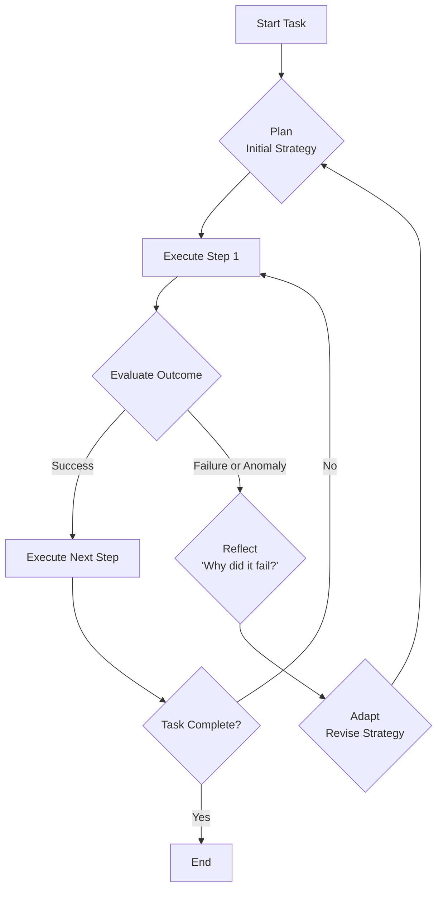

# Gemini 3 Pro vs. GPT-5.1: Choosing the Right Model for Agentic Workflows

As of late 2025, the landscape of generative AI has decisively shifted from conversational chatbots to sophisticated, autonomous agents. For CTOs and engineering leads, the choice of a foundation model is now one of the most critical architectural decisions. The two dominant players, Google's Gemini 3 Pro and OpenAI's GPT-5.1, offer powerful but distinctly different capabilities for building these agentic workflows.

This article provides a technical comparison based on projected late-2025 benchmarks and capabilities, helping you select the right engine for your next generation of AI-powered systems.

### What You’ll Get

*   A breakdown of the core strengths of Gemini 3 Pro and GPT-5.1.
*   Projected performance differences in key agentic tasks.
*   Example use cases and hypothetical code snippets.
*   A high-level diagram of GPT-5.1's adaptive reasoning loop.
*   A clear decision matrix to guide your architectural choice.

---

## The New Frontier: From Prompts to Processes

The core challenge in 2025 is no longer just generating accurate text or code. It's about building agents that can perceive their environment, create multi-step plans, execute tasks using tools, and adapt when things go wrong. Both Gemini 3 Pro and GPT-5.1 are designed for this paradigm, but their underlying architectures reflect their creators' differing philosophies.

*   **Google's Approach:** Leverage its vast, multi-format data advantage (YouTube, Google Search, Android) to build models with a native, holistic understanding of the world.
*   **OpenAI's Approach:** Focus relentlessly on the reasoning engine, creating models that can strategize, self-correct, and master complex digital tool use, supported by a world-class developer ecosystem.

## Gemini 3 Pro: The Multimodal Maestro

Gemini 3 Pro represents the pinnacle of *native multimodality*. Unlike earlier models that bolt-on vision capabilities, its architecture is designed from the ground up to process and reason across text, images, audio, and, most importantly, high-fidelity video streams in real time.

### Core Strengths

*   **Spatio-Temporal Reasoning:** Gemini 3 Pro doesn't just "see" frames in a video; it understands object permanence, motion, and the cause-and-effect relationships over time.
*   **High-Fidelity Data Ingestion:** It can process multiple concurrent, high-resolution video and audio streams, making it ideal for agents that need to perceive the physical world.
*   **Cross-Modal Generation:** The model can take a complex input, like a video of a manufacturing line, and generate a detailed text report, a Python script to optimize the process, and a diagram illustrating the proposed changes.

### Agentic Use Cases

Gemini 3 Pro excels where the agent's primary task is to observe, interpret, and act upon complex, real-world environments.

*   **Autonomous Monitoring:** A security agent that analyzes hundreds of CCTV feeds, not just for "person detected," but for "unusual crowd behavior" or "a vehicle circling the block for the third time."
*   **Interactive Creative Assistant:** A storyboarding agent that watches raw footage from a film set and suggests continuity improvements, shot sequencing, and even generates dialogue based on the actors' expressions.
*   **Robotics and Automation:** An assembly line agent that visually inspects components for microscopic defects in real-time, far surpassing the speed and accuracy of previous computer vision systems.

```python
# Hypothetical Python SDK for Gemini 3 Pro
import google.generativeai as genai

# Configure the model for real-time video analysis
safety_agent = genai.GenerativeModel('gemini-3-pro-vision')

# The agent receives a live stream from a factory floor
video_stream = get_live_camera_feed("rtsp://factory.local/cam1")

# The agent's prompt defines its goal and tools
analysis_prompt = """
Analyze the provided video stream of the assembly line.
Your goal is to detect anomalies in the robotic arm's movement.
If an anomaly is detected that risks a collision, trigger the 'emergency_stop' tool.
Provide a continuous stream of JSON objects describing the arm's state.
"""

response_stream = safety_agent.generate_content(
    [analysis_prompt, video_stream],
    tools=[emergency_stop],
    stream=True
)

for response in response_stream:
    # Process real-time analysis from the model
    process_agent_feedback(response.text)
```

## GPT-5.1: The Adaptive Reasoning Engine

GPT-5.1 is OpenAI's answer to the brittleness of earlier agents. Its core innovation is *adaptive reasoning*. This is a form of meta-cognition where the model can dynamically adjust its strategy mid-task without explicit human intervention. It excels at navigating complex digital systems and abstract problem-solving.

### Core Strengths

*   **Dynamic Task Decomposition:** If an initial plan fails, GPT-5.1 can autonomously break the problem down into smaller, more manageable sub-tasks.
*   **Reflective Self-Correction:** The model maintains a short-term "working memory" of its recent actions and their outcomes, allowing it to reason about its own mistakes and avoid repeating them.
*   **Optimized Tool Use:** GPT-5.1 is exceptionally proficient at learning API schemas and chaining tool calls together in novel ways to achieve a goal. Its function-calling fidelity is considered the industry benchmark.

### Agentic Use Cases

GPT-5.1 is the premier choice for agents that operate in complex digital environments, requiring strategic planning and resilience to failure.

*   **AI-Powered DevOps:** An agent that attempts a complex cloud migration, hits a dependency error, researches the error in the cloud provider's documentation (via a tool), formulates a new plan, and re-executes the deployment.
*   **Financial Research Analyst:** An agent tasked with "find undervalued tech stocks" that can query financial APIs, read SEC filings, detect conflicting information, and adjust its research criteria on the fly.
*   **Autonomous Code Refactoring:** A software engineering agent that can take a legacy codebase, devise a multi-stage refactoring plan, execute it file by file, run tests, and revert changes when a test fails, learning from the failure to inform its next step.

> **Mermaid Diagram: GPT-5.1's Adaptive Reasoning Loop**
> This flow illustrates how the model moves beyond a simple plan-execute cycle to incorporate reflection and adaptation, making its agents more robust.



## Head-to-Head Benchmark Analysis (Projected)

This table summarizes the projected performance of each model on key vectors relevant to agentic workflows.

| Benchmark / Feature          | Gemini 3 Pro                                | GPT-5.1                                          | Winner & Nuance                                                                   |
| ---------------------------- | ------------------------------------------- | ------------------------------------------------ | --------------------------------------------------------------------------------- |
| **Multimodal Reasoning**     | 🏆 **State-of-the-art**                      | Excellent (image/audio), but lags in video | **Gemini.** Its native architecture gives it a fundamental edge in understanding time and motion. |
| **Complex Reasoning & Logic**  | Very Strong                                 | 🏆 **State-of-the-art**                          | **GPT-5.1.** The adaptive reasoning loop makes it superior for abstract, multi-step problems. |
| **Tool Use & API Fidelity**  | Excellent                                   | 🏆 **Industry Leading**                          | **GPT-5.1.** Its ability to self-correct on failed API calls is a game-changer. |
| **Developer Ecosystem**      | Strong, integrated with Google Cloud      | 🏆 **Unmatched**                                 | **GPT-5.1.** OpenAI's focus on APIs, SDKs, and documentation remains a key advantage. |
| **Latency for Video Input**  | 🏆 **Low**                                   | High                                             | **Gemini.** Processing video streams is a core competency, not a secondary feature.    |
| **Cost for Digital Tasks**   | Competitive                                 | 🏆 **More Efficient**                            | **GPT-5.1.** Often more token-efficient for text- and code-heavy agentic workflows. |
| **Cost for Multimodal Tasks**| 🏆 **More Efficient**                        | Expensive                                        | **Gemini.** Optimized hardware (TPUs) and architecture make complex vision tasks cheaper. |

## The CTO's Decision Matrix

Your choice of foundation model should be driven entirely by the primary domain of your agent. The era of a "one-size-fits-all" super-intelligence is not yet here. Instead, we have highly specialized, world-class experts.

> ### Decision Framework: Choose Your Foundation Model
>
> **Choose Gemini 3 Pro if your agent's core task is to...**
> *   ...**Perceive and understand** the physical world through video and audio.
> *   ...**Interact with robotics**, drones, or other hardware based on sensory input.
> *   ...**Analyze spatio-temporal events**, like traffic patterns, sports games, or manufacturing processes.
> *   ...**Create content** derived from rich, multimodal sources.
>
> **Choose GPT-5.1 if your agent's core task is to...**
> *   ...**Navigate and manipulate complex digital systems**, like cloud infrastructure, databases, or SaaS applications.
> *   ...**Execute long, brittle workflows** that require self-correction and dynamic replanning.
> *   ...**Perform deep research and analysis** by synthesizing information from dozens of text-based sources and APIs.
> *   ...**Write, debug, and refactor large codebases** with a high degree of autonomy.

## Conclusion

The competition between Gemini 3 Pro and GPT-5.1 is not a simple race for higher benchmark scores. It's a divergence in specialization. Gemini 3 Pro is the foundation for agents that **see**, while GPT-5.1 is the foundation for agents that **think**.

For engineering leaders, the winning strategy is not to bet on a single model but to understand the unique topology of the problems you are solving. By aligning the model's core strengths with your agent's primary function—be it perceiving the physical world or navigating the digital one—you will build more capable, reliable, and efficient autonomous systems.


## Further Reading

- https://www.cometapi.com/gemini-3-pro-vs-gpt-5-1-which-is-better-a-complete-comparison/
- https://composio.dev/blog/gemini-3-pro-vs-gpt-5-1
