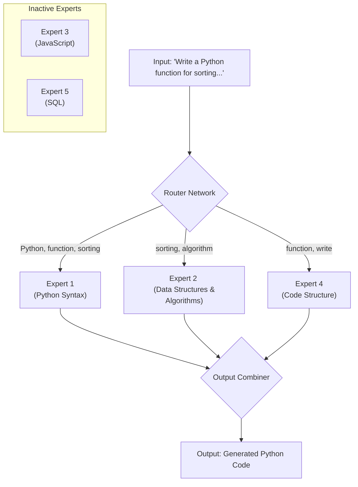

# The DeepSeek Disruption: How Open Weights are Challenging Proprietary Giants

The AI landscape has long been dominated by a familiar narrative: proprietary, closed-source models from giants like OpenAI and Google set the state-of-the-art, while open-source alternatives play an perpetual game of catch-up. This narrative is now facing its most significant challenge yet. The recent emergence of models like DeepSeek-V2, and the hypothetical leap to a future V3.2, signals a seismic shift. An open-weights model isn't just "almost as good" anymore—it's directly competing with, and in some domains, surpassing the best closed-source offerings.

This isn't just another incremental update. It represents a fundamental disruption to the established order, raising critical questions about data privacy, the commoditization of AI, and the very future of enterprise AI strategy.

### What You’ll Get

In this article, we'll dissect the DeepSeek phenomenon and its broader implications:

*   **Benchmark Breakdown:** An analysis of how DeepSeek's coding models are performing against giants like GPT-4o and what this means for developers.
*   **The Open-Weights Advantage:** A clear look at why enterprise teams are increasingly drawn to models they can own and control.
*   **Architectural Edge:** A simplified explanation of the Mixture-of-Experts (MoE) architecture that powers DeepSeek's efficiency.
*   **Strategic Implications:** Insights into the "commoditization of intelligence" and how it impacts your business moat.

---

## What is DeepSeek? A Quick Primer

DeepSeek is not just another LLM. It's a family of models developed by DeepSeek AI, a company with a clear focus on pushing the boundaries of what open-weights AI can achieve, especially in the realm of code and reasoning.

Their latest major release, **DeepSeek-V2**, is a powerful Mixture-of-Experts (MoE) model. Unlike dense models that activate all their parameters for every token, MoE models route tokens to specialized "expert" sub-networks. This makes them incredibly efficient to run for their size.

Key characteristics of the DeepSeek model family:

*   **Open Weights:** The model weights are publicly available under a permissive license, allowing anyone to download, modify, and run them on their own infrastructure.
*   **Coding Specialization:** While there are general-purpose chat models, the `DeepSeek-Coder` variants are specifically trained on a massive corpus of code, making them exceptional coding assistants.
*   **Mixture-of-Experts (MoE) Architecture:** DeepSeek-V2 is a 236B parameter model, but only activates 21B parameters per token. This provides the knowledge capacity of a massive model with the inference speed and cost of a much smaller one.

## The Benchmark Gauntlet: Performance That Demands Attention

The claims of challenging proprietary giants are not just marketing. They are backed by impressive performance on standardized benchmarks. While we look toward a future where a hypothetical DeepSeek V3.2 competes with GPT-5, today's DeepSeek-V2 is already trading blows with the current SOTA.

### Unmatched Coding Prowess

For developers and engineering leaders, the most compelling story is DeepSeek's performance on coding tasks. It's not just about autocompleting lines; it's about complex problem-solving. This is where benchmarks like HumanEval, MBPP, and competitive programming challenges like CodeForces come into play.

| Model | HumanEval (Pass@1) | MBPP (Pass@1) | Notes |
| :--- | :---: | :---: | :--- |
| **DeepSeek-Coder-V2** | **90.2%** | **84.5%** | Open-weights, specialized for code |
| GPT-4o (Omni) | 88.4% | 80.4% | Proprietary, general-purpose SOTA |
| Llama 3 70B Instruct | 81.7% | 75.9% | Open-weights, general-purpose |
| Gemini 1.5 Pro | 84.1% | 75.9% | Proprietary, general-purpose |

> **Note:** Benchmarks are indicative, not absolute. Real-world performance can vary. However, the trend is undeniable: a freely available model is outperforming the most advanced proprietary systems on their own turf in a critical, high-value domain.
> [Source: Official DeepSeek-V2 Technical Report](https://github.com/deepseek-ai/DeepSeek-V2)

The performance on platforms like CodeForces, which require deep algorithmic understanding, further solidifies this position. This isn't just about syntax; it's about reasoning—a capability previously seen as the exclusive domain of top-tier proprietary models.

## A New Architectural Paradigm: The MoE Advantage

How does DeepSeek achieve this performance so efficiently? The answer lies in its MoE architecture. Imagine a team of specialists versus a single generalist. The generalist has to know everything, all the time. The specialist team directs each problem to the person best equipped to handle it.

This is MoE in a nutshell. A "router" network inspects the incoming data (the tokens) and sends it to a small subset of "expert" networks.

Here's a high-level flow:


This approach drastically reduces the computational cost (FLOPs) per inference, making it feasible to self-host a model with hundreds of billions of parameters.

## The Open-Weights Ripple Effect: Beyond Performance

The disruption caused by models like DeepSeek extends far beyond benchmark scores. It fundamentally changes the strategic conversation for any organization using AI.

### Enterprise Data Privacy and Control

This is the most immediate and impactful benefit. When you use a proprietary model via an API, your data is sent to a third-party server.

*   **Proprietary API Call:** Your code, your prompts, and your intellectual property cross the internet to servers you don't control. Even with trust and robust agreements, this is a non-starter for organizations in regulated industries like finance, healthcare, or defense.
*   **Self-Hosted Open-Weights Model:** The model runs on your servers—in your VPC or on-premise. Data never leaves your control. You can fine-tune it on your private codebase without fear of leaking trade secrets.

This shift from "renting intelligence" to "owning intelligence" is a paradigm change for enterprise security and compliance.

### The Commoditization of Intelligence

When state-of-the-art AI models become open, free, and accessible, the foundational "intelligence" layer starts to become a commodity. Your competitive advantage no longer comes from simply *having access* to a powerful LLM.

The new moat is built on:

1.  **Proprietary Data:** How you fine-tune the base model on your unique datasets to create a specialized, defensible asset.
2.  **Domain-Specific Workflows:** How you integrate the model into your specific business processes to create a 10x productivity gain.
3.  **Superior User Experience:** The application layer you build on top of the model that solves a real user problem better than anyone else.

In this new world, the LLM is the engine, not the car. Open-weights models give every company the keys to a world-class engine.

### Getting Started with DeepSeek Coder

The barrier to entry for experimenting with these models is surprisingly low, thanks to frameworks like Hugging Face `transformers`.

Here's a quick example of how you might load and run the `DeepSeek-Coder-V2` model:

```python
import torch
from transformers import AutoTokenizer, AutoModelForCausalLM

# Define the model path from Hugging Face Hub
model_path = "deepseek-ai/DeepSeek-Coder-V2-Instruct"
tokenizer = AutoTokenizer.from_pretrained(model_path, trust_remote_code=True)
# For GPU efficiency, use bfloat16 and move the model to the GPU
model = AutoModelForCausalLM.from_pretrained(
    model_path,
    trust_remote_code=True,
    torch_dtype=torch.bfloat16,
    device_map="auto" # Automatically uses available GPUs
)

messages = [
    {'role': 'user', 'content': 'Write a Python function to fetch and parse JSON from a URL.'}
]

# Prepare the input for the model
inputs = tokenizer.apply_chat_template(messages, add_generation_prompt=True, return_tensors="pt").to(model.device)

# Generate the output
outputs = model.generate(inputs, max_new_tokens=256, do_sample=False, top_k=50, top_p=0.95, num_return_sequences=1, eos_token_id=tokenizer.eos_token_id)

# Decode and print the result
print(tokenizer.decode(outputs[0][len(inputs[0]):], skip_special_tokens=True))
```
> **Note:** Running a model of this size requires significant hardware (typically multiple high-VRAM GPUs). However, quantized versions and inference optimization libraries are making it increasingly accessible.

## Conclusion: The Playing Field is Leveling

The rise of DeepSeek V2 and its successors is more than just a new leader on a benchmark table. It is a powerful demonstration that the open-source community and focused, independent research labs can not only keep pace with but, in key areas, surpass the closed-source giants.

For developers, this means access to unparalleled coding assistants that can run locally. For enterprises, it means a viable, secure, and customizable path to deploying generative AI without compromising on privacy. The era of unquestioned dominance by a few proprietary models is over. The future of AI is increasingly open, distributed, and in your hands.


## Further Reading

- https://www.indiatoday.in/technology/news/story/deepseek-releases-updated-ai-that-matches-gemini-3-and-chatgpt-5-internet-says-whale-is-back-2829475-2025-12-02
