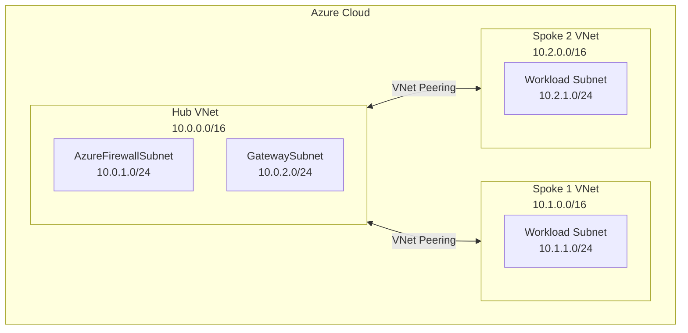

# Build Azure Hub and Spoke Architecture using Terraform

The Hub and Spoke network topology is a foundational pattern for building scalable, secure, and cost-effective networking on Azure. It centralizes common services like firewalls, gateways, and DNS in a central "Hub" virtual network (VNet), while isolating application workloads in separate "Spoke" VNets.

Automating this setup with an Infrastructure as Code (IaC) tool like Terraform ensures your architecture is repeatable, version-controlled, and free from manual configuration errors. This guide provides a direct, hands-on approach to building a functional Hub and Spoke topology within a single Azure subscription using Terraform.

### What You’ll Get

By the end of this article, you will have:

*   A clear understanding of the Hub and Spoke architecture in Azure.
*   A complete set of Terraform configuration files to deploy the network.
*   Practical code examples for creating VNets, subnets, and VNet peering.
*   The commands needed to deploy and manage the infrastructure.
*   Key best practices for a production-ready setup.

## Understanding the Hub and Spoke Model

At its core, the model is simple but powerful. The Hub VNet acts as a central point for connectivity and shared services. The Spoke VNets connect to the Hub via VNet peering, allowing them to access shared resources and, if configured, the internet or on-premises networks.

This design prevents spokes from communicating directly with each other, forcing traffic through the Hub where it can be inspected by security appliances like Azure Firewall.

### Architecture Overview

Here is a high-level diagram of the architecture we will build.



### Roles and Responsibilities

| Component | Role | Common Resources |
| :--- | :--- | :--- |
| **Hub VNet** | Central connectivity and shared services | Azure Firewall, VPN/ExpressRoute Gateway, DNS Servers, Bastion |
| **Spoke VNet** | Isolated workload environments | Virtual Machines, App Services, Databases, Kubernetes Clusters |
| **VNet Peering** | Connects Hub and Spokes | Enables private IP communication across VNets on the Azure backbone |

## Prerequisites

Before you begin, ensure you have the following tools installed and configured:

*   **Terraform CLI**: Version 1.0 or newer. ([Download Terraform](https://www.terraform.io/downloads.html))
*   **Azure CLI**: Authenticated to your Azure subscription. ([Install Azure CLI](https://docs.microsoft.com/en-us/cli/azure/install-azure-cli))
*   An active **Azure Subscription**.

Log in to Azure to get started:
```bash
az login
az account set --subscription "Your-Subscription-Name-or-ID"
```

## Setting Up the Terraform Project

A clean project structure makes your configuration easier to manage. Create a new directory and organize your files as follows:

```
.
├── main.tf         # Main configuration, including the provider
├── variables.tf    # Input variables
├── outputs.tf      # Output values
├── hub.tf          # Hub VNet resources
├── spokes.tf       # Spoke VNet resources
└── peering.tf      # VNet peering resources
```

### 1. Provider Configuration

First, define the Azure provider and set its requirements in `main.tf`.

**`main.tf`**
```terraform
terraform {
  required_providers {
    azurerm = {
      source  = "hashicorp/azurerm"
      version = "~> 3.0"
    }
  }
}

provider "azurerm" {
  features {}
}
```

### 2. Define Variables

Using variables makes your code reusable. Define the location and a common resource prefix in `variables.tf`.

**`variables.tf`**
```terraform
variable "location" {
  type        = string
  description = "The Azure region where resources will be deployed."
  default     = "East US"
}

variable "resource_prefix" {
  type        = string
  description = "A prefix for all resource names to ensure uniqueness."
  default     = "prod-hs"
}
```

## Building the Hub VNet

The Hub is the heart of our network. We'll create a resource group, a VNet, and a dedicated subnet for Azure Firewall (a common shared service).

**`hub.tf`**
```terraform
# Resource Group for the Hub VNet
resource "azurerm_resource_group" "hub_rg" {
  name     = "${var.resource_prefix}-hub-rg"
  location = var.location
}

# Hub VNet
resource "azurerm_virtual_network" "hub_vnet" {
  name                = "${var.resource_prefix}-hub-vnet"
  location            = azurerm_resource_group.hub_rg.location
  resource_group_name = azurerm_resource_group.hub_rg.name
  address_space       = ["10.0.0.0/16"]

  tags = {
    environment = "Production"
    role        = "Hub"
  }
}

# Subnet for Azure Firewall
# Note: The name 'AzureFirewallSubnet' is mandatory for the Azure Firewall service.
resource "azurerm_subnet" "firewall_subnet" {
  name                 = "AzureFirewallSubnet"
  resource_group_name  = azurerm_resource_group.hub_rg.name
  virtual_network_name = azurerm_virtual_network.hub_vnet.name
  address_prefixes     = ["10.0.1.0/24"]
}
```

## Creating the Spoke VNets

Spokes are where your applications live. To demonstrate scalability, we'll use a `for_each` loop in Terraform to create multiple spokes from a map variable.

First, add a new variable for our spokes in `variables.tf`.

**`variables.tf`** (add this block)
```terraform
variable "spokes" {
  type = map(object({
    address_space = list(string)
    subnet_name   = string
    subnet_prefix = list(string)
  }))
  description = "A map of spoke configurations."
  default = {
    spoke1 = {
      address_space = ["10.1.0.0/16"]
      subnet_name   = "workload-subnet"
      subnet_prefix = ["10.1.1.0/24"]
    }
    spoke2 = {
      address_space = ["10.2.0.0/16"]
      subnet_name   = "workload-subnet"
      subnet_prefix = ["10.2.1.0/24"]
    }
  }
}
```

Now, create the resources in `spokes.tf`.

**`spokes.tf`**
```terraform
# Resource Groups for Spokes
resource "azurerm_resource_group" "spoke_rg" {
  for_each = var.spokes

  name     = "${var.resource_prefix}-${each.key}-rg"
  location = var.location
}

# Spoke VNets
resource "azurerm_virtual_network" "spoke_vnet" {
  for_each = var.spokes

  name                = "${var.resource_prefix}-${each.key}-vnet"
  location            = azurerm_resource_group.spoke_rg[each.key].location
  resource_group_name = azurerm_resource_group.spoke_rg[each.key].name
  address_space       = each.value.address_space
  
  tags = {
    environment = "Production"
    role        = "Spoke"
  }
}

# Subnets within each Spoke VNet
resource "azurerm_subnet" "spoke_subnet" {
  for_each = var.spokes

  name                 = each.value.subnet_name
  resource_group_name  = azurerm_resource_group.spoke_rg[each.key].name
  virtual_network_name = azurerm_virtual_network.spoke_vnet[each.key].name
  address_prefixes     = each.value.subnet_prefix
}
```

## Connecting Hub and Spokes with VNet Peering

VNet peering is the glue that connects our network. A peering is a two-way relationship, so we need to create two `azurerm_virtual_network_peering` resources for each Spoke: one from Hub-to-Spoke and one from Spoke-to-Hub.

> **Important:** VNet peering is *not* transitive. A Spoke can talk to the Hub, and the Hub can talk to another Spoke, but the two Spokes cannot talk to each other directly through peering alone. All inter-spoke traffic must be routed through a network virtual appliance (NVA), like Azure Firewall, in the Hub.

**`peering.tf`**
```terraform
# Peer from Hub to each Spoke
resource "azurerm_virtual_network_peering" "hub_to_spoke" {
  for_each = azurerm_virtual_network.spoke_vnet

  name                      = "peer-hub-to-${each.key}"
  resource_group_name       = azurerm_resource_group.hub_rg.name
  virtual_network_name      = azurerm_virtual_network.hub_vnet.name
  remote_virtual_network_id = each.value.id

  # Allows spokes to use the Hub's VPN/ExpressRoute gateway (if present)
  allow_gateway_transit = true 
}

# Peer from each Spoke back to the Hub
resource "azurerm_virtual_network_peering" "spoke_to_hub" {
  for_each = azurerm_virtual_network.spoke_vnet

  name                      = "peer-${each.key}-to-hub"
  resource_group_name       = azurerm_resource_group.spoke_rg[each.key].name
  virtual_network_name      = each.value.name
  remote_virtual_network_id = azurerm_virtual_network.hub_vnet.id

  # Allows spoke to use the remote gateway in the Hub
  use_remote_gateways = true
}
```

Finally, let's define some outputs to easily retrieve the VNet IDs after deployment.

**`outputs.tf`**
```terraform
output "hub_vnet_id" {
  value       = azurerm_virtual_network.hub_vnet.id
  description = "The resource ID of the Hub VNet."
}

output "spoke_vnet_ids" {
  value = {
    for k, vnet in azurerm_virtual_network.spoke_vnet : k => vnet.id
  }
  description = "A map of Spoke VNet names to their resource IDs."
}
```

## Deployment and Verification 🚀

With all the configuration files in place, you can now deploy the architecture.

1.  **Initialize Terraform:**
    This downloads the necessary provider plugins.
    ```bash
    terraform init
    ```

2.  **Plan the Deployment:**
    This creates an execution plan and shows you what resources will be created.
    ```bash
    terraform plan
    ```

3.  **Apply the Configuration:**
    This builds the resources in Azure. Type `yes` when prompted.
    ```bash
    terraform apply
    ```

After the apply completes, you can verify the resources in the [Azure Portal](https://portal.azure.com). Navigate to the Hub VNet, select "Peerings" from the menu, and you should see the peering connections to both spokes with a status of "Connected."

## Summary

You have successfully defined and deployed a scalable Azure Hub and Spoke network using Terraform. This IaC approach provides a solid, automated foundation for your cloud environment.

*   You established a **central Hub** for shared services.
*   You created **isolated Spokes** for workloads using a `for_each` loop.
*   You connected them securely with **VNet peering**.

From here, you can expand the Hub with an Azure Firewall to inspect traffic, a VPN Gateway for hybrid connectivity, or a Bastion host for secure VM access. By managing your network as code, you ensure consistency and can easily adapt to future requirements.
