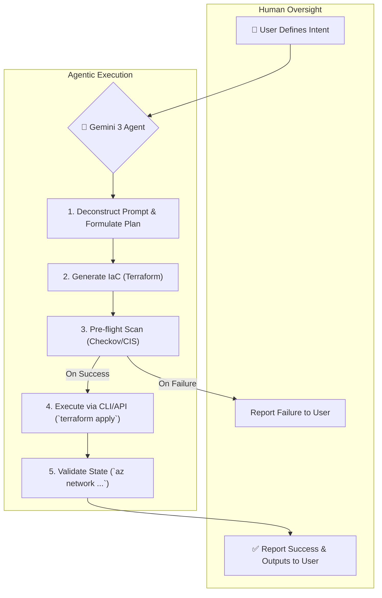

# From Coding to Orchestrating: What Gemini 3 Taught Us About the Future of Cloud Engineering Last Month

November 2025 will be remembered as the month the paradigm shifted. The release of Gemini 3 wasn't just an incremental update to a large language model; it was the formal start of the "Agentic Era" for cloud engineering. For years, AI has been a capable copilot, helping us write syntax faster. Now, it's the orchestrator, and our role has fundamentally changed. Engineers who master high-level intent are thriving, while those who only wrote boilerplate code are facing an existential career crisis.

This article unpacks the practical implications of this shift, moving beyond the hype to detail what it means to be a cloud engineer in a world with true AI agents. We’ll explore the new workflows, the essential skills, and the critical security considerations that define this new landscape.

### What You'll Get

*   **The Core Shift:** A clear breakdown of the move from AI as a *code generator* to AI as a *system orchestrator*.
*   **A Practical Example:** A real-world walkthrough of deploying a secure Azure environment using a high-level prompt with Gemini 3.
*   **Visualized Workflow:** A Mermaid diagram illustrating the new agentic-driven cloud deployment process.
*   **The New Skillset:** An analysis of which skills are becoming obsolete and which are now mission-critical for AI Architects.
*   **Security in the Agentic Era:** A look at the new security challenges and opportunities presented by AI agents with production access.

---

## The Generational Leap: From Code Completion to System Orchestration

For the past few years, our interaction with AI in the cloud has been largely conversational and assistive. We used tools like GitHub Copilot to autocomplete Terraform blocks or asked ChatGPT to write a Python script for a Lambda function. The AI was a powerful, syntax-aware assistant, but *we* were still the orchestrator. We held the plan, executed the commands, and validated the outcome.

Gemini 3 changed this by introducing a robust, multi-modal agentic framework. It doesn't just write code; it interprets intent, formulates a multi-step plan, interacts with APIs and CLIs, and validates its own work.

Here’s a comparison of the old vs. new paradigms:

| Feature | Pre-Agentic AI (e.g., GPT-4, Copilot) | Agentic AI (Gemini 3) |
| :--- | :--- | :--- |
| **Primary Function** | Code generation & suggestion | End-to-end task execution & orchestration |
| **User Input** | Specific, low-level requests ("Write a Terraform module for a VNet") | High-level intent ("Deploy a secure, cost-optimized app environment") |
| **Interaction Layer** | Text/Code Editor | APIs, CLIs, SDKs, Human feedback loops |
| **Output** | A block of code or text | A successfully deployed and validated system |
| **Engineer's Role** | Syntax Writer, Executor | System Architect, AI Overseer |

This shift means we spend less time on the *how* (writing HCL syntax) and more time on the *what* and *why* (defining security policies, network architecture, and success criteria).

## Practical Example: Orchestrating a Secure Azure Landing Zone

Let's move from theory to practice. Imagine you need to deploy a new, secure foundation for an application in Azure.

### The Prompt: Defining High-Level Intent

Instead of opening a code editor, you now provide Gemini 3 with a high-level, natural language prompt that defines the desired end state.

> **Prompt:** "Orchestrate a new Azure environment for a production web application named `ProjectPhoenix`. It requires a hub-spoke network topology in `East US 2`. The hub VNet should contain Azure Firewall. The spoke VNet needs two subnets: one for App Service Environment v3 and one for a private PostgreSQL Flexible Server. All resources must be tagged with `CostCenter: A123` and `Project: Phoenix`. Ensure all traffic is routed through the firewall and that resources are scanned for compliance with CIS v8 benchmarks *before* deployment. Execute the plan and report back with the VNet peering status and firewall public IP."

This prompt contains intent, constraints, and validation requirements—the new language of cloud engineering.

### Gemini 3's Execution Plan

Gemini 3 doesn't just spit out a 500-line Terraform file. It deconstructs the request and formulates a plan:

1.  **Deconstruct Intent:** The agent identifies key entities: Hub VNet, Spoke VNet, Azure Firewall, ASEv3, PostgreSQL, VNet Peering, NSGs, and CIS compliance checks.
2.  **Generate Infrastructure as Code:** It generates the necessary Terraform files in a temporary workspace. It understands module dependencies and best practices.

    ```terraform
    # --- Generated by Gemini 3 Agent ---
    # File: networking.tf

    resource "azurerm_resource_group" "phoenix_hub_rg" {
      name     = "rg-phoenix-hub-eus2"
      location = "East US 2"
      tags = {
        CostCenter = "A123"
        Project    = "Phoenix"
      }
    }

    resource "azurerm_virtual_network" "phoenix_hub_vnet" {
      name                = "vnet-phoenix-hub-eus2"
      address_space       = ["10.10.0.0/16"]
      location            = azurerm_resource_group.phoenix_hub_rg.location
      resource_group_name = azurerm_resource_group.phoenix_hub_rg.name
      # ... additional configuration ...
    }
    
    # ... further resources for firewall, spoke, peering, etc. ...
    ```

3.  **Pre-flight Security & Cost Analysis:** Before execution, the agent uses integrated tools to validate its own plan. It might invoke an open-source tool like [Checkov](https://www.checkov.io/) or a commercial scanner via an API to check the generated IaC against the requested CIS benchmarks.
4.  **Execute & Validate:** Upon passing the checks, the agent authenticates to Azure (using a managed identity or a secure vault) and runs `terraform apply`. After deployment, it uses the Azure CLI (`az`) to query the deployed resources, confirming that VNet peering is `Connected` and retrieving the firewall's public IP address.
5.  **Report:** It synthesizes the results and presents a concise report back to the user, fulfilling the final part of the prompt.

### The Flow: Visualizing the Agentic Workflow

This new workflow is a closed loop of intent, planning, execution, and validation, all managed by the AI agent with human oversight.



## The New Skillset: Rise of the AI Architect

This automation of low-level tasks forces a re-evaluation of our skills. The value is no longer in knowing the exact syntax for a Terraform resource but in being able to design and govern the systems the AI builds.

### What's Becoming Obsolete

*   **Boilerplate IaC Writing:** Manually writing standard modules for VPCs, subnets, or security groups is now a task for the AI.
*   **Basic Scripting:** Simple glue scripts (e.g., pulling a value from one CLI command to use in another) are easily handled by the agent.
*   **Manual CLI Operations:** Repetitive `az` or `aws` commands for provisioning or checking resources are a thing of the past.

### What's Essential Now

*   **System Design & Intent Articulation:** Your primary value is translating business and technical requirements into clear, unambiguous, and comprehensive prompts. You design the *what*, and the AI handles the *how*.
*   **AI Oversight & Validation:** You are the final checkpoint. This involves reviewing the AI's execution plan, debugging when it misunderstands intent, and creating automated tests to validate that the deployed infrastructure meets your standards.
*   **Security & Governance Strategy:** Instead of writing individual security rules, you define the *governance framework* the AI must operate within. For example, "Never deploy a storage account with public access" or "All databases must be encrypted with a customer-managed key."
*   **API Integration & Tooling:** Knowing which tools (APIs, CLIs, SDKs) to give the agent access to is critical. You're curating the AI's toolbox to ensure it's effective and secure.

## The Double-Edged Sword: Security in the Agentic Era

Giving an AI agent credentials to modify production infrastructure is an enormous leap in trust and risk.

> **Info**
> The new security paradigm is not about securing the code; it's about securing the *agent*. This includes robust identity management, least-privilege access for the AI, and immutable audit logs of every action it takes.

**The Upside:** AI agents can be powerful allies for security. We can instruct them to build infrastructure that is "secure by default" from the very beginning, embedding proactive scans and compliance checks into the deployment lifecycle far more consistently than a human operator could.

**The Downside:** The blast radius of a mistake is magnified. A poorly worded prompt, a malicious actor gaining control of the agent, or a subtle flaw in the AI's logic could lead to rapid, large-scale security incidents. Imagine an agent misinterpreting "delete temporary resources" and instead targeting production databases.

This is why the human-in-the-loop for approval and strict, role-based access control for the agent are non-negotiable. For more on cloud security best practices, the [Cloud Security Alliance (CSA)](https://cloudsecurityalliance.org/) remains a critical resource.

## Conclusion: The Engineer as a Conductor

The "Agentic Era" doesn't make cloud engineers obsolete; it elevates them. We are moving from being musicians in the orchestra, focused on playing our individual instruments (writing code, running commands), to being the conductor. Our job is to interpret the score (the business requirements), guide the orchestra (the AI agents and their tools), and ensure the final performance is flawless.

The last month has been a whirlwind, but the message is clear: stop mastering syntax and start mastering systems. The future belongs not to the fastest coder, but to the clearest thinker and the most effective orchestrator.
