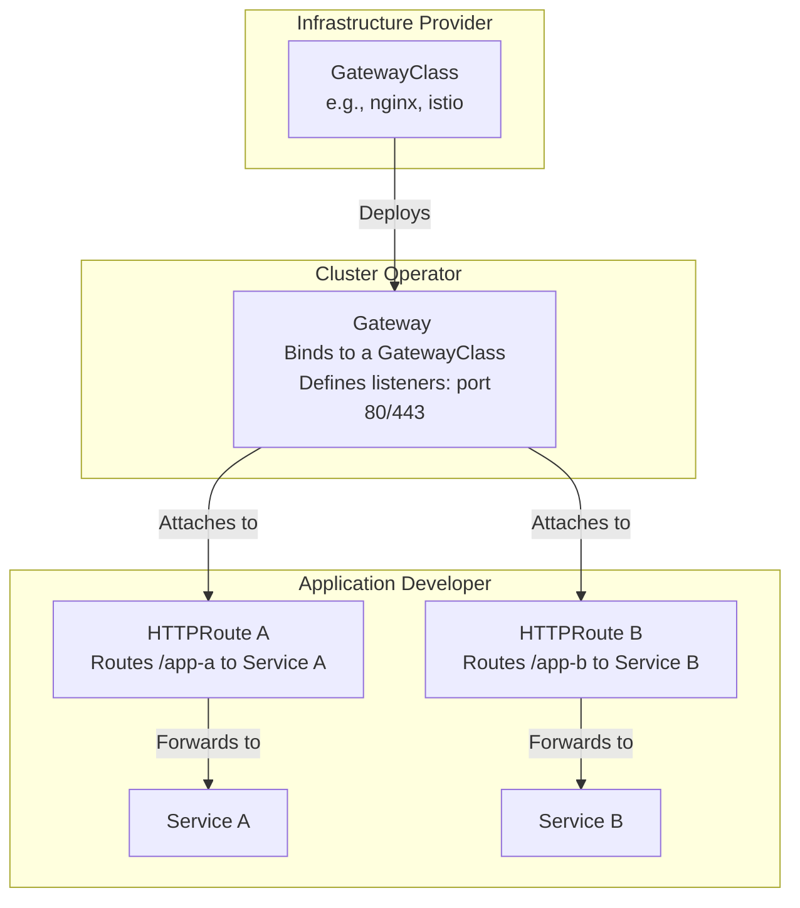

# Gateway API is GA: Why It’s Time to Deprecate Your Ingress Controller

The Kubernetes networking landscape has officially evolved. With the [Gateway API reaching General Availability (GA)](https://kubernetes.io/blog/2023/10/31/gateway-api-ga/), the community has a powerful, standardized, and role-oriented successor to the long-serving Ingress API. While Ingress got us started, its limitations have become a significant source of friction for platform and application teams.

If you're still managing a sprawling collection of vendor-specific Ingress annotations, now is the time to plan your migration. The Gateway API isn't just a new tool; it's a new paradigm for service networking in Kubernetes.

## What You’ll Get

This article provides a practitioner's guide to understanding and migrating to the Gateway API. Here’s what we’ll cover:

*   **The Pain of Ingress:** A clear look at the technical limitations and "annotation hell."
*   **Gateway API's Core Concepts:** How its role-oriented design solves Ingress's biggest problems.
*   **Head-to-Head Comparison:** A direct breakdown of Ingress vs. Gateway API.
*   **Actionable Migration Strategy:** A step-by-step plan for teams using NGINX or Istio.

## The Problem with Ingress: Welcome to Annotation Hell

The Ingress API was a great start. It provided a simple, declarative way to manage basic HTTP/S routing to services. However, modern applications require much more: canary releases, traffic splitting, header rewrites, timeouts, retries, and complex middleware.

To fill these gaps, every Ingress controller vendor introduced its own set of custom annotations. This led to a situation many engineers call "annotation hell."

Consider a seemingly simple requirement: a path rewrite and a custom timeout. With an NGINX Ingress controller, your Ingress resource might look something like this:

```
# Conceptual Ingress object demonstrating annotation complexity
apiVersion: networking.k8s.io/v1
kind: Ingress
metadata:
  name: my-app-ingress
  annotations:
    nginx.ingress.kubernetes.io/rewrite-target: /
    nginx.ingress.kubernetes.io/proxy-connect-timeout: "15"
    nginx.ingress.kubernetes.io/proxy-read-timeout: "20"
    nginx.ingress.kubernetes.io/cors-enabled: "true"
    # ...and potentially dozens more
spec:
  rules:
  # ...
```

This approach has critical flaws:

*   **Non-Portability:** These annotations are specific to NGINX. If you switch to Traefik, Kong, or another controller, you must learn a new annotation set and rewrite all your manifests.
*   **Lack of Structure:** Annotations are flat key-value strings. There is no type safety, validation, or hierarchical structure, making them error-prone and hard to manage at scale.
*   **Permission Issues:** To manage routing, an application developer often needs `write` permissions on the Ingress object. This object also defines hostnames and TLS settings, which are typically the responsibility of a platform operator. This violates the principle of least privilege.

## Enter the Gateway API: A Role-Oriented Revolution

The Gateway API was designed from the ground up to address these shortcomings. It's not a single resource but a collection of CRDs (`GatewayClass`, `Gateway`, `HTTPRoute`, etc.) that separates responsibilities across different roles.

This role-oriented design is its killer feature:

1.  **Infrastructure Provider:** (e.g., NGINX, Istio, Google, AWS) Defines a `GatewayClass`, which is a template for creating gateways.
2.  **Cluster Operator / Platform Admin:** Creates a `Gateway` resource from a `GatewayClass`. They define where and how the load balancer listens (e.g., ports, protocols, TLS certificates), without needing to know about the backend applications.
3.  **Application Developer:** Manages `HTTPRoute` (or `TCPRoute`, `GRPCRoute`) resources to route traffic to their specific `Service`. They can control fine-grained behavior like path matching, header manipulation, and traffic splitting for their application *only*.

This separation is powerful. An app developer can no longer accidentally break TLS configuration for the entire domain.



The key resources that reached GA are `GatewayClass`, `Gateway`, and `HTTPRoute`, making the API ready for production HTTP routing workloads.

## Ingress vs. Gateway API: A Head-to-Head Comparison

| Feature | Ingress API | Gateway API |
| :--- | :--- | :--- |
| **Portability** | Low. Relies on vendor-specific annotations for advanced features. | High. Core features (header rewrites, traffic splitting) are part of the standard API. |
| **Role Separation** | None. A single resource mixes cluster and application concerns. | Explicit. `Gateway` (ops) and `HTTPRoute` (devs) are separate resources. |
| **Feature Set** | Basic. HTTP/S host and path matching only. | Expressive. Rich, native support for traffic splitting, header manipulation, cross-namespace routing. |
| **Extensibility** | Poor. Limited to annotations. | Excellent. Custom filters allow vendors to add functionality in a structured way. |

> **Key Takeaway:** Gateway API promotes a "shift left" for developers, allowing them to safely manage their application's routing configuration, while platform teams retain control over shared infrastructure like load balancers and certificates.

## Planning Your Migration: A Practical Strategy

Migrating doesn't require a "big bang." You can and should run your Ingress controller and a Gateway API implementation side-by-side.

### Step 1: Install a Gateway API Controller

First, your cluster needs the Gateway API CRDs and a controller that implements them. Many popular Ingress providers now support the Gateway API.

1.  **Install the CRDs:** This is a one-time setup step.
    ```bash
    kubectl apply -f https://github.com/kubernetes-sigs/gateway-api/releases/download/v1.0.0/standard-install.yaml
    ```
2.  **Choose and install a controller:** Pick an implementation that fits your needs. You can find a list of official implementers in the [Kubernetes Gateway API documentation](https://gateway-api.sigs.k8s.io/implementations/).

### Step 2: Coexistence and Gradual Rollout

Your existing Ingress resources will continue to function without interruption. The new Gateway controller will only watch for Gateway API resources like `Gateway` and `HTTPRoute`.

*   **Start small:** Choose a new or non-critical application to onboard to the Gateway API.
*   **Deploy a `Gateway`:** The cluster operator defines a `Gateway` resource, which will likely provision a new load balancer (or share an existing one, depending on the controller).
*   **Deploy an `HTTPRoute`:** The application team creates an `HTTPRoute` to route traffic for their new service via the `Gateway`.

### Step 3: Translating Your Configuration

The final step is to translate your existing Ingress rules and annotations into standard `HTTPRoute` resources.

#### For NGINX Ingress Users

The logic captured in NGINX annotations maps directly to structured fields in `HTTPRoute`.

*   **Before (Ingress):**
    *   A rule for path `/foo` routes to `foo-service`.
    *   An annotation `nginx.ingress.kubernetes.io/rewrite-target: /` rewrites the path.
*   **After (HTTPRoute):**
    *   A `matches` rule for path `/foo`.
    *   A `filters` section with a `URLRewrite` filter to modify the path to `/`.

This explicit, structured `filter` is portable across any Gateway API implementation, completely eliminating vendor lock-in for core features.

#### For Istio Users

Istio users are already familiar with a similar concept using Istio's own `Gateway` and `VirtualService` CRDs. The migration is more of a shift to a standardized, community-driven API than a conceptual change.

*   An Istio `Gateway` resource is conceptually equivalent to a Gateway API `Gateway`. It defines the entry point, port, and TLS settings.
*   An Istio `VirtualService` maps closely to a Gateway API `HTTPRoute`. It defines match conditions (paths, headers) and routing rules (traffic splitting, rewrites).

Istio has first-class support for the Gateway API, so you can begin creating `HTTPRoute` resources that attach to an Istio-managed `Gateway`. This allows you to gradually replace `VirtualService` resources with a portable, Kubernetes-native standard.

## The Future is Standardized

The GA of the Gateway API marks a major milestone for Kubernetes. It provides a robust, portable, and role-oriented foundation for the next generation of service networking. By moving away from the brittle, non-standard world of Ingress annotations, teams can build more reliable, secure, and maintainable systems.

Don't rip and replace your Ingress setup overnight. Instead, start today by installing a Gateway API controller in a development cluster. Onboard a new service and experience the clarity and power of its expressive, role-centric design. The era of annotation hell is over.


## Further Reading

- https://blog.nginx.org/blog/kubernetes-networking-ingress-controller-to-gateway-api
- https://konghq.com/blog/engineering/gateway-api-vs-ingress
