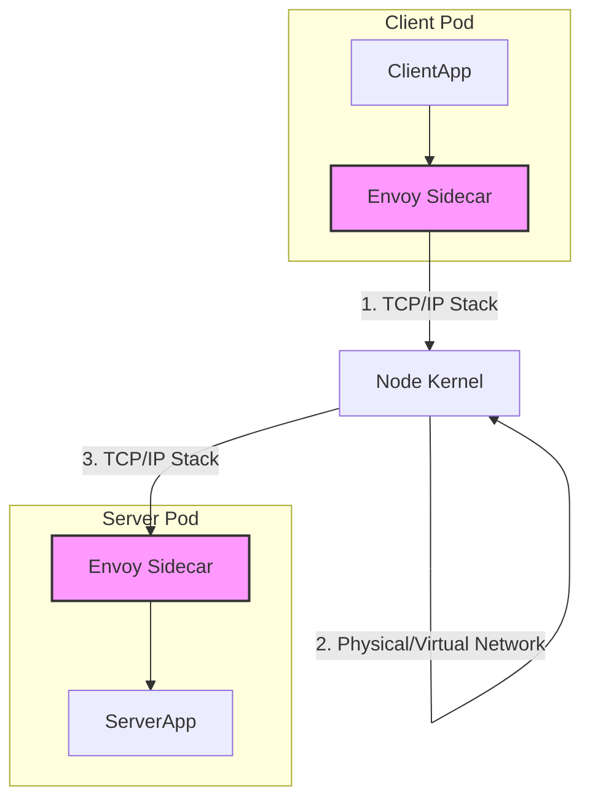
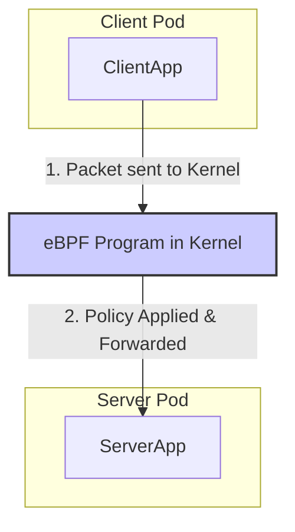

# Sidecar-Free Service Mesh: Understanding Cilium’s eBPF Architecture

Service meshes have become a cornerstone of modern cloud-native infrastructure, offering observability, security, and traffic control. For years, the dominant architecture has been the **sidecar model**, where a proxy container runs alongside every application pod. While powerful, this model introduces significant overhead.

Enter the next evolution: the sidecar-free service mesh. Powered by the revolutionary Linux kernel technology **eBPF**, projects like Cilium are redefining what a service mesh can be. This article explores Cilium's eBPF-native architecture, its performance benefits, and the advanced capabilities it unlocks.

### What You’ll Get

* **Architectural Contrast**: A clear comparison between the traditional sidecar model and Cilium's eBPF-based approach.
* **Performance Insights**: An understanding of why the sidecar-free model reduces latency and resource consumption.
* **Practical Examples**: Code snippets demonstrating L7 traffic management in Cilium.
* **Future Outlook**: A look at the maturing capabilities, like pervasive mTLS and advanced traffic management, solidifying in the ecosystem.

---

## The Traditional Sidecar Model: A Quick Refresher

In a sidecar-based service mesh like early Istio, a full network proxy (typically Envoy) is injected into each application pod. This proxy intercepts all incoming and outgoing network traffic.

* **How it works**: Kubernetes networking rules (`iptables`) redirect traffic from the application container to the sidecar proxy. The proxy then applies policies (like routing or access control) before forwarding the traffic to its destination.
* **Pros**: It's language-agnostic and decouples networking logic from the application code.
* **Cons**:
  * **Resource Overhead**: Every pod runs an additional container, consuming significant CPU and memory across the cluster.
  * **Increased Latency**: Traffic must pass through an extra network hop within the pod (App -> Proxy -> Network), adding latency to every request.
  * **Operational Complexity**: Managing, updating, and troubleshooting thousands of sidecar proxies can be a heavy operational burden.

This flow can be visualized as two distinct proxy hops for a single request-response cycle.



## Enter eBPF: The Kernel-Level Game Changer

At the heart of Cilium's innovation is **eBPF** (extended Berkeley Packet Filter). eBPF allows developers to run sandboxed, event-driven programs directly within the Linux kernel without changing kernel source code or loading kernel modules.

> **What is eBPF?** Think of it as creating tiny, hyper-efficient, and safe programmable hooks at various points in the kernel, such as the networking stack. When a packet arrives, an eBPF program can process it before it even reaches the pod's network namespace.

For networking, this is a paradigm shift. Instead of redirecting packets to a user-space proxy, eBPF can apply networking logic directly at the source, inside the kernel.

## Cilium's Sidecar-Free Architecture

Cilium leverages eBPF to implement its service mesh data plane directly in the kernel. This eliminates the need for a per-pod sidecar proxy for many functionalities.

### How It Works

Cilium attaches eBPF programs to kernel hooks on each Kubernetes node. These programs manage networking, observability, and security for all pods on that node.

1. **Identity-Based Security**: Cilium assigns a cryptographic identity to each pod based on its Kubernetes labels. Security policies are enforced in the kernel by eBPF programs that understand these identities.
2. **Service Routing**: When a pod makes a request to a Kubernetes Service, eBPF intercepts the call and performs load balancing directly in the kernel, selecting a destination pod and forwarding the packet.
3. **L7 Policy Enforcement**: For application-layer protocols like HTTP or gRPC, Cilium's eBPF programs can parse the traffic and make decisions without a full user-space proxy. For very complex policies, it can transparently direct traffic to a shared, node-level Envoy proxy, still avoiding the per-pod model.

The data path becomes significantly shorter and more efficient.



### Key Performance Benefits

The architectural difference translates into tangible performance gains.

* **Reduced Latency**: By removing the two extra proxy hops per request (one on the client side, one on the server side), network latency is significantly reduced.
* **Lower Resource Consumption**: Eliminating the sidecar container in every pod saves a massive amount of CPU and memory, especially in large clusters. This leads to better pod density and lower infrastructure costs.
* **Simplified Operations**: A single agent per node is far easier to manage, monitor, and upgrade than thousands of individual sidecar proxies.

## Core Capabilities: Beyond Performance

While performance is a major driver, Cilium's eBPF-based mesh also enables powerful, transparent features.

### L7 Traffic Management without a Sidecar

Cilium can enforce L7 traffic policies, such as path-based routing or header manipulation, directly with eBPF or by using a highly efficient, shared Envoy proxy running on the node.

Here’s an example of a `CiliumNetworkPolicy` that only allows `GET` requests to the `/public` endpoint of pods with the `app:my-api` label.

```yaml
apiVersion: "cilium.io/v2"
kind: CiliumNetworkPolicy
metadata:
  name: "api-l7-policy"
spec:
  endpointSelector:
    matchLabels:
      app: my-api
  ingress:
  - fromEndpoints:
    - matchLabels:
        app: frontend
    toPorts:
    - ports:
      - port: "8080"
        protocol: TCP
      rules:
        http:
        - method: "GET"
          path: "/public"
```

This policy is translated into eBPF programs and applied in the kernel, inspecting HTTP traffic without needing a dedicated proxy in the `my-api` pod.

### The Path to Pervasive mTLS

Mutual TLS (mTLS) is critical for zero-trust security. The sidecar model handles this by terminating TLS in the proxy. Cilium achieves mTLS with a more efficient approach.

As these capabilities mature, especially looking towards late 2025, the goal is fully transparent and performant encryption managed by eBPF and node-level agents. This means:

* **Transparent Encryption**: Applications don't need to be aware of mTLS. Encryption and decryption can happen in the kernel via eBPF or through a streamlined path using the node's TLS implementation.
* **Efficient Certificate Management**: A single Cilium agent per node manages certificate rotation and distribution, rather than requiring each sidecar to do so.

This approach promises to deliver the security benefits of mTLS without the performance penalty of traditional service meshes.

## Sidecar vs. Sidecar-Free: A Comparative Look

| Feature                  | Sidecar Model (e.g., Istio w/ Envoy)            | Cilium Sidecar-Free (eBPF)                   |
| ------------------------ | ----------------------------------------------- | -------------------------------------------- |
| **Data Plane Proxy**     | Per-pod Envoy proxy                             | eBPF programs in the kernel                  |
| **Resource Usage**       | High (CPU/Memory per pod)                       | Low (Shared per node)                        |
| **Request Latency**      | Higher (extra network hops in pod)              | Lower (direct kernel-level path)             |
| **Operational Overhead** | High (manage thousands of proxies)              | Low (manage one agent per node)              |
| **Security Transparency**| Good, but traffic is unencrypted inside the pod | Excellent, kernel-level enforcement          |
| **"Blast Radius"**       | A crashed proxy affects one pod.                | A crashed agent can affect a whole node.     |

## The Future is (Mostly) Sidecar-Free

The shift towards eBPF-based service meshes represents a significant leap forward in cloud-native networking. By moving the data plane from user-space sidecars to the Linux kernel, Cilium offers a more performant, efficient, and simpler architecture.

While sidecars may still be valuable for extremely complex L7 processing or integrating legacy systems, the general-purpose service mesh is evolving. For the vast majority of workloads, the sidecar-free model provides the required observability, security, and traffic control without the associated tax.

As eBPF continues to mature, expect to see even more service mesh functionality being pushed directly into the kernel, making our distributed systems faster and more efficient than ever before. To learn more, check out the official [Cilium Service Mesh documentation](https://docs.cilium.io/en/stable/network/servicemesh/index.html) and the resources at [eBPF.io](https://ebpf.io/).

## Further Reading

* <https://cilium.io/use-cases/service-mesh/>
* <https://docs.cilium.io/en/stable/network/servicemesh/index.html>
