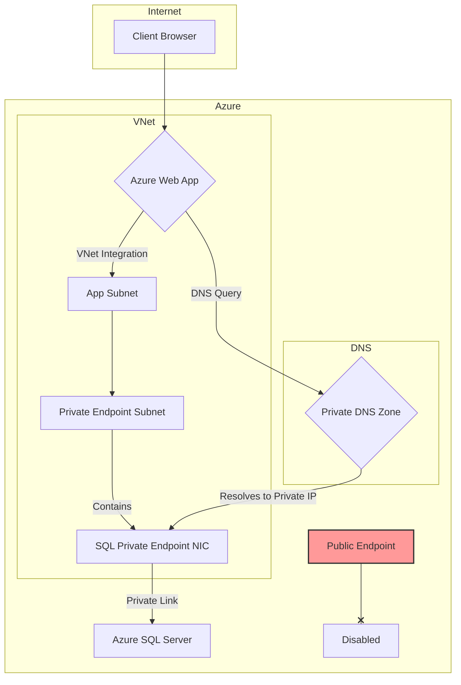

# Securely Connecting Azure Web App to Private Azure SQL: A Hands-On Lab with AZ CLI

In modern cloud architecture, a common pattern is to host a public-facing application while keeping the backend database completely isolated from the public internet. This enhances security by drastically reducing the attack surface. In Azure, the go-to solution for this is combining **Azure App Service VNet Integration** with **Azure Private Link** for your SQL database.

This guide provides a hands-on, practitioner-focused lab. We'll skip the portal UI and build this entire architecture from the ground up using the Azure Command-Line Interface (AZ CLI). This approach is repeatable, scriptable, and perfect for any IaC (Infrastructure as Code) pipeline.

### What You’ll Get

By the end of this article, you will have:

* **A Clear Architectural Understanding:** A visual diagram and explanation of how VNet Integration and Private Endpoints work together.
* **Step-by-Step AZ CLI Commands:** A complete, copy-paste-friendly script to build the entire solution.
* **A Secure, Private Infrastructure:** An Azure Web App that communicates with an Azure SQL Database over a private network backbone, with the database's public endpoint disabled.
* **Verification and Best Practices:** Knowledge on how to confirm your private connection is working and key considerations for production environments.

## The Architecture Explained

Before we write any code, let's visualize the goal. Our Web App needs to send outbound traffic into our private Virtual Network (VNet). Inside that VNet, our Azure SQL Server needs a private IP address so it can receive that traffic.

Here’s how the pieces fit together:

1. **Azure Web App:** Our public-facing application.
2. **VNet Integration:** This feature "plugs" the Web App's backend into a dedicated subnet within our VNet. All outbound traffic from the Web App can now be routed into the VNet as if it originated there.
3. **Private Endpoint for Azure SQL:** This creates a network interface (NIC) with a private IP address in a different subnet of our VNet. This NIC is directly linked to our Azure SQL Server.
4. **Private DNS Zone:** This is the magic. When the VNet-integrated Web App tries to resolve the public DNS name of the SQL server (e.g., `myserver.database.windows.net`), the Private DNS Zone intercepts the request and returns the *private IP address* of the Private Endpoint, not the public one.

This ensures traffic never leaves the Microsoft Azure backbone.



## Prerequisites

To follow this lab, you’ll need:

* An active **Azure subscription** with permissions to create resources.
* **Azure CLI** installed and configured. You can verify with `az --version`.
* You are logged in via `az login`.

## Step-by-Step Lab Setup with AZ CLI

We'll build this infrastructure piece by piece. For clarity and reusability, we'll start by setting up shell variables.

### 1. Initial Variable Setup

Create a new script file or run these commands in your terminal. This makes the rest of the lab easy to adapt.

```bash
# --- Configuration Variables ---
RESOURCE_GROUP="rg-webapp-sql-private-link"
LOCATION="eastus"
VNET_NAME="vnet-core-services"
WEBAPP_SUBNET_NAME="snet-webapp-integration"
PE_SUBNET_NAME="snet-private-endpoints"
APP_SERVICE_PLAN="asp-privatelink-demo"
WEBAPP_NAME="webapp-secure-sql-$(openssl rand -hex 4)" # Must be globally unique
SQL_SERVER_NAME="sql-secure-db-$(openssl rand -hex 4)" # Must be globally unique
SQL_DATABASE_NAME="appdb"
SQL_ADMIN_USER="sqladmin"
SQL_ADMIN_PASS="ThisIsAComplexP@ssw0rd!" # Change this for production!
```

### 2. Create Core Infrastructure

First, we lay the network and database foundation.

```bash
# Create the resource group
az group create --name $RESOURCE_GROUP --location $LOCATION

# Create the Virtual Network
az network vnet create \
  --name $VNET_NAME \
  --resource-group $RESOURCE_GROUP \
  --address-prefixes 10.0.0.0/16

# Create a subnet for App Service VNet Integration
az network vnet subnet create \
  --name $WEBAPP_SUBNET_NAME \
  --vnet-name $VNET_NAME \
  --resource-group $RESOURCE_GROUP \
  --address-prefixes 10.0.1.0/24 \
  --delegations "Microsoft.Web/serverFarms"

# Create a subnet for the Private Endpoint
# We must disable network policies for the private endpoint to work
az network vnet subnet create \
  --name $PE_SUBNET_NAME \
  --vnet-name $VNET_NAME \
  --resource-group $RESOURCE_GROUP \
  --address-prefixes 10.0.2.0/24 \
  --disable-private-endpoint-network-policies true

# Create the Azure SQL logical server
az sql server create \
  --name $SQL_SERVER_NAME \
  --resource-group $RESOURCE_GROUP \
  --location $LOCATION \
  --admin-user $SQL_ADMIN_USER \
  --admin-password $SQL_ADMIN_PASS

# Create the database
az sql db create \
  --name $SQL_DATABASE_NAME \
  --server $SQL_SERVER_NAME \
  --resource-group $RESOURCE_GROUP \
  --service-objective S0
```

> **Important Note:** Disabling `privateEndpointNetworkPolicies` on the subnet is a mandatory step. This allows the Private Endpoint service to manage network routing within that specific subnet.

### 3. Create the App Service and Configure VNet Integration

Now, create the Web App and connect its outbound traffic to our VNet.

```bash
# Create an App Service Plan (SKU must support VNet Integration)
az appservice plan create \
  --name $APP_SERVICE_PLAN \
  --resource-group $RESOURCE_GROUP \
  --sku S1 \
  --is-linux

# Create the Web App
az webapp create \
  --name $WEBAPP_NAME \
  --plan $APP_SERVICE_PLAN \
  --resource-group $RESOURCE_GROUP \
  --runtime "DOTNETCORE:6.0" # Or your preferred runtime

# Get the App Service Subnet ID
WEBAPP_SUBNET_ID=$(az network vnet subnet show --name $WEBAPP_SUBNET_NAME --vnet-name $VNET_NAME --resource-group $RESOURCE_GROUP --query id -o tsv)

# Integrate the Web App with the VNet
az webapp vnet-integration add \
  --name $WEBAPP_NAME \
  --resource-group $RESOURCE_GROUP \
  --vnet $VNET_NAME \
  --subnet $WEBAPP_SUBNET_ID
```

At this point, your Web App can reach resources inside the VNet, but the SQL server doesn't have a VNet presence yet.

### 4. Secure the SQL Database with a Private Endpoint

This is the most critical part where we project the SQL server into our private network and set up the private DNS resolution.

```bash
# Get the Resource ID of the SQL Server
SQL_SERVER_ID=$(az sql server show --name $SQL_SERVER_NAME --resource-group $RESOURCE_GROUP --query id -o tsv)

# 1. Create the Private Endpoint
PE_RESULT=$(az network private-endpoint create \
  --name "pe-${SQL_SERVER_NAME}" \
  --resource-group $RESOURCE_GROUP \
  --vnet-name $VNET_NAME \
  --subnet $PE_SUBNET_NAME \
  --private-connection-resource-id $SQL_SERVER_ID \
  --group-ids "sqlServer" \
  --connection-name "conn-sql-${WEBAPP_NAME}")

# 2. Create the Private DNS Zone
az network private-dns zone create \
  --name "privatelink.database.windows.net" \
  --resource-group $RESOURCE_GROUP

# 3. Link the DNS Zone to our VNet
az network private-dns link vnet create \
  --name "DnsLinkToCoreVnet" \
  --zone-name "privatelink.database.windows.net" \
  --resource-group $RESOURCE_GROUP \
  --virtual-network $VNET_NAME \
  --registration-enabled false

# 4. Create the DNS 'A' record in the zone
# This connects 'your-server.database.windows.net' to its new private IP
NIC_ID=$(echo $PE_RESULT | jq -r '.networkInterfaces[0].id')
PRIVATE_IP=$(az resource show --ids $NIC_ID --api-version 2019-04-01 --query properties.ipConfigurations[0].properties.privateIPAddress -o tsv)

az network private-dns record-set a create \
  --name $SQL_SERVER_NAME \
  --zone-name "privatelink.database.windows.net" \
  --resource-group $RESOURCE_GROUP

az network private-dns record-set a add-record \
  --record-set-name $SQL_SERVER_NAME \
  --zone-name "privatelink.database.windows.net" \
  --resource-group $RESOURCE_GROUP \
  --ipv4-address $PRIVATE_IP
```

### 5. Lock Down and Verify

With the private connection established, we can confidently disable public access to the SQL server.

```bash
# Disable public network access on the SQL Server
az sql server update \
  --name $SQL_SERVER_NAME \
  --resource-group $RESOURCE_GROUP \
  --public-network-access "Disabled"
```

**How to Verify:**

1. **Add Connection String:** Go to your Web App's **Configuration** settings and add an application setting for your database connection string. Use the FQDN of your SQL server.
    * **Name:** `SQLAZURECONNSTR_DefaultConnection`
    * **Value:** `Server=tcp:${SQL_SERVER_NAME}.database.windows.net,1433;Initial Catalog=${SQL_DATABASE_NAME};User ID=${SQL_ADMIN_USER};Password=${SQL_ADMIN_PASS};`

2. **Use Kudu Console:** Navigate to your Web App in the Azure portal, go to **Advanced Tools**, and open the Kudu console (SSH). From the terminal, test the connection to the SQL server's *public FQDN*.

    ```bash
    # From the Kudu SSH console inside the Web App
    # This command checks if a TCP connection can be established on port 1433
    tcpping ${SQL_SERVER_NAME}.database.windows.net:1433 
    ```

    You should see a "Connection successful" message. This proves that the private DNS is correctly resolving the FQDN to the private IP and routing the connection through your VNet. If you tried the same command from your local machine, it would fail.

## Key Considerations and Best Practices

| Consideration        | Description                                                                                                                                                                                                                                                             |
| -------------------- | ----------------------------------------------------------------------------------------------------------------------------------------------------------------------------------------------------------------------------------------------------------------------- |
| **Cost**             | Both **VNet Integration** (on certain App Service Plan SKUs) and **Private Link** have associated costs. They are billed based on uptime and data processed. Always check the [Azure Pricing](https://azure.microsoft.com/en-us/pricing/details/private-link/) page. |
| **Service Endpoints**| An older alternative is Service Endpoints. However, Private Endpoints are generally superior as they provide a dedicated private IP *inside* your VNet, offering more network isolation and enabling connectivity from peered VNets or on-premises via VPN/ExpressRoute. |
| **DNS is Critical**  | The entire solution hinges on correct DNS resolution. The Private DNS Zone is not optional; it's the mechanism that directs your VNet-integrated services to the private endpoint.                                                                                      |
| **Scalability**      | This architecture is highly scalable. The App Service Plan can be scaled up or out, and the database tier can be adjusted independently, all while maintaining the secure private connection.                                                                          |

## Conclusion

You have successfully constructed a robust and secure Azure architecture using only the command line. By leveraging VNet Integration and Private Link, your Azure Web App communicates with its SQL database over a completely private channel, adhering to the principle of least privilege and significantly strengthening your security posture.

This pattern is a foundational element of enterprise-grade cloud applications, ensuring that your sensitive data remains isolated from public networks. The AZ CLI approach demonstrated here makes this powerful configuration both accessible and easily automated for your production environments.
