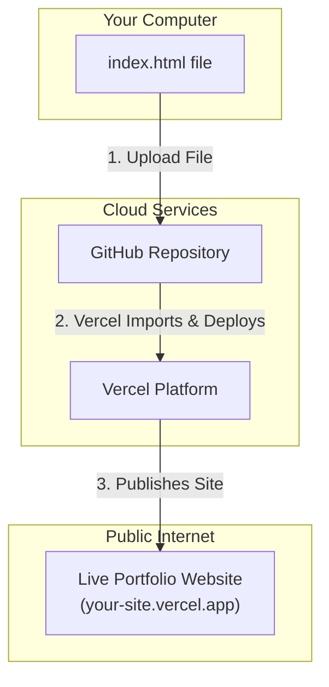

# Create & Host Portfolio Website for Free (No Coding Skills Required)

In today's digital-first world, a personal portfolio isn't just a nice-to-have; it's an essential tool for personal branding and career growth. But what if you're not a developer? The idea of coding a website from scratch can be daunting. This guide will show you how to bypass the code entirely. We'll build a professional, custom portfolio website using an AI generator, integrate a working contact form, and host it online for free.

This is a practical, no-code workflow for anyone—designers, marketers, writers, students, or professionals—looking to establish a compelling online presence without writing a single line of code.

### What You’ll Get

By the end of this article, you will have:
*   A fully functional, single-page portfolio website generated by AI.
*   A live, publicly accessible URL for your site, hosted for free.
*   An integrated contact form that sends submissions directly to your email.
*   A repeatable, no-code workflow for creating and deploying simple websites.

---

## The No-Code Stack: AI + Forms + Hosting

Our powerful, free toolkit consists of three core components that work together seamlessly. This combination allows you to go from an idea to a live website in under an hour.

*   **AI Website Generation:** [Google's Gemini Studio](https://aistudio.google.com/) (or any similar advanced AI chat model) will act as our "developer," turning a text prompt into complete HTML, CSS, and JavaScript code.
*   **Contact Form Backend:** [Web3Forms](https://web3forms.com/) provides a simple, free way to add a functional contact form without needing a server. Visitors can message you, and the submissions land right in your inbox.
*   **Hosting and Deployment:** [Vercel](https://vercel.com/) offers a generous free tier for hosting static websites. Its integration with GitHub makes deploying and updating your site incredibly simple.

This stack is a perfect example of the modern "no-code" and "low-code" ethos: leveraging powerful services to achieve professional results without the traditional barriers.

## Step 1: Generate Your Website with AI

This is where the magic happens. We will provide a large language model (LLM) like Gemini with structured information about you, and it will generate the code for a complete website.

### Prepare Your Input Data

The quality of the AI's output depends directly on the quality of your input. Don't just ask for "a portfolio." Gather the following information and have it ready:

*   **Your Bio:** A short, compelling paragraph about who you are and what you do.
*   **Your Skills:** A list of your key skills or areas of expertise.
*   **Projects/Experience:** Details for 3-4 of your best projects or work experiences. For each, include a title, a brief description, and the key outcomes or technologies used.
*   **Contact Info:** Your name, email, and links to your LinkedIn, GitHub, or social media profiles.

> **💡 Pro-Tip:** Copy and paste the text directly from your resume or LinkedIn profile. Format it in a simple text file for easy access.

### Craft the Perfect Prompt

Now, feed the prepared data into your chosen AI tool. A detailed, structured prompt is crucial. Here is a template you can adapt.

```text
Act as an expert front-end developer. Generate a complete, single-page portfolio website for me using HTML, CSS, and JavaScript.

**Requirements:**
1.  **Single File:** All HTML, CSS, and JavaScript should be in a single `index.html` file. Inline the CSS in a `<style>` tag and the JavaScript in a `<script>` tag.
2.  **Responsive Design:** The website must be fully responsive and look great on desktop, tablet, and mobile devices. Use a mobile-first approach.
3.  **Modern & Clean:** The design should be minimalist, professional, and clean, with a simple color palette (e.g., dark gray, white, and a single accent color like blue or green).
4.  **Sections:** The page must include the following sections in this order:
    *   A hero section with my name, a title/tagline, and links to my social profiles.
    *   An "About Me" section with my bio.
    *   A "Skills" section, displayed as a grid of skill tags.
    *   A "Projects" section, with each project displayed as a card containing a title, description, and key technologies.
    *   A "Contact Me" section with a simple contact form (name, email, message, submit button).

**Here is my personal data to populate the website:**

*   **Name:** [Your Name]
*   **Title/Tagline:** [e.g., "Digital Marketer & Content Strategist"]
*   **Bio:** [Paste your bio here]
*   **Skills:** [e.g., "SEO, Content Writing, Google Analytics, Email Marketing"]
*   **Social Links:**
    *   LinkedIn: [Your LinkedIn URL]
    *   GitHub: [Your GitHub URL]
*   **Projects:**
    *   **Project 1 Title:** [Title]
    *   **Project 1 Description:** [Description]
    *   **Project 1 Tech:** [e.g., "Mailchimp, Ahrefs, SEMrush"]
    *   **Project 2 Title:** [Title]
    *   **Project 2 Description:** [Description]
    *   **Project 2 Tech:** [e.g., "HubSpot, Google Ads"]

Please generate the complete `index.html` file now.
```

The AI will process this and output a single block of code.

### Review and Save the Code

You don't need to understand the code, but you do need to manage it.
1.  Click the "Copy" button to grab the entire code block generated by the AI.
2.  Open a plain text editor (like VS Code, Sublime Text, or even Notepad).
3.  Paste the code into a new file.
4.  Save the file with the exact name `index.html`.

You can double-click this file to open it in your web browser and preview your new website locally!

## Step 2: Add a Functional Contact Form with Web3Forms

Your AI-generated site has a contact form, but it doesn't *do* anything yet. We'll use Web3Forms to make it work.

1.  **Get Your Access Key:**
    *   Go to [Web3Forms.com](https://web3forms.com/).
    *   Enter your email address and click "Create Access Key."
    *   You'll receive an email with your unique access key. Keep it handy.

2.  **Integrate into Your HTML:**
    *   Open your `index.html` file in your text editor.
    *   Find the `<form>` tag in the "Contact Me" section.
    *   Modify the `<form>` tag and add a hidden input field as shown below. Replace `YOUR_ACCESS_KEY` with the key you received.

```html
<!-- Before (from AI) -->
<form>
  <!-- form fields like input, textarea, button -->
</form>

<!-- After (with Web3Forms integration) -->
<form action="https://api.web3forms.com/submit" method="POST">
  <input type="hidden" name="access_key" value="YOUR_ACCESS_KEY_HERE">
  <!-- The rest of your form fields (name, email, message, etc.) -->
  <!-- ... -->
  <button type="submit">Submit Form</button>
</form>
```

Save the `index.html` file. That's it. Your contact form is now fully functional and will send submissions to your email.

## Step 3: Deploy to the World with Vercel

Now it's time to put your website online. We'll use a standard Git-based workflow, which is a best practice and surprisingly simple with Vercel.

### The Deployment Flow

This process involves putting your code in a GitHub repository, which Vercel then reads to build and host your site.



### Step-by-Step Deployment

1.  **Create a GitHub Account:** If you don't have one, sign up for free at [GitHub.com](https://github.com/).
2.  **Create a New Repository:**
    *   On GitHub, click the "+" icon in the top right and select "New repository."
    *   Give it a name (e.g., `my-portfolio`).
    *   Keep it "Public."
    *   Click "Create repository."
3.  **Upload Your File:**
    *   On your new repository page, click the "Add file" button and choose "Upload files."
    *   Drag and drop your `index.html` file into the browser window.
    *   Click "Commit changes."
4.  **Deploy with Vercel:**
    *   Go to [Vercel.com](https://vercel.com/) and sign up for a free "Hobby" account. Choose to "Continue with GitHub."
    *   Authorize Vercel to access your GitHub account.
    *   Click "Add New..." and select "Project."
    *   Find your `my-portfolio` repository in the list and click "Import."
    *   Vercel will auto-detect the settings. You don't need to change anything.
    *   Click "Deploy."

Wait a minute or two, and Vercel will build and deploy your site, presenting you with a public URL (like `my-portfolio.vercel.app`). Congratulations, your portfolio is now live!

## Pros and Cons of This Approach

This method is powerful and fast, but it's important to understand its trade-offs.

| Pros                                         | Cons                                                     |
| :------------------------------------------- | :------------------------------------------------------- |
| **Completely Free**                          | **Limited Customization** (Relies on AI prompt skills)   |
| **Extremely Fast** (Minutes to a live site)  | **No CMS** (Content changes require re-uploading file)   |
| **No Coding Required**                       | **Generic Designs** (AI can produce similar-looking sites) |
| **Teaches Modern Deployment** (Git-based)    | **Dependent on Third-Party Services**                    |
| **Secure and Scalable** (Thanks to Vercel)   | **Not suitable for complex sites** (e.g., e-commerce)    |

## Conclusion: Your Brand, Your Platform

You've successfully built and launched a personal portfolio website without writing any code or spending any money. This workflow demonstrates the incredible power of modern AI and no-code platforms. You now have a live, professional hub for your personal brand that you can share with potential employers, clients, and collaborators.

While this AI-generated site is a fantastic starting point, it's also a gateway. As you grow, you can explore modifying the HTML/CSS yourself or diving into more advanced website builders. For now, you have a powerful and professional online presence—go share it with the world.
