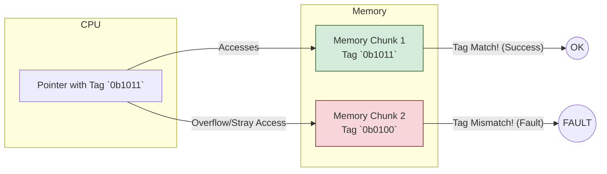

# Linux Kernel 6.18 LTS: Rust Drivers and Critical Security Updates

The Linux kernel development community has delivered a landmark release with version 6.18, officially designated as the next Long-Term Support (LTS) kernel in late 2025. This is a critical release for enterprises, cloud providers, and embedded systems, promising years of stable support.

Kernel 6.18 moves beyond incremental updates, introducing foundational changes that will shape the future of Linux development and security. Key highlights include the maturation of the Rust programming language for driver development, a refined release process to improve stability, and the full integration of ARM's Memory Tagging Extension (MTE), a hardware-level defense against memory vulnerabilities.

### What You’ll Get

This article breaks down the most impactful changes in Linux 6.18 LTS for practitioners. You will learn:

* **The State of Rust:** How Rust has moved from an experimental feature to a viable option for production-grade kernel drivers.
* **The New 'Prepatch' Cycle:** An inside look at the new development phase designed to catch bugs earlier and create more stable release candidates.
* **ARM's MTE Explained:** Why hardware-assisted memory tagging is a game-changer for securing cloud servers and edge devices.
* **Practical Implications:** What these changes mean for developers, system administrators, and security engineers.

---

## Rust in the Kernel Matures

Since its introduction in kernel 6.1, the "Rust for Linux" initiative has been one of the most watched developments in the open-source world. With 6.18, Rust transitions from a promising experiment to a production-ready tool for specific, high-impact subsystems.

### From Experimental to Production-Ready Drivers

The key milestone in this release is the stabilization of several core Rust abstractions and the inclusion of the first stable drivers written primarily in Rust. While C remains the dominant language, Rust now offers a compelling, safer alternative for new code.

* **Stable Drivers:** The 6.18 kernel includes stable Rust-based drivers for subsystems like **NVMe** and **GPIO**. These serve as a blueprint for future development.
* **Safer Abstractions:** The `kernel` crate and other low-level abstractions have been refined, providing safe wrappers around complex kernel APIs and reducing the need for `unsafe` blocks.
* **Toolchain Integration:** The build system integration is now seamless, making it straightforward to compile Rust modules alongside C code without complex manual configuration.

A simplified example of a Rust driver's structure illustrates the focus on safety and clear interfaces.

```rust
// A simplified conceptual example of a Rust character device driver
use kernel::prelude::*;
use kernel::chrdev;

// Define the module metadata
module! {
    type: MyCharDevice,
    name: b"my_rust_device",
    author: b"Kernel Dev",
    description: b"A sample Rust character device for Kernel 6.18",
    license: b"GPL v2",
}

// The main driver struct
struct MyCharDevice;

// Implementation of the character device file operations
impl chrdev::FileOperations for MyCharDevice {
    // Open is called when a user opens the device file
    fn open(context: &chrdev::OpenContext) -> Result<Self> {
        pr_info!("Device opened!\n");
        Ok(MyCharDevice)
    }

    // Read from the device
    fn read(
        &self,
        _file: &kernel::fs::File,
        _data: &mut [u8],
        _offset: u64,
    ) -> Result<usize> {
        // Safe Rust code handles memory management and logic
        pr_info!("Read operation called.\n");
        Ok(0) // Return 0 bytes read for this example
    }
}
```

### Key Advantages of Rust Drivers

The push for Rust is driven by its ability to eliminate entire categories of bugs that have plagued C-based systems for decades.

| Feature | Advantage in the Kernel |
| :--- | :--- |
| **Memory Safety** | Eliminates buffer overflows and use-after-free bugs at compile time. |
| **Concurrency Safety** | The ownership and borrowing system prevents data races. |
| **Expressive Type System** | Creates clearer, more maintainable APIs between kernel subsystems. |
| **Modern Tooling** | `cargo` and a rich ecosystem simplify dependency management and testing. |

> **A Note on `unsafe`:** Rust still provides the `unsafe` keyword for low-level operations like direct memory access, which is essential in a kernel. However, its explicit nature forces developers to isolate and rigorously audit potentially dangerous code, a significant improvement over C's implicit unsafety.

## The New 'Prepatch' Release Cycle

For years, the kernel development cycle followed a predictable pattern: a two-week merge window followed by a series of release candidates (`-rc`). Kernel 6.18 formalizes a new step: the **Prepatch** phase. This phase occurs *after* the merge window closes but *before* the first release candidate is tagged.

The primary goal is to create a more stable `-rc1`. Previously, `-rc1` often contained significant, undiscovered integration bugs from the merge window. The prepatch phase provides a dedicated period for maintainers and automated tooling to find and fix these issues.

### How It Works

The new workflow introduces a short, focused integration and stabilization period.

```mermaid
graph TD;
    A[Merge Window Opens] --> B{Subsystem Pull Requests};
    B --> C[Merge Window Closes];
    C --> D(New: Prepatch Phase);
    D --> E{Integration Testing and Fixes};
    E --> F[rc1 Tagged];
    F --> G{Release Candidates (rc2, rc3...)};
    G --> H[Final Release];
```

### Impact on Developers and Testers

This change has clear benefits for everyone involved in the kernel ecosystem:

* **For Subsystem Maintainers:** Provides an earlier opportunity to see how their changes interact with the rest of the kernel.
* **For Automated Test Systems:** The prepatch tree (`-preN`) offers a clear target for heavy integration and regression testing.
* **For Enterprise Distributions:** A more stable `-rc1` means a higher quality baseline for their own testing, leading to more reliable final products.

For more details on the kernel development process, the official documentation at [The Linux Kernel Archives](https://www.kernel.org/doc/html/latest/process/development-process.html) is an excellent resource.

## MTE on ARM: A Hardware-Assisted Security Leap

Perhaps the most significant security feature in Kernel 6.18 is the mature, production-ready support for the **ARM Memory Tagging Extension (MTE)**. MTE is a hardware feature in ARMv8.5-A and later processors that provides hardware-level enforcement against common memory safety violations.

### MTE in the Cloud and at the Edge

With the rise of powerful ARM-based servers like AWS Graviton and Ampere Altra, securing workloads in the cloud is paramount. MTE provides a performant way to detect and mitigate memory-based attacks that software solutions like AddressSanitizer (ASan) can't match in production environments.

Here’s how MTE works at a high level:

1. **Tagging:** A small, 4-bit "tag" is associated with every 16 bytes of memory. The same tag is stored in the top bits of pointers that refer to that memory.
2. **Checking:** On every memory access (load or store), the CPU's hardware checks if the pointer's tag matches the memory's tag.
3. **Faulting:** If the tags do not match, the hardware raises an exception, allowing the kernel to terminate the offending process immediately. This stops buffer overflows and use-after-free attacks dead in their tracks.



The performance overhead of MTE is significantly lower than software-based tools, making it feasible to enable by default for sensitive applications and even entire systems, a huge win for cloud and edge security. More information can be found in the official [ARM developer documentation](https://developer.arm.com/documentation/102142/0100/An-introduction-to-MTE).

## Other Notable Changes

While Rust, MTE, and the new release cycle are headliners, 6.18 LTS also includes many other important updates:

* **Bcachefs Maturation:** The next-generation copy-on-write (CoW) filesystem continues to stabilize, with significant performance improvements and new features.
* **Improved CPU Scheduler:** Enhancements to the kernel scheduler provide better performance on systems with hybrid architectures (e.g., Intel P-cores and E-cores).
* **BPF Enhancements:** The Berkeley Packet Filter (BPF) subsystem, crucial for networking and observability, gains new helper functions and improved security controls.
* **IO_uring Optimizations:** The high-performance asynchronous I/O interface has been further optimized, reducing overhead and increasing throughput for demanding applications like databases.

## Summary: A Landmark LTS Release

Linux Kernel 6.18 LTS is more than just another update; it's a strategic release that hardens the kernel's foundation.

* The maturity of **Rust** provides a path toward a more secure and robust driver ecosystem.
* The **'Prepatch' cycle** refines the world's largest collaborative software project, promising higher stability.
* The integration of **ARM MTE** marks a fundamental shift toward hardware-enforced security, making the entire platform more resilient.

For any organization running Linux on modern hardware, especially in security-sensitive cloud and edge environments, upgrading to 6.18 is not just recommended—it's essential for building a secure, stable, and future-proof infrastructure.

## Further Reading

* <https://www.theregister.com/2025/12/05/new_lts_kernel_and_alpine/>
* <https://linuxsecurity.com/features/linux-kernel-security-2025>
