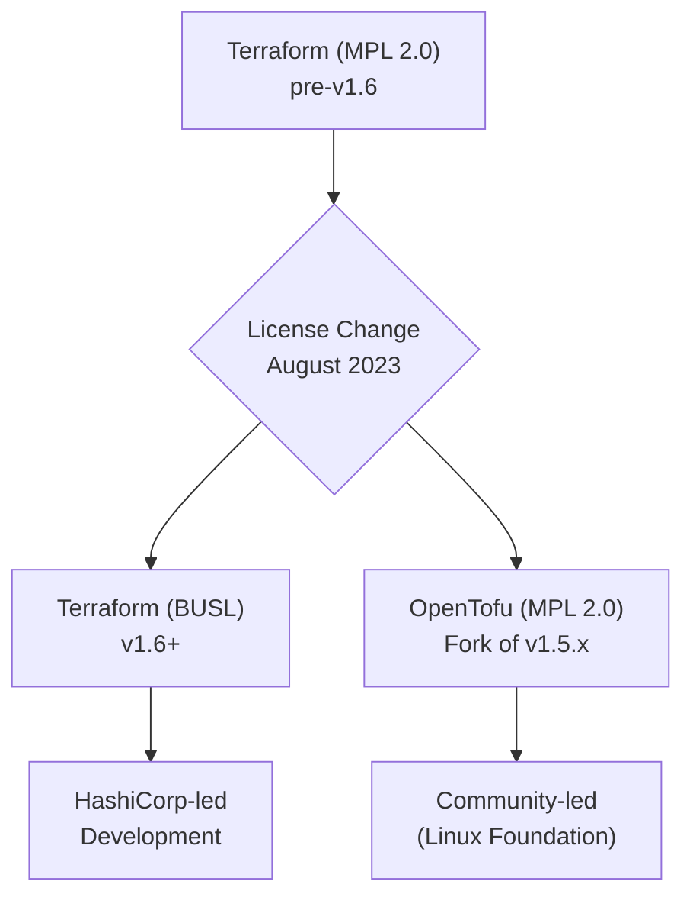
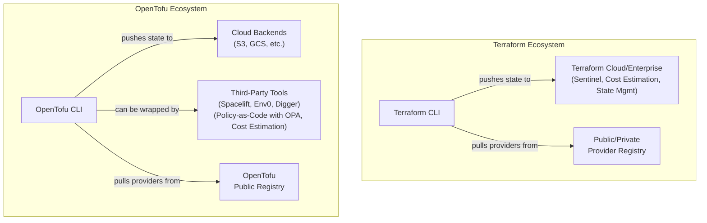

# Terraform vs. OpenTofu in 2025: The Definitive Feature Comparison

The Infrastructure as Code (IaC) landscape was permanently altered in 2023 when HashiCorp transitioned Terraform from an open-source MPL 2.0 license to the Business Source License (BUSL). This move spurred the creation of OpenTofu, a community-driven fork managed by the Linux Foundation.

Fast forward to late 2025. The dust has settled, and what began as a nearly identical twin has evolved into a distinct alternative. Both tools still share a common HCL syntax and core workflow, but their development paths, feature sets, and philosophies have clearly diverged. This article provides a practitioner's guide to navigating the choice between Terraform and OpenTofu for new projects today.

## What You’ll Get

- **Core Differences:** A clear breakdown of the licensing and governance models.
- **Feature-by-Feature Analysis:** A detailed comparison of state management, security, the provider ecosystem, and CLI enhancements.
- **Architectural Context:** Mermaid diagrams illustrating the fork's origin and the different ecosystems.
- **Decision Framework:** Actionable advice on how to choose the right tool for your team’s needs in 2025.

## The Core Divide: License and Governance

The fundamental difference isn't a feature—it's philosophy, enforced by licensing and governance. This initial split is the root of all subsequent technical divergence.

- **Terraform** is licensed under the [BUSL 1.1](https://www.hashicorp.com/bsl). It is source-available but not OSI-approved open source. The license restricts using Terraform's code to create a competitive commercial offering. Development is solely directed by HashiCorp.
- **OpenTofu** is licensed under the [MPL 2.0](https://www.mozilla.org/en-US/MPL/2.0/), a well-established, OSI-approved open-source license. It is governed by a technical steering committee under the neutral stewardship of the Linux Foundation, ensuring community-driven development.

This fork created two distinct evolutionary paths.



## Feature Deep Dive: Where They Differ in 2025

While the core `plan` and `apply` workflow remains familiar, two years of separate development have produced meaningful differences.

| Feature Area         | Terraform                        | OpenTofu                               |
| :------------------- | :------------------------------- | :------------------------------------- |
| **Licensing**        | BUSL 1.1 (Source-Available)      | MPL 2.0 (Open Source)                  |
| **Governance**       | Corporate (HashiCorp)            | Community (Linux Foundation)           |
| **State Encryption** | Backend-dependent (e.g., S3-SSE) | Native, client-side encryption         |
| **Registry**         | Original HashiCorp Registry      | OpenTofu Public Registry               |
| **Enterprise Suite** | Terraform Cloud & Enterprise     | Third-party tools (Spacelift, Env0)    |
| **Policy as Code**   | Sentinel (proprietary)           | Open Policy Agent (OPA), etc.          |
| **Core CLI**         | Mature, stable                   | Backwards-compatible with new features |

### State Management & Security

State file security has become a major differentiator. Since the state file can contain sensitive data, protecting it at rest and in transit is critical.

**Terraform** continues to rely on backend-level encryption. For example, when using an S3 backend, you enable server-side encryption on the S3 bucket. The security of your state is entirely dependent on the configuration and capabilities of your chosen backend.

```hcl
# main.tf - Terraform S3 backend configuration
terraform {
  backend "s3" {
    bucket         = "my-tf-state-bucket-2025"
    key            = "global/s3/terraform.tfstate"
    region         = "us-east-1"
    encrypt        = true # Relies on S3's server-side encryption
    dynamodb_table = "terraform-locks"
  }
}
```

**OpenTofu** has introduced a game-changing feature: **native client-side state encryption**. This encrypts the state file _before_ it is sent to the backend, providing end-to-end encryption. The keys remain with you, adding a powerful layer of security that is independent of the backend's capabilities.

```hcl
# main.tf - OpenTofu S3 backend with client-side encryption
terraform {
  backend "s3" {
    bucket         = "my-tofu-state-bucket-2025"
    key            = "global/s3/terraform.tfstate"
    region         = "us-east-1"
    # New encryption block for client-side security
    encryption {
      type = "age"
      # Public key from a tool like age-keygen
      recipient = "age1lq…"
    }
  }
}
```

> **What This Means:** With OpenTofu, even if your backend storage is compromised or misconfigured, the state file's contents remain unreadable without the private key. This is a significant security win.

### Ecosystem & Registry

The provider ecosystem is the lifeblood of any IaC tool. Here, the two platforms cater to different integration philosophies.

**Terraform**'s ecosystem is vertically integrated. The official [Terraform Registry](https://registry.terraform.io/) is vast, and new features are often designed to seamlessly connect the CLI with Terraform Cloud and Enterprise. This offers a polished, all-in-one experience for teams invested in the HashiCorp stack, with features like Sentinel for policy-as-code and integrated cost estimation.

**OpenTofu** promotes a best-of-breed, horizontally integrated ecosystem. It operates its own [OpenTofu Registry](https://opentofu.org/registry), which has achieved near-parity with Terraform's for all major providers. For advanced features, it encourages integration with open standards and third-party tools like Open Policy Agent (OPA) for policy-as-code and platforms like Spacelift, Env0, or Digger for CI/CD and collaboration.



### CLI and Core Functionality

Both CLIs are mature and stable. You still use the `tofu` command (instead of `terraform`) with OpenTofu, but the subcommands (`init`, `plan`, `apply`) are identical.

The divergence is in the details. HashiCorp has focused CLI improvements on enhancing the Terraform Cloud experience. OpenTofu's development, driven by community requests, has introduced quality-of-life features like more readable plan outputs and more flexible `test` command structures, which were long-standing requests in the pre-fork community.

## Choosing Your Path in 2025

The decision is no longer about just a license. It’s about aligning your technical strategy and organizational philosophy with the tool's ecosystem.

### Choose Terraform if

- ✅ You are deeply integrated with the HashiCorp ecosystem (Vault, Consul, Packer, Terraform Cloud).
- ✅ You require a single commercial vendor for support, SLAs, and enterprise features.
- ✅ Your organization's legal and business teams have approved the BUSL 1.1 license and its constraints.
- ✅ A tightly integrated, all-in-one platform is more valuable to your team than a composable, open-source toolchain.

### Choose OpenTofu if

- ✅ A guarantee of an OSI-approved, open-source license (MPL 2.0) is a strict requirement.
- ✅ You value community-driven governance and want a say in the tool's future direction.
- ✅ Enhanced security features like client-side state encryption are a priority.
- ✅ You prefer a best-of-breed, composable toolchain, integrating with tools like OPA, various CI/CD systems, and third-party management platforms.

## Final Thoughts

In 2025, the Terraform vs. OpenTofu debate has matured from a licensing dispute into a genuine choice between two powerful, but distinct, IaC platforms.

Terraform offers a polished, stable, and vertically integrated solution for the enterprise, backed by a single vendor. OpenTofu champions the open-source ethos, delivering community-prioritized features like enhanced security and a flexible, composable ecosystem. The choice you make today will shape not just how you write code, but the philosophy and architecture of your entire cloud infrastructure practice.

## Further Reading

- <https://spacelift.io/blog/opentofu-vs-terraform>
- <https://medium.com/@averageguymedianow/terraform-vs-opentofu-the-complete-guide-to-infrastructure-as-code-tools-in-2025-7f1b9dccd9e7>
