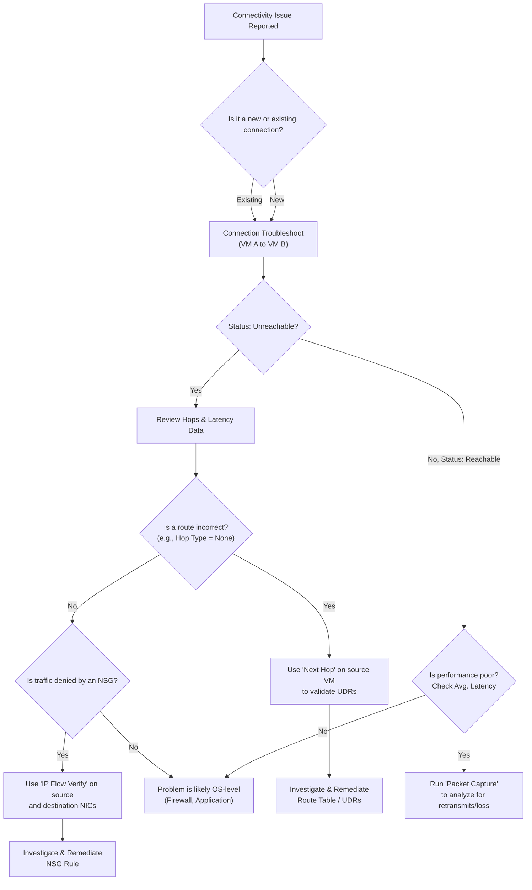

# Technical Insight: Mastering Azure Network Watcher

Azure Network Watcher is the foundational diagnostics and monitoring suite for your Azure Virtual Network (VNet). It's not a single resource you deploy, but a regional backend service that powers a collection of indispensable tools. For any practitioner managing Azure infrastructure, understanding how to leverage Network Watcher is non-negotiable for maintaining network health, ensuring security, and rapidly resolving connectivity issues.

This article dives deep into the practical application of Network Watcher, moving beyond the official documentation to provide a practitioner's view on its tools, management, and common pitfalls.

### What You’ll Get

- **Core Purpose:** A clear understanding of what Network Watcher is and its role in the Azure ecosystem.
- **Key Tool Breakdown:** Actionable insights into essential tools like IP Flow Verify, Next Hop, Connection Troubleshoot, and NSG Flow Logs.
- **Practical Workflow:** A visual troubleshooting flow to diagnose common network problems systematically.
- **Management Best Practices:** Guidance on managing the Network Watcher resource, its costs, and automation strategies.
- **Common Pitfalls:** A look at frequent mistakes and how to avoid them.

---

## The Role of Network Watcher in Azure

Azure automatically creates a Network Watcher instance in a resource group named `NetworkWatcherRG` for each region where you deploy virtual network resources. This design choice is fundamental to its operation.

- **Regional Scope:** Network Watcher operates on a per-region basis. The instance in _East US_ provides tools to diagnose resources _within_ East US.
- **Backend Service:** It's a suite of tools rather than a single, monolithic service. You interact with it via the Azure Portal, CLI, PowerShell, or REST API to diagnose specific issues.
- **Automatic & Essential:** While you can disable it, this is strongly discouraged. Many network diagnostic features across Azure depend on it.

> **Note:** The `NetworkWatcherRG` resource group and the Network Watcher resources within it are automatically managed by Azure. Deleting them can break network diagnostics and they will likely be recreated by the platform. It's best to leave them in place and manage access via Azure RBAC.

## Core Diagnostic and Monitoring Tools

Network Watcher's power lies in its specialized tools. Knowing which tool to use for a specific problem is key to efficient troubleshooting.

### IP Flow Verify

This is your first stop for diagnosing Network Security Group (NSG) rule issues. It answers a simple question: "Is traffic between a specific source and destination allowed or denied by NSG rules?"

- **Use Case:** A developer reports that their web server VM cannot receive traffic from their jump box VM on port 443.
- **How it Works:** It checks the effective NSG rules applied to a VM's network interface (NIC) to determine if a specific flow (protocol, source/destination IP, source/destination port) is permitted.

```bash
# Azure CLI example to check if a VM can receive HTTPS traffic
az network watcher test-ip-flow \
  --resource-group MyResourceGroup \
  --name MyVM \
  --direction Inbound \
  --protocol TCP \
  --local-port 443 \
  --remote-ip-address 203.0.113.10 \
  --remote-port 54321
```

The output will explicitly state `Access: Allow` or `Access: Deny` and name the specific NSG rule responsible.

### Next Hop

When you suspect a routing issue, Next Hop is the tool to use. It tells you the next hop type and IP address for traffic leaving a VM to a specific destination. This is invaluable for debugging User-Defined Routes (UDRs).

- **Use Case:** You've configured a firewall (NVA) to inspect all outbound internet traffic, but you suspect some traffic is bypassing it.
- **How it Works:** It inspects the VM's effective route table (a combination of system routes and UDRs) to determine the path for a given destination IP.

Common Next Hop types include:

- `VirtualNetworkGateway`
- `VnetLocal`
- `Internet`
- `VirtualAppliance` (your NVA)
- `None` (traffic is dropped)

### Connection Troubleshoot

This tool provides a more comprehensive, end-to-end connectivity check between a source (like a VM) and a destination (VM, FQDN, or IP address). It combines the functionality of IP Flow Verify and Next Hop, providing a unified view.

- **Use Case:** A VM cannot connect to an Azure SQL Database public endpoint.
- **What it Checks:**
  - Basic connectivity (TCP ping).
  - DNS resolution for FQDNs.
  - Effective NSG rules at the source and destination (if both are Azure resources).
  - Effective routes at the source and destination.

### Key Diagnostic Tool Comparison

| Tool                        | Primary Question                            | Best For                      | Scope      |
| :-------------------------- | :------------------------------------------ | :---------------------------- | :--------- |
| **IP Flow Verify**          | "Is this NSG rule blocking my traffic?"     | NSG rule validation           | Single NIC |
| **Next Hop**                | "Where is my traffic being routed?"         | UDR and routing issues        | Single NIC |
| **Connection Troubleshoot** | "Can A reach B, and why or why not?"        | General connectivity problems | End-to-end |
| **Packet Capture**          | "What does the traffic actually look like?" | Deep, intermittent issues     | Single NIC |

### NSG Flow Logs

For proactive monitoring and security analysis, NSG Flow Logs are essential. They record information about IP traffic flowing through an NSG, providing invaluable data for auditing, compliance, and traffic analysis.

- **Data Captured:** Source/Destination IP, Source/Destination Port, Protocol, Traffic decision (Allowed/Denied).
- **Storage:** Logs are written to an Azure Storage Account in JSON format.
- **Analysis:** You can analyze these logs using tools like **Azure Traffic Analytics**, which provides rich visualizations and insights on top of the raw log data.

Enabling NSG Flow Logs is a best practice for any production environment. Learn more at the [official NSG Flow Logs documentation](https://docs.microsoft.com/azure/network-watcher/network-watcher-nsg-flow-logging-overview).

## A Practical Troubleshooting Workflow

When an issue arises, a systematic approach saves time. The following diagram illustrates a logical flow for diagnosing a typical "VM-to-VM" connectivity problem.



This workflow starts broad with Connection Troubleshoot and narrows the focus based on the results, leading you to the specific tool needed to find the root cause.

## Managing Network Watcher Effectively

### Cost Considerations

While the Network Watcher service itself is free, the features you enable can incur costs.

- **NSG Flow Logs:** You pay for the volume of logs generated and stored in your Azure Storage Account.
- **Traffic Analytics:** Processed log data is ingested into a Log Analytics Workspace, which has its own pricing model.
- **Packet Capture:** You pay for the storage of the capture files.
- **Connection Monitor:** Tests incur a monthly fee per endpoint and per test group.

Always review the [Azure Pricing Calculator](https://azure.microsoft.com/pricing/calculator/) to estimate costs before enabling these features at scale.

### Automation and Infrastructure as Code (IaC)

For consistency and repeatability, manage Network Watcher configurations using IaC tools like Bicep, ARM Templates, or Terraform. This is especially important for enabling NSG Flow Logs across your environment.

```terraform
# Example: Enabling NSG Flow Logs with Terraform
resource "azurerm_network_watcher_flow_log" "example" {
  network_watcher_name = "NetworkWatcher_eastus"
  resource_group_name  = "NetworkWatcherRG"

  network_security_group_id = azurerm_network_security_group.example.id
  storage_account_id        = azurerm_storage_account.example.id
  enabled                   = true

  retention_policy {
    enabled = true
    days    = 7
  }

  traffic_analytics {
    enabled               = true
    workspace_id          = azurerm_log_analytics_workspace.example.workspace_id
    workspace_region      = azurerm_log_analytics_workspace.example.location
    workspace_resource_id = azurerm_log_analytics_workspace.example.id
  }
}
```

This ensures that all new NSGs are configured with the correct logging and retention policies from day one.

## Conclusion

Azure Network Watcher is a powerful and essential suite of tools that moves network troubleshooting from guesswork to a data-driven process. By understanding the specific purpose of each tool—from the quick checks of IP Flow Verify to the deep analysis of NSG Flow Logs—you can drastically reduce your mean time to resolution (MTTR).

Embrace a systematic workflow, manage costs proactively, and automate configurations to make Network Watcher an integral part of your robust and observable Azure environment.
