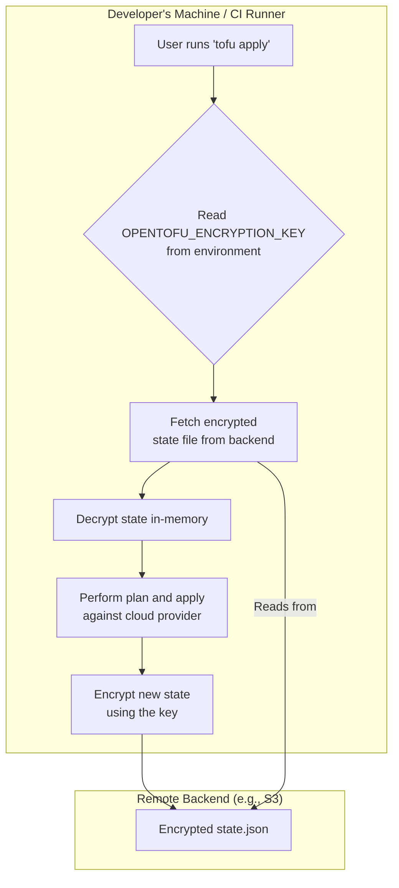

# Securing Your Infrastructure: Implementing Native State Encryption in OpenTofu

Infrastructure as Code (IaC) has revolutionized how we manage cloud resources, but it introduces a critical security challenge: the state file. This file, a detailed blueprint of your managed infrastructure, often contains sensitive data like database credentials, private keys, and API tokens. Leaving it unencrypted is like leaving your infrastructure's master keys on a public table.

Fortunately, OpenTofu 1.9 introduced a powerful, native feature to address this directly: at-rest state encryption. This eliminates the need for complex external tools or relying solely on backend-specific encryption, giving you direct control over your security posture.

This article provides a hands-on guide to implementing native state encryption in OpenTofu, turning your state file from a liability into a secured asset.

## What You’ll Get

By the end of this tutorial, you will:

*   **Understand the Risks:** Grasp the security implications of an unencrypted OpenTofu state file.
*   **Implement Native Encryption:** Learn the step-by-step process to configure and enable state encryption.
*   **Visualize the Workflow:** See a clear diagram of the encryption and decryption process.
*   **Learn Best Practices:** Discover tips for managing encryption keys and migrating existing states.
*   **Compare Approaches:** Understand how native encryption stacks up against other methods.

## The Silent Risk: Why Unencrypted State is a Security Blind Spot

The OpenTofu state file (`.tfstate`) is a JSON file that stores a mapping between your configuration and the real-world resources it manages. While essential for operations, it can inadvertently become a treasure trove for attackers if compromised.

**What sensitive data can be found in a state file?**

*   Database root passwords from a `random_password` resource.
*   Private keys for virtual machines.
*   API keys for third-party services.
*   Initial secrets for services like AWS Secrets Manager.
*   Private IP addresses and network topology details.

> **Note:** A compromised state file not only leaks secrets but also gives an attacker a complete, queryable map of your infrastructure, accelerating their ability to move laterally and cause damage.

Leaving the state file unencrypted, even in a "private" S3 bucket or storage account, creates a significant risk. A single misconfiguration in bucket policy or IAM permissions could expose all your secrets.

## Introducing OpenTofu's Native State Encryption

Introduced in OpenTofu 1.9, native state encryption allows you to encrypt the state file *before* it's written to the remote backend. This ensures the data is encrypted at rest, with a key that you control, independent of the backend's storage-level encryption.

The mechanism is straightforward and robust:

*   **Algorithm:** It uses AES-GCM, a widely trusted authenticated encryption standard.
*   **Key Management:** The encryption key is provided via an environment variable, making it easy to integrate with CI/CD systems and secret managers.
*   **Transparency:** The encryption and decryption process is handled transparently by the OpenTofu CLI during operations like `plan`, `apply`, and `refresh`.

## Step-by-Step Implementation Guide

Let's walk through configuring native encryption for an S3 backend. The principles are identical for other backends like Azure Blob Storage or Google Cloud Storage.

### Step 1: Prerequisites

Ensure you are using OpenTofu version 1.9.0 or newer. You can verify your version with:

```bash
tofu --version
```

### Step 2: Generate a Secure Encryption Key

The encryption key must be a 32-byte, Base64-encoded string. You can generate a cryptographically secure key using `openssl`.

```bash
openssl rand -base64 32
# Example Output: jL4n/G+pPq8sW7uX9zVbB/fG3hK5eR1aZ0nC2vB/dE=
```

> **Critical Security Warning:** Treat this key as your most important secret. Do **not** commit it to your Git repository. Store it securely in a dedicated secret manager like HashiCorp Vault, AWS Secrets Manager, or Infisical.

### Step 3: Configure the Backend in Your OpenTofu Code

Modify your `backend` configuration block to include the `encryption` block. For this guide, we'll use the `env` key provider, which tells OpenTofu to look for the key in an environment variable.

```hcl
# main.tf or backend.tf

terraform {
  backend "s3" {
    bucket         = "your-secure-opentofu-state-bucket"
    key            = "global/s3/terraform.tfstate"
    region         = "us-east-1"
    dynamodb_table = "your-opentofu-state-lock-table"
    encrypt        = true # This is AWS-level SSE, still recommended!

    # --- Add this block for native OpenTofu encryption ---
    encryption {
      key_provider "env" {}
    }
  }
}
```

This configuration tells OpenTofu that state files for this backend must be encrypted and that the key will be supplied by the environment.

### Step 4: Set the Environment Variable

Before running any OpenTofu commands, export the generated key as the `OPENTOFU_ENCRYPTION_KEY` environment variable.

```bash
export OPENTOFU_ENCRYPTION_KEY="jL4n/G+pPq8sW7uX9zVbB/fG3hK5eR1aZ0nC2vB/dE="
```

In a CI/CD environment (like GitHub Actions or GitLab CI), you would inject this variable from the pipeline's secret store.

### Step 5: Initialize and Apply

Now, you're ready to run OpenTofu.

1.  **Initialize the backend:** OpenTofu will recognize the new encryption configuration.
    ```bash
    tofu init
    ```
2.  **Apply your changes:**
    ```bash
    tofu apply
    ```

After the `apply` completes, the `terraform.tfstate` object in your S3 bucket will be encrypted with your key. Anyone who gains access to the S3 object without the key will only see unintelligible ciphertext.

## The Encryption and Decryption Flow

The entire process is seamless from the user's perspective. The following diagram illustrates the data flow during an `apply` operation.



## Best Practices and Considerations

*   **Key Rotation:** Regularly rotate your encryption key to limit the "blast radius" if a key is ever compromised. To rotate, generate a new key, update your secret manager, and re-initialize your project with the new key in the environment (`tofu init -reconfigure`). OpenTofu will be able to decrypt the old state with the old key and will write the new state with the new key. *Ensure both old and new keys are available during the transition.*
*   **Secret Management is Paramount:** The security of this system depends entirely on the security of your encryption key. Use a robust secret management tool and grant access on a need-to-know basis.
*   **Migrating Existing State:** If you have an unencrypted state file, you can migrate it by:
    1.  Pulling the state locally: `tofu state pull > current.tfstate`
    2.  Adding the `encryption` block to your backend configuration.
    3.  Re-initializing: `tofu init -reconfigure`
    4.  Pushing the state back up: `tofu state push current.tfstate`
*   **Team Collaboration:** Ensure all team members have a secure way to access the required `OPENTOFU_ENCRYPTION_KEY` for their work. Automated credential-fetching tools are ideal.

## Comparing Encryption Approaches

Native encryption is a powerful option, but it's helpful to see how it compares to other methods.

| Approach | Pros | Cons |
| :--- | :--- | :--- |
| **Native OpenTofu Encryption** | - **Backend Agnostic:** Works across all backends.<br>- **Zero Trust:** Data is encrypted before leaving the client.<br>- **Full Control:** You manage the key lifecycle. | - **Key Management Overhead:** You are responsible for securely storing and rotating the key. |
| **Backend-Provided Encryption (e.g., S3 SSE-KMS)** | - **Simplified Management:** The cloud provider handles key management (with KMS).<br>- **Transparent:** Often enabled with a single boolean flag. | - **Backend-Specific:** Only protects data at rest *in that specific backend.*<br>- **Limited Control:** Relies on the provider's security and IAM. |
| **No Encryption** | - **Simple Setup:** No extra configuration needed. | - **Extreme Security Risk:** Exposes all infrastructure secrets and details if the state file is leaked. |

For maximum security, combine native OpenTofu encryption with backend-provided encryption (like `encrypt = true` in the S3 backend). This "belt and suspenders" approach provides defense-in-depth.

## Conclusion

The native state encryption feature in OpenTofu 1.9 is a monumental step forward for IaC security. By giving practitioners a simple, standardized way to encrypt state files at rest, it closes a common and dangerous security gap. The process is straightforward to implement and integrates seamlessly into existing CI/CD workflows.

Don't wait for a security incident to highlight the importance of your state file. Take control of your infrastructure's secrets today by enabling native state encryption. For more details, consult the official [OpenTofu documentation on backend configuration](https://opentofu.org/docs/language/settings/backends/configuration/).


## Further Reading

- https://infisical.com/blog/terraform-vs-opentofu
- https://spacelift.io/blog/opentofu-vs-terraform
