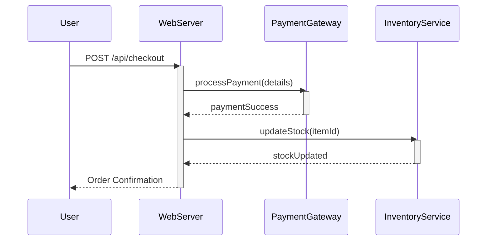

# Technical Insight: Mastering GitHub Copilot in Large-Scale Applications

GitHub Copilot is more than an autocomplete; it's a powerful pair programmer that can dramatically accelerate development. However, its effectiveness can diminish in large, complex codebases. When faced with thousands of files, intricate business logic, and evolving architecture, Copilot can become slow, confused, or generate irrelevant code.

The key isn't to abandon the tool but to master it. This guide moves beyond basic prompts to provide advanced techniques for wielding GitHub Copilot effectively in enterprise-grade applications. We'll cover how to manage its context, prevent drift, and integrate it into a professional development workflow.

### What You’ll Get

*   **Context Control:** Strategies to focus Copilot's attention and prevent context overload.
*   **Advanced Prompting:** Techniques using `@workspace` to make Copilot aware of your entire project.
*   **Workflow Integration:** How to use Test-Driven Development (TDD) and iterative chat to build complex features.
*   **Architectural Guidance:** Methods for using Copilot to visualize and generate code based on system architecture.
*   **Performance Tips:** Best practices to avoid AI slowdown and maintain a fluid development experience.

---

## The Challenge of Scale for AI Assistants

AI programming assistants like GitHub Copilot rely on *context*—the code in your currently open files, your recent history, and your prompts. In a small project, this context is manageable. In a large-scale application, the context window becomes a bottleneck.

*   **Context Dilution:** With hundreds of potentially relevant files, Copilot may struggle to identify the correct patterns, service interfaces, or data models.
*   **Architectural Ignorance:** The AI has no inherent understanding of your system's high-level architecture, bounded contexts, or design principles. It only sees the code you show it.
*   **Performance Degradation:** Feeding the AI an enormous context can lead to slower responses and higher resource usage, disrupting your development flow.

To overcome this, you must actively manage and direct Copilot's focus, acting as an architect guiding your AI apprentice.

## Core Strategies for Effective Large-Scale Use

Mastery involves moving from passively accepting suggestions to actively curating the context Copilot uses to generate code.

### Leverage Contextual Scaffolding

Your first line of control is your IDE environment. Copilot heavily weighs the files you have open.

*   **Curate Your Tabs:** Before working on a feature, close irrelevant files. Open the specific files that define the feature's dependencies: the data model, the service interface, the relevant API controller, and the parent component. This creates a focused "micro-context."
*   **Use Precise Comments:** Guide Copilot with explicit, in-code instructions. Instead of a generic comment, be specific about the logic you need.

```javascript
// GOOD:
// Given a user object, check if user.subscriptionStatus is 'active'
// and user.lastLogin is within the last 30 days.
// Use the 'date-fns' library to handle date comparison.
// Returns a boolean.
function isUserActive(user) {
  // Copilot will generate code here based on the detailed instructions
}
```

> **Pro Tip:** Think of comments as a direct conversation with the AI. The more specific the requirements you provide *before* the function signature, the more accurate the generated code will be.

### Master Project-Wide Context with `@workspace`

For tasks that require knowledge across the entire codebase, Copilot Chat's `@workspace` command is your most powerful tool. It allows you to ask questions and generate code based on an index of your entire repository, not just your open files.

Use it to:
*   **Understand Existing Logic:** "`/explain` how authentication is handled in `@workspace`"
*   **Find Relevant Code:** "Where in `@workspace` do we define the database schema for the `Orders` table?"
*   **Generate New Features:** "`@workspace` /new I need a new API endpoint `/api/v1/reports`. It should use the `ReportService` to fetch data and transform it using `ReportDataTransformer`. Create a new file for this in the `controllers` directory."

This moves Copilot from a file-level assistant to a project-level partner. For more information, refer to the official [GitHub Copilot documentation](https://docs.github.com/en/copilot).

### Prevent AI Hallucination and Drift

In a large codebase, it's easy for the AI to "drift" and generate code that is inconsistent with your project's patterns. You must anchor it with clear, atomic instructions.

*   **Be Specific and Atomic:** Break down large tasks. Instead of "Create a user profile page," use a series of smaller prompts: "Generate a React component for a user profile header," followed by "Generate a service function to fetch user data."
*   **Provide Examples:** If you want a function to follow a certain pattern, paste a small, correct example into the chat or a comment block to guide the output.

This table illustrates the difference between vague and effective prompting:

| Bad Prompt (Vague)                         | Good Prompt (Specific & Actionable)                                                                                             |
| ------------------------------------------ | ------------------------------------------------------------------------------------------------------------------------------- |
| "Add caching."                             | "Implement Redis caching for the `getUserDetails(userId)` function in `UserService.ts`. The cache key should be `user:{userId}`." |
| "Refactor this file."                      | "Refactor the `processOrder` function in `OrderProcessor.java` to use the Strategy pattern for payment processing."             |
| "Fix the bug."                             | "In `@workspace`, the checkout process fails when the cart contains a discounted item. Explain the cause and suggest a fix." |

---

## Advanced Techniques and Workflow Integration

Integrating Copilot seamlessly into professional workflows requires more than just prompting. It involves using it for planning, testing, and maintaining architectural consistency.

### Use Chat History for Iterative Development

Don't treat each prompt as a separate event. Use the Copilot Chat history to build on previous interactions. If the first generated code isn't quite right, you can reply with refinements:

1.  **Initial Prompt:** "Create a TypeScript interface for a `Product` with id, name, price, and an optional description."
2.  **Copilot Generates Code.**
3.  **Refinement:** "Good. Now add a `tags` property which is an array of strings."
4.  **Further Refinement:** "Make the `id` and `name` properties readonly."

This iterative loop is incredibly effective for developing complex logic, as it keeps the context tight and focused.

### Architecting for AI-Friendliness

The better your code is structured, the better Copilot can understand and assist you. Principles of good software design are also principles of good AI collaboration.

*   **Single Responsibility Principle (SRP):** Small, focused modules and functions are easier for Copilot to understand and modify correctly.
*   **Clear Naming Conventions:** Descriptive names for variables, functions, and classes provide strong contextual clues.
*   **Well-Defined Interfaces:** Explicit contracts between different parts of your system help Copilot generate code that integrates correctly.

### Visualize Architecture with Mermaid

Before writing code, you can use Copilot to think at a higher level by generating diagrams. This helps validate your approach and can serve as a blueprint for subsequent code generation prompts.

**Prompt to Copilot Chat:**
> "Generate a Mermaid sequence diagram for a user purchasing an item. The actors are User, WebServer, PaymentGateway, and InventoryService. The flow should be: User adds item to cart, clicks checkout, server processes the order, calls PaymentGateway, and on success, updates InventoryService."

**Generated Mermaid Code:**



This diagram provides a clear, verifiable flow that you can then use to instruct Copilot to write the actual controller and service logic for the `WebServer`.

## Summary: From Assistant to Partner

In large-scale applications, GitHub Copilot is not an autopilot. It's a powerful force multiplier that requires skillful direction. By mastering context management, employing precise, project-aware prompts with `@workspace`, and integrating it into a structured workflow, you can transform Copilot from a simple code completer into a true development partner.

The most effective developers will not be those who let the AI write all the code, but those who learn to ask the right questions, provide the right context, and guide the AI to align with a robust architectural vision.
