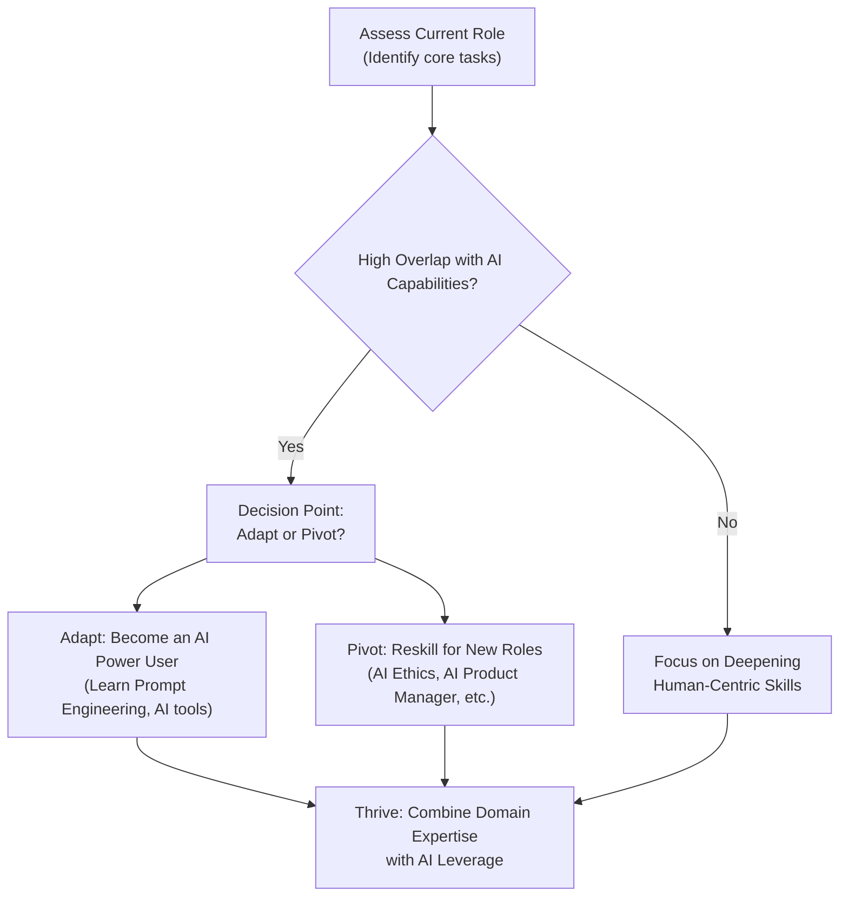

# Technical Insight

**Category:** Career
**Tags:** ai-job-displacement, future-of-work, career-reskilling, ai-impact, job-extinction, survival-guide

The AI revolution isn't a distant forecast; it's the current climate. Generative AI and large language models (LLMs) are no longer just automating repetitive physical tasks—they are now proficient at cognitive, creative, and analytical work. For professionals in both tech and non-tech sectors, this marks a critical inflection point. Ignoring this shift is not an option.

This guide cuts through the noise to provide a clear-eyed view of the jobs most vulnerable to AI-driven extinction by 2027. More importantly, it offers a pragmatic survival guide for adapting, reskilling, and ultimately, thriving in this new professional landscape.

### What You’ll Get

- A curated list of 20 tech and non-tech jobs facing significant AI disruption.
- A clear analysis of _why_ these specific roles are at risk.
- A high-level framework for assessing your own role's vulnerability.
- Actionable, no-fluff strategies to future-proof your career.

---

## The AI Disruption Wave: What's Happening?

Historically, automation impacted blue-collar, manual labor jobs. The current wave, powered by models like GPT-4 and beyond, is different. It targets white-collar roles by automating tasks related to data synthesis, content creation, and pattern recognition.

> A recent report from Goldman Sachs estimates that generative AI could automate the equivalent of **300 million full-time jobs** globally. This isn't about replacement overnight, but a fundamental restructuring of how work gets done.
>
> **Source:** [Goldman Sachs - The Potentially Large Effects of Artificial Intelligence on Economic Growth](https://www.gspublishing.com/content/research/en/reports/2023/03/27/d64e052b-0f6e-45d7-967b-d7be35fabd16.html)

The key driver is AI's ability to handle tasks that were once considered the exclusive domain of human cognition: writing code, drafting legal documents, analyzing market data, and creating designs.

## 20 Jobs on the AI Chopping Block

The roles most at risk share common characteristics: they are predictable, data-driven, or involve generating structured content based on established patterns. Here’s a breakdown of roles where AI is already demonstrating significant capabilities.

### Tech Roles Under Pressure

Many entry-level and routine tech jobs are first in line for AI-driven transformation. AI can now write boilerplate code, run tests, and manage data with increasing autonomy.

- **L1/L2 Tech Support:** AI-powered chatbots and diagnostic tools can resolve common user issues instantly, reducing the need for human agents for initial troubleshooting.
- **Data Entry Clerk:** AI algorithms excel at Optical Character Recognition (OCR) and data extraction from structured and unstructured documents, making manual entry largely obsolete.
- **Junior Web Developer (Template-based):** AI tools can generate HTML/CSS and JavaScript for standard websites and landing pages from a simple text prompt.
- **QA Tester (Manual & Repetitive):** AI can automate the process of writing and executing test cases for regression and functional testing, identifying bugs faster than humans.
- **Database Administrator (Routine):** AI can automate performance tuning, patching, and backup management, handling the day-to-day maintenance of databases.
- **Junior Copywriter (SEO & Marketing):** LLMs can produce high volumes of SEO-optimized articles, social media posts, and ad copy that are often indistinguishable from human-written content.
- **Graphic Designer (Stock Assets & Templates):** Generative image models can create logos, social media graphics, and website banners in seconds, diminishing the need for creating basic assets from scratch.
- **Market Research Analyst (Data Collection):** AI can scrape and analyze vast datasets from public sources, social media, and reports to identify trends, automating the data gathering and initial analysis phases.
- **Technical Writer (Documentation):** AI tools can analyze codebases and automatically generate clear, structured documentation for APIs and software libraries.
- **Paralegal & Legal Assistant:** AI can review thousands of legal documents for discovery, summarize case law, and draft standard contracts far more quickly than humans.

### Non-Tech Roles Facing Transformation

The disruption extends far beyond the tech industry. Roles centered on communication, administration, and data processing are also highly susceptible.

The table below outlines several non-tech roles and the specific AI capabilities impacting them.

| Role                         | Impacting AI Capability           | Why It's At Risk                                                                            |
| :--------------------------- | :-------------------------------- | :------------------------------------------------------------------------------------------ |
| **Customer Service Rep**     | Advanced Chatbots & Voice AI      | AI handles queries 24/7 with instant access to data, escalating only complex cases.         |
| **Bookkeeper**               | Automated Data Processing         | AI platforms connect to bank accounts and auto-categorize transactions, generating reports. |
| **Proofreader/Editor**       | Natural Language Processing (NLP) | AI grammar and style checkers are now incredibly sophisticated, catching nuanced errors.    |
| **Administrative Assistant** | AI Scheduling & Automation Tools  | AI can manage calendars, book travel, and handle email correspondence autonomously.         |
| **Telemarketer**             | AI-powered Voice Agents           | AI can make thousands of calls, navigate phone trees, and handle basic sales scripts.       |
| **Travel Agent**             | Personalized AI Recommenders      | AI aggregates flight and hotel data to build custom itineraries based on user preferences.  |

- **Financial Analyst (Entry-Level):** AI can perform financial modeling, analyze earnings reports, and generate summaries of market performance, automating the core data-crunching tasks.
- **News Reporter (Data-driven):** For formulaic reporting like sports scores or financial earnings, AI can take a data feed and instantly write a summary article.
- **Translator:** While nuanced translation still requires humans, neural machine translation services are now highly accurate for common languages and standard business documents.
- **Real Estate Agent (Initial Search):** AI platforms can analyze a buyer's preferences to curate property listings, schedule viewings, and answer initial questions, reducing the agent's role in the discovery phase.

## The Survival Guide: From At-Risk to In-Demand

The future isn't about competing with AI; it's about collaborating with it. Survival and success depend on a strategic pivot from tasks AI can do to work that requires uniquely human skills.

### Embrace the AI Co-pilot Model

Shift your mindset from "AI is a replacement" to "AI is a powerful tool." The most valuable professionals will be those who can leverage AI to amplify their abilities. Think of it as a "centaur" model, combining human intellect and strategic oversight with AI's computational power.

```plaintext
# Old Workflow
1. Human receives task.
2. Human manually gathers and processes all data.
3. Human produces output (code, report, design).
4. Human reviews and refines.

# AI Co-pilot Workflow
1. Human defines strategic goal for task.
2. Human prompts AI to perform data gathering and initial draft.
3. Human critically reviews, edits, and adds unique insight to AI's output.
4. Final product is a human-AI collaboration, produced faster and often better.
```

### Develop "AI-Proof" Skills

Focus your development on competencies that are difficult, if not impossible, to automate. These are the skills that create durable value.

- **Complex Problem-Solving:** Tackling ambiguous, multi-faceted problems where the "rules" are not clearly defined.
- **Critical Thinking & Strategy:** Questioning AI outputs, identifying biases, and making high-level strategic decisions that AI can't.
- **Emotional Intelligence & Communication:** Building relationships, leading teams, and negotiating—areas where human nuance is irreplaceable.
- **Creativity & Innovation:** Generating truly novel ideas and concepts, rather than remixing existing data. AI is a great tool for brainstorming, but genuine innovation comes from human insight.
- **AI Ethics & Governance:** As AI becomes more integrated, experts who can navigate the ethical, legal, and safety implications will be in high demand.

### Strategic Reskilling & Upskilling

Adaptation requires a deliberate plan. Use the following framework to chart your course. This flow shows the decision-making process for adapting your career in the age of AI.



**Actionable Steps:**

1.  **Audit Your Tasks:** List your daily and weekly tasks. Which ones are repetitive, data-driven, or formulaic? These are your AI automation targets.
2.  **Learn Prompt Engineering:** Mastering how to communicate effectively with AI is becoming a fundamental digital literacy skill.
3.  **Explore Adjacent Roles:** If you're a graphic designer, explore UI/UX strategy. If you're a copywriter, move into brand strategy or content marketing leadership. Move from _doing_ the task to _directing_ the strategy behind it.
4.  **Invest in Certifications:** Look for credible programs in AI management, data science, or prompt engineering that align with your career goals.

---

The rise of AI is not an apocalypse for the workforce, but it is a reckoning. The jobs of the future will be defined by human-machine collaboration. Professionals who proactively assess their roles, embrace AI as a co-pilot, and cultivate uniquely human skills will not just survive—they will define the next era of work. The time to adapt is now.
