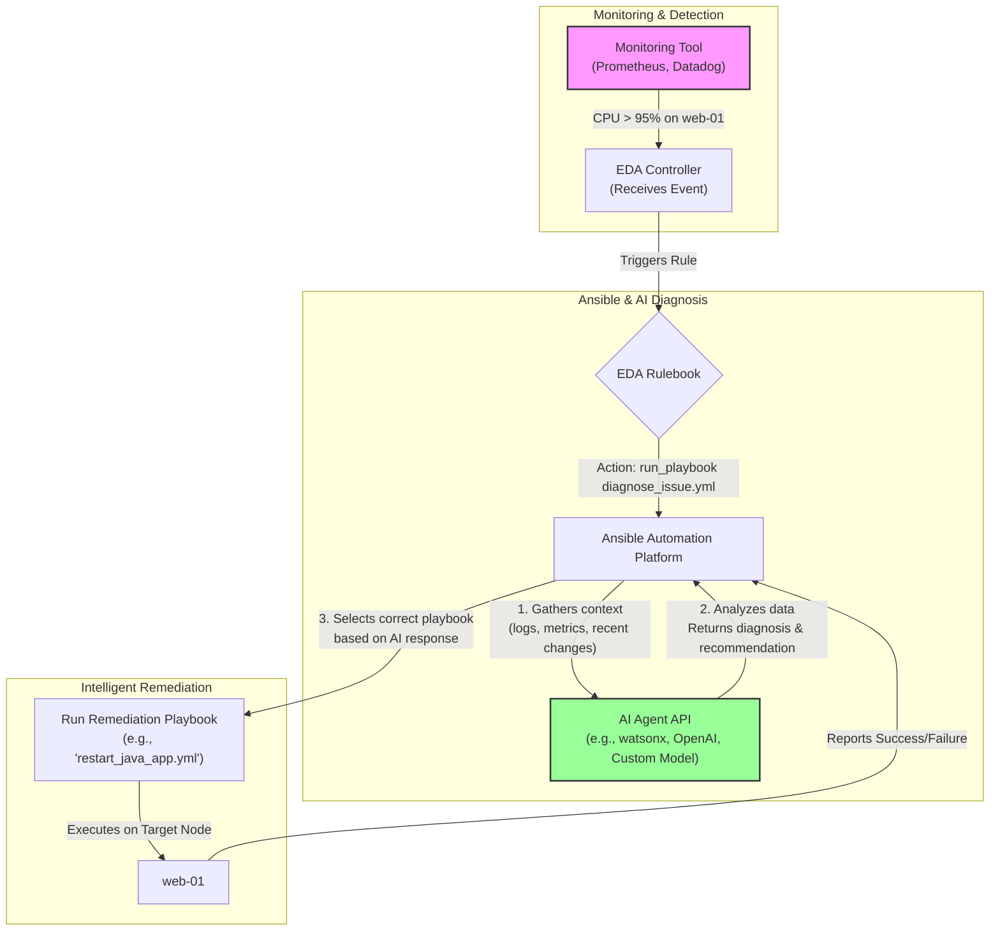

# The Event-Driven Enterprise: Self-Healing Infra with Ansible and AI

In modern IT operations, the goal isn't just to automate tasks—it's to build resilient systems that can react and heal themselves. Traditional automation is often imperative; you tell it *what* to do and *when*. The next frontier is event-driven automation, where the infrastructure responds intelligently to real-time events.

Enter Event-Driven Ansible (EDA), a powerful solution for creating these reactive systems. But what happens when an event is ambiguous? A "high CPU" alert could stem from a dozen different root causes. A static playbook might apply the wrong fix. This is where the convergence of EDA and AI agents creates a truly self-healing enterprise, moving from simple reaction to intelligent diagnosis and remediation.

### What You’ll Get

By the end of this article, you will understand:

*   The core concepts of Event-Driven Ansible (EDA).
*   How an AI agent can act as a diagnostic "brain" within an automation workflow.
*   A high-level architecture for an AI-powered, self-healing system.
*   Example code for an EDA Rulebook and the interfacing Ansible Playbook.
*   The key benefits and practical challenges of implementing this model.

---

## The Foundations: Understanding Event-Driven Ansible

Event-Driven Ansible provides the framework for reactive automation. It listens for events from various sources and triggers actions based on predefined rules. It's a simple but powerful "if-this-then-that" engine for your entire infrastructure.

The key components are:

*   **Event Sources:** These are the eyes and ears of your system. They produce events. Common sources include monitoring tools (Prometheus, Dynatrace), message queues (Kafka), cloud services (AWS CloudWatch), or even simple webhooks.
*   **Rulebooks:** A Rulebook is a YAML file that defines the logic. It connects a specific event from a source to a specific action. You can define conditions to filter and refine when an action should be taken.
*   **Actions:** This is what Ansible does in response to a rule being met. The action is typically running a playbook or a specific module to remediate an issue, create a ticket, or notify a team.

> **Key Idea:** EDA decouples the *detection* of an issue from the *response*, allowing for a more flexible and scalable automation strategy. Learn more at the official [Ansible documentation](https://www.redhat.com/en/technologies/management/ansible/event-driven-ansible).

## The AI-Powered Twist: From Reaction to Diagnosis

A standard EDA workflow for a CPU alert might simply restart a service. This is a blunt instrument. It might work, or it might just postpone the real problem. An AI-powered approach introduces a crucial intermediate step: **diagnosis**.

Instead of triggering a remediation playbook directly, the EDA rule triggers a *diagnosis playbook*. This playbook's sole job is to gather context and hand it off to an AI agent (e.g., a large language model fine-tuned on your operational data or a specialized AIOps platform API).

The AI agent then becomes the decision engine. It can:

*   Analyze the incoming alert data.
*   Correlate it with recent deployments from your CI/CD pipeline.
*   Query log aggregation platforms (like Splunk or ELK) for error patterns.
*   Check for known issues in a knowledge base.

Based on this holistic view, the AI returns a structured response containing the most likely root cause and the *name* of the specific, targeted remediation playbook to run.

### High-Level Self-Healing Flow

This Mermaid diagram illustrates the complete, intelligent workflow from alert to resolution.



## Building the Self-Healing Workflow: Code Examples

Let's break down the key components with practical examples.

### 1. The EDA Rulebook

The journey starts with a rulebook that listens for an incoming alert. Here, we're using a generic webhook source. When an alert with a `status` of `firing` comes in, it triggers the `diagnose_high_cpu.yml` playbook.

```yaml
# file: cpu-alert-rules.yml
---
- name: Listen for monitoring alerts and trigger AI diagnosis
  hosts: localhost
  sources:
    - ansible.eda.webhook:
        host: 0.0.0.0
        port: 5000

  rules:
    - name: High CPU alert received
      condition: event.payload.alert_name == "HighCPU" and event.payload.status == "firing"
      action:
        run_playbook:
          name: diagnose_high_cpu.yml
          extra_vars:
            host_name: "{{ event.payload.hostname }}"
            alert_details: "{{ event.payload.details }}"
```

### 2. The Diagnosis Playbook (The AI Hand-off)

This playbook doesn't fix anything. Its purpose is to package the event data and send it to our AI agent's API endpoint. The `ansible.builtin.uri` module is perfect for this.

```yaml
# file: diagnose_high_cpu.yml
---
- name: Gather data and request diagnosis from AI Agent
  hosts: localhost
  gather_facts: false
  tasks:
    - name: Call AI Diagnostics API
      ansible.builtin.uri:
        url: "https://api.ai-ops.internal/v1/diagnose"
        method: POST
        body_format: json
        body:
          hostname: "{{ host_name }}"
          alert: "{{ alert_details }}"
          # In a real scenario, you'd add tasks here to
          # fetch recent logs or deployment info to enrich the payload.
        headers:
          Authorization: "Bearer {{ ai_api_token }}"
        return_content: yes
      register: ai_response

    - name: Set remediation facts from AI diagnosis
      ansible.builtin.set_fact:
        remediation_playbook: "{{ ai_response.json.remediation_playbook }}"
        diagnosis_reason: "{{ ai_response.json.diagnosis }}"
        confidence_score: "{{ ai_response.json.confidence }}"

    - name: DEBUG - Show AI Recommendation
      ansible.builtin.debug:
        msg: >
          AI Diagnosis: {{ diagnosis_reason }} with {{ confidence_score }} confidence.
          Recommended Playbook: {{ remediation_playbook }}

    - name: Execute the recommended remediation playbook
      ansible.builtin.include_role:
        name: "{{ remediation_playbook | replace('.yml', '') }}"
      when: confidence_score | float > 0.90
```

The AI is expected to return a JSON object like this:

```json
{
  "diagnosis": "Runaway Java process detected based on log pattern 'OutOfMemoryError'.",
  "remediation_playbook": "restart_java_app.yml",
  "confidence": 0.95,
  "target_node": "web-01"
}
```

### 3. Dynamic Remediation

The final task in the diagnosis playbook uses the variable from the AI's response (`remediation_playbook`) to dynamically call the *correct* playbook or role. We add a confidence check (`when: confidence_score | float > 0.90`) to prevent the system from taking action on low-confidence predictions, potentially escalating to a human instead.

## Benefits and Challenges

Adopting an AI-driven, self-healing model is a significant architectural shift. It's important to weigh the pros and cons.

| Benefits ✅                                                              | Challenges & Considerations ⚠️                                     |
| ------------------------------------------------------------------------ | --------------------------------------------------------------------- |
| **Reduced Mean Time to Resolution (MTTR)** by automating diagnosis.      | **AI Model Accuracy:** The system is only as good as its AI.          |
| **Increased Accuracy:** Targeted fixes are applied instead of generic ones. | **Training & Data:** Requires high-quality operational data for training. |
| **Reduced Alert Fatigue:** Humans are only engaged for novel or low-confidence issues. | **"Black Box" Problem:** Understanding *why* an AI made a decision can be hard. |
| **Scalability:** The system can handle a massive volume of events without human scaling. | **Security:** Granting an AI the authority to run playbooks requires robust guardrails. |
| **Knowledge Capture:** The AI model becomes a living repository of operational knowledge. | **Cost:** AIOps platforms and model inference can be expensive.        |

## Final Thoughts

The integration of Event-Driven Ansible and AI is not a far-off dream; it's the next logical evolution of IT automation. By leveraging EDA to *react* and an AI agent to *think*, organizations can build truly autonomous systems that are more resilient, efficient, and intelligent.

This approach transforms operations from a reactive, human-centric model to a proactive, automated one. It frees up skilled engineers from repetitive troubleshooting, allowing them to focus on building value rather than fighting fires. The journey requires careful planning and a solid data strategy, but the payoff is a powerful, self-healing enterprise ready for the complexities of the future.


## Further Reading

- https://www.redhat.com/en/blog/whats-new-ansible-automation-platform-content
- https://tv.redhat.com/en/detail/6376346688112/the-future-of-automation-red-hat-ansible-automation-platform-roadmap
