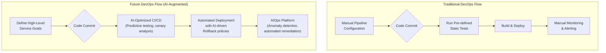

# Future of DevOps, Cloud Engineering & Software Engineering in the Next 2 Years

The technological landscape is undergoing a seismic shift, driven by the rapid maturation of Artificial Intelligence. For professionals in DevOps, Cloud, and Software Engineering, the next two to three years (2025-2028) won't be about replacement, but about radical evolution. The roles aren't disappearing; they're elevating. Repetitive tasks are being automated, clearing the way for a new focus on high-level strategy, architecture, and complex problem-solving. This guide provides a research-driven forecast to help you navigate this new terrain.

### What You’ll Get

*   **AI's Real Impact:** A clear analysis of how AI is reshaping core responsibilities, not just replacing jobs.
*   **Role Evolution:** Projections for how DevOps, Cloud, and Software Engineering roles will transform.
*   **Fresher Job Trends:** Actionable advice for new entrants facing a higher competitive bar.
*   **Essential Skills Checklist:** A breakdown of the critical competencies needed to thrive from 2025 onwards.

---

## The AI Catalyst: From Assistant to Collaborator

AI is no longer a novelty; it's a foundational layer of the modern tech stack. Tools like GitHub Copilot, AIOps platforms, and generative IaC are becoming standard. The paradigm is shifting from a human-centric workflow with AI assistance to an AI-augmented workflow where humans provide direction, oversight, and creative problem-solving.

The core change is the abstraction of low-level tasks. Your value is no longer in *writing* the boilerplate YAML or the basic unit test; it's in *defining the system* that AI helps you build and manage.

## The Evolving Roles: 2025-2028 Projections

The fundamental titles may remain, but the day-to-day responsibilities and required expertise are changing dramatically.

### The DevOps Engineer Becomes the Platform Architect

The focus of DevOps is moving from building individual pipelines to engineering a cohesive, self-service Internal Developer Platform (IDP). The goal is to improve developer experience and velocity at scale.

*   **From:** Manually configuring Jenkinsfiles or GitLab CI/CD YAML.
*   **To:** Designing and managing a platform where AI-driven tools suggest pipeline optimizations, predict failures, and automate security checks.

This evolution is about scale and intelligence. AIOps will become central to monitoring, moving from reactive alerting to proactive, self-healing systems.



### The Cloud Engineer Becomes the Cloud Strategist

Managing cloud infrastructure is transitioning from provisioning resources to architecting for efficiency, cost, and resilience across complex environments.

*   **From:** Manually spinning up EC2 instances or configuring VPCs.
*   **To:** Architecting serverless solutions, implementing sophisticated FinOps strategies to control costs, and managing multi-cloud deployments.

Expertise is shifting up the stack from IaaS to PaaS, Serverless, and managed AI/ML services. The value is in knowing *which* cloud service to use for a specific business problem and how to integrate it cost-effectively.

| Traditional Cloud Tasks | Future-Ready Cloud Skills |
| ---------------------- | --------------------------- |
| Manual VM Provisioning | Serverless & Container Orchestration (K8s) |
| Basic Cost Monitoring  | Advanced FinOps & Cost Optimization |
| Single-Cloud Focus     | Multi-Cloud & Hybrid Cloud Architecture |
| Infrastructure Setup   | Infrastructure as Code (IaC) Generation & Management |
| Manual Security Audits | Automated Security Posture Management |

### The Software Engineer Becomes the Product Architect

With AI handling boilerplate code, unit tests, and even entire functions, the software engineer's role is elevated to that of a system designer and business problem-solver. The focus shifts from the *syntax* of code to the *semantics* of the system.

> "AI won't replace good developers. But developers who use AI will replace those who don't." - Satya Nadella, CEO of Microsoft.

The new workflow involves describing intent and having an AI partner generate the implementation, which the engineer then validates, refines, and integrates.

```python
# The new prompt-driven development cycle
# 1. Engineer defines the goal in a comment or prompt
# "Create a Python function 'process_data' that takes a list of dicts,
# filters out entries where 'status' is 'invalid', and returns a list
# of 'id' values for the valid entries."

# 2. AI (e.g., GitHub Copilot) generates the code
def process_data(data: list[dict]) -> list[str]:
    """
    Processes a list of dictionaries, filtering invalid entries.

    Args:
        data: A list of dictionaries, each with 'status' and 'id' keys.

    Returns:
        A list of 'id' strings from valid entries.
    """
    valid_ids = [
        item['id'] for item in data 
        if item.get('status') == 'valid'
    ]
    return valid_ids

# 3. Engineer reviews, tests, and refines the AI-generated code.
```

This frees up cognitive bandwidth for more critical tasks:
*   **System Design:** How do services interact?
*   **Data Modeling:** What is the most efficient schema?
*   **Domain Logic:** How does this solve the actual business problem?

## Navigating the New Job Market: A Guide for Freshers

The barrier to entry for junior roles is rising. AI tools can now perform many of the simple, repetitive tasks that were once the training ground for new graduates. To stand out, freshers must demonstrate a different kind of value.

*   **Master the Fundamentals:** AI can write code, but it can't explain *why* a hash map is better than a list for a specific problem. Deep knowledge of data structures, algorithms, and networking is more critical than ever.
*   **Show, Don't Just Tell:** Build a portfolio that showcases architectural thinking. Instead of another CRUD app, build a small-scale distributed system, use IaC to deploy it, and write a detailed README explaining your design choices.
*   **Become an AI Power User:** Demonstrate proficiency with tools like GitHub Copilot, ChatGPT for debugging, and other AI assistants. Frame them as productivity multipliers in your resume and interviews.
*   **Contribute to Open Source:** This remains one of the best ways to prove you can collaborate, understand a large codebase, and deliver value in a real-world setting.

> **Info Block:** The most valuable entry-level candidates will be those who can ask the right questions—of the system, of the business, and of their AI tools. Curiosity and critical thinking are the new killer apps.

## Essential Skills to Master Now

To remain competitive, focus on skills that AI complements rather than replaces. These are human-centric, strategic, and cross-functional.

### 1. AI Literacy & Prompt Engineering
Understanding how to communicate effectively with AI models is a non-negotiable skill. This means learning to write clear, concise, and context-rich prompts to get the desired output, whether it's code, a Terraform module, or a debugging suggestion.

### 2. System Design & Architecture
This is the single most important skill. The ability to design scalable, resilient, and maintainable systems is what separates an engineer from a coder. This applies across DevOps, Cloud, and Software Engineering. Study resources like "[Designing Data-Intensive Applications](https://dataintensive.net/)" and architectural patterns.

### 3. Advanced Observability
Go beyond basic logging and metrics. Learn to use tools for distributed tracing (OpenTelemetry), service mesh visualization, and eBPF to gain deep insights into complex microservices architectures. The goal is to understand *why* a system is behaving a certain way.

### 4. Security by Design (DevSecOps)
Security is no longer a separate function; it's an integral part of the entire lifecycle. Engineers must be proficient in threat modeling, static/dynamic code analysis (SAST/DAST), and supply chain security (e.g., SLSA framework).

### 5. FinOps & Cloud Cost Management
As cloud bills grow, the ability to design and operate cost-efficient systems is a huge differentiator. This involves understanding cloud pricing models, using cost management tools, and making architectural decisions that balance performance and budget.

## Final Thoughts: Adapt or Be Automated

The future of tech roles is not about a battle against machines, but a partnership. The engineers who thrive will be those who offload tactical execution to AI and elevate their own work to focus on strategy, design, and business value. The demand for deep thinkers, skilled architects, and creative problem-solvers will only intensify. Start honing these future-proof skills today.
