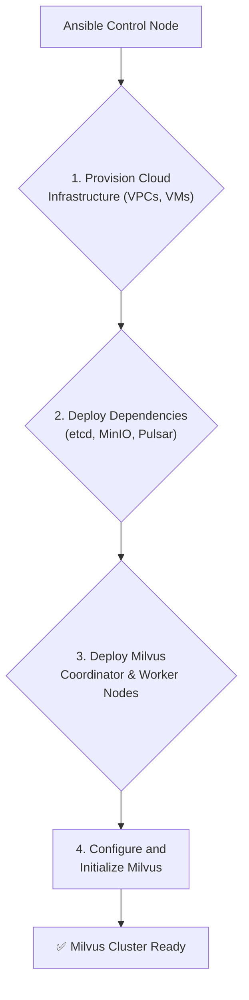

# Provisioning the AI Stack: Using Ansible to Deploy GPU Clusters and Vector DBs

The rise of generative AI has transformed not only how we build applications but also the infrastructure they run on. Gone are the days of simple web servers; today's AI stack demands powerful GPU clusters, specialized drivers, and complex data stores like vector databases. For DevOps and MLOps teams, this introduces significant challenges in consistency, scalability, and reliability. Manually configuring a single GPU node is tedious; provisioning a cluster is a recipe for drift and error.

Enter Ansible. With the recent release of the **Ansible Content Collections for AI in 2025**, automation for the entire AI/ML lifecycle is now a first-class citizen. These new, curated collections provide robust, idempotent roles for provisioning everything from the bare metal to the application layer, allowing teams to treat their AI infrastructure as code. This article dives into how you can leverage these tools to standardize your AI stack.

### What You’ll Get

*   An overview of the new Ansible Content Collections for AI.
*   A clear, repeatable pattern for automating NVIDIA driver and CUDA installations.
*   Example playbooks for deploying standardized PyTorch environments.
*   A high-level architecture for provisioning vector databases like Milvus.
*   A comparison of automating self-hosted vs. SaaS vector DBs.

---

## The New Frontier: AI Infrastructure as Code

The core challenge of MLOps is bridging the gap between flexible data science experimentation and rigid production requirements. Infrastructure is a major part of this challenge. A slight mismatch in a CUDA driver version or a Python dependency can bring a multi-million dollar model training pipeline to a halt.

This is where Ansible's new AI-focused collections shine. They abstract away the low-level, error-prone commands and provide a declarative interface for defining your stack.

**Key Collections introduced in 2025 include:**

*   `nvidia.gpu`: For managing NVIDIA drivers, CUDA toolkits, and container runtimes.
*   `community.ml_frameworks`: For deploying environments with PyTorch, TensorFlow, and JAX.
*   `community.vector_db`: Roles for deploying and managing vector databases like Milvus, Weaviate, and interacting with SaaS APIs like Pinecone.

These collections enable teams to build a single, version-controlled source of truth for their entire AI platform.

## Laying the Foundation: The GPU Node

Everything in the AI stack starts with a properly configured GPU-enabled compute node. This is notoriously difficult to get right due to the tight coupling between the Linux kernel, NVIDIA drivers, the CUDA toolkit, and the ML framework.

### Taming the NVIDIA Driver

The `nvidia.gpu` collection simplifies this dramatically. The `nvidia.gpu.driver` role intelligently handles distribution-specific package dependencies, kernel module signing (for Secure Boot), and version pinning.

Here is a playbook for ensuring a specific NVIDIA driver and CUDA version are installed on all nodes in your `gpu_cluster` group.

```yaml
---
- name: Configure GPU nodes with NVIDIA drivers and CUDA
  hosts: gpu_cluster
  become: true
  vars:
    nvidia_driver_version: "535.129.03"
    cuda_toolkit_version: "12.2"

  tasks:
    - name: Ensure NVIDIA drivers are installed
      ansible.builtin.include_role:
        name: nvidia.gpu.driver
      vars:
        driver_version: "{{ nvidia_driver_version }}"
        # The role handles the logic for different package managers
        # (e.g., dnf, apt) behind the scenes.

    - name: Ensure CUDA Toolkit is installed
      ansible.builtin.include_role:
        name: nvidia.gpu.cuda_toolkit
      vars:
        cuda_version: "{{ cuda_toolkit_version }}"
```

This simple, declarative playbook replaces dozens of shell commands and conditional checks, making your GPU fleet uniform and predictable.

## Standardizing ML Environments

Once the base OS and drivers are set, the next layer is the ML environment itself. Data scientists often use `conda` or `venv` to manage dependencies, but these can become inconsistent across a team. Ansible can enforce a standard, reproducible environment.

### Deploying PyTorch with Ansible

The `community.ml_frameworks` collection doesn't reinvent the wheel; it provides robust wrappers around tools like `pip` and `venv`. This lets you define your Python environment in a structured Ansible variable file.

This example playbook sets up a dedicated user, creates a virtual environment, and installs a specific version of PyTorch compatible with our CUDA toolkit.

```yaml
---
- name: Deploy a standardized PyTorch environment
  hosts: gpu_cluster
  become: true
  vars:
    app_user: "ml_service"
    project_path: "/opt/apps/inference_api"
    venv_path: "{{ project_path }}/venv"
    pytorch_version: "2.1.0"
    cuda_version_short: "cu121" # PyTorch wheel identifier for CUDA 12.1+

  tasks:
    - name: Ensure the application user exists
      ansible.builtin.user:
        name: "{{ app_user }}"
        shell: /bin/bash
        create_home: true

    - name: Create the project directory
      ansible.builtin.file:
        path: "{{ project_path }}"
        state: directory
        owner: "{{ app_user }}"
        group: "{{ app_user }}"
        mode: '0755'

    - name: Create Python virtual environment
      ansible.builtin.pip:
        name: venv
        virtualenv: "{{ venv_path }}"
        virtualenv_python: python3.9
      become: true
      become_user: "{{ app_user }}"

    - name: Install PyTorch and TorchVision
      ansible.builtin.pip:
        name:
          - "torch=={{ pytorch_version }}"
          - "torchvision"
        virtualenv: "{{ venv_path }}"
        extra_args: "--index-url https://download.pytorch.org/whl/{{ cuda_version_short }}"
      become: true
      become_user: "{{ app_user }}"
```

Now, every node in your cluster has an identical, isolated PyTorch environment ready for your application code.

## Automating the Vector Database Layer

Modern AI applications, especially those using Retrieval-Augmented Generation (RAG), rely heavily on vector databases. These systems have complex, distributed architectures. The `community.vector_db` collection is designed to manage this complexity.

Below is a Mermaid diagram illustrating the high-level workflow of Ansible deploying a self-hosted Milvus cluster.



This flow shows how Ansible acts as a single orchestrator for infrastructure, dependencies, and the application itself.

### A Tale of Two Databases: Milvus vs. Pinecone

Your automation strategy will differ depending on whether you choose a self-hosted solution like Milvus or a SaaS platform like Pinecone. Ansible is flexible enough to handle both.

| Feature | Ansible for Milvus (Self-Hosted) | Ansible for Pinecone (SaaS) |
| :--- | :--- | :--- |
| **Deployment** | Provisions VMs/containers, installs dependencies (etcd, MinIO), and deploys Milvus components via the `milvus_cluster` role. | No deployment. Ansible's role is configuration. |
| **Configuration** | Manages `milvus.yaml` configuration file, setting resource limits, storage endpoints, and replication factors. | Uses the `pinecone_index` module (part of the collection) to create, configure, and delete indexes via the Pinecone API. |
| **Scaling** | Adds new worker nodes to the inventory and re-runs the playbook. Ansible ensures the new nodes join the existing cluster correctly. | Manages the `replicas` and `pod_type` parameters for an index via the API to scale up or down. |

Here's a conceptual playbook snippet for deploying a Milvus cluster using the new collection.

```yaml
# Conceptual example - not a complete playbook
- name: Deploy self-hosted Milvus cluster
  hosts: milvus_nodes
  become: true

  tasks:
    - name: Deploy Milvus using the vector_db collection
      ansible.builtin.include_role:
        name: community.vector_db.milvus_cluster
      vars:
        milvus_etcd_endpoints: "etcd-1:2379,etcd-2:2379"
        milvus_storage_type: "minio"
        milvus_minio_endpoint: "minio.internal:9000"
        # ... other configuration parameters
```

> **The Power of Integration**
> The true strength comes from combining these roles. You can create a single master playbook that provisions a GPU node, installs the drivers, sets up a PyTorch environment, and connects it to a freshly deployed Milvus cluster—all in one automated, repeatable run.

## Bringing It All Together: The Full Stack Playbook

A top-level playbook ties all these components together, creating a full AI stack from a single command. This modular approach is a core strength of Ansible.

```yaml
# Filename: deploy_ai_stack.yml
---
- name: Provision GPU drivers and CUDA
  import_playbook: playbooks/01_configure_gpu.yml

- name: Deploy standardized Python environments
  import_playbook: playbooks/02_setup_ml_env.yml

- name: Deploy and configure the Milvus vector database
  import_playbook: playbooks/03_deploy_vector_db.yml

- name: Deploy the inference application
  import_playbook: playbooks/04_deploy_app.yml
```

This structure makes the entire platform definition easy to read, manage, and version in Git.

## Key Takeaways

The complexity of AI infrastructure demands a mature Infrastructure as Code (IaC) solution. The 2025 Ansible Content Collections for AI provide the specialized tools needed to manage the modern AI stack effectively.

*   **Standardization is Key:** By codifying your setup, you eliminate configuration drift and ensure every environment, from development to production, is identical.
*   **Speed and Agility:** Ansible allows you to provision entire GPU clusters and their software stacks in minutes, not days.
*   **Reliability:** Idempotent playbooks ensure that your infrastructure always converges to the desired state, reducing errors and increasing uptime.

Ansible is no longer just for configuring web servers and databases. It has evolved into an essential orchestration tool for MLOps, enabling teams to build, scale, and manage the powerful infrastructure that drives the next generation of artificial intelligence. ✨


## Further Reading

- https://www.redhat.com/en/blog/whats-new-ansible-automation-platform-content
