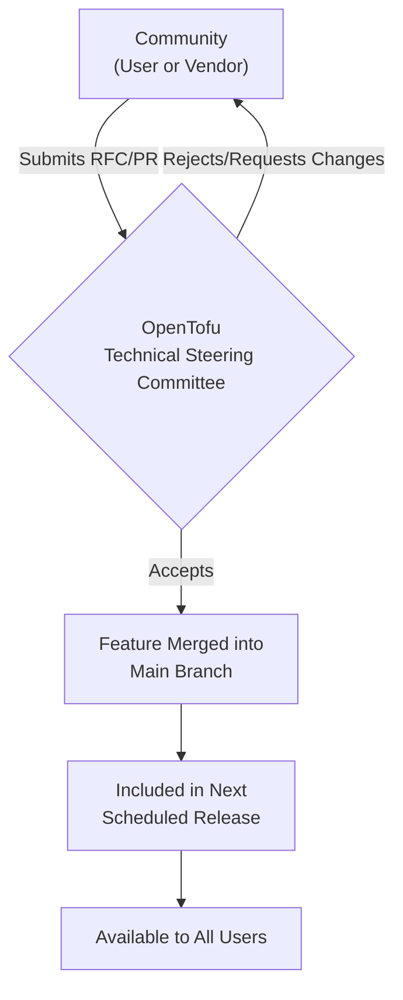

# The Great IaC Schism: Terraform under IBM vs. OpenTofu in 2025

It’s December 2025. Over eighteen months have passed since IBM closed its acquisition of HashiCorp, and the world of Infrastructure as Code (IaC) has irrevocably split. The "one true `terraform apply`" is a memory. Today, two distinct, powerful ecosystems dominate the landscape: IBM's enterprise-focused Terraform and the community-stewarded OpenTofu.

This schism is no longer a theoretical debate; it's a daily reality for platform engineers and DevOps teams. The tools, while sharing a common ancestry, are diverging in philosophy, features, and target audience. Choosing between them is one of the most critical architectural decisions a team can make heading into 2026. This article dissects the current state of play, a future shaped by enterprise AI and open-source resilience.

### What You'll Get

*   **Market Analysis:** A clear view of how the IaC landscape has bifurcated.
*   **IBM's Terraform:** Insight into its strategy centered on Hybrid Cloud and Enterprise AI.
*   **OpenTofu's Trajectory:** A look at its community-driven roadmap and technical wins.
*   **Technical Showdown:** A direct comparison of key features and philosophies.
*   **The Rise of Agentic IaC:** Understanding the next evolution of infrastructure management.
*   **Actionable Guidance:** A framework for choosing the right tool for your needs.

---

## The New World Order: Two Titans of IaC

The initial shock of HashiCorp's [BSL license change](https://www.hashicorp.com/license-faq) in 2023, followed by the [IBM acquisition announcement](https://newsroom.ibm.com/2024-04-24-IBM-to-Acquire-HashiCorp,-Inc-Creating-a-Comprehensive-End-to-End-Hybrid-Cloud-Platform) in 2024, set the stage. The community's response was swift: the creation of [OpenTofu](https://opentofu.org/), a fork managed by the Linux Foundation, promising to keep the tool truly open source.

By late 2025, the dust has settled, revealing two mature but distinct paths.

*   **IBM Terraform:** Has become the IaC backbone of IBM's hybrid cloud strategy, deeply integrated with Red Hat OpenShift, IBM Cloud, and the watsonx AI platform.
*   **OpenTofu:** Has solidified its position as the de-facto standard for organizations prioritizing open governance, multi-cloud flexibility, and a predictable, community-led release cycle.

The choice is no longer just about syntax compatibility; it's about aligning with a platform philosophy.

## IBM's Terraform: The Enterprise Colossus

Under IBM, Terraform has accelerated its push into the Fortune 500. The strategy is clear: make Terraform the essential control plane for complex, regulated enterprise environments, powered by AI.

### Strategy: Hybrid Cloud and Enterprise AI

IBM isn't just maintaining Terraform; it's weaving it into its core product stack. The tightest integrations are with:
*   **Red Hat OpenShift:** Automating cluster provisioning, networking, and application deployment across on-prem and cloud environments.
*   **IBM Cloud:** Offering first-party providers with advanced features for PowerVS, VPC, and satellite locations.
*   **watsonx:** This is the game-changer. IBM has embedded its AI platform directly into the Terraform workflow, moving beyond simple code generation.

### Key Technical Win: AI-Driven Plan Analysis

The standout feature of 2025 is the `watsonx_advisor` integration, which augments the `terraform plan` command. It provides automated analysis and recommendations before you ever apply a change.

> **Info Block:** The `watsonx_advisor` doesn't just check for syntax. It uses a trained model to analyze the plan against corporate governance policies, security benchmarks (like CIS), and potential cost overruns, providing actionable feedback directly in the CLI.

Consider this hypothetical HCL snippet for provisioning a compute instance:

```hcl
# main.tf
resource "ibm_is_instance" "web_server" {
  name    = "production-web-01"
  profile = "bx2-4x16" # A profile with 4 vCPUs and 16GB RAM
  image   = "ibm-ubuntu-22-04-1-minimal-amd64-1"
  zone    = "us-south-1"

  vpc     = data.ibm_is_vpc.main.id
  primary_network_interface {
    subnet = data.ibm_is_subnet.main.id
  }
}
```

Running `terraform plan` now yields an additional, AI-powered output:

```sh
$ terraform plan

An execution plan has been generated and is shown below.
...
+ resource "ibm_is_instance" "web_server" { ... }
...
Plan: 1 to add, 0 to change, 0 to destroy.

------------------------------------------------------------------------
🤖 watsonx Advisor Analysis:

- [Cost Optimization] The instance profile "bx2-4x16" is oversized for a
  standard web server workload based on historical metrics.
  Recommendation: Consider "bx2-2x8" for a 45% cost reduction.
- [Security Compliance] The default security group allows all outbound
  traffic (0.0.0.0/0). This violates policy CORP-SEC-004.
  Recommendation: Attach a security group with restricted egress rules.
------------------------------------------------------------------------
```

### The Trade-offs

This deep integration comes at a cost. The most advanced features, especially the AI advisor, work best within the IBM ecosystem. Development has prioritized features that benefit IBM Cloud and OpenShift, sometimes leaving other cloud providers a step behind in the official provider. The BSL license remains a point of contention for companies building competitive platforms.

---

## OpenTofu: For the Community, By the Community

OpenTofu has spent the last year proving its viability and delivering on its core promise: to be a reliable, open, and community-driven IaC tool. Its development is transparent, guided by public RFCs and community feedback.

### Strategy: Stability and Open Governance

OpenTofu's roadmap is driven by practicality, not a corporate parent's agenda. Key focuses include:
*   **Predictable Releases:** A stable release cadence that users can depend on.
*   **Core Workflow Enhancements:** Improving the fundamental `plan`/`apply` loop, state management, and language features.
*   **Open Registry:** Fostering a truly open and diverse ecosystem of providers and modules without preferential treatment.

This flow of contribution is managed in the open, under the Linux Foundation's guidance.



### Key Technical Win: End-to-End State Encryption

A long-requested feature finally saw the light of day in OpenTofu 1.8: client-side state encryption. Previously, state file encryption was dependent on the backend (e.g., S3 bucket encryption). Now, you can encrypt the state *before* it's sent to the backend, using a public key.

This provides an additional layer of security, ensuring that even someone with direct access to the state backend cannot read its contents.

```hcl
# backend.tf - OpenTofu
terraform {
  backend "s3" {
    bucket         = "my-secure-tofu-state-bucket"
    key            = "global/networking/terraform.tfstate"
    region         = "us-east-1"
    encrypt        = true # Standard S3 server-side encryption
    state_encryption_key = file("~/.keys/tofu-state.pub") # NEW: Client-side encryption key
  }
}
```

This feature is a direct result of community security concerns and demonstrates OpenTofu's responsiveness to its user base.

---

## The Fork in the Code: A Technical Showdown

While 95% of the HCL you write is compatible with both, the strategic differences are becoming clear.

| Feature / Aspect | IBM Terraform | OpenTofu |
| :--- | :--- | :--- |
| **Licensing** | Business Source License (BSL 1.1) | Mozilla Public License (MPL 2.0) |
| **AI Integration** | Deep, native `watsonx` integration for plan analysis. | Vendor-neutral, via community/provider ecosystem. |
| **Governance** | IBM-led roadmap. | Open, community-driven via Linux Foundation. |
| **State Management** | Advanced features for Terraform Cloud/Enterprise. | Focus on core open-source backend security (e.g., client-side encryption). |
| **Ecosystem** | Strong focus on IBM Cloud and Red Hat products. | Broad, vendor-agnostic provider registry. |
| **Primary Audience** | Large enterprises, IBM/Red Hat customers. | Startups, SMBs, and enterprises prioritizing open-source and multi-cloud. |

## The Elephant in the Room: Agentic IaC

The next frontier is already here: Agentic IaC. This isn't just about auto-completing code. It's about AI agents that can take a high-level goal and execute the entire IaC lifecycle.

**A typical Agentic IaC workflow:**

```mermaid
graph LR;
    A[Human Operator] -->|Sets Goal: "Deploy a resilient<br/>e-commerce backend in EU"| B(AI IaC Agent);
    B --> C{Generate & Plan};
    C -- "Plan looks good" --> D{Apply Changes};
    D --> E{Monitor & Self-Heal};
    C -- "Plan needs review" --> A;
```

Here too, the philosophies diverge:
*   **IBM's Approach:** Leverages `watsonx Code Assistant` as a trusted, enterprise-grade agent. The goal is to provide a reliable, secure, and auditable "autopilot" for infrastructure within the guardrails of an organization's policies.
*   **OpenTofu's Approach:** The community is building integrations with various open-source LLMs and agentic frameworks. This offers maximum flexibility and avoids vendor lock-in but requires more integration effort and due diligence from the end-user.

## Conclusion: Choosing Your Path in 2026

The "Terraform vs. OpenTofu" debate has matured from a licensing argument to a strategic platform choice. Neither tool is "better" in a vacuum; they serve different masters.

*   **Choose IBM Terraform if...**
    *   You are heavily invested in the IBM and Red Hat ecosystems.
    *   You need enterprise-grade, AI-driven compliance, security, and cost optimization out-of-the-box.
    *   You value a single, accountable vendor for support and development.

*   **Choose OpenTofu if...**
    *   You are building a product that might compete with HashiCorp/IBM's commercial offerings.
    *   You prioritize open-source governance and want to avoid any chance of vendor lock-in.
    *   Your primary need is a stable, predictable, and powerful multi-cloud IaC tool driven by a diverse community.

The great IaC schism of 2024 has ultimately been a catalyst. It forced the ecosystem to evolve, giving practitioners a meaningful choice: the integrated, AI-powered enterprise suite or the flexible, resilient open-source standard. Your choice will define not just how you write your code, but the philosophy that underpins your platform for years to come.
