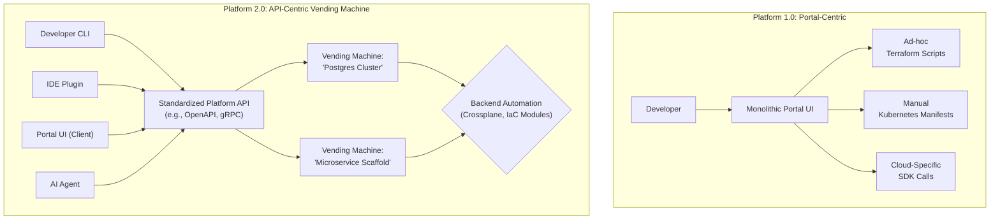

# Platform Engineering 2.0: Moving From 'Portals' to Standardized Vending Machines

Platform Engineering has moved from a niche topic to a mainstream strategy for enabling developer self-service and productivity. The conversation in 2024 was dominated by the idea of the Internal Developer Portal (IDP), often centered around tools like Backstage. While portals brought much-needed visibility and a unified entry point, a myopic focus on the UI has revealed a crucial flaw: a beautiful front door is useless if the rooms behind it are chaotic.

We are now entering Platform Engineering 2.0. The focus is shifting from the *interface* to the *contract*. The future isn't another monolithic portal; it's a decentralized ecosystem of standardized, API-driven "vending machines" that deliver reliable infrastructure products on demand.

### What You'll Get

This article breaks down the next evolution in platform engineering. You'll get:

* An analysis of the limitations of the "portal-first" approach.
* A clear definition of the "Self-Service Vending Machine" model.
* Why API standardization is the true engine of a modern platform.
* How AI is a natural catalyst for this API-first shift.
* A practical roadmap for evolving your platform strategy.

---

## The 2024 Portal Hype: A Necessary First Step

Internal Developer Portals were a massive leap forward. They aggregated service catalogs, documentation, and CI/CD status into a single pane of glass, tackling the cognitive load developers faced. According to a [Google DORA report](https://cloud.google.com/blog/products/application-modernization/new-platform-engineering-research-report), high-performing platform teams are more likely to offer curated portals and self-service capabilities.

However, the "portal-first" approach often led to common pitfalls:

* **The Façade Problem:** The portal becomes a thin UI wrapper over a collection of inconsistent, brittle scripts and manual backend processes. The user experience is shiny, but the fulfillment is unreliable.
* **Monolithic Constraints:** A single, all-encompassing portal can become a development bottleneck, slow to adapt to new technologies and team needs.
* **Ignoring a Developer's "Flow":** Developers don't live in a web portal. They live in their IDE, their terminal, and their Git workflow. Forcing them into a browser for every action breaks their concentration and can feel like a step backward.

> The goal was always self-service, but we got distracted by the user interface. The real value is in the repeatable, reliable, and discoverable *service* itself, not the web page used to request it.

## The Rise of the "Self-Service Vending Machine"

Enter the "Vending Machine" model. Think of it this way: when you use a vending machine, you don't care about the complex robotics inside. You care about the standardized interface (a button), the clear contract (press A1, get potato chips), and the reliable outcome.

In platform engineering, a vending machine is a focused, productized, and API-driven service that delivers a specific piece of infrastructure or a capability.

* **It vends a *product*, not a resource.** You don't ask for a raw EC2 instance. You ask for a "production-ready web service container" that comes with networking, IAM roles, observability hooks, and security scanning baked in.
* **It's API-first.** The primary interface is a well-defined, versioned API, not a UI. This makes the service programmatically accessible from anywhere.
* **It's composable.** Small, single-purpose vending machines (e.g., one for databases, one for CI/CD pipelines, one for feature flag setups) can be combined to build more complex workflows.

This shift is illustrated by the changing architecture of internal platforms.



In the 2.0 model, the portal becomes just another *client* to the platform's core APIs, standing alongside CLIs, IDE extensions, and automated GitOps controllers.

## Why API Standardization is the True Enabler

The vending machine model is powered by a commitment to API standardization. When your platform's capabilities are exposed via a clear, documented, and stable API contract, you unlock immense value.

### Consistency Over Customization

An API is a contract that enforces standards. When a developer requests a new database via your "Database Vending Machine" API, the platform guarantees it will be provisioned with the correct:

* Backup policies
* Encryption standards
* Monitoring agents
* Network firewall rules
* Cost-allocation tags

This moves golden paths from "strongly suggested documentation" to "the only way it gets built."

### Unlocking True Developer Flow

With a robust API, developers can provision infrastructure from where they work best.

* **From the Terminal:** A simple CLI can wrap the API.

    ```bash
    # A hypothetical platform CLI
    platformctl create database my-app-db --instance-type=prod-small
    ```

* **From the IDE:** A VS Code or JetBrains extension can provide a native UI for making API calls.
* **From a Git Commit:** A GitOps controller can watch for a manifest file in a repository (e.g., a Kubernetes CRD that represents a platform resource) and reconcile the state by calling the platform API.

### The Platform as a Product

Treating the platform API as the core product forces good practices.

| Portal-First Approach | API-First (Vending Machine) Approach |
| :--- | :--- |
| **Focus** | User interface and experience. |
| **Contract** | Implicit, often changing with the UI. |
| **Consumption** | Primarily through the web browser. |
| **Evolution** | Monolithic releases of the entire portal. |
| **Focus** | Stability, reliability, and documentation. |
| **Contract** | Explicit, versioned, and documented (OpenAPI). |
| **Consumption** | CLI, IDE, GitOps, UI - any valid client. |
| **Evolution** | Independent, versioned releases of each service. |

## AI as an Accelerator, Not a Silver Bullet

The predictions for 2025 highlight AI as a major force in platform engineering, and the API-first model is perfectly suited for it. Instead of building complex "AI for DevOps" solutions from scratch, organizations can leverage AI as an intelligent *client* for their stable platform APIs.

Imagine a developer interacting with a chatbot:

> **Developer:** "I need a temporary, low-cost Redis cache for a two-week experiment on the `feature-x` branch."

An AI agent, trained on the platform's OpenAPI specifications, can translate this natural language request into a precise sequence of API calls to the relevant vending machines.

1. Call the `NamespaceVendingMachine` to create a temporary Kubernetes namespace.
2. Call the `CacheVendingMachine` with parameters `type=redis`, `size=small`, `ttl=14d`.
3. Return the connection string and credentials directly to the developer.

This is not a far-off fantasy. It's the logical next step when you have a machine-readable, standardized layer for all your platform's capabilities. AI becomes a powerful "intent-based" interface to the solid foundation you've already built.

## Building Your Platform Vending Machine: A Roadmap

Transitioning to this model doesn't require a total rewrite. It's an incremental evolution.

### 1. Identify Your Golden Paths

Start with the most frequent and painful requests. Is it creating a new microservice from a template? Provisioning a cloud database? Gaining access to a specific environment? Pick one.

### 2. Define the Contract (API First)

Before writing any automation code, design the API. Use a tool like the [OpenAPI Specification](https://www.openapis.org/) to define the inputs (e.g., service name, environment type) and the outputs (e.g., git repo URL, database connection string). Get feedback from your developer customers on this contract.

### 3. Automate the Fulfillment

With a clear contract, implement the backend logic. This is where tools like Terraform, Pulumi, or [Crossplane](https://www.crossplane.io/) shine. The API endpoint simply triggers a well-defined, version-controlled IaC module. The key is that this automation is a hidden implementation detail.

### 4. Expose and Document

Deploy the API and provide excellent, user-friendly documentation. Now, you can build multiple clients on top of it: a simple CLI, a new page in your existing portal, or a webhook for your CI system. You've decoupled the capability from a single interface.

---

The future of platform engineering is about building a composable, resilient, and automated platform that meets developers where they are. By shifting our focus from building all-powerful portals to engineering simple, reliable, API-driven vending machines, we create a foundation that is not only more efficient today but is also ready for the next generation of tooling, including AI-driven operations.

## Further Reading

* [https://platformengineering.org/blog/platform-engineering-predictions-for-2025](https://platformengineering.org/blog/platform-engineering-predictions-for-2025)
* [https://cloud.google.com/blog/products/application-modernization/new-platform-engineering-research-report](https://cloud.google.com/blog/products/application-modernization/new-platform-engineering-research-report)
