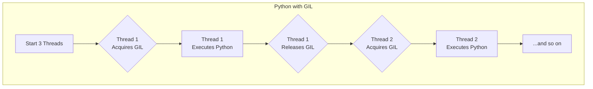
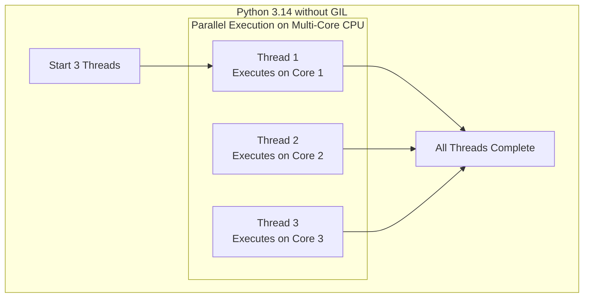

# Python 3.14 Deep Dive: Free-Threading and the End of the GIL

Python 3.14 is shaping up to be one of the most significant releases in the language's history. While it brings a host of improvements, one feature stands out, marking a fundamental shift in Python's concurrency model: the maturation of **free-threaded Python**. This experimental mode allows for the removal of the Global Interpreter Lock (GIL), unlocking true parallelism for CPU-bound tasks.

This article dives into what the "no-GIL" world means for developers, especially those in data science, AI, and high-performance computing. We'll also explore other key features like deferred annotations and the evolving JIT compiler.

## What You'll Get

Here’s a breakdown of what we'll cover:

*   **A Clear Explanation:** What the Global Interpreter Lock (GIL) is and why it has been a bottleneck.
*   **The No-GIL Revolution:** How free-threading in Python 3.14 changes the game for multi-core processors.
*   **Performance Deep Dive:** Understanding the difference between CPU-bound and I/O-bound workloads and which ones benefit.
*   **Key Features Rundown:** A look at PEP 649 (Deferred Annotations) and JIT compiler enhancements.
*   **Practical Guidance:** A balanced view on when you should (and shouldn't) consider using the new no-GIL build.

## The Elephant in the Room: Free-Threading and the End of the GIL

For years, the Global Interpreter Lock has been a topic of intense debate. Python 3.14 doesn't remove it by default, but it provides a stable, supported build option to compile CPython without it.

### First, What is the GIL?

The GIL is a mutex (a lock) that protects access to Python objects, preventing multiple native threads from executing Python bytecode at the same time within a single process.

*   **Its Purpose:** The GIL simplifies memory management and makes writing C extensions easier by preventing race conditions at the C level.
*   **Its Limitation:** On a multi-core CPU, only one thread can run Python code at any given moment. This effectively makes multi-threaded Python programs single-threaded for CPU-bound operations.

Think of it as a single-lane bridge into a city. No matter how many cars (threads) are waiting, only one can cross at a time, creating a major bottleneck if the work involves heavy lifting (CPU tasks) within the city.

> **Key takeaway:** The GIL has historically made Python less effective at leveraging multi-core processors for computationally intensive tasks using standard threading.

### Introducing Free-Threaded Python

As outlined in [PEP 703](https://peps.python.org/pep-0703/), Python 3.14 introduces a compile-time flag (`--disable-gil`) to build a "free-threaded" version of the interpreter.

In this mode, the GIL is gone. Multiple threads can execute Python bytecode simultaneously on different CPU cores, allowing for true parallelism. This is achieved through more fine-grained locking mechanisms and changes to memory management, including a new approach to reference counting.

### The Performance Impact: A Tale of Two Workloads

The benefits of removing the GIL are not universal. The impact depends entirely on the nature of your workload.

| Workload Type | Description & Examples                                       | Impact of No-GIL Build                                                                                              |
| :-------------- | :----------------------------------------------------------- | :------------------------------------------------------------------------------------------------------------------ |
| **CPU-Bound**   | Tasks limited by CPU speed. *Examples: Numerical computation (NumPy), image processing, machine learning model training.* | **Massive Performance Gain.** Threads can run on separate cores, directly reducing execution time for parallelizable problems. |
| **I/O-Bound**   | Tasks that wait for external resources. *Examples: Network requests, database queries, reading/writing files.*            | **Minimal to No Gain.** Python's existing `threading` and `asyncio` models already handle I/O-bound concurrency effectively by releasing the GIL during waits. |

### A Visual: GIL vs. No-GIL Execution Flow

A diagram makes the difference crystal clear.

Here's how traditional multi-threading works with the GIL. Notice the sequential execution of Python code, even with multiple threads.



Now, here is the flow in a free-threaded Python 3.14 build. The threads run in parallel.


*Jekyll-safe Mermaid syntax has been used for compatibility.*

### Code Example: A CPU-Bound Task

Imagine a function that performs a heavy calculation.

```python
import threading
import time

def cpu_intensive_task(n=10**7):
    """A simple function that burns CPU cycles."""
    count = 0
    while count < n:
        count += 1

# --- How you would run it ---
thread_count = 4
threads = []

start_time = time.time()

for _ in range(thread_count):
    thread = threading.Thread(target=cpu_intensive_task)
    threads.append(thread)
    thread.start()

for thread in threads:
    thread.join()

end_time = time.time()
print(f"Execution time: {end_time - start_time:.2f} seconds")
```

*   **With the GIL:** Running this code with 4 threads on a 4+ core machine will take roughly the same time as running it with 1 thread. The threads compete for the GIL and cannot execute in parallel.
*   **Without the GIL:** On a free-threaded build, this same code could theoretically run up to 4x faster on a 4-core machine, as each thread would get its own core.

## Beyond the GIL: Other Noteworthy Features

While free-threading is the star, Python 3.14 brings other valuable updates.

### PEP 649: Deferred Annotation Evaluation

Previously, if you used a type hint for a class that hadn't been defined yet (a forward reference), you had to either use strings or import `from __future__ import annotations`.

```python
# Old way (pre-3.14, without __future__ import) - This would fail
class Service:
    def get_user(self) -> User: # NameError: name 'User' is not defined
        ...

class User:
    ...
```

[PEP 649](https://peps.python.org/pep-0649/) makes this behavior the default. The interpreter now "lazily" evaluates annotations, storing them as strings internally until they are needed. This simplifies code and eliminates the need for the `__future__` import.

### JIT Compiler on the Rise

Python 3.13 introduced an experimental JIT (Just-In-Time) compiler using a "copy-and-patch" technique. Python 3.14 continues to build on this foundation.

*   **What it does:** A JIT compiler can selectively translate hot paths of your Python bytecode into optimized machine code at runtime.
*   **The goal:** This reduces interpreter overhead and can provide significant speedups for certain types of long-running, stable code, complementing the gains from free-threading.
*   **Current status:** It is still experimental but signals a clear direction for Python's core performance strategy.

## The Big Picture: Should You Switch?

The no-GIL build is a monumental step, but it comes with trade-offs. It's not a silver bullet.

> **Important Note:** The biggest challenge for the no-GIL ecosystem is the C-extension API (the `abi3` series). Many popular libraries like NumPy, Pandas, and SciPy rely heavily on C extensions that were built with the GIL in mind. Updating them to be thread-safe in a no-GIL world is a massive, ongoing effort.

### When to Consider the No-GIL Build

*   You have a pure Python, CPU-bound application that can be parallelized with threads.
*   You are starting a new project in a domain like scientific computing or data processing and can ensure your dependencies are compatible.
*   You want to experiment with the future of Python performance and are willing to navigate a developing ecosystem.

### When to Stick with the Standard GIL Build

*   Your application is primarily I/O-bound (e.g., a web server). The standard build with `asyncio` is already highly optimized for this.
*   You rely heavily on a complex stack of C extensions that have not yet been updated for the no-GIL world.
*   You prioritize stability and the vast, mature ecosystem over cutting-edge parallel performance.

## Summary

Python 3.14 is a landmark release that directly addresses one of Python's longest-standing performance limitations.

*   **Free-Threading is Here:** The optional no-GIL build unlocks true parallelism, a game-changer for CPU-intensive scientific and AI workloads.
*   **It's a Trade-Off:** The benefits are workload-specific, and the ecosystem of C extensions will take time to adapt. Use it judiciously.
*   **Quality of Life Improves:** Features like Deferred Annotations (PEP 649) streamline modern Python development practices.
*   **The Future is Faster:** Continued work on the JIT compiler shows a multi-pronged strategy to make Python faster, both for parallel and single-threaded code.

The move towards a GIL-free option is a bold step, positioning Python for the next decade of multi-core computing. While the transition will be gradual, the path to a more parallel Python is now clearer than ever.


## Further Reading

- [https://docs.python.org/3/whatsnew/3.14.html](https://docs.python.org/3/whatsnew/3.14.html)
- [https://www.python.org/downloads/release/python-3140/](https://www.python.org/downloads/release/python-3140/)
