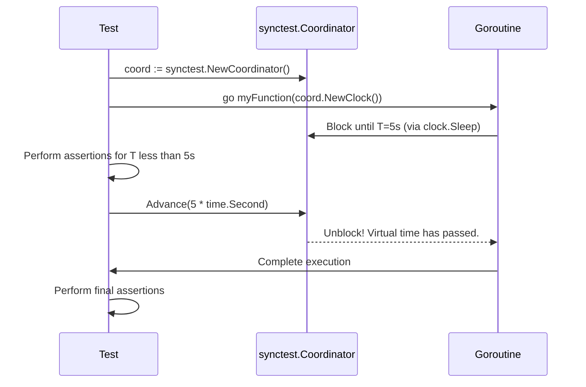
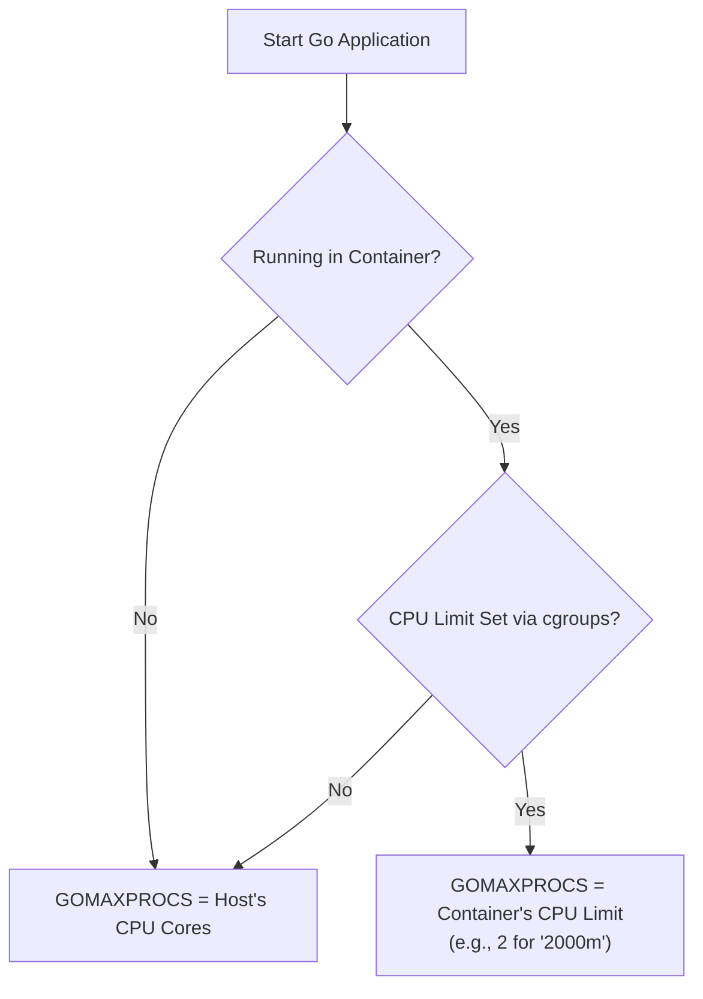

# Go 1.25: Turbocharging Tests with the 'synctest' Package

Go 1.25 is shaping up to be a landmark release, moving beyond incremental improvements to deliver powerful new tools that address long-standing developer pain points. While the full release brings a host of changes, three standouts are set to redefine how we write tests, handle JSON, and run applications in containers: the `synctest` package, the new `encoding/json/v2` package, and a smarter, container-aware `GOMAXPROCS`.

This article dives deep into these pivotal features. We'll explore how `synctest` eliminates flaky, slow, time-based tests, what makes `json/v2` a worthy successor to the original, and why the `GOMAXPROCS` update is a silent performance booster for your cloud-native deployments.

## What You'll Get

By the end of this read, you'll have a clear understanding of:

*   A deep dive into the new `synctest` package for deterministic, time-based testing.
*   The performance and safety gains from the new `encoding/json/v2` package.
*   How container-aware `GOMAXPROCS` automatically optimizes your Go apps in Kubernetes.
*   Practical code examples and diagrams to illustrate these new concepts.

## The Game Changer: `synctest` for Deterministic Testing

Testing concurrent code that relies on time—think timeouts, retries, and scheduled tasks—has always been a challenge in Go. The common approach often involves `time.Sleep`, which introduces two major problems: it makes tests slow and, worse, it makes them flaky.

### The Problem with `time.Sleep` in Tests

A test that sleeps for 100 milliseconds to wait for a timeout isn't just wasting 100ms of CI time; it's making a dangerous assumption. On a heavily loaded system, the goroutine might not have even run within that window, causing the test to fail unpredictably. This brittleness erodes trust in your test suite.

### Introducing `synctest`: How It Works

The new `synctest` package solves this by providing a virtual, controllable clock for your tests. Instead of waiting for real-time to pass, you explicitly tell the test scheduler when to advance time.

At its core is the `synctest.Coordinator`. You create one for your test, and it acts as a central scheduler for all goroutines involved. Goroutines can "block" until a specific virtual time is reached. The test code can then instantly advance the virtual clock, unblocking any goroutines waiting for that moment.

Here's a high-level flow of how it orchestrates a test:



This approach is:
*   **Instantaneous:** Advancing time by an hour takes nanoseconds.
*   **Deterministic:** Tests behave identically on every run, regardless of system load.
*   **Reliable:** No more guessing games with sleep durations.

### Practical Example: Testing a Timeout

Let's test a simple function that does work but gives up after a timeout.

```go
package main

import (
	"context"
	"sync/atomic"
	"testing"
	"time"

	"testing/synctest"
)

// a function that simulates doing work, cancellable via context
func doWorkWithTimeout(ctx context.Context, clock synctest.Clock, workDone *atomic.Bool) {
	// a select statement that waits on two events
	select {
	case <-clock.After(5 * time.Second):
		// This will "fire" when the virtual clock advances past 5s
		return // Timeout occurred
	case <-time.After(10 * time.Millisecond):
		// In a real scenario, this might be a channel receive or other work
		workDone.Store(true)
	}
}

func TestWorkCompletes(t *testing.T) {
	coord := synctest.NewCoordinator(t)
	var workDone atomic.Bool

	go doWorkWithTimeout(coord.Context(context.Background()), coord.NewClock(), &workDone)

	// Advance the clock just enough for the work to complete
	coord.Advance(20 * time.Millisecond)

	if !workDone.Load() {
		t.Error("expected work to be done, but it was not")
	}
}

func TestWorkTimesOut(t *testing.T) {
	coord := synctest.NewCoordinator(t)
	var workDone atomic.Bool

	go doWorkWithTimeout(coord.Context(context.Background()), coord.NewClock(), &workDone)

	// Advance the clock far into the future, past the 5s timeout
	coord.Advance(10 * time.Second)

	if workDone.Load() {
		t.Error("expected work to time out, but it completed")
	}
}
```

In these examples, the tests complete almost instantly. We surgically control time to create the exact conditions we want to test, a massive improvement for both speed and reliability.

## A New Era for JSON: `encoding/json/v2`

The standard `encoding/json` package has served Go well, but its age shows. It has some surprising behaviors, performance quirks, and an API that can be unforgiving. Go 1.25 introduces `encoding/json/v2` as a modern, safer, and faster alternative.

### Why a New JSON Package?

The original package couldn't be fixed without breaking backward compatibility. A `v2` allows the Go team to learn from a decade of experience and start fresh. The primary goals of `v2` are:

*   **Correctness:** Eliminate surprising behaviors, like `json.Unmarshal` treating numbers as `float64` by default.
*   **Performance:** Optimize for speed and reduce memory allocations.
*   **Safety:** Provide clearer error messages and more deterministic behavior.

### Key Improvements in `v2`

The new package is not a drop-in replacement, as it has a slightly different API and behavior. However, the benefits are significant.

| Feature / Behavior | `encoding/json` (v1) | `encoding/json/v2` (v2) |
| :----------------- | :--------------------- | :---------------------- |
| **Performance** | Good, but with known allocation hotspots. | Significantly faster and more memory-efficient. |
| **HTML Escaping** | Escapes `<`, `>`, `&` by default. | **Does not escape by default**, improving readability. |
| **Invalid UTF-8** | Replaces invalid sequences with `U+FFFD`. | **Returns an error** by default, promoting correctness. |
| **Duplicate Keys** | Last key wins, silently. | **Returns an error** by default, preventing data loss. |
| **API** | `Marshal`, `Unmarshal`. | More granular API, e.g., `MarshalEncode` for streaming. |

> **Info:** The decision to make stricter behaviors the default (like erroring on duplicate keys) is a deliberate move towards making Go programs safer and more robust out of the box.

### Code Sneak Peek: `v2` in Action

While the final API might evolve, early usage looks familiar but cleaner.

```go
import (
	"fmt"
	"encoding/json/v2" // Note the v2 import path
)

type User struct {
	Name string `json:"name"`
	URL  string `json:"url"`
}

func main() {
	u := User{Name: "Alice", URL: "https://example.com?a=1&b=2"}

	// Marshal with v2
	data, err := json.Marshal(u)
	if err != nil {
		// handle error
	}

	// Output will not have HTML escaping by default:
	// {"name":"Alice","url":"https://example.com?a=1&b=2"}
	fmt.Println(string(data))
}
```

## Smarter Concurrency: Container-aware GOMAXPROCS

For years, running Go applications in containers (like Docker on Kubernetes) required a workaround. The Go runtime would set `GOMAXPROCS`—the number of OS threads that can execute user-level Go code simultaneously—based on the node's total CPU cores, not the container's CPU limit.

### The Old Way: Guessing CPU Limits

If your Kubernetes pod was limited to `0.5` CPU, but the node had 64 cores, the Go runtime would set `GOMAXPROCS` to 64. This caused the Go scheduler to create 64 threads, leading to excessive thread contention and context switching for a tiny CPU budget, ultimately harming performance.

Developers relied on third-party packages like [`automaxprocs`](https://github.com/uber-go/automaxprocs) to read cgroup limits and set `GOMAXPROCS` correctly at startup.

### The New Default: Automatic Adaptation

With Go 1.25, this is no longer necessary. The Go runtime is now aware of Linux cgroup v1 and v2 CPU limits. It automatically detects the container's CPU quota and sets `GOMAXPROCS` to a sensible value.

This flow is now built-in:



### Impact on Kubernetes Deployments

This is a massive quality-of-life improvement for DevOps and platform engineers.

*   **No More Boilerplate:** You can remove `automaxprocs` from your `main.go`.
*   **Optimal Performance by Default:** Applications will use the right amount of threads for their allocated resources without any tuning.
*   **Reduced Resource Waste:** Prevents the Go scheduler from fighting the Linux kernel scheduler, leading to more efficient CPU usage.

## Conclusion: Is Go 1.25 a Must-Have?

Go 1.25 delivers more than just new features; it provides robust solutions to real-world problems.
*   **`synctest`** will fundamentally change how we test concurrent and time-sensitive code, leading to faster, more reliable CI pipelines.
*   **`encoding/json/v2`** is a much-needed modernization of a core package, offering better performance and safer defaults.
*   **Container-aware `GOMAXPROCS`** makes Go an even better citizen in the cloud-native ecosystem, delivering optimal performance in Kubernetes out of the box.

For any team building and testing complex, concurrent systems or deploying applications in containers, the upgrade to Go 1.25 is not just recommended—it's a significant step forward.


## Further Reading

- [https://antonz.org/go-1-25/](https://antonz.org/go-1-25/)
- [https://go.dev/doc/go1.25](https://go.dev/doc/go1.25)
