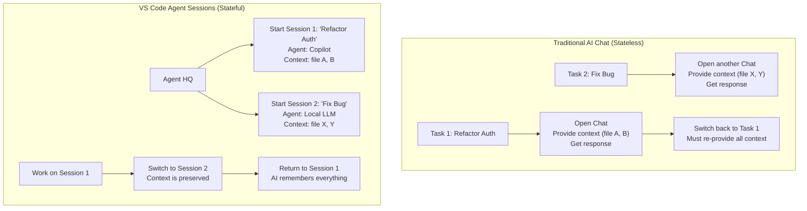

# VS Code 1.106: Managing Your AI Team with Agent Sessions

The world of AI-powered development is evolving at a breakneck pace. We've moved from simple autocomplete to sophisticated chat assistants. However, this progress has introduced a new challenge: fragmentation. Developers often juggle multiple AI tools—GitHub Copilot for boilerplate, a local LLM for sensitive code, and specialized bots for testing or documentation. Each tool lives in its own silo, with no shared context, leading to repetitive explanations and inefficient workflows.

VS Code version 1.106 addresses this head-on by introducing **Agent HQ** and **Agent Sessions**. This release reimagines the editor not just as a place to write code, but as a command center for managing your personal team of AI agents. It’s a foundational shift towards a truly "agentic" editor.

### What You'll Get

*   **A Unified Hub:** Discover Agent HQ, a central panel to manage all your integrated AI agents.
*   **Persistent Context:** Learn how Agent Sessions preserve context for specific tasks, letting you pause and resume complex work without losing the AI's "train of thought."
*   **Proactive Assistance:** See how "Next Edit Suggestions" anticipate your needs, offering intelligent code blocks instead of just single lines.
*   **Streamlined Workflows:** Understand how these features combine to reduce context switching and boost your focus.

---

## The Problem: AI Tool Sprawl

Until now, each AI interaction has been largely ephemeral. You open a chat panel, provide context by referencing open files, ask your question, and get a response. If you switch to a different task or a different AI tool, you start over.

This model is inefficient for complex, multi-file tasks like:
*   Refactoring a core authentication service.
*   Adding a new feature that touches the API, database, and UI layers.
*   Writing comprehensive integration tests for an existing module.

Each time you re-engage the AI, you must meticulously re-establish the context, files, and goals. Agent HQ is designed to eliminate this friction.

## Introducing Agent HQ: Your AI Command Center

Agent HQ is a new icon in the Activity Bar, providing a centralized dashboard for all configured AI agents. Think of it as a team roster. From here, you can see which agents are available (e.g., GitHub Copilot, a custom-configured Ollama agent, a documentation bot) and manage their active tasks.

The power of Agent HQ is realized through **Agent Sessions**.

### Deep Dive: Agent Sessions

An Agent Session is a persistent, task-oriented workspace for a single AI agent. It's more than a chat history; it's a dedicated environment that encapsulates:
*   **The Objective:** A clear, high-level goal (e.g., "Refactor user service to use dependency injection").
*   **The Context:** A specific set of files and folders relevant to the task. You explicitly add files to a session's context, giving the agent focused knowledge.
*   **The Conversation:** The complete history of your interaction with the agent for that task.
*   **The State:** The agent's internal "understanding" of the task, which is preserved even when you close and reopen VS Code.

This approach transforms the developer-AI interaction from a series of stateless requests into a continuous, stateful collaboration.



### Configuring a Custom Agent

Adding a new agent to your HQ is straightforward. You can define agents in your `settings.json`, pointing to local models or API endpoints.

```json
// settings.json
"agentHQ.agents": [
    {
        "id": "ollama-coder",
        "name": "Ollama Coder (Local)",
        "api": {
            "type": "ollama",
            "model": "codellama:13b-instruct"
        },
        "description": "Local CodeLlama model for general purpose coding."
    },
    {
        "id": "docs-writer",
        "name": "Docs Writer",
        "api": {
            "type": "openAI",
            "model": "gpt-4-turbo-preview",
            "apiKey": "${env:OPENAI_API_KEY}"
        },
        "description": "Specialized agent for generating Markdown documentation."
    }
]
```

This allows you to build a specialized team, using the right agent for the right job, all managed through a single interface.

## The Agentic Editor: Next Edit Suggestions

Perhaps the most forward-looking feature in this release is the move towards a more proactive, "agentic" editor. This is powered by **Next Edit Suggestions**.

Instead of waiting for you to ask for code, the editor—powered by the active Agent Session—analyzes your current work and suggests the next logical chunk of code you're likely to write.

> **Info Block:** This is a philosophical shift. The IDE is no longer a passive tool but an active participant in the coding process, anticipating your intent and helping you get there faster.

### How It Works

When you pause typing, the agent in your active session examines:
1.  The session's high-level objective.
2.  The code you've just written.
3.  The Abstract Syntax Tree (AST) of the current file.
4.  The other files in the session's context.

It then proposes a multi-line change, presented as a clear diff that you can accept, modify, or reject with a single click.

### Example in Action

Imagine you've just created a new function signature inside a TypeScript class.

**Your Code:**
```typescript
class UserService {
    private db: Database;

    constructor(db: Database) {
        this.db = db;
    }

    async getUserById(id: string): Promise<User | null> {
        // You pause here...
    }
}
```

**Next Edit Suggestion:**
VS Code will show a ghostly diff suggestion for the function body, based on its understanding of your class structure and common patterns.

```diff
--- a/userService.ts
+++ b/userService.ts
@@ -6,6 +6,9 @@
     }
 
     async getUserById(id: string): Promise<User | null> {
-        // You pause here...
+        console.log(`Fetching user with ID: ${id}`);
+        const user = await this.db.users.findUnique({ where: { id } });
+        return user;
     }
 }
```

This is far more powerful than single-line completion because it understands the *intent* of the entire function block.

## Practical Benefits and Trade-offs

This new agentic model brings significant changes to the developer workflow.

| Pros                                 | Cons / Considerations                            |
| ------------------------------------ | ------------------------------------------------ |
| **Drastically Reduced Context Switching** | Can be resource-intensive with many active sessions. |
| **Persistent and Shareable Sessions**    | Requires developers to adopt a more structured, task-based approach. |
| **Superior AI for Complex Tasks**      | The quality of "Next Edit Suggestions" depends heavily on the agent's capability. |
| **Unified Management of All AI Tools** | Initial configuration of custom agents requires setup. |

## Summary

VS Code 1.106 marks an inflection point. With Agent HQ and Agent Sessions, we're moving beyond fragmented AI chats and into a new era of integrated AI collaboration. The editor is becoming a true partner, capable of managing a team of specialized AI agents and proactively assisting with complex, multi-file tasks.

By providing a persistent, context-aware framework, VS Code is laying the groundwork for a future where the line between developer and AI blurs, resulting in a faster, more intuitive, and more powerful development experience.

For more information on the latest features, always check the official [VS Code release notes](https://code.visualstudio.com/updates).


## Further Reading

- [https://code.visualstudio.com/updates](https://code.visualstudio.com/updates)
- [https://github.blog/changelog/2025-01-06-copilot-workspace-changelog-january-6-2025/](https://github.blog/changelog/2025-01-06-copilot-workspace-changelog-january-6-2025/)
