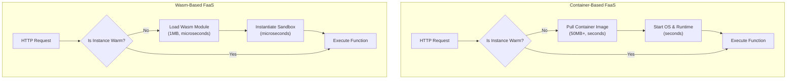
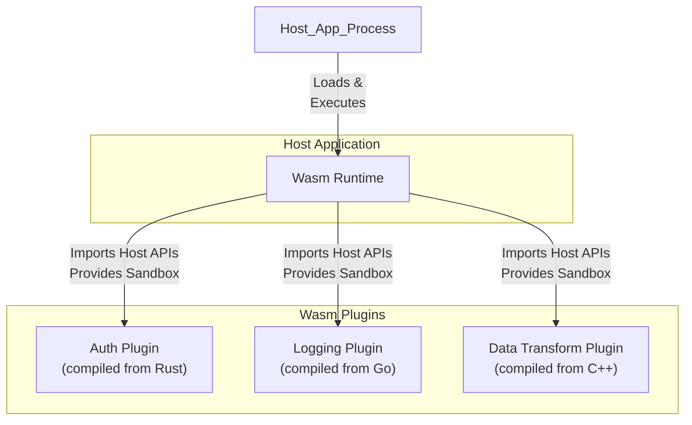

# WebAssembly on the Server: Real-World Use Cases in 2025

WebAssembly (Wasm) promised a new era of portable, high-performance code for the web. But its journey didn't stop at the browser's edge. Today, Wasm is rapidly becoming a cornerstone of server-side and cloud-native architecture. Its lightweight, secure, and polyglot nature is solving some of the most pressing challenges in modern computing.

Forget thinking of Wasm as just a browser feature. By 2025, it's a critical tool for building faster, safer, and more scalable backend systems. This article explores the real-world use cases proving Wasm's server-side dominance.

### What You'll Get

*   **Core Advantages:** A clear breakdown of why Wasm is a game-changer on the server.
*   **Practical Use Cases:** Deep dives into serverless functions, edge computing, and universal plugin architectures.
*   **Wasm vs. Containers:** An analysis of how Wasm complements, not replaces, technologies like Docker.
*   **Code & Diagrams:** Concrete examples and architectural flows to illustrate key concepts.

---

## Beyond the Browser: The Server-Side Proposition

Wasm's value on the server stems from its fundamental design principles, which address common pain points in cloud computing. The [WebAssembly System Interface (WASI)](https://wasi.dev/) standardizes how Wasm modules interact with the underlying operating system, unlocking their full server-side potential.

Here’s why developers are adopting it:

*   **Sandboxed Security:** Every Wasm module runs in a memory-safe sandbox. It has no access to the host system, network, or file system by default. Capabilities must be explicitly granted, drastically reducing the attack surface for untrusted code.
*   **Near-Native Performance:** Wasm is a binary instruction format designed for a compact size and efficient execution. It's compiled ahead-of-time (AOT), allowing it to run at speeds that rival native code, far surpassing interpreted languages.
*   **True Polyglotism:** You can compile code from a growing list of languages—including Rust, Go, C/C++, and Python—into a single, portable `.wasm` binary. This allows teams to use the best language for the job without worrying about runtime compatibility.
*   **Blazing-Fast Cold Starts:** While containers can take seconds to spin up, Wasm modules can be instantiated in microseconds. This is a revolutionary improvement for on-demand computing models.

> **Quote:** "WebAssembly on the server is the future. Its sandboxed nature and near-native performance make it a great alternative to containers." - Solomon Hykes, Co-founder of Docker.

## Use Case 1: The New Frontier of Serverless Functions

Serverless (or FaaS) platforms live and die by their ability to scale to zero and handle spiky traffic efficiently. The "cold start" problem—the latency of instantiating a new function instance—has long been a challenge for container-based solutions.

### Scale-to-Zero Perfected

Wasm's microsecond startup times effectively eliminate the cold start problem. This allows providers to offer more responsive and cost-effective serverless platforms where functions can be created and destroyed almost instantaneously in response to events.

Providers like [Fermyon Cloud](https://www.fermyon.com/spin) and [Cloudflare Workers](https://workers.cloudflare.com/) are built on this principle. They can pack thousands of isolated Wasm instances on a single machine, a density that is impossible with traditional containers.

Here’s a simple comparison of the startup flow:



Here is a small example of a Rust function that can be compiled to WASI and run on a Wasm-based serverless platform.

```rust
// main.rs
use anyhow::Result;
use spin_sdk::{
    http::{Request, Response, Router},
    http_component,
};

/// A simple Spin HTTP component.
#[http_component]
fn handle_api(req: Request) -> Result<Response> {
    let mut router = Router::new();
    router.get("/hello/:name", |req, params| {
        let name = params.get("name").unwrap_or("World");
        Ok(http::Response::builder()
            .status(200)
            .body(Some(format!("Hello, {}!", name).into()))?)
    });
    router.handle(req)
}
```

To compile this for Wasm, you'd use the `wasm32-wasi` target:
```bash
# This command compiles the Rust code into a Wasm module
cargo build --target wasm32-wasi --release
```

## Use Case 2: Powering the Intelligent Edge

Edge computing requires running logic on resource-constrained devices, close to the end-user. Wasm is a perfect fit for this environment due to its small footprint and robust security model.

### Lightweight and Secure Edge Logic

At the edge, you need to deploy small, fast, and secure code. Wasm modules are often less than a megabyte, making them easy to distribute and load on edge nodes. Their sandbox is critical for running multi-tenant or third-party code without compromising the host system.

Common edge use cases include:
*   **A/B Testing:** Dynamically route users to different backends.
*   **Request/Response Modification:** Add or remove HTTP headers.
*   **Authentication:** Validate tokens or API keys at the edge before passing requests to the origin.
*   **Image Optimization:** Resize or reformat images on the fly.

Platforms like [Fastly Compute](https://www.fastly.com/products/edge-compute) and Vercel Edge Functions leverage Wasm to provide developers with a powerful, low-latency platform for deploying custom logic globally.

## Use Case 3: A Universal Plugin Architecture

Software has always relied on plugins for extensibility, but this often meant dealing with language-specific FFI (Foreign Function Interface) bindings, slow interpreters, or security risks. Wasm provides a single, universal standard for plugins.

### Safe, Fast, and Portable Extensions

A host application can embed a Wasm runtime (like [Wasmtime](https://wasmtime.dev/) or [Wasmer](https://wasmer.io/)) and safely execute plugins compiled from any language. The host defines a set of functions (e.g., `get_data`, `log_message`) that the Wasm module can import, giving the plugin controlled access to host capabilities.

This model is being adopted across the industry:
*   **Service Meshes:** The [Proxy-Wasm](https://github.com/proxy-wasm/spec) standard allows developers to write custom filters for proxies like Envoy and Istio in their language of choice.
*   **SaaS Platforms:** Shopify uses Wasm to let developers safely extend checkout logic with [Shopify Functions](https://shopify.dev/docs/api/functions).
*   **Databases:** Several databases are exploring Wasm for sandboxed User-Defined Functions (UDFs).

Here's a conceptual diagram of a host application loading polyglot Wasm plugins:



---

## Wasm and Containers: Better Together

A common misconception is that Wasm aims to replace containers like Docker. In reality, they solve problems at different levels of abstraction and are increasingly used together.

### Granularity and Isolation

Containers and Wasm provide different security and performance trade-offs.

| Feature            | Docker Containers                                  | WebAssembly Modules                            |
| ------------------ | -------------------------------------------------- | ---------------------------------------------- |
| **Isolation Unit** | OS Process (via namespaces, cgroups)               | Lightweight Sandbox (inside a host process)    |
| **Startup Time**   | Seconds                                            | Microseconds to Milliseconds                   |
| **Binary Size**    | Tens or hundreds of MBs (includes OS base)         | Kilobytes to a few MBs (app code only)         |
| **Security**       | OS-level boundary; kernel vulnerabilities are a risk | Capability-based; secure by default            |
| **Best For**       | Full applications with complex OS dependencies      | Single functions, plugins, untrusted code      |

### The Rise of Wasm in Kubernetes

The cloud-native ecosystem is embracing Wasm as a first-class workload. While early projects like Krustlet proved the concept, the community is now standardizing on running Wasm with container runtimes that support the Wasm specification.

Using shims like `crun` with a WasmEdge backend, you can now define a Kubernetes Pod that pulls and runs a `.wasm` module instead of a container image. This lets you mix and match Wasm and container workloads on the same cluster, using the best tool for each task. Projects like [SpinKube](https://github.com/fermyon/spin-kube) are making this integration even smoother.

## The Road Ahead

WebAssembly on the server is no longer a future-looking experiment; it's a production-ready technology solving real-world problems in 2025. Its unique combination of speed, security, and portability has carved out a permanent place in the cloud-native landscape.

As you design your next application, don't just ask, "Should I use a container?" Instead, ask, "What's the right level of isolation for this workload?" Increasingly, the answer for functions, plugins, and edge logic will be WebAssembly—a powerful, lightweight companion in a container-first world.


## Further Reading

- [https://www.atakinteractive.com/blog/webassembly-in-2025-the-future-of-high-performance-web-applications](https://www.atakinteractive.com/blog/webassembly-in-2025-the-future-of-high-performance-web-applications)
- [https://medium.com/@technologicinnovation/in-2025-cloud-native-and-edge-native-apps-will-be-built-with-webassembly-beyond-the-browser-b8a2f086f679](https://medium.com/@technologicinnovation/in-2025-cloud-native-and-edge-native-apps-will-be-built-with-webassembly-beyond-the-browser-b8a2f086f679)
