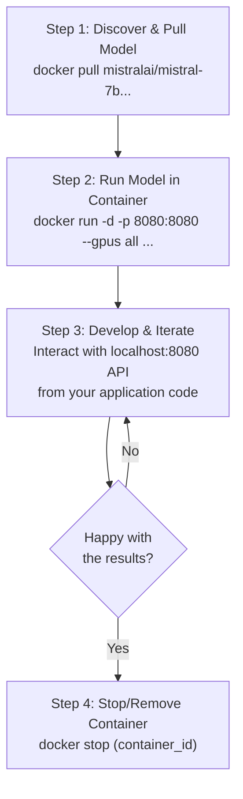

# Running LLMs Locally: A Guide to Docker Desktop’s AI Model Runner

Running Large Language Models (LLMs) on your local machine has often been a complex process, riddled with dependency conflicts, environment setup headaches, and hardware compatibility issues. Docker is changing that. With the introduction of AI model running capabilities directly into Docker Desktop, developers can now pull, run, and experiment with powerful open-weights models as easily as they run any other container.

This guide provides a hands-on walkthrough of Docker Desktop's new AI Model Runner. We'll explore how to get started, run popular models like Llama and Mistral, and integrate them into your local development loop, all while highlighting the crucial benefits of privacy and cost efficiency.

### What You'll Get

*   **Understanding the "Why":** Learn the key benefits of running LLMs locally with Docker, including privacy, cost, and developer experience.
*   **Step-by-Step Instructions:** A clear, actionable guide to pulling and running your first open-weights model.
*   **Practical Code Examples:** See the exact commands for interacting with a model via a simple API.
*   **Workflow Visualization:** A Mermaid diagram illustrating the complete local development lifecycle.
*   **Best Practices:** Tips on resource management and choosing the right model for your needs.

---

## Why Run LLMs Locally with Docker?

Before diving into the "how," it's essential to understand the "why." Integrating LLMs into applications traditionally meant relying on third-party APIs, which introduces concerns about latency, cost, and data privacy. Docker's approach directly addresses these pain points.

### Unmatched Privacy and Data Control

When you run a model locally, your data never leaves your machine. This is a game-changer for developing applications that handle sensitive, proprietary, or personally identifiable information (PII). You maintain full sovereignty over your data, eliminating the risks associated with sending it to external cloud services.

*   No data is sent to third-party APIs.
*   Ideal for prototyping with confidential code or documents.
*   Ensures compliance with strict data privacy regulations like GDPR.

### Significant Cost Savings

API calls to powerful models can become expensive, especially during the iterative development and testing phases. Running models locally eliminates per-token or per-call costs, allowing for unlimited experimentation without a single API key.

> **Development Loop Economics:** A local model allows for thousands of "free" inferences per day, drastically reducing the cost of debugging, prompt engineering, and feature iteration compared to pay-as-you-go cloud services.

### Streamlined Developer Experience

Docker abstracts away the most painful parts of the setup process. It packages the model, its dependencies, the server, and the hardware acceleration configurations into a single, portable container.

*   **No more dependency hell:** Forget managing complex Python environments, `pip` conflicts, or system libraries.
*   **Simplified GPU access:** Docker Desktop handles the intricate setup for NVIDIA CUDA or Apple Metal, making GPU acceleration accessible with a simple command flag.
*   **Consistency across environments:** A model that runs on your machine will run identically on a colleague's machine.

## Getting Started: Prerequisites

Getting started is remarkably straightforward. You just need a recent version of Docker Desktop and a machine with sufficient resources.

1.  **Docker Desktop 4.28 or newer:** The AI/ML features are part of recent releases. You can [download it from the official Docker website](https://www.docker.com/products/docker-desktop/).
2.  **System Resources:**
    *   **RAM:** At least 16 GB is recommended, as models are loaded into memory.
    *   **Storage:** Ensure you have enough disk space for the model files (can range from 4 GB to over 70 GB).
    *   **GPU (Recommended):** An NVIDIA GPU (with CUDA drivers) or an Apple Silicon Mac will provide a significant performance boost for faster inference.

## Pulling Your First AI Model

Docker hosts a collection of popular, pre-packaged open-weights models on Docker Hub. These images come with everything needed to run the model, including a compatible web server.

Let's pull a code-focused model, `codellama/codellama-7b-instruct-gguf`. The `gguf` format is optimized for running efficiently on consumer hardware.

Open your terminal and run the following command:

```bash
docker pull docker.io/codellama/codellama-7b-instruct-gguf
```

You'll see Docker download the model layers, just like any other container image. The size can be several gigabytes, so it may take a few minutes depending on your internet connection.

## Running the Model and Interacting with It

Once the image is pulled, you can run it as a container. This command will start the model server, expose it on a local port, and enable GPU acceleration if available.

```bash
docker run -d --gpus all -p 8080:8080 docker.io/codellama/codellama-7b-instruct-gguf
```

Let's break down that command:
*   `docker run`: The standard command to create and start a container.
*   `-d`: Runs the container in detached mode (in the background).
*   `--gpus all`: **Crucial for performance.** This flag tells Docker to grant the container access to all available GPUs.
*   `-p 8080:8080`: Maps port 8080 on your host machine to port 8080 inside the container.
*   `docker.io/codellama/...`: The name of the model image you just pulled.

The container is now running and hosting an API endpoint compatible with the OpenAI API standard. You can interact with it using a simple `curl` command.

Let's ask it to write a Python function:

```bash
curl -X POST http://localhost:8080/v1/chat/completions \
-H "Content-Type: application/json" \
-d '{
  "model": "codellama-7b-instruct.Q4_K_M.gguf",
  "messages": [
    {
      "role": "user",
      "content": "Write a Python function that takes a list of integers and returns a new list with only the even numbers."
    }
  ],
  "temperature": 0.1
}'
```

You should receive a JSON response containing the model's generated code, something like this:

```json
{
  "id": "chatcmpl-...",
  "object": "chat.completion",
  "created": 1700000000,
  "model": "codellama-7b-instruct.Q4_K_M.gguf",
  "choices": [
    {
      "index": 0,
      "message": {
        "role": "assistant",
        "content": "```python\ndef filter_even_numbers(numbers):\n  \"\"\"Takes a list of integers and returns a new list with only the even numbers.\"\"\"\n  return [num for num in numbers if num % 2 == 0]\n```"
      },
      "finish_reason": "stop"
    }
  ],
  "usage": {
    "prompt_tokens": 42,
    "completion_tokens": 51,
    "total_tokens": 93
  }
}
```

You now have a fully functional code generation LLM running entirely on your local machine!

## The Developer Workflow with Model Runner

The real power of Docker's AI Model Runner shines in the local development loop. You can easily start, stop, and switch between different models to test various capabilities for your application.

Here’s a visualization of the typical workflow:



This rapid, cost-free iteration cycle is invaluable for prompt engineering, testing different model behaviors, and building robust AI-powered features before ever touching a production environment or a paid API.

## Supported Models and Customization

Docker is continuously expanding its library of supported models. You can find models tailored for different tasks, from general instruction-following to specialized code generation.

| Model Name | Common Use Case | Docker Hub Link |
| :--- | :--- | :--- |
| `llama3/llama3-8b-instruct-gguf` | General chat and instruction following | `docker.io/library/llama3-8b-instruct-gguf` |
| `mistralai/mistral-7b-instruct-v0.2-gguf` | High-quality, efficient chat | `docker.io/mistralai/mistral-7b-instruct...` |
| `codellama/codellama-7b-instruct-gguf` | Code generation and completion | `docker.io/codellama/codellama-7b-instruct...` |
| `nomic-ai/nomic-embed-text-v1.5-gguf` | Text embeddings for RAG/search | `docker.io/nomic-ai/nomic-embed-text...` |

For more advanced use cases, Docker provides guidance on how to package your own models, giving you the flexibility to run fine-tuned or proprietary models within the same streamlined workflow.

## Key Considerations and Best Practices

### Resource Management
LLMs are resource-intensive. A 7-billion parameter model can easily consume 8-12 GB of RAM and VRAM. Monitor your system's resource usage via the Docker Desktop dashboard or system tools to avoid performance bottlenecks.

### Model Selection
Start with smaller models (like 7B or 8B parameter variants) as they offer a great balance of performance and resource consumption. Only move to larger models if your task requires more nuance and your hardware can support it.

### GPU Acceleration
While the models can run on a CPU, the experience will be slow. For any serious development, using the `--gpus all` flag with a supported GPU is non-negotiable. It can make inference speed 10-20x faster, transforming the experience from sluggish to interactive.

## Conclusion

Docker Desktop's AI Model Runner represents a significant leap forward in making local AI development accessible, private, and cost-effective. By containerizing the entire LLM stack, Docker eliminates the friction of setup and allows developers to focus on what truly matters: building innovative applications.

Whether you're a solo developer prototyping a new feature, a researcher experimenting with different architectures, or a team building privacy-first AI tools, this new capability provides a powerful and secure foundation. The barrier to entry for hands-on LLM development has never been lower. It's time to start pulling and running.


## Further Reading

- [https://www.docker.com/blog/how-we-designed-model-runner-and-whats-next/](https://www.docker.com/blog/how-we-designed-model-runner-and-whats-next/)
- [https://www.docker.com/solutions/docker-ai/](https://www.docker.com/solutions/docker-ai/)
