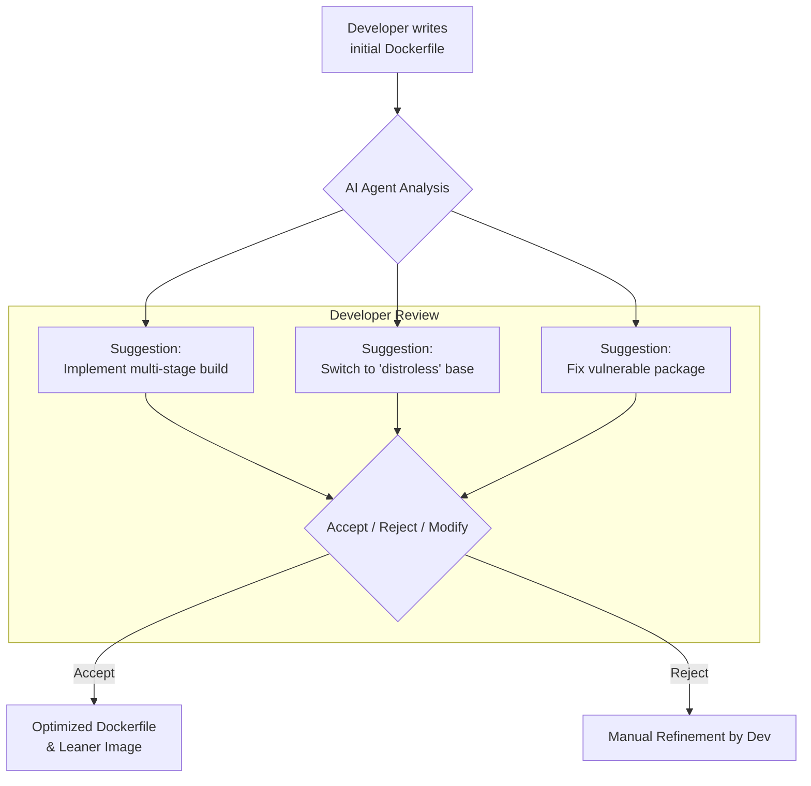

# The AI-Optimized Dockerfile: Using Agents to Shrink Image Sizes

Containerization is the bedrock of modern software deployment, but crafting the perfect `Dockerfile` is often more art than science. We manually wrestle with multi-stage builds, hunt for minimal base images, and scan for vulnerabilities, all while trying to keep build times low. This manual toil is time-consuming and error-prone. But what if an intelligent agent could do the heavy lifting for you?

Emerging AI-powered features within tools like Docker Desktop are set to revolutionize this workflow. These agents analyze your `Dockerfile`, understand your application's context, and automatically apply best practices to produce smaller, faster, and more secure container images. Let's explore how this new paradigm works.

### What You'll Get

*   **Understanding AI's Role:** A clear view of how AI agents analyze and refactor Dockerfiles.
*   **Automated Optimizations:** Concrete examples of AI applying multi-stage builds and selecting distroless images.
*   **Enhanced Security:** How AI can automate vulnerability detection and suggest concrete fixes.
*   **A Balanced View:** A look at the pros and cons of relying on AI for container optimization.

## The Problem: Dockerfile Debt

Just like code, Dockerfiles accumulate "debt." An initial quick-and-dirty `Dockerfile` often makes it into production, carrying along unnecessary build tools, bloated dependencies, and outdated base images.

Manually optimizing these files requires significant expertise and discipline. Key challenges include:
*   **Expertise Gap:** Not every developer is a Docker expert.
*   **Time Sink:** Properly refactoring and testing a `Dockerfile` takes time away from feature development.
*   **Hidden Bloat:** Build dependencies, uncleaned package manager caches, and large base images unnecessarily inflate image size.
*   **Security Blindspots:** Outdated layers can harbor known vulnerabilities (CVEs) that go undetected without active scanning.

This is where an AI agent becomes a powerful ally, acting as a an expert pair-programmer for your containerization strategy.

## Enter the AI Agent: Docker's Smart Assistant

Think of the "Docker AI" agent as a linter on steroids. It doesn't just flag problems; it actively suggests and applies solutions. It integrates directly into your local development environment, providing real-time feedback.

The workflow is designed to be seamless, augmenting the developer's process without taking away control.



This interactive loop ensures the developer remains the ultimate authority while benefiting from automated expert analysis.

## Key Optimization Strategies Automated by AI

An AI agent's primary goal is to apply established best practices automatically. Let's look at the most impactful optimizations.

### 1. Automated Multi-Stage Builds

Multi-stage builds are the single most effective technique for reducing image size. They allow you to use one container image for building your application (with all its SDKs and dependencies) and a separate, minimal image for running it. The AI can automate this conversion.

**Before: A Single-Stage Node.js Dockerfile**

This common pattern results in a large image because it includes the entire Node.js SDK and all `devDependencies`.

```dockerfile
# Dockerfile-before
FROM node:18

WORKDIR /usr/src/app

# Copy package files and install ALL dependencies
COPY package*.json ./
RUN npm install

# Copy app source
COPY . .

# Build the app (e.g., TypeScript compilation)
RUN npm run build

EXPOSE 3000
CMD [ "node", "dist/main.js" ]
```

**After: AI-Generated Multi-Stage Dockerfile**

The agent identifies the build step (`npm run build`) and the final runtime command. It then splits the process into `build` and `runner` stages.

```dockerfile
# Dockerfile-after (AI-generated)
# Stage 1: Build the application
FROM node:18-alpine AS build
WORKDIR /usr/src/app

COPY package*.json ./
# Only install dependencies needed for the build
RUN npm install

COPY . .
RUN npm run build

# Stage 2: Create the minimal production image
FROM node:18-alpine AS runner
WORKDIR /usr/src/app

# Copy only production dependencies
COPY package*.json ./
RUN npm install --only=production

# Copy the built application from the 'build' stage
COPY --from=build /usr/src/app/dist ./dist

EXPOSE 3000
CMD [ "node", "dist/main.js" ]
```

| Dockerfile | Typical Image Size | Reduction |
| :--- | :--- | :--- |
| Single-Stage (`node:18`) | ~950 MB | - |
| Multi-Stage (`node:18-alpine`) | ~180 MB | **~81%** |

### 2. Intelligent Base Image Selection

Choosing the right base image is critical. An AI agent can analyze your application's requirements and suggest the most minimal base image possible, moving you from `ubuntu` -> `debian-slim` -> `alpine` -> `distroless`.

> **What are Distroless Images?**
> [Google's Distroless images](https://github.com/GoogleContainerTools/distroless) contain only your application and its runtime dependencies. They do not contain package managers, shells, or other standard programs you would expect to find in a standard Linux distribution. This drastically reduces the attack surface.

For a compiled Go application, an AI might suggest the following transformation:

**Before: Using a standard base image**
```dockerfile
# build stage...
FROM golang:1.21 AS build
WORKDIR /src
COPY . .
RUN CGO_ENABLED=0 go build -o /app .

# runner stage
FROM alpine:latest
COPY --from=build /app /app
CMD ["/app"]
```
**After: AI suggestion for a `distroless` image**
```dockerfile
# build stage...
FROM golang:1.21 AS build
WORKDIR /src
COPY . .
RUN CGO_ENABLED=0 go build -o /app .

# AI-suggested runner stage for maximum security and minimum size
FROM gcr.io/distroless/static-debian11
COPY --from=build /app /app
CMD ["/app"]
```
The AI agent understands that a statically linked Go binary has no external dependencies, making it a perfect candidate for a `distroless/static` image, which is often under 10MB.

### 3. Automated Vulnerability Scanning and Remediation

Modern Docker tooling, like [Docker Scout](https://www.docker.com/products/docker-scout/), already provides vulnerability scanning. An AI agent takes this a step further by not just reporting but *acting* on the findings.

Imagine the agent finds a high-severity CVE in your `node:18-alpine` base image. Instead of just flagging it, it can:
1.  **Check for a Patch:** Determine if a newer tag (e.g., `node:18.17.1-alpine`) resolves the CVE.
2.  **Suggest the Fix:** Propose updating the `FROM` instruction in your `Dockerfile`.
3.  **Validate the Build:** Trigger a test build with the new base image to ensure no breaking changes.

This turns security scanning from a passive reporting tool into an active remediation engine.

## Pros and Cons of AI-Driven Optimization

While powerful, this technology requires a balanced perspective.

| Pros | Cons |
| :--- | :--- |
| ✅ **Speed & Efficiency** | ❌ **Lack of Nuanced Context** |
| Drastically reduces time spent on manual optimization. | An AI might not understand specific business logic or complex, non-standard build steps. |
| ✅ **Democratizes Best Practices** | ❌ **Potential for Over-Optimization** |
| Empowers all developers to create secure, lean images without deep expertise. | The "best" image isn't always the smallest; debuggability can be a valid trade-off. |
| ✅ **Continuous Security Improvement** | ❌ **The "Black Box" Problem** |
| Automatically applies security patches, reducing the window of vulnerability. | Developers must trust the AI's reasoning and always review its suggestions carefully. |

## Conclusion: The Future is Automated, but Supervised

AI agents for `Dockerfile` optimization represent a significant leap forward in developer productivity and application security. By automating the tedious and complex tasks of multi-stage builds, base image selection, and vulnerability patching, they free up developers to focus on what matters most: building great software.

However, this is not a replacement for human oversight. The most effective workflow will be a partnership, where the AI provides expert recommendations and the developer provides the ultimate sign-off. As these tools mature, they will become an indispensable part of any modern, secure software development lifecycle.


## Further Reading

- [https://www.infoq.com/news/2025/11/docker-desktop-ai/](https://www.infoq.com/news/2025/11/docker-desktop-ai/)
