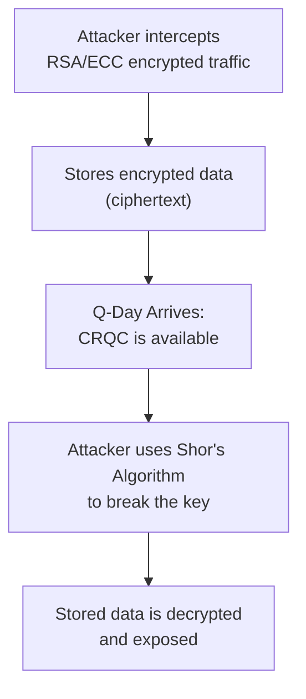
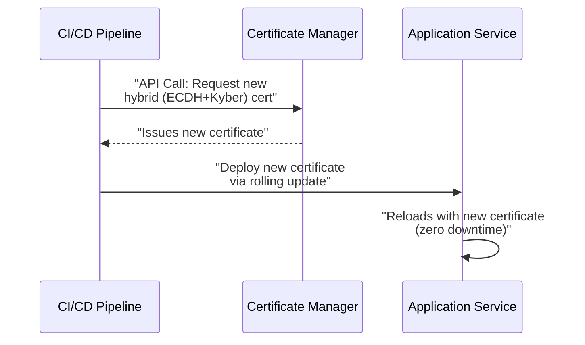

# Preparing for Q-Day: The DevOps Guide to Post-Quantum Cryptography

The era of quantum computing is no longer a distant sci-fi concept. It's a strategic reality that demands immediate attention from every DevOps and security practitioner. While a cryptographically relevant quantum computer (CRQC) that can break today's encryption standards is still years away, adversaries are already preparing. The threat is real, and the time to act is now.

This guide breaks down the quantum threat into actionable steps. We'll move past the theoretical and focus on the practical measures your team can and should be taking today to prepare for the post-quantum world.

### What You'll Get

* **Understand the Threat:** A clear explanation of the "Harvest Now, Decrypt Later" attack vector.
* **Actionable Timeline:** Why 2025 is the year to solidify your PQC strategy.
* **A Practical Framework:** A three-step guide to achieving crypto-agility.
* **Concrete Examples:** Code snippets, diagrams, and tables to illustrate key concepts.

---

## The "Harvest Now, Decrypt Later" Threat

The most immediate danger isn't that a quantum computer will suddenly appear and break your live TLS session tomorrow. The real, present-day threat is **Harvest Now, Decrypt Later (HNDL)**.

HNDL is a simple yet potent attack strategy:

1. **Harvest:** An adversary intercepts and stores your encrypted data today. This could be anything from sensitive customer PII and intellectual property to state secrets and financial records.
2. **Wait:** They hold this data, knowing it's protected by classical encryption like RSA or ECC.
3. **Decrypt:** Once a CRQC is operational, they use it to run algorithms like Shor's, which can efficiently break classical public-key cryptography, and decrypt the harvested data.

The shelf-life of your data is the critical factor. If encrypted data needs to remain confidential for the next 10-15 years, it is *already vulnerable* to an HNDL attack.

This process can be visualized as a simple data interception flow:



> **The takeaway:** The security of your long-term data doesn't depend on when a quantum computer arrives, but on when you stop using vulnerable encryption.

## Why PQC is a 2025 Priority

The transition to new cryptographic standards is a slow, complex process. We can't afford to wait until "Q-Day" is on the horizon. The U.S. National Institute of Standards and Technology (NIST) has been working for years to standardize a suite of Post-Quantum Cryptography (PQC) algorithms.

The final standards are expected to be published in 2024. This makes **2025 the pivotal year for organizations to move from awareness to action**. This is the time to have a concrete inventory, a transition plan, and a budget in place. Waiting longer introduces unacceptable risk.

For more information on the standardization process, see the [NIST Post-Quantum Cryptography Project](https://csrc.nist.gov/projects/post-quantum-cryptography).

## Achieving Crypto-Agility: A Phased Approach

The goal is not a one-time, "rip and replace" migration. The goal is **crypto-agility**: the ability to transition between cryptographic algorithms and protocols quickly and efficiently without breaking your systems. This is a core DevOps principle applied to cryptography.

Here is a practical, three-phase approach to building crypto-agility.

### Phase 1: Inventory and Assessment

You can't protect what you don't know you have. The first step is a comprehensive inventory of all cryptographic assets in your environment.

**What to look for:**

* **TLS Certificates:** Web servers, load balancers, internal APIs.
* **Code Signing Certificates:** Verifying the integrity of binaries and scripts.
* **SSH Keys:** Server access, Git repositories, and automated processes.
* **VPNs & Network Gear:** Site-to-site and client VPNs using protocols like IPsec.
* **Application-Level Encryption:** Libraries and SDKs used by developers (e.g., JWTs, database encryption).
* **Hardware Security Modules (HSMs):** Where are your most critical private keys stored?

**How to find it:**

* **Use Scanners:** Tools like `nmap` can identify open ports and TLS versions.
* **Check CI/CD Pipelines:** Scrutinize your build and deployment scripts for hardcoded keys or certificate generation steps.
* **Analyze Source Code:** Grep your codebases for common crypto libraries (`OpenSSL`, `Bouncy Castle`, `cryptography.io`).

A simple command to check a server's certificate signature algorithm:

```bash
# Replace 'example.com' with your domain
openssl s_client -connect example.com:443 2>/dev/null | openssl x509 -noout -text | grep "Signature Algorithm"
```

The output `Signature Algorithm: ecdsa-with-SHA256` tells you it's using Elliptic Curve (ECC) cryptography, which is vulnerable to quantum attacks.

### Phase 2: Transition to Quantum-Safe Algorithms

Once you have an inventory, you can start planning the transition. NIST has selected several primary algorithms for standardization, with two being particularly important for most use cases.

| Algorithm      | Type                      | Replaces         | Key Characteristics                                |
|----------------|---------------------------|------------------|----------------------------------------------------|
| **Kyber (ML-KEM)** | Key Encapsulation Mechanism | RSA/ECC Key Exchange | Used for establishing shared secrets (e.g., in TLS). |
| **Dilithium (ML-DSA)** | Digital Signature Algorithm | RSA/ECDSA Signatures | Used for authentication and proving identity.      |

**Key Considerations:**

* **Performance:** PQC algorithms often have larger key and signature sizes compared to their classical counterparts. This can impact latency and bandwidth, especially in constrained environments (IoT).
* **Hybrid Mode:** A pragmatic initial step is to operate in a "hybrid" mode. This approach combines a classical algorithm (like ECDH) with a PQC algorithm (like Kyber). A compromise of either one does not compromise the established key. This ensures backward compatibility and hedges against potential weaknesses in the new algorithms.
* **Library Support:** Check if your programming languages, web servers, and libraries support the new standards. OpenSSL 3.0+ and other major libraries are actively integrating PQC.

### Phase 3: Automate and Orchestrate

Manual certificate and key rotation is slow, error-prone, and unsustainable at scale. Automation is the only way to achieve true crypto-agility.

**Integrate PQC into your DevOps toolchain:**

* **Automated Certificate Management:** Use tools like `cert-manager` for Kubernetes or HashiCorp Vault to automate the entire lifecycle of your PQC certificates.
* **Infrastructure as Code (IaC):** Define your cryptographic policies in code using tools like Terraform or Ansible. This makes it easy to update an algorithm across your entire infrastructure with a single commit.
* **CI/CD Pipeline Integration:** Build security checks into your pipeline that validate cryptographic configurations and prevent the deployment of services using weak or deprecated algorithms.

This mermaid diagram shows a simplified, automated certificate rotation flow in a modern environment:



By embedding crypto management directly into your automated workflows, you transform a massive, manual migration project into a manageable, iterative process.

## Summary: Don't Wait for Q-Day

The quantum threat is a slow-burning fire that requires immediate action. The "Harvest Now, Decrypt Later" strategy means your sensitive data is already at risk.

Preparing for the post-quantum era is a marathon, not a sprint. By focusing on **crypto-agility**, you can build resilient systems that can adapt to the next generation of cryptography. Start today by taking inventory, planning your transition, and, most importantly, automating every step of the process. The future of your data's security depends on the work you do now.

## Further Reading

* [https://www.bcg.com/publications/2025/how-quantum-computing-will-upend-cybersecurity](https://www.bcg.com/publications/2025/how-quantum-computing-will-upend-cybersecurity)
* [https://cpl.thalesgroup.com/encryption/post-quantum-crypto-agility](https://cpl.thalesgroup.com/encryption/post-quantum-crypto-agility)
