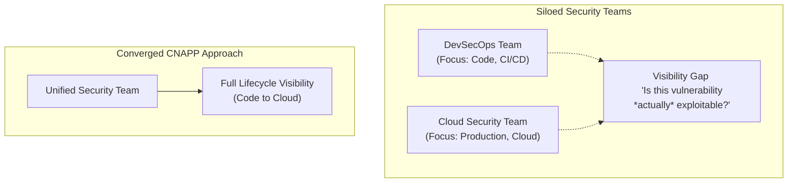
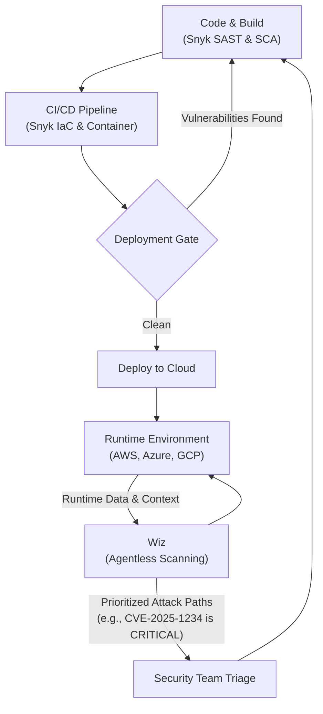

# Snyk vs. Wiz in 2025: Convergence of Code and Cloud Security

The debate in application security is no longer a simple "shift left" vs. "shield right." As development and cloud operations become deeply intertwined, the tools that secure them are converging. Two titans dominate this new landscape: Snyk, the developer-first code security champion, and Wiz, the agentless cloud security pioneer.

By late 2025, the question has evolved from "Snyk *or* Wiz?" to "How do Snyk *and* Wiz work together?" This article breaks down their core strengths, explores the market trend towards convergence, and explains why a mature security program often leverages both.

### What You'll Get

* A clear breakdown of Snyk's developer-centric security model.
* An analysis of Wiz's powerful cloud-native and runtime security capabilities.
* An explanation of CNAPP (Cloud-Native Application Protection Platform) convergence.
* A concise comparison table highlighting key differences.
* Architectural diagrams illustrating where each tool shines and how they integrate.
* A forward-looking verdict on building a comprehensive security strategy in 2025.

---

## Snyk: Securing the Software Development Lifecycle (SDLC)

Snyk’s philosophy is rooted in empowering developers. Its primary mission is to find and fix vulnerabilities *before* code ever reaches production. This is the essence of the "shift left" security paradigm.

### Core Strengths

* **Software Composition Analysis (SCA):** Snyk excels at scanning open-source dependencies for known vulnerabilities. Its comprehensive vulnerability database is a key asset, providing rich context and remediation advice.
* **Static Application Security Testing (SAST):** It analyzes your first-party code to find security flaws, such as SQL injection or cross-site scripting, directly within the developer's workflow.
* **Developer Experience (DX):** Snyk integrates seamlessly into IDEs (like VS Code), Git repositories (GitHub, GitLab), and CI/CD pipelines. This low-friction approach means developers can fix issues without context switching.
* **Container and IaC Scanning:** Snyk scans container images for vulnerable OS packages and application dependencies. It also analyzes Infrastructure as Code (IaC) templates like Terraform and CloudFormation for misconfigurations.

A typical Snyk workflow is initiated directly by the developer or an automated CI pipeline.

```bash
# Example: Running a full Snyk scan from the command line
# This command finds issues in open-source dependencies, proprietary code,
# container images, and IaC files in the current project.

snyk test --all-projects --report
```

Snyk's power lies in its **pre-deployment** focus. It identifies potential security issues as isolated artifacts—a vulnerable library in `package.json` or a hardcoded secret in a Python file.

## Wiz: Securing the Deployed Cloud Environment

Wiz entered the market with a revolutionary agentless approach to cloud security. Its goal is to provide a complete, context-aware picture of your entire cloud estate in minutes. Wiz owns the **post-deployment** or runtime security domain.

### Core Strengths

* **Agentless Deep Scanning:** Wiz connects to your cloud provider APIs (AWS, Azure, GCP) and scans workload snapshots without needing to install agents on every virtual machine or container. This enables rapid, wide-scale deployment.
* **Cloud Security Posture Management (CSPM):** It identifies cloud misconfigurations, such as public S3 buckets, overly permissive IAM roles, or unencrypted databases.
* **Attack Path Analysis:** This is Wiz's killer feature. The Wiz Security Graph correlates disparate risks—a public-facing VM with a high-severity vulnerability running a container with an exposed secret that can access sensitive data—to show you the *actual, exploitable attack paths*.
* **Cloud Workload Protection (CWPP) & CDR:** Wiz provides visibility into vulnerabilities on running workloads (VMs, containers, serverless functions) and offers detection and response capabilities for active threats in the cloud.

> Wiz doesn't just tell you there's a vulnerability; it tells you that the vulnerability is on an internet-exposed machine with high-level permissions, making it a critical, immediate risk. This is the power of runtime context.

## The Great Convergence: Rise of the CNAPP

For years, code security and cloud security operated in separate silos. This created a dangerous visibility gap. A low-severity vulnerability found by Snyk might become a critical risk when deployed in a misconfigured environment only visible to Wiz.

This gap is what drove the rise of the **Cloud-Native Application Protection Platform (CNAPP)**. A true CNAPP aims to unify security across the entire application lifecycle, from the first line of code to the running cloud workload.



Both Snyk and Wiz are aggressively expanding to become the definitive CNAPP.

* **Snyk** is adding more runtime context and cloud posture capabilities.
* **Wiz** is pushing left, acquiring companies and building features for code and pipeline scanning.

However, as of 2025, each retains a distinct center of gravity based on its origins.

## Head-to-Head Comparison (as of 2025)

| Feature | Snyk | Wiz |
| :--- | :--- | :--- |
| **Primary Focus** | Developer-First, Pre-Deployment | Cloud-First, Runtime Environment |
| **Key Strength** | Actionable vulnerability fixing in the SDLC | Attack path analysis and risk prioritization |
| **Target User** | Developers, DevSecOps Engineers | Cloud Security, Operations, SREs |
| **Deployment Model**| Integrations (IDE, Git, CI/CD) | Agentless API connection to cloud |
| **Core Value** | Find and fix issues *early*. | Understand what matters *now*. |
| **Typical Finding** | "This library has a critical RCE vulnerability." | "This RCE is on a public-facing host with access to a production database." |

## The "Better Together" Strategy

Instead of forcing a choice, many mature organizations in 2025 are adopting a "better together" strategy. They use each tool for its core strength and integrate their findings for a complete security posture.

This symbiotic relationship provides end-to-end visibility:

1. **Snyk in Development:** Developers use Snyk in their IDE and CI pipeline to catch and fix the majority of vulnerabilities before deployment. This reduces the noise and workload for the security team.
2. **Wiz in Production:** Wiz continuously scans the live cloud environment, providing the crucial runtime context. It prioritizes the vulnerabilities that slip through the cracks based on their actual exploitability and potential impact.

Here’s how that integrated lifecycle looks:



*Jekyll-safe Mermaid syntax used for this diagram.*

In this model, Snyk acts as the high-volume, developer-centric filter, while Wiz acts as the high-fidelity, security-centric prioritizer. The output from Wiz (e.g., "prioritize this specific container image") can be fed back to the development team to fix the root cause identified by Snyk.

## The 2025 Outlook and Final Verdict

By late 2025, the lines between Snyk and Wiz continue to blur. Both platforms offer increasingly overlapping features. However, their fundamental DNA remains distinct, and this is key to making a strategic choice.

* **If your primary challenge is developer friction and a high volume of vulnerabilities in your codebase and dependencies, start with Snyk.** Its best-in-class developer experience will embed security into your SDLC most effectively.

* **If your primary challenge is a complex, sprawling cloud environment with unknown risks and a lack of visibility, start with Wiz.** Its agentless scanning and attack path analysis will provide immediate value and help you prioritize what to fix first.

Ultimately, the most advanced security programs don't choose a winner. They recognize that securing the cloud-native world requires excellence in two domains: empowering developers to write secure code and giving security teams the context to protect the production environment. In 2025, the winning strategy is not Snyk *vs.* Wiz, but **Snyk + Wiz**.

---
*For further reading on CNAPP, see resources from industry analysts like [Gartner](https://www.gartner.com/en/information-technology/glossary/cloud-native-application-protection-platforms-cnapp).*

## Further Reading

* [https://cycode.com/blog/snyk-vs-wiz-3-key-differences/](https://cycode.com/blog/snyk-vs-wiz-3-key-differences/)
* [https://www.wiz.io/academy/wiz-vs-snyk](https://www.wiz.io/academy/wiz-vs-snyk)
