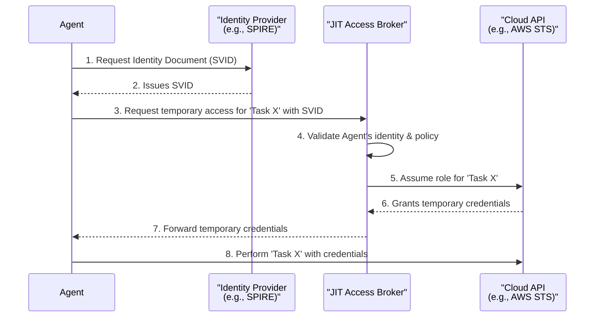
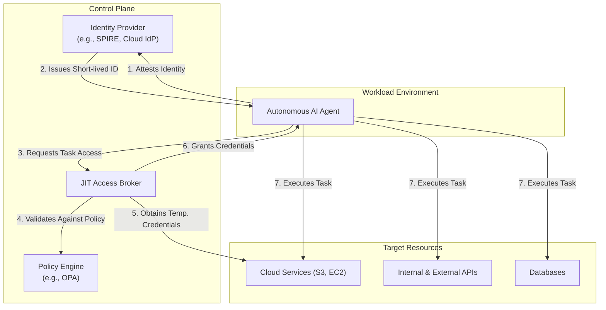

# Securing the Agent: The Rise of Non-Human Identity Management (NHIM)

Autonomous AI agents are no longer a futuristic concept; they are being deployed in production environments today. These agents execute complex tasks, from managing cloud infrastructure to processing sensitive data, and to do so, they are armed with API keys, access tokens, and cloud permissions. This new class of powerful, autonomous actors introduces a significant and often overlooked security risk. Traditional identity management, built for humans and predictable services, is cracking under the strain. It's time to talk about Non-Human Identity Management (NHIM).

This article dives into the security challenges posed by autonomous agents and introduces the principles of NHIM, focusing on a critical best practice: applying the Principle of Least Privilege in this new context.

### What You'll Get

* **Threat Insight:** A clear understanding of the security risks unique to autonomous AI agents.
* **Concept Definition:** A breakdown of what Non-Human Identity Management (NHIM) is and why it's essential.
* **Actionable Strategy:** Practical best practices for scoping agent permissions using the Principle of Least Privilege.
* **Visual Architecture:** A conceptual diagram of an NHIM workflow to solidify your understanding.

---

## The New Threat Vector: Autonomous Agents in the Wild

Unlike a traditional script or service account that executes a predefined, static workflow, an AI agent possesses a degree of autonomy. It can interpret goals, make decisions, and interact with systems in unpredictable ways. This autonomy, when combined with powerful permissions, creates a potent threat surface.

The primary risks include:

* **Credential Sprawl and Exposure:** Agents need credentials to function. If an agent's long-lived API key is hardcoded or improperly stored, a single leak can grant an attacker the agent's full capabilities.
* **Over-Privileged by Default:** It's often easier to grant an agent a broad role (e.g., `PowerUserAccess`) than to meticulously define the exact permissions it needs. This is a ticking time bomb.
* **Autonomous Amplification of Attacks:** A compromised agent doesn't just leak data; it can be weaponized. An attacker could subtly alter its goals, tricking it into deleting resources, exfiltrating data, or provisioning malicious infrastructure—all while appearing as legitimate activity.
* **Ambiguous Audit Trails:** When an agent performs a thousand actions, how do you distinguish between normal operation, a bug, or malicious influence? Traditional logs often lack the context to attribute intent, making forensics a nightmare.

> **Info:** The core difference is *autonomy*. A traditional CI/CD pipeline is a predictable, non-human actor. An AI agent designed to "optimize cloud costs" is not. It might decide to terminate instances or modify autoscaling groups based on a complex, internal model, making its behavior emergent and harder to secure.

## Enter NHIM: Identity Management for a Machine-First World

Non-Human Identity Management (NHIM) is an evolution of traditional Identity and Access Management (IAM) and Machine Identity Management (MIM). It's a security framework designed specifically for the dynamic, ephemeral, and autonomous nature of modern software agents, microservices, and devices.

NHIM moves beyond static roles and long-lived keys, focusing instead on verifiable, short-lived, and context-aware identities.

| Feature | Traditional IAM/MIM | Modern NHIM |
| :--- | :--- | :--- |
| **Identity** | Static (e.g., Service Account) | Dynamic, Contextual (e.g., Workload Identity) |
| **Credentials**| Long-lived API keys, certificates | Short-lived tokens (OIDC, JWTs) |
| **Authorization**| Broad, persistent roles | Fine-grained, Just-in-Time (JIT) permissions |
| **Lifecycle** | Manual or semi-automated | Fully automated, ephemeral |

NHIM is built on a foundation of Zero Trust—never trust, always verify. Every action an agent attempts must be authenticated and authorized against a policy, regardless of its perceived location or origin.

## Applying the Principle of Least Privilege for Agents

The Principle of Least Privilege (PoLP) states that an entity should only have the minimum permissions necessary to perform its intended function. For AI agents, this principle must be applied with extreme rigor and automation.

### 1. Scope Permissions by Intent, Not Role

Avoid creating generic roles like `DataProcessingAgent`. Instead, define policies based on the specific *task* or *intent* the agent is executing at a given moment.

For example, an agent tasked with archiving old S3 logs doesn't need permissions to delete buckets or read from a production database.

**A Poorly Scoped Policy (Too Broad):**

```json
{
    "Version": "2012-10-17",
    "Statement": [
        {
            "Effect": "Allow",
            "Action": "s3:*",
            "Resource": "*"
        }
    ]
}
```

**A Well-Scoped Policy (Least Privilege):**

```json
{
    "Version": "2012-10-17",
    "Statement": [
        {
            "Effect": "Allow",
            "Action": [
                "s3:GetObject",
                "s3:ListBucket"
            ],
            "Resource": [
                "arn:aws:s3:::my-log-source-bucket",
                "arn:aws:s3:::my-log-source-bucket/*"
            ]
        },
        {
            "Effect": "Allow",
            "Action": "s3:PutObject",
            "Resource": "arn:aws:s3:::my-log-archive-bucket/*"
        }
    ]
}
```

This granular policy ensures the agent can only read from the source and write to the archive, nothing more.

### 2. Embrace Short-Lived, Dynamic Credentials

Static API keys are a liability. The goal is to eliminate them entirely. Instead, agents should acquire temporary credentials dynamically. This drastically reduces the window of opportunity for an attacker if a credential is ever compromised.

* **Cloud IAM Roles:** Use mechanisms like AWS IAM Roles for EC2/ECS or Workload Identity Federation in GCP/Azure to grant temporary, role-based credentials to workloads without storing keys.
* **SPIFFE/SPIRE:** For service-to-service communication, projects like [SPIFFE](https://spiffe.io/) (Secure Production Identity Framework for Everyone) and its implementation SPIRE provide a standardized way for workloads to automatically prove their identity and receive short-lived cryptographic documents (SVIDs).

### 3. Implement Just-in-Time (JIT) Access

Just-in-Time access takes PoLP a step further. Instead of having standing permissions, an agent requests elevated access only for the duration of a specific, authorized task.

Here’s a conceptual flow for JIT access:



This model ensures that the agent is powerless by default and only gains specific permissions for a limited time when its intent is validated.

### 4. Continuous Monitoring and Anomaly Detection

You cannot secure what you cannot see. Robust logging is critical.

* **Log Agent Actions:** Track every API call and significant decision the agent makes.
* **Behavioral Baselines:** Establish a baseline of normal agent activity.
* **Alert on Deviation:** Use security analytics tools to detect anomalies, such as an agent trying to access a new service, operating at an unusual time, or performing actions outside its typical pattern.

## Conceptual NHIM Architecture

A modern NHIM system integrates several components to provide secure, dynamic identity.



## The Future is Autonomous and Secured

AI agents offer incredible potential for automation and efficiency, but they represent a paradigm shift for security. Treating them as just another "service account" is a recipe for disaster. By adopting an NHIM mindset—built on Zero Trust, the Principle of Least Privilege, and dynamic, just-in-time credentialing—we can unlock the power of autonomous systems without handing over the keys to the kingdom. The goal isn't to restrict innovation; it's to build a secure foundation upon which it can thrive.

## Further Reading

* [https://www.appviewx.com/news/appviewx-post-quantum-readiness-tools-help-enterprises-future-proof-devops-and-secops-against-new-cryptographic-threats/](https://www.appviewx.com/news/appviewx-post-quantum-readiness-tools-help-enterprises-future-proof-devops-and-secops-against-new-cryptographic-threats/)
