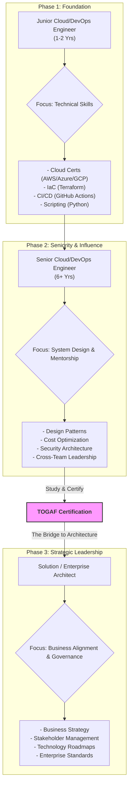

# Is TOGAF Still Valid in 2026?

In a tech landscape dominated by rapid, AI-driven development and agile methodologies, frameworks like TOGAF can seem like relics from a bygone era. As we approach 2026, the question is more pressing than ever for Cloud and DevOps professionals: Is a structured enterprise architecture framework still relevant, or is it just bureaucratic overhead?

The short answer is: **it depends entirely on your career goals.** For engineers aiming to transition from building systems to designing and governing them, TOGAF remains a powerful, albeit misunderstood, tool. This article dissects the TOGAF 10 standard's place in the modern, AI-augmented world, specifically for those on the Cloud and DevOps career path.

### What You'll Get

*   An analysis of TOGAF 10's relevance in the age of AI and Agile.
*   A clear breakdown of the certification path, costs, and exam strategy for 2026.
*   A curated list of the best free study materials to get you started.
*   A career roadmap showing where TOGAF fits for junior, senior, and aspiring architect engineers.
*   A final verdict on whether the certification is a worthwhile investment for *you*.

---

## TOGAF 10 in the AI Era: Dinosaur or DNA?

The primary critique of TOGAF is that it’s too slow and rigid for a world that prizes speed and iteration. While this was a fair criticism of its older, monolithic versions, the **TOGAF 10 Standard** is fundamentally different. It's a modular, flexible toolkit, not a prescriptive process.

Think of it this way: Agile and DevOps are excellent at the *how*—building and delivering value quickly. AI accelerates this process exponentially. But TOGAF addresses the *what* and the *why* at a strategic level.

*   **Governing Complexity:** As AI models, data pipelines, and cloud-native services proliferate, the complexity doesn't disappear; it multiplies. TOGAF provides a language and structure for managing this complexity, ensuring that technology decisions align with business strategy.
*   **AI and Data Architecture:** Effective AI relies on robust, well-governed data. TOGAF’s Business, Data, and Application Architecture domains provide the scaffolding to design systems where data is a strategic asset, not a liability.
*   **A Framework of Frameworks:** TOGAF 10 is designed to integrate with other frameworks. You can use its core Architecture Development Method (ADM) to guide projects that are executed using Scrum, SAFe, or other agile methods. It provides the guardrails; you provide the engine.

> **Key Takeaway:** TOGAF isn't about slowing down development. It's about ensuring that what you're building fast is also the *right thing* and that it will integrate, scale, and remain secure within the wider enterprise context.

## Decoding the TOGAF 10 Certification

If you've decided TOGAF aligns with your goals, the next step is understanding the certification process. The Open Group is the official certifying body.

### The Structure: Two Levels

The TOGAF 10 certification is broken into two parts, which can be taken separately or together in a combined exam:

1.  **TOGAF® EA Foundation (Part 1):** Tests your knowledge of the framework's terminology, structure, and basic concepts. It's a multiple-choice, closed-book exam.
2.  **TOGAF® EA Practitioner (Part 2):** Tests your ability to apply the framework. This is an open-book, scenario-based exam where you'll use the official TOGAF documentation to solve complex problems.

### The Cost in 2026

Certification costs can vary by region and exam provider. As of late 2025, you should budget accordingly:

| Exam Path | Estimated Cost (USD) | Notes |
| :--- | :--- | :--- |
| Foundation Only | ~$600 | Good for a basic understanding. |
| Practitioner Only | ~$600 | Requires Foundation as a prerequisite. |
| **Combined (Foundation + Practitioner)** | **~$950** | The most common and cost-effective path. |

*Note: These prices are for the exam vouchers only and do not include training courses, which can range from $1,500 to $3,000.*

### Exam Strategy

*   **Accredited Training:** The fastest but most expensive route. It provides structured learning and a high pass rate.
*   **Self-Study:** A perfectly viable and popular option for disciplined individuals. It significantly reduces costs but requires more effort to synthesize the material. Most successful self-studiers recommend dedicating 80-100 hours of focused study.

## Your Free TOGAF Study Arsenal

You don't need to spend thousands to prepare. Here are some of the best free resources available:

*   **The Open Group Library:** The official source. You can download the core TOGAF 10 documentation for free after registering. This is your primary text. [The Open Group Library](https://publications.opengroup.org/library) is essential.
*   **YouTube Deep Dives:** Channels like "TOGAF Explained" and various independent trainers offer detailed breakdowns of the ADM phases and key concepts.
*   **Community Forums:** Websites like TechExams and Reddit's r/TOGAF have active communities where you can ask questions and find study groups.
*   **Practice Questions:** Search for "TOGAF 10 practice questions." While premium question banks are often better, free versions can help you gauge your readiness for the Foundation exam.

---

## The Cloud/DevOps Engineer's Roadmap to Architecture

So, who should take TOGAF and when? Let's break it down by career stage.

### The Junior Engineer (1-2 Years)

**Focus:** Building technical depth.
**Recommendation:** **Do not pursue TOGAF yet.** Your priority is hands-on competency.
*   **Master a Cloud Platform:** Get certified (e.g., AWS Solutions Architect Associate, Azure Administrator).
*   **Learn Infrastructure as Code (IaC):** Deeply understand Terraform or Bicep/ARM.
*   **Understand CI/CD:** Get proficient with GitLab CI, GitHub Actions, or Jenkins.
*   **Scripting:** Become fluent in Python or Go for automation.

TOGAF at this stage is a distraction. The concepts will be too abstract without the real-world experience to anchor them.

### The Senior Engineer (6+ Years)

**Focus:** Scaling systems and influencing design.
**Recommendation:** **Strongly consider TOGAF.** You are likely performing architecture work without the official title.
*   You're already designing solutions that span multiple services.
*   You're mentoring junior engineers on best practices.
*   You're involved in cross-team discussions about technology choices and trade-offs.

TOGAF will provide the vocabulary and structured thinking to formalize your experience. It helps you articulate your designs in the language of business stakeholders, which is critical for making the leap to an architect role.

### The Aspiring Architect

**Focus:** Bridging the gap from technical expert to strategic leader.
**Recommendation:** **TOGAF is a key differentiator for you.**
You have the technical credibility. What you need is a proven methodology for enterprise-level thinking. TOGAF demonstrates that you understand:
*   **Stakeholder Management:** How to balance the needs of engineering, product, and the C-suite.
*   **Business Acumen:** How technology decisions drive business outcomes.
*   **Governance and Risk:** How to build systems that are not just functional but also compliant, secure, and maintainable.

### Visualizing the Journey

This diagram illustrates where TOGAF fits into the career progression of a Cloud/DevOps professional.

## The Verdict: Is TOGAF Worth It for You in 2026?

TOGAF is not a magic bullet. It won't teach you how to configure a Kubernetes cluster or write a Lambda function. It is a strategic tool for a specific career transition.

| Pros | Cons |
| :--- | :--- |
| ✅ Provides a common language for architecture. | ❌ Can be perceived as overly bureaucratic. |
| ✅ Highly valued in large enterprises and government. | ❌ Less relevant for startups and small companies. |
| ✅ Aligns technology decisions with business goals. | ❌ Certification requires significant study time. |
| ✅ Demonstrates strategic thinking beyond code. | ❌ Does not teach specific technologies. |

Ultimately, the decision comes down to your career ambitions.

*   If you love being a hands-on builder and want to become a principal-level individual contributor, your time is better spent on deep technical learning (e.g., CKA, advanced networking).
*   If your goal is to move into a Solution Architect, Enterprise Architect, or senior leadership role where you guide technology strategy for a team or an entire organization, then **yes, TOGAF is absolutely still valid in 2026.** It provides the foundational blueprint for a successful career in architecture.
