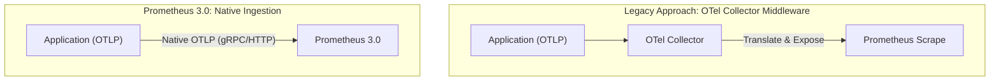

# Prometheus 3.0: A New UI and Native OTLP Support

Prometheus has long been the gold standard for metrics-based monitoring in the cloud-native ecosystem. With the release of Prometheus 3.0, the project takes a significant leap forward, moving beyond incremental updates to deliver foundational improvements in user experience, interoperability, and data consistency.

This major release introduces a completely revamped user interface, native support for the OpenTelemetry Protocol (OTLP), and strict UTF-8 enforcement. These changes are not just cosmetic; they represent a strategic evolution to meet the demands of modern, polyglot observability stacks.

### What You'll Get

This article breaks down the most impactful changes in Prometheus 3.0. Here’s what you can expect:

* **A deep dive into the new React-based UI**, highlighting usability improvements.
* An explanation of **native OTLP support** and how it simplifies your architecture.
* Insight into the importance of **strict UTF-8 validation** for data integrity.
* Practical examples, code snippets, and diagrams to illustrate the new features.

---

## The Revamped User Interface

The classic Prometheus UI was functional but has long shown its age. Prometheus 3.0 trades the old AngularJS interface for a modern, responsive frontend built with **React and the PatternFly design system**. This is more than a facelift; it's a ground-up redesign focused on operator efficiency.

### Key UI Enhancements

* **Improved PromQL Experience:** The query editor is now a first-class component, offering superior syntax highlighting, multi-line editing, and more intelligent autocompletion for metrics and labels.
* **Streamlined Navigation:** A clean, persistent sidebar makes it easier to switch between alerts, targets, service discovery status, and configuration pages.
* **Enhanced Visualization:** Graphs are rendered more clearly, with better performance and more intuitive controls for time range selection and stacking.

The new interface significantly lowers the barrier to entry for new users while providing power users with the efficient tooling they need.

### UI at a Glance: Old vs. New

| Feature | Classic UI (2.x) | Prometheus 3.0 UI |
| :--- | :--- | :--- |
| **Framework** | AngularJS | React & PatternFly |
| **PromQL Editor** | Basic text area | Advanced editor with autocomplete |
| **Layout** | Top-level tabs, slightly dated | Modern, responsive sidebar navigation |
| **Usability** | Functional but requires expertise | Intuitive for both new and old users |

## Bridging Worlds with Native OTLP Support

Perhaps the most significant architectural change in Prometheus 3.0 is the introduction of **native support for the OpenTelemetry Protocol (OTLP)**. This positions Prometheus as a first-class citizen in the broader OpenTelemetry ecosystem.

Previously, to get OTLP metrics into Prometheus, you needed a translation layer—typically the OpenTelemetry Collector. The Collector would receive OTLP data, process it, and then expose it in the Prometheus exposition format for scraping. This added an extra component to deploy, manage, and monitor.

With native support, Prometheus can now directly ingest OTLP metrics over gRPC or HTTP, simplifying the data pipeline for many use cases.

### The New, Simplified Architecture

This change streamlines the data flow from your instrumented applications directly to Prometheus, reducing latency and operational overhead.



### Enabling OTLP Ingestion

Enabling the OTLP receiver is straightforward. You add a new `otlp` configuration block to your `prometheus.yml` file.

```yaml
# prometheus.yml

# ... your existing scrape_configs ...

otlp:
  receiver:
    protocols:
      # Enable the OTLP/gRPC receiver on the default port (4317)
      grpc:

      # Enable the OTLP/HTTP receiver on the default port (4318)
      http:
```

> **Note:** While the OTel Collector remains invaluable for advanced use cases like complex processing, batching, and routing telemetry to multiple backends, native support in Prometheus is a game-changer for simpler setups focused on metrics. For more details, see the official [OpenTelemetry documentation](https://opentelemetry.io/).

## Enhanced Internationalization with Strict UTF-8

Data consistency is paramount in any monitoring system. Prometheus 2.x was somewhat lenient about the character encoding of labels and metric names, occasionally leading to corrupted data or unpredictable query behavior when non-UTF-8 characters were ingested.

Prometheus 3.0 addresses this by enforcing **strict UTF-8 validation** on all incoming strings, including metric names, label names, and label values.

### Why This Matters

* **Guaranteed Data Integrity:** It eliminates the possibility of "garbage" characters corrupting your time series data.
* **Reliable Internationalization:** You can now confidently use multi-language characters in your labels (e.g., `cluster="k8s-produção"`, `app="重要应用"`), and they will be stored and queried correctly.
* **Cross-System Consistency:** It aligns Prometheus with modern standards where UTF-8 is the default encoding for text data.

This is a **breaking change**. If any of your applications, exporters, or push gateways send data that is not valid UTF-8, Prometheus 3.0 will reject those samples.

> **Action Required:** Before upgrading to Prometheus 3.0, audit your metric sources. Ensure that all instrumented code and third-party exporters generate valid UTF-8 strings. Failure to do so *will* result in data loss for non-compliant targets.

## Other Notable Changes

Beyond the headline features, Prometheus 3.0 includes several other valuable improvements:

* **Created Timestamps:** Full support for `created` timestamps is now available, which helps solve problems with counter resets after a target restart. This brings Prometheus closer to the [OpenMetrics specification](https://openmetrics.io/).
* **PromQL Optimizations:** The query engine has received performance tuning, resulting in faster execution for certain types of complex queries.
* **TSDB Enhancements:** The time-series database (TSDB) layer includes optimizations to reduce memory usage on startup and improve compaction efficiency.
* **Deprecations:** Several legacy flags and internal APIs have been removed, cleaning up the codebase and encouraging the use of current best practices.

## Summary

Prometheus 3.0 is a landmark release that modernizes the platform's core experience. The new UI makes Prometheus more accessible and powerful, while native OTLP support solidifies its role as a central pillar in the OpenTelemetry landscape. Finally, the move to strict UTF-8 enforcement is a crucial step for data integrity and global usability.

By focusing on user experience, interoperability, and correctness, Prometheus 3.0 is well-equipped to handle the future of cloud-native monitoring.

## Further Reading

* [https://prometheus.io/blog/2024/11/14/prometheus-3-0/](https://prometheus.io/blog/2024/11/14/prometheus-3-0/)
* [https://grafana.com/events/grafanacon/2025/prometheus-3.0-everything-you-need-to-know/](https://grafana.com/events/grafanacon/2025/prometheus-3.0-everything-you-need-to-know/)
