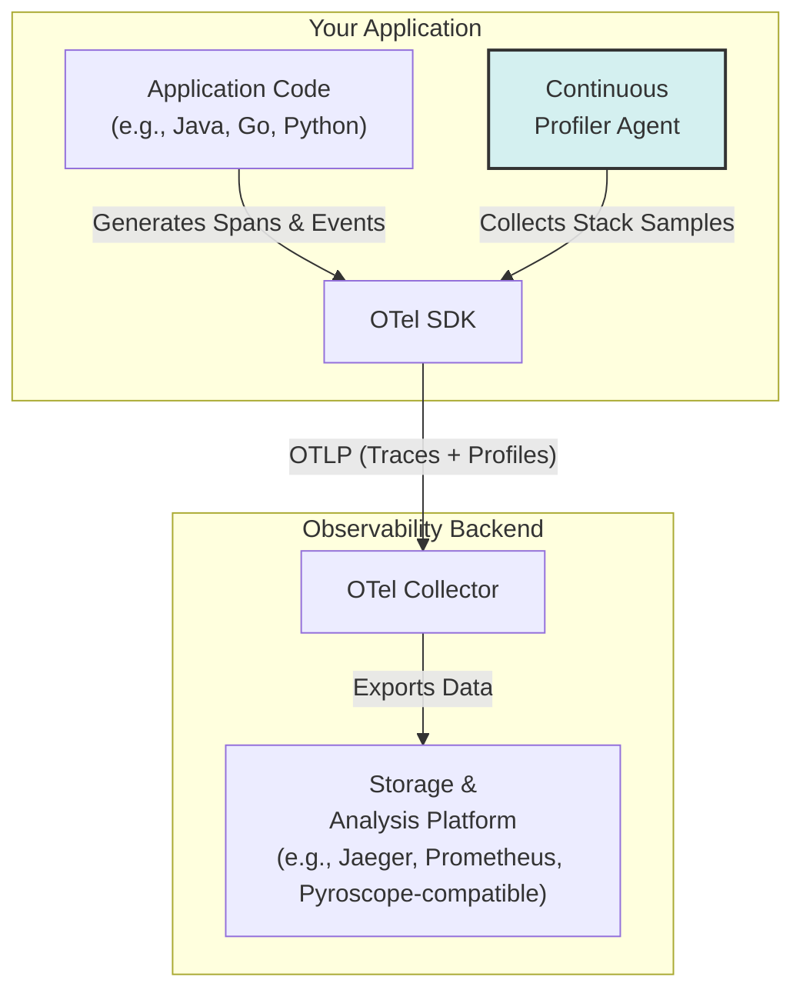

# The Fourth Signal: Introduction to OpenTelemetry Profiling

For years, the observability world has stood on the "three pillars": logs, metrics, and traces. This triad gave us a powerful way to understand system behavior, from high-level performance indicators to the granular details of a single request. But as systems grow more complex, particularly with the rise of AI and distributed microservices, a critical gap has emerged. We can see *where* time is spent (traces), but not always *why* it's spent. Enter the fourth signal: **Profiling**.

OpenTelemetry, the industry standard for instrumentation, is officially embracing continuous profiling as a first-class signal. This addition promises to bridge the final gap between identifying a problem and pinpointing the exact lines of code responsible for it, fundamentally changing how we debug performance in production.

### What You'll Get

In this article, you will learn:

* Why logs, metrics, and traces alone are sometimes insufficient.
* What continuous profiling is and how it differs from traditional profiling.
* How OpenTelemetry integrates profiling with traces for correlated analysis.
* Practical use cases for profiling in AI/ML and microservices workloads.
* The high-level architecture of OpenTelemetry's new profiling signal.

---

## Why a Fourth Signal? The Limits of the Big Three

The existing three signals are excellent at what they do, but each has its limitations when it comes to resource-level performance analysis.

| Signal   | What It Tells You                                | The Missing Piece                                             |
| :------- | :----------------------------------------------- | :------------------------------------------------------------ |
| **Metrics**  | *What* is happening (aggregated numbers).        | Lacks context for individual requests or code-level details.  |
| **Logs**     | *Why* something happened (discrete events).      | Hard to correlate with performance; can be noisy or sparse.   |
| **Traces**   | *Where* a request spent its time (latency).      | Doesn't explain *why* a function was slow (e.g., CPU vs. I/O). |
| **Profiles** | **How** resources (CPU, memory) are being used. | Provides the code-level "why" behind the latency seen in traces. |

A trace might show that a function `process_data()` took 500ms, but it won't tell you if that was due to waiting on the network or being stuck in a computationally expensive loop. This is the gap profiling fills. It provides a ground-level view of resource consumption, showing exactly which functions are consuming CPU cycles or allocating memory.

> **Key Insight:** Profiling connects system latency to resource consumption at the code level. It answers the question: "My trace shows this span is slow, but *what code* in that span is burning CPU?"

## Understanding Continuous Profiling

Traditionally, profiling was a heavy, intrusive process reserved for development environments. You'd attach a profiler, run a specific scenario, and analyze the output—a process too cumbersome and high-overhead for production.

**Continuous Profiling** changes the game. It involves lightweight, low-overhead profilers that are always on in production. By constantly sampling the application's call stack (the sequence of functions being executed), it builds a statistical picture of where resources are being spent over time.

* **Always-On:** Captures data continuously, so you can analyze performance for any time window, not just pre-planned sessions.
* **Low Overhead:** Uses sampling techniques to minimize performance impact, making it safe for production environments. According to CNCF, typical overhead is less than 5%. [Source: CNCF End User Technology Radar](https://radar.cncf.io/2022-03-observability)
* **Historical Context:** Allows you to compare performance profiles before and after a deployment to identify regressions immediately.

## How OpenTelemetry Profiling Works

The OpenTelemetry community is standardizing the data format and transport protocol for profiling data, just as it did for the other signals. The vision is not just to collect profiles, but to deeply integrate them with existing signals.

The core innovation is **linking profiles to traces**. When an application generates a trace, the profiler running alongside it can associate its collected samples with the specific span context.

This creates a powerful workflow:

1. A dashboard metric shows high CPU usage.
2. You find a trace from that period with unusually high latency in a specific service.
3. You click on the slow span in the trace and pivot directly to the CPU profile captured *during that exact request*.
4. The profile (often visualized as a flame graph) points to the exact function—and line of code—that consumed the most CPU.

### High-Level Architecture

The data flow is consistent with other OTel signals, relying on the OTel Collector for processing and exporting.



### The Profile Data Model

While still evolving, the OpenTelemetry profiling specification defines a `Profile` data model that can be sent via OTLP. It includes:

* **Stack Traces:** The core data, representing the call stack at a point in time.
* **Value Types:** Information on what is being measured (e.g., `cpu`, `wall-time`, `alloc_objects`, `alloc_space`).
* **Timestamps:** When the samples were collected.
* **Trace/Span Links:** The crucial connection that associates a profile with a specific trace context.

## Practical Use Cases: AI and Microservices

Resource-intensive workloads are where profiling shines brightest.

### AI and ML Workloads 🤖

AI applications often involve heavy data processing and numerical computation, making them prime candidates for performance bottlenecks.

* **Inefficient Data Preprocessing:** A trace might show a long delay before model inference begins. A CPU profile could reveal that a data serialization or transformation function (e.g., converting images to tensors) is unexpectedly CPU-bound.
* **Memory Leaks in Training:** A memory profile can identify objects that are being allocated but never released during long-running training jobs, helping to prevent out-of-memory errors.
* **Optimizing Inference:** For a real-time inference API, every millisecond counts. A profile can highlight whether time is being spent in the model's forward pass, data validation, or post-processing logic, guiding optimization efforts.

### Microservices Architectures 🌐

In a distributed system, a bottleneck in one service can cause cascading failures.

* **Identifying Noisy Neighbors:** A single, inefficient function in a shared microservice can consume disproportionate CPU, starving other requests. Continuous profiling can spot this anomaly instantly.
* **Garbage Collection (GC) Pauses:** In languages like Java or Go, a high rate of memory allocation can lead to long GC pauses. A memory profile can pinpoint the code allocating excessive short-lived objects, allowing developers to optimize and reduce GC pressure.
* **Debugging Latency Spikes:** When a user reports a slow request, you can find its trace and see the linked profile. This might reveal that the slowness was caused not by I/O, but by an inefficient JSON serialization library consuming CPU in a tight loop.

## Getting Started with OTel Profiling

As of late 2023/early 2024, the OpenTelemetry profiling signal is in an **experimental** stage. The specification is solidifying, and support in SDKs and backends is emerging.

To adopt it, you will typically need three components:

1. **A Profiler:** A language-specific library or agent that can collect stack traces (e.g., `pprof` for Go, an async-profiler-based agent for Java).
2. **OpenTelemetry SDK:** The OTel SDK for your language, configured to receive data from the profiler and link it to traces.
3. **An OTLP-Compatible Backend:** An observability platform that can receive, store, and visualize the OTLP profile format.

Here is a *conceptual* Go snippet illustrating how a profiler might be configured to export data via OTel.

```go
// NOTE: This is a conceptual example.
// Actual implementation will depend on the OTel Go SDK's profiling support.

import (
    "go.opentelemetry.io/otel"
    // Fictional profiler packages for illustration
    "go.opentelemetry.io/profiler" 
    "go.opentelemetry.io/exporter/otlp/otlpprofiles"
)

func main() {
    // 1. Configure an OTLP exporter for profiles
    profileExporter, err := otlpprofiles.New(context.Background())
    if err != nil {
        log.Fatalf("failed to create profile exporter: %v", err)
    }

    // 2. Initialize the profiler with the exporter
    // This would start the continuous sampling of CPU and memory.
    provider := profiler.NewProvider(
        profiler.WithSyncer(profileExporter),
        profiler.WithProfileTypes(profiler.CPU, profiler.Memory),
    )
    otel.SetProfilerProvider(provider)

    // Your application logic starts here...
    // The profiler runs in the background. The OTel SDK will automatically
    // link profiles to traces where possible.
}
```

Keep an eye on the official OpenTelemetry documentation and the announcements from your observability vendor for production-ready support. [OpenTelemetry Blog](https://opentelemetry.io/blog/) is the best place for updates.

## The Future: A Unified Observability Vision

The addition of profiling completes the observability picture. It creates a seamless diagnostic experience where developers can navigate from a high-level symptom down to the root cause in code, all within a single, correlated system.

The unified workflow looks like this:
*A **metric** alerts you to a problem → a **trace** shows you which service and operation is slow → a **profile** reveals the exact function burning resources → a **log** provides the application-specific context for that exact request.*

This holistic view eliminates guesswork, drastically reduces Mean Time to Resolution (MTTR), and empowers developers to build more performant and reliable software. Profiling isn't just another signal; it's the connective tissue that binds system-level observability to application code.

## Further Reading

* [https://opentelemetry.io/blog/2025/](https://opentelemetry.io/blog/2025/)
* [https://medium.com/@serverwalainfra/opentelemetry-in-2025-the-backbone-of-full-stack-observability-for-container-environments-619d44135a5a](https://medium.com/@serverwalainfra/opentelemetry-in-2025-the-backbone-of-full-stack-observability-for-container-environments-619d44135a5a)
