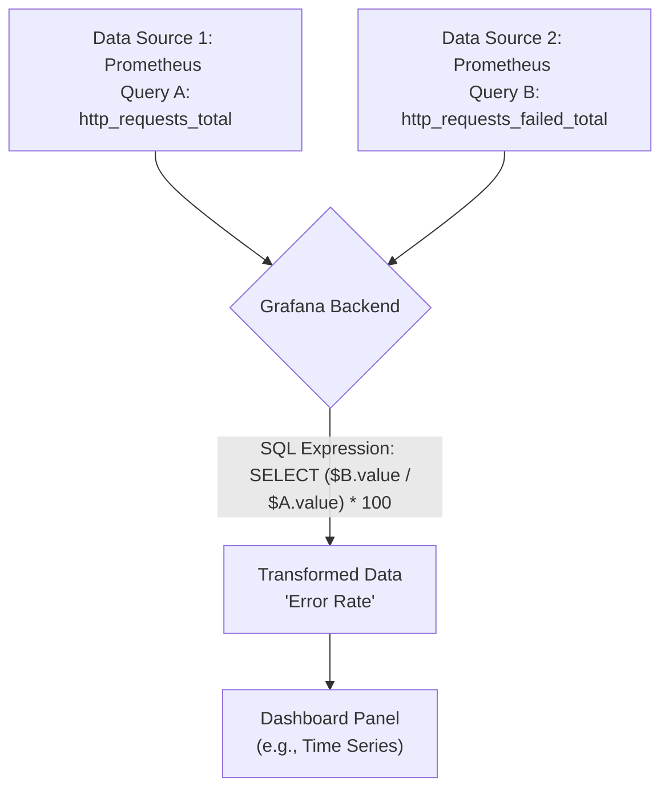
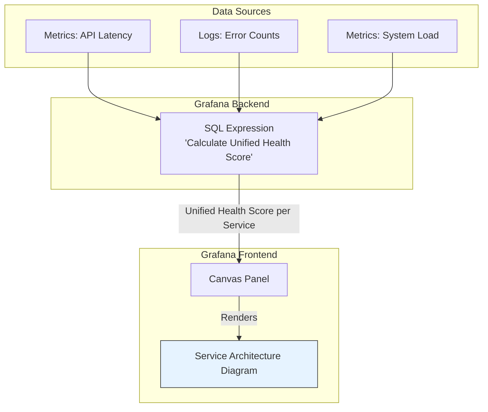

# Grafana 12: SQL Expressions and Canvas Visualization

Grafana continues its evolution from a time-series plotter to a comprehensive observability platform. With the release of Grafana 12, two groundbreaking features take center stage: **SQL Expressions** for powerful server-side data transformations and the **Canvas Panel** for creating bespoke, data-driven visualizations. These tools empower practitioners to manipulate and display data in ways that were previously complex or impossible without external processing.

This article dives deep into these new capabilities, exploring how they work, why they matter, and how you can combine them to build more insightful and intuitive dashboards.

### What You'll Get

*   **In-depth look at SQL Expressions:** Understand how to perform data source-agnostic, SQL-like transformations directly in Grafana.
*   **Guide to the Canvas Panel:** Learn to create custom diagrams and infographics driven by your live data.
*   **Practical Examples:** See concrete code snippets and use cases for both features.
*   **Architectural Flows:** Visualize how data moves with high-level Mermaid diagrams.
*   **Actionable Insights:** Discover how to combine these features for maximum impact.

---

## SQL Expressions: Server-Side Transformations Arrive

For years, Grafana users have relied on client-side transformations and expressions to perform calculations on query results. Grafana 12 introduces **SQL Expressions**, a paradigm shift that moves this logic to the Grafana backend, offering more power and efficiency.

### What are SQL Expressions?

SQL Expressions allow you to use a SQL-like syntax to query, join, and aggregate results from *any* data source, not just SQL databases. Think of it as a post-processing engine for your queries. You can pull data from Prometheus, Loki, and a PostgreSQL database, then use a single SQL Expression to merge and calculate a new, unified dataset.

This operation happens on the Grafana server *before* the data is sent to your browser, making it highly efficient.

### Why This Matters

The move to server-side expressions has several key advantages:

*   **Reduced Data Source Load:** Perform complex joins and aggregations in Grafana, reducing the query burden on your primary data stores.
*   **Cross-Data Source Calculations:** Easily calculate ratios, sums, or other metrics using data from entirely different systems (e.g., divide Prometheus metrics by a value from a MySQL table).
*   **Simplified Queries:** Keep your data source queries simple and focused on fetching raw data. Let Grafana handle the complex relational logic.
*   **Centralized Logic:** Define your key performance indicators (KPIs) and business metrics once in Grafana, ensuring consistency across all dashboards.

### How It Works: A Practical Example

Let's consider a common scenario: calculating an application's error rate. Your total requests are stored as one Prometheus metric (`http_requests_total`) and your failed requests as another (`http_requests_failed_total`).

Previously, you might use two separate queries and a client-side "Expression" transformation. With SQL Expressions, the process is cleaner.

1.  **Query A:** Fetch total requests.
2.  **Query B:** Fetch failed requests.
3.  **SQL Expression:** Use a single SQL statement to calculate the rate.

```sql
SELECT
  ($B.value / $A.value) * 100 AS "Error Rate"
FROM
  $A, $B
WHERE
  $A.time = $B.time
```

This expression joins the results from query A and B on the timestamp and computes the percentage. The result is a new, queryable dataset named "Error Rate" that you can visualize directly.

The data flow looks like this:



---

## Canvas Panel: From Dashboards to Diagrams

While Grafana excels at charts and graphs, some information is best conveyed through diagrams, schematics, or infographics. The new **Canvas Panel** is a free-form visualization layer that lets you build exactly that.

### What is the Canvas Panel?

The Canvas panel is a visualization type that provides a blank slate where you can place and arrange elements with absolute positioning. You can add shapes, text, icons, and images, and then—most importantly—bind them to your data queries.

Think of it as a hybrid of a drawing tool like Visio or Figma and a Grafana dashboard. You design the static layout and then link elements to live data streams.

### Key Use Cases

The possibilities are vast, but here are a few powerful applications:

*   **Network Topology:** Create a diagram of your network infrastructure where nodes and links change color based on health, latency, or traffic volume.
*   **Process Flow Monitoring:** Visualize a business process or data pipeline, with each stage showing its current status or throughput.
*   **Industrial Control (SCADA):** Build simplified mimics of physical systems, showing sensor readings from factory floor equipment or IoT devices.
*   **Infographics:** Design custom, visually engaging displays for high-level business KPIs.

> **Pro Tip:** You can set a static image (like a floor plan or architectural diagram) as the background of your Canvas panel and overlay live data points on top of it.

### Building a Simple Canvas Visualization

Let's create a basic server status indicator.

1.  **Add Panel:** Add a new panel to your dashboard and select `Canvas` as the visualization type.
2.  **Add Data:** Create a query to fetch a metric, for example, the CPU utilization of a specific server from Prometheus.
    ```promql
    instance:node_cpu:ratio{instance="server-01"}
    ```
3.  **Add Elements:**
    *   In the Canvas editing pane, add a `Text` element. Set its content to "Server-01 CPU".
    *   Add an `Icon` (e.g., a server icon).
    *   Add another `Text` element that will display the live value.
4.  **Connect Data to Elements:**
    *   Select the second text element.
    *   In its configuration, set the `Content` property to be driven by data from your query. You can select the "Last" value from the query result.
    *   Use the `Number format` option to add a unit (e.g., `%`).
5.  **Add Data-Driven Rules (Optional):**
    *   Select the server icon.
    *   Go to the "Overrides" tab for that element.
    *   Create a rule that changes the icon's color based on the value. For example:
        *   If value > 80, color is `red`.
        *   If value > 60, color is `orange`.
        *   Base color is `green`.

You now have a simple, visually intuitive component that instantly communicates server status.

---

## Combining Forces: SQL Expressions and Canvas

The true power of Grafana 12 emerges when you combine these two features. SQL Expressions can pre-process and synthesize complex metrics, which can then be visualized in a highly contextual way with the Canvas panel.

Imagine you want to create a high-level health dashboard for a distributed service. The service's health isn't a single metric but a combination of API latency, error rate, and system load.

1.  **Aggregate Health Data:** Use SQL Expressions to query metrics from multiple sources (Prometheus for performance, Loki for error logs) and calculate a unified "Health Score" from 0 to 100.
2.  **Visualize on Canvas:** Build a Canvas panel that shows a simplified architectural diagram of your service.
3.  **Bind and Display:** Bind the color of each service component in your diagram to the calculated Health Score.

The architecture for this powerful combination would look like this:



This approach allows you to abstract immense complexity into a simple, at-a-glance visualization that is immediately understandable to all stakeholders.

## The Bigger Picture: Grafana's Evolution

Grafana 12's introduction of SQL Expressions and the Canvas panel marks a significant step in its journey. The platform is solidifying its position not just as a tool for creating charts, but as a holistic framework for data storytelling.

*   **SQL Expressions** provide the semantic layer to transform raw data into meaningful business insights.
*   **The Canvas Panel** provides the presentation layer to communicate those insights in the most effective format possible.

By giving users more control over both data transformation and visualization, Grafana is empowering teams to build truly custom and context-rich observability solutions. It's an exciting time to be a Grafana user. We recommend exploring these features in your own environments to unlock new levels of clarity in your data.

For more information, check out the official [Grafana documentation](https://grafana.com/docs/grafana/latest/).


## Further Reading

- [https://grafana.com/blog/2025/11/19/grafana-12-3-release-all-the-latest-features/](https://grafana.com/blog/2025/11/19/grafana-12-3-release-all-the-latest-features/)
- [https://grafana.com/docs/grafana/latest/whatsnew/whats-new-in-v12-0/](https://grafana.com/docs/grafana/latest/whatsnew/whats-new-in-v12-0/)
