# Implementing GreenOps: Using OpenCost and Kube-green to Reduce Carbon

As cloud-native systems scale, their energy consumption and associated carbon footprint grow. GreenOps, an evolution of FinOps, applies the same principles of visibility, optimization, and governance to environmental sustainability. It's not just about being eco-friendly; it's about building efficient, cost-effective, and responsible systems.

This practical guide moves beyond theory. We'll show you how to implement a GreenOps feedback loop in your Kubernetes clusters using two powerful open-source tools: **OpenCost** for measurement and **Kube-green** for automated optimization.

### What You'll Get

By the end of this article, you will have a clear, actionable strategy to:

* Understand the core principles of GreenOps and carbon efficiency.
* Install and use OpenCost to measure the carbon footprint of your Kubernetes workloads.
* Deploy Kube-green to automatically reduce energy consumption in non-production environments.
* Combine these tools into a continuous improvement loop for a greener, more efficient cluster.

## What is GreenOps?

GreenOps is a discipline that operationalizes sustainability in cloud and IT operations. It aims to reduce the environmental impact of infrastructure by improving energy efficiency and reducing carbon emissions. Just as FinOps brought financial accountability to engineering teams, GreenOps brings environmental accountability.

The core loop is simple: **Measure, Optimize, Repeat.** You can't improve what you can't measure. That's where we'll start.

### Why Measure Carbon in Kubernetes?

Every CPU cycle and byte of RAM in your cluster consumes electricity. That electricity is generated from a mix of sources, some renewable and some fossil fuels. The "carbon intensity" of the power grid varies significantly by data center region and even time of day.

> **What is Carbon Intensity?**
> Carbon intensity measures the grams of carbon dioxide equivalent (gCO₂eq) emitted per kilowatt-hour (kWh) of electricity consumed. A data center in a region powered by hydropower will have a much lower carbon intensity than one in a region reliant on coal.

By measuring the carbon efficiency of your workloads, you can identify "hotspots"—inefficient applications or entire environments that contribute disproportionately to your carbon footprint.

## Step 1: Measure with OpenCost

[OpenCost](https://www.opencost.io/) is a vendor-neutral, open-source project for measuring and allocating Kubernetes infrastructure costs. As a CNCF Sandbox project, it has strong community backing. Critically for GreenOps, it also provides carbon efficiency metrics.

### Installing OpenCost

The easiest way to install OpenCost is with its Helm chart.

```bash
# Add the OpenCost Helm repository
helm repo add opencost https://opencost.github.io/opencost-helm-chart

# Install OpenCost into its own namespace
helm install opencost opencost/opencost --namespace opencost --create-namespace
```

After a few minutes, the OpenCost pods will be running.

### Accessing Carbon Data

You can access the OpenCost UI by port-forwarding the service:

```bash
kubectl port-forward --namespace opencost service/opencost 8080:9090
```

Now, navigate to `http://localhost:8080` in your browser. In the left-hand navigation, go to the **Reports** section. Here, you can create a new report and add "Carbon Efficiency" as a metric to track.

OpenCost calculates this by correlating your cluster's resource consumption with the known carbon intensity of your cloud provider's data center region.

### Interpreting the Data

OpenCost provides a clear view of consumption, cost, and environmental impact broken down by namespace, deployment, or other Kubernetes objects.

| Metric | Description | What to Look For |
| :--- | :--- | :--- |
| **Total Cost** | The financial cost of resources consumed. | High-cost namespaces that are not production-critical. |
| **CPU/Memory Usage**| The amount of CPU and memory used vs. requested. | Low utilization, indicating over-provisioning. |
| **Carbon Efficiency**| A score representing resource utilization vs. carbon output. | Lower scores are better. High scores indicate waste. |

With this data, you can pinpoint the best targets for optimization. Often, the lowest-hanging fruit are non-production environments like `development`, `qa`, and `staging`, which run 24/7 but are only used during business hours.

## Step 2: Optimize with Kube-green

This is where we act on our insights. [Kube-green](https://kube-green.dev/) is a Kubernetes operator that automatically shuts down (scales to zero) and restarts resources based on a schedule. It's the perfect tool for reducing the energy consumption of idle non-production environments.

### How Kube-green Works

Kube-green uses a Custom Resource Definition (CRD) called `SleepInfo`. You define a `SleepInfo` object in a namespace, specifying the hours you want the resources to be "asleep." The Kube-green controller watches for these objects and automatically scales down Deployments, StatefulSets, and CronJobs at the specified time, then scales them back up in the morning.

Here is a high-level flow of its operation:

```mermaid
graph TD
    A["Sleep Time Triggered<br/>(e.g., 8 PM)"] --> B{Kube-green Controller};
    B --> C["Reads SleepInfo CRD for<br/>target namespace"];
    C --> D["Saves original<br/>replica counts"];
    D --> E["Patches Deployments & StatefulSets<br/>to replicas: 0"];
    subgraph "Resources Asleep (Night) 😴"
        E
    end
    F["Wake Up Time Triggered<br/>(e.g., 8 AM)"] --> G{Kube-green Controller};
    G --> H["Reads SleepInfo CRD"];
    H --> I["Restores original<br/>replica counts"];
    I --> J["Resources are active again"];
    subgraph "Resources Awake (Day) ☀️"
        J
    end
```



### Installing Kube-green

Like OpenCost, Kube-green is easily installed via Helm.

```bash
# Add the Kube-green Helm repository
helm repo add kube-green https://charts.kube-green.dev
helm repo update

# Install Kube-green into its own namespace
helm install kube-green kube-green/kube-green --namespace kube-green --create-namespace
```

### Configuring a Sleep Schedule

Now, let's create a `SleepInfo` resource to put our `development` namespace to sleep on weeknights and weekends.

Create a file named `dev-sleep-schedule.yaml`:

```yaml
apiVersion: "kube-green.com/v1alpha1"
kind: "SleepInfo"
metadata:
  name: "sleep-for-dev"
  namespace: "development" # This schedule applies ONLY to the 'development' namespace
spec:
  # Shut down Monday through Friday
  weekdays: "1-5" 
  # Stop pods at 8 PM
  sleepAt: "20:00" 
  # Start pods at 8 AM
  wakeUpAt: "08:00" 
  # Important: Set your local timezone
  timeZone: "America/New_York"
  # Optional: To also put resources to sleep all day on weekends
  # excludeRefs: [] # Can be used to exclude specific resources
```

*Note: A `SleepInfo` with `weekdays: "*"` would apply to every day. By specifying `1-5`, we ensure the namespace stays asleep all weekend because there is no `wakeUpAt` trigger on Saturday or Sunday.*

Apply it to your cluster:

```bash
kubectl apply -f dev-sleep-schedule.yaml
```

That's it! The Kube-green operator will now automatically manage the resources in the `development` namespace, significantly reducing its energy consumption and carbon footprint during idle hours.

## Putting It All Together: The GreenOps Loop

Neither of these tools is a one-time fix. They are components of a continuous improvement cycle.

```mermaid
graph TD
    subgraph "Continuous GreenOps Cycle"
        A("1. Measure with OpenCost") --> B("2. Analyze Footprint");
        B --> C{"Identify Idle Resources?<br/>(e.g., dev/staging)";
        C -- Yes --> D("3. Apply Kube-green<br/>SleepInfo Schedules");
        D --> A;
        C -- No --> E("4. Look for other<br/>optimizations & repeat");
        E --> A;
    end
```

**Your workflow becomes:**

1. **Baseline:** Use OpenCost to measure the current cost and carbon footprint of your cluster, paying close attention to non-production namespaces.
2. **Act:** Identify idle namespaces and apply `SleepInfo` schedules with Kube-green.
3. **Verify:** After a week, return to your OpenCost reports. You should see a measurable drop in both the cost and carbon emissions for the targeted namespaces.
4. **Iterate:** Expand the strategy. Can other namespaces be put to sleep? Can you use OpenCost data to identify over-provisioned production workloads for right-sizing?

## Conclusion: A Greener Cloud

GreenOps is a powerful framework for building more sustainable and efficient cloud-native applications. By combining the measurement capabilities of **OpenCost** with the automated optimization of **Kube-green**, you can create a tangible impact.

You not only reduce your carbon footprint but also lower your cloud bill—a clear win for both the planet and your budget. This practical, tool-driven approach empowers engineering teams to take direct control over their environmental impact, transforming sustainability from an abstract goal into a daily engineering practice.

## Further Reading

* [https://umbrellacost.com/blog/guide-to-greenops/](https://umbrellacost.com/blog/guide-to-greenops/)
* [https://thenewstack.io/greenops-and-finops-a-dual-strategy-for-sustainable-ai/](https://thenewstack.io/greenops-and-finops-a-dual-strategy-for-sustainable-ai/)
