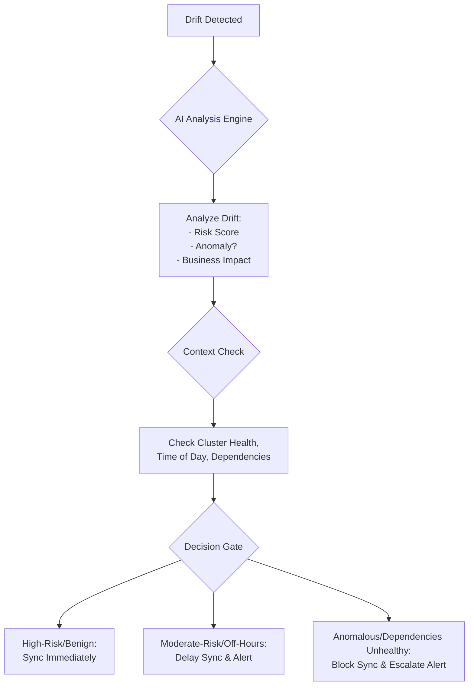
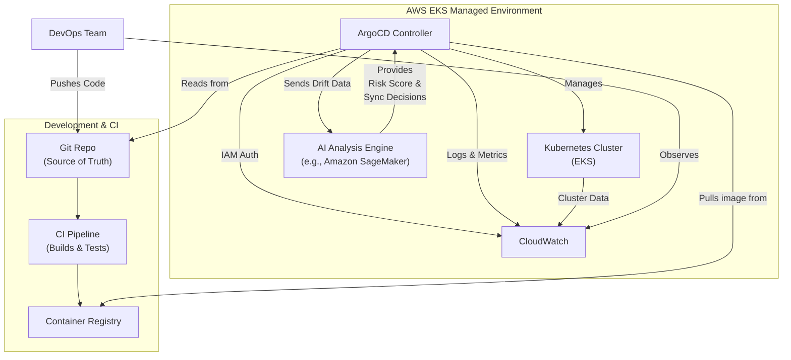

# ArgoCD in 2025: Integrating AI into GitOps Pipelines

GitOps has moved from a novel concept to a standard operational practice for managing Kubernetes infrastructure and applications. At the heart of this movement, [ArgoCD](https://argo-cd.readthedocs.io/en/stable/) has become the de-facto tool for declarative, continuous delivery. But as we look toward 2025, the paradigm is shifting from simple reconciliation to intelligent, proactive orchestration. The next evolution of ArgoCD is poised to integrate Artificial Intelligence to create smarter, more resilient, and highly autonomous GitOps pipelines.

This article explores the near-future roadmap for ArgoCD, focusing on how AI-driven capabilities and deeper cloud-native integrations, particularly with services like AWS EKS, will redefine operational excellence.

### What You'll Get

* **Future-Forward Insights:** An analysis of how AI is being integrated into core GitOps workflows.
* **Practical Concepts:** Understanding AI-powered drift detection and context-aware sync policies.
* **Architectural Vision:** A look at how ArgoCD's integration with managed Kubernetes services simplifies operations.
* **Clear Diagrams:** Mermaid flowcharts and architectural diagrams to visualize these new patterns.
* **Balanced Perspective:** A discussion of the benefits and challenges of adopting AI in your pipelines.

---

## The Evolution of GitOps: Beyond Reconciliation

At its core, ArgoCD operates on a simple, powerful loop: it constantly compares the live state of applications in a Kubernetes cluster against the desired state defined in a Git repository. When a discrepancy—or *drift*—is detected, it reports the application as `OutOfSync` and provides mechanisms to reconcile it.

This model is fundamentally **reactive**. It excels at correcting deviations after they happen. The next frontier for GitOps is to become **proactive and predictive**.

> The goal is to move from "What is the current drift?" to "What is the *risk* of this drift, and what drift is likely to occur next?" This is where AI enters the picture.

## AI-Powered GitOps: The Intelligent Co-Pilot

Integrating AI and Machine Learning (ML) models into ArgoCD transforms it from a state machine into an intelligent control plane. These capabilities are not about replacing the GitOps model but augmenting it with a layer of smart decision-making.

### Predictive Drift Detection

Standard drift detection is binary: the state either matches or it doesn't. AI introduces nuance by analyzing the *nature* of the drift.

* **Anomaly Detection:** An ML model trained on your cluster's historical state can distinguish between benign, expected changes (e.g., a pod restarting) and anomalous drift that could signal a security breach or a cascading failure.
* **Risk Scoring:** Instead of just flagging an application as `OutOfSync`, an AI-enhanced ArgoCD could assign a risk score. A change to a ConfigMap for a non-critical app might be low-risk, while an unexpected change to a service account's permissions would be flagged as high-risk, triggering immediate alerts.
* **Noise Reduction:** By learning what constitutes "normal" operational flux, the system can intelligently ignore trivial drift, reducing alert fatigue for operations teams.

### Automated, Context-Aware Sync Policies

Today, ArgoCD sync policies are fairly static—you can enable auto-sync with or without pruning. An AI-driven approach makes this process dynamic and context-aware. The system could ask questions before acting:

* Is this a business-critical application?
* Are we within a designated maintenance window or peak traffic hours?
* Are there alerts firing for dependent services (e.g., a database or an external API)?

This flow can be visualized as an intelligent decision gate within the reconciliation loop.



Here's a conceptual look at what an AI-enhanced `Application` manifest snippet might include. This is not valid today but illustrates the direction.

```shell
# This is a conceptual representation, not valid code.
spec:
  # ... existing spec fields
  syncPolicy:
    automated:
      prune: true
      selfHeal: true
    # --- New AI-driven fields ---
    ai:
      # Enable AI-driven sync decisions.
      mode: "enabled"
      # Sensitivity for anomaly detection: low, medium, high.
      sensitivity: "high"
      # Define "blackout" windows where AI will prevent syncs.
      blackoutWindows:
        - "weekdays/21:00-23:59Z"
        - "weekends/all"
```

## Seamless Operations with EKS Managed Capabilities

While AI enhances application management, managing ArgoCD itself can still be an operational burden. Cloud providers are moving to simplify this through managed offerings. For AWS users, the integration of ArgoCD with [Amazon EKS capabilities](https://docs.aws.amazon.com/eks/latest/userguide/working-with-argocd.html) is a game-changer.

This isn't just about an installation helper; it's about deep, native integration that simplifies security, observability, and lifecycle management.

### Simplified Installation and Upgrades

Instead of manually managing ArgoCD deployments with Helm or Kustomize, it could be enabled as a managed EKS Add-on. This offloads the responsibility of patching, upgrading, and ensuring compatibility with the EKS control plane to AWS.

### Deep IAM Integration

Authenticating users and service accounts in ArgoCD often requires complex configuration. A native integration would allow you to map AWS IAM roles and users directly to ArgoCD roles, leveraging the security foundation of AWS without managing separate user databases or SSO configurations.

### Native Observability

Logs, metrics, and events from ArgoCD would stream directly into Amazon CloudWatch, Amazon Managed Service for Prometheus, and AWS X-Ray. This provides a single pane of glass for observing both your cluster's health and the health of your delivery toolchain.

Here’s how the operational model changes:

| Feature | Traditional ArgoCD on EKS | With EKS Managed Capabilities |
| :--- | :--- | :--- |
| **Installation** | Manual Helm/Kustomize install | One-click EKS Add-on |
| **Upgrades** | Manual, requires compatibility checks | Managed by AWS, version-aligned |
| **Authentication** | Dex/OIDC/SAML configuration | Direct IAM Role Mapping |
| **Permissions** | Manual Kubernetes RBAC/ArgoCD RBAC | IAM policies for granular control |
| **Monitoring** | Deploy Prometheus/Grafana stack | Native integration with CloudWatch |

## The Combined Power: A Future-Forward Architecture

When you combine an AI-powered ArgoCD with the operational simplicity of a managed EKS environment, you get a robust, intelligent, and low-overhead GitOps platform.

The architecture looks like this: Developers push code, CI builds an image, and the GitOps process takes over, but now with an intelligent feedback loop.



In this model, ArgoCD is no longer just a reconciler. It’s the core of a learning system that leverages cloud-native services to make smarter decisions, reducing manual intervention and improving the stability of the entire platform.

## Challenges and Considerations

Adopting an AI-driven GitOps model is not without its challenges:

* **Model Training:** The AI models require sufficient, high-quality data from your specific environment to be effective.
* **Explainability:** "Black box" AI decisions can be problematic. Teams need tools to understand *why* the AI chose to delay a sync or flag a specific drift.
* **Complexity:** Adding an AI layer introduces new components to manage, secure, and monitor, even if parts of it are managed services.
* **Security:** The AI models and their data pipelines become critical infrastructure and potential targets for attack.

## Conclusion

The future of ArgoCD in 2025 is not just about doing GitOps better; it's about doing it smarter. By integrating AI for predictive analysis and context-aware automation, ArgoCD is set to evolve from a reactive tool into a proactive operational co-pilot.

Combined with the simplification offered by managed Kubernetes platforms like EKS, this evolution promises to deliver on the ultimate goal of GitOps: creating highly automated, resilient, and secure systems that allow developers to ship features faster and with greater confidence. The journey is underway, and the teams that embrace this intelligent, integrated approach will be best positioned to lead in the next era of cloud-native operations.

## Further Reading

* [https://docs.aws.amazon.com/eks/latest/userguide/working-with-argocd.html](https://docs.aws.amazon.com/eks/latest/userguide/working-with-argocd.html)
