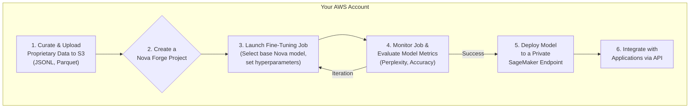

# Customizing Intelligence: A First Look at AWS Nova Forge

Announced at re:Invent 2025, AWS Nova Forge is a new, fully managed service designed to solve one of the most significant challenges in enterprise AI: creating truly specialized, high-performance models without the astronomical cost and complexity of training from scratch. It allows organizations to fine-tune AWS's next-generation "Nova" foundational models with their own proprietary data, all within a secure, private environment.

This service represents a major shift in the AI landscape, moving beyond general-purpose APIs to offer bespoke intelligence. By providing a streamlined path to model customization, AWS is betting that the future of enterprise AI is not just about using powerful models, but *owning* them.

### What You'll Get

* An overview of AWS Nova Forge and its core value proposition.
* A direct comparison: The fixed-cost fine-tuning model versus training from scratch.
* A high-level technical workflow, including a diagram and code snippets.
* A critical analysis of the trade-offs between performance gains and platform lock-in.

---

## What is AWS Nova Forge?

At its core, **AWS Nova Forge** is a managed environment for continuous pre-training and fine-tuning of AWS's cutting-edge Nova foundational models. Unlike services like Amazon Bedrock, which provide access to a variety of models via API, Nova Forge gives you a private, mutable copy of a base model to adapt with your own data.

The service is built on three key pillars:

* **Proprietary Models:** It exclusively uses the Nova model family, AWS's successor to Titan. These are state-of-the-art, multi-modal models optimized for performance on AWS's custom Trainium and Inferentia silicon.
* **Data Security:** All fine-tuning and inference happens within your AWS Virtual Private Cloud (VPC). Your proprietary data and the resulting model weights never leave your account, addressing critical data governance and privacy concerns.
* **Managed MLOps:** Nova Forge abstracts away the complex infrastructure management. It handles instance provisioning, distributed training jobs, hyperparameter optimization, and model versioning, allowing teams to focus on data quality and model performance.

> **What's a "Foundational Model"?**
> A foundational model is a large-scale AI model trained on a vast quantity of generalized data. It can be adapted to a wide range of downstream tasks. Nova Forge allows you to perform this adaptation (fine-tuning) for your specific business domain.

## The $100k Question: Fine-Tuning vs. Training From Scratch

The most disruptive aspect of Nova Forge is its pricing model: a flat fee, reportedly starting at **$100,000 per year per model family**. This fixed cost fundamentally changes the economic calculation for building custom AI. It stands in stark contrast to the multi-million dollar, unpredictable cost of training a large language model (LLM) from the ground up.

Here’s a breakdown of the comparison:

| Feature | Training from Scratch | Fine-Tuning with Nova Forge |
| :--- | :--- | :--- |
| **Cost** | $4M - $12M+ (unpredictable) | $100k/year (predictable) |
| **Time-to-Value** | 9 - 18 months | Weeks to a few months |
| **Expertise Required** | Elite team of PhD-level researchers & MLOps engineers | ML engineers & data scientists with domain expertise |
| **Data Requirements** | Petabytes of diverse, public & proprietary data | Gigabytes to Terabytes of high-quality, domain-specific data |
| **Performance Ceiling** | Theoretically highest, but extremely difficult to achieve | High; capped by the base Nova model's architecture but state-of-the-art for most tasks |
| **Infrastructure** | Massive, custom GPU clusters | Fully managed by AWS (Trainium/Inferentia) |

For most enterprises, even large ones, training from scratch is a non-starter. The resource investment is simply too high. Nova Forge presents a compelling alternative: achieve 95% of the performance for less than 5% of the cost and effort.

## How Nova Forge Works: A Technical Workflow

The process is designed to be straightforward for teams familiar with the AWS ecosystem. It integrates seamlessly with services like S3, IAM, and SageMaker.

Here is a high-level view of the workflow:



### Step 1: Data Preparation and Ingestion

Your journey begins with your data. You'll need to curate a high-quality, domain-specific dataset. This could be internal documentation, customer support transcripts, a codebase, or financial reports.

* **Format:** The data should be structured, typically in a format like JSON Lines (`.jsonl`).
* **Location:** Upload the prepared dataset to a private S3 bucket in your AWS account.

### Step 2: Configuring a Forge Project

You initiate the process via the AWS Console or programmatically. A "Forge Project" defines the scope of your customization.

Here’s a hypothetical `boto3` (Python SDK) example of starting a fine-tuning job:

```python
import boto3

# Authenticate with AWS
nova_forge_client = boto3.client('nova-forge', region_name='us-east-1')

response = nova_forge_client.create_finetuning_job(
    JobName='legal-document-analyzer-v1',
    BaseModelId='nova-v2.1-text-instruct', # Select the base model
    TrainingDataConfig={
        'S3Uri': 's3://my-secure-data-bucket/legal-corpus/training.jsonl'
    },
    OutputDataConfig={
        'S3Uri': 's3://my-model-artifacts-bucket/legal-analyzer/'
    },
    Hyperparameters={
        'epochs': '3',
        'learning_rate': '2e-5',
        'batch_size': '8'
    },
    ResourceConfig={
        'InstanceType': 'ml.trn1.32xlarge', # Managed by the service
        'InstanceCount': 16
    }
)

print(f"Fine-tuning job started: {response['JobArn']}")
```

### Step 3: Monitoring and Evaluation

Once the job is running, Nova Forge provides real-time metrics through Amazon CloudWatch. You can track training loss, validation accuracy, and other key indicators. After training, the service offers built-in evaluation tools to test the model against a holdout dataset, ensuring it meets your performance benchmarks before deployment.

### Step 4: Deployment

With a satisfactory model, a single click or API call deploys it to a dedicated, auto-scaling Amazon SageMaker endpoint. This endpoint is fully private and can be secured within your VPC, accessible only by your authorized applications.

## The Inevitable Trade-Off: Performance vs. Platform Lock-In

Nova Forge is an incredibly powerful tool, but it's not without its strategic implications. Adopting it means making a conscious trade-off between top-tier, managed performance and deep integration into the AWS ecosystem.

### The Performance Argument

The upside is undeniable.

* **State-of-the-Art Foundation:** You are building upon a world-class model, not a blank slate.
* **Optimized Stack:** The entire process, from data ingestion to inference, is optimized for AWS's custom silicon, promising superior price-performance.
* **Accelerated Innovation:** Your team can deliver highly specialized AI capabilities in a fraction of the time, creating a significant competitive advantage.

### The Lock-In Reality

The downside is a classic case of platform lock-in.

* **Non-Portable Artifacts:** The fine-tuned model is an AWS-native artifact. You cannot export the model weights and run them on Google Cloud, Azure, or your on-premise servers.
* **Ecosystem Dependency:** Your MLOps practices, deployment scripts, and team skills become deeply intertwined with AWS-specific services (IAM, S3, SageMaker, Nova Forge itself).
* **Subscription Model:** The annual fee creates a recurring cost. While predictable, it also makes it harder to migrate away if your business strategy changes. This is a well-known pattern, discussed in detail by thought leaders like [Martin Fowler](https://martinfowler.com/articles/oss-lockin.html) in the context of vendor relationships.

## Final Thoughts

AWS Nova Forge is a bold and strategic move. It acknowledges that for most enterprises, the future of AI is not about building the next GPT from scratch, but about sharpening existing intelligence for specific, high-value tasks.

**This service is for:** Organizations with sensitive, proprietary data who are already significantly invested in the AWS cloud and want to build a defensible moat using domain-specific AI.

By offering this capability at a fixed, predictable price, AWS is democratizing access to custom, high-performance AI. However, potential customers must weigh the immense power and speed against the strategic implications of building a core piece of their intellectual property on a proprietary, single-vendor platform. The "Forge" is powerful, but the gates to the ecosystem lock from the inside.

## Further Reading

* [https://www.eweek.com/news/aws-reinvent-2025-roundup-neuron/](https://www.eweek.com/news/aws-reinvent-2025-roundup-neuron/)
