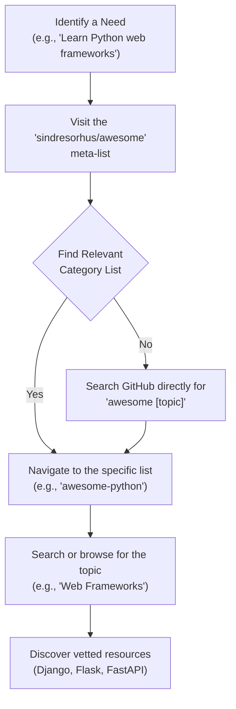

# Technical Insight: Navigating GitHub's Awesome Lists

In the vast ecosystem of software development, finding high-quality, up-to-date resources can feel like searching for a needle in a haystack. Enter "Awesome Lists"—community-curated collections of the best frameworks, libraries, tools, and articles on virtually any technical topic, all hosted on GitHub. These lists serve as living directories, vetted by thousands of developers worldwide.

This article dives into the world of awesome lists, providing a curated selection of the most valuable repositories. We'll explore what makes them a cornerstone for continuous learning and problem-solving, and highlight specific resources to kickstart your journey.

### What You'll Get

*   An understanding of what makes an "Awesome" list a go-to resource.
*   A curated list of the top 15 most-starred and actively maintained awesome repositories.
*   Hand-picked highlights from each list to guide your exploration.
*   A visual guide to leveraging these resources effectively.

---

## The Genesis of 'Awesome'

The "awesome" movement was started by [Sindre Sorhus](https://github.com/sindresorhus) with the creation of the `sindresorhus/awesome` repository. It's a meta-list that indexes other high-quality awesome lists, governed by a simple manifesto: lists should only contain awesome, not just popular, resources. This focus on quality over quantity is what makes them so powerful.

The process of using these lists is straightforward but incredibly effective for discovery and learning.

> **Pro Tip:** Always check the recent commit history of an awesome list. An actively maintained list ensures the resources are current and relevant, not just relics of a bygone tech trend.

## The Curated List: Top 15 Awesome Repositories

Here are 15 of the most starred, well-maintained, and practical awesome lists on GitHub. Each one is a gateway to a wealth of knowledge.

### 1. The Meta-List: awesome
The list that started it all. This is your primary index for discovering other awesome lists across every conceivable domain. If you need a list for a topic, start here.

*   **Repository:** [`sindresorhus/awesome`](https://github.com/sindresorhus/awesome)
*   **Key Resources:**
    *   Platforms (Node.js, .NET, etc.)
    *   Programming Languages (Python, Go, Rust, etc.)
    *   Front-End and Back-End Development
    *   Computer Science
    *   Databases
    *   Security
    *   Hardware and Robotics

### 2. awesome-python
An exhaustive collection of Python frameworks, libraries, software, and resources. It's an essential bookmark for any Python developer.

*   **Repository:** [`vinta/awesome-python`](https://github.com/vinta/awesome-python)
*   **Key Resources:**
    *   **Web Frameworks:** Django, Flask, FastAPI
    *   **Data Science:** Pandas, NumPy, SciPy
    *   **Machine Learning:** Scikit-learn, TensorFlow, PyTorch
    *   **GUI Development:** PyQt, Kivy, Tkinter
    *   **Testing:** Pytest, Unittest, Mock
    *   **Asynchronous Programming:** Asyncio, Trio

### 3. awesome-selfhosted
A list of free software network services and web applications that you can host on your own servers, giving you full control over your data and infrastructure.

*   **Repository:** [`awesome-selfhosted/awesome-selfhosted`](https://github.com/awesome-selfhosted/awesome-selfhosted)
*   **Key Resources:**
    *   **Analytics:** Plausible, Matomo
    *   **Automation:** n8n, Huginn
    *   **Communication:** Mattermost (Slack alternative), Synapse (Matrix server)
    *   **Content Management:** Ghost, Strapi, WordPress
    *   **Media Streaming:** Jellyfin, PhotoPrism

### 4. awesome-go
A curated list of awesome Go frameworks, libraries, and software. Essential for any Gopher, from beginner to expert.

*   **Repository:** [`avelino/awesome-go`](https://github.com/avelino/awesome-go)
*   **Key Resources:**
    *   **Web Frameworks:** Gin, Echo, Fiber
    *   **Database Tools & ORMs:** GORM, sqlx
    *   **Concurrency:** Tools and patterns for Goroutines
    *   **Command Line:** Cobra, Viper
    *   **Logging:** Zap, Zerolog

### 5. awesome-nodejs
A delightful collection of the best Node.js packages and resources, covering everything from frameworks to command-line utilities.

*   **Repository:** [`sindresorhus/awesome-nodejs`](https://github.com/sindresorhus/awesome-nodejs)
*   **Key Resources:**
    *   **Web Frameworks:** Express, Fastify, NestJS
    *   **Build Tools:** Webpack, Parcel, esbuild
    *   **Testing:** Jest, Mocha, Cypress
    *   **Process Management:** PM2, nodemon
    *   **Logging:** Pino, Winston

### 6. awesome-sysadmin
A valuable resource for system administrators, containing open-source software and tools for managing and monitoring systems.

*   **Repository:** [`awesome-foss/awesome-sysadmin`](https://github.com/awesome-foss/awesome-sysadmin)
*   **Key Resources:**
    *   **Backups:** BorgBackup, Restic
    *   **Automation:** Ansible, SaltStack
    *   **Monitoring:** Prometheus, Zabbix, Netdata
    *   **Version Control:** Gitea, GitLab
    *   **Virtualization:** Proxmox, QEMU

### 7. awesome-machine-learning
A comprehensive list of machine learning frameworks, libraries, and software, categorized by language and task.

*   **Repository:** [`josephmisiti/awesome-machine-learning`](https://github.com/josephmisiti/awesome-machine-learning)
*   **Key Resources:**
    *   **Frameworks by Language:** Python, R, C++, Java
    *   **Computer Vision:** OpenCV, SimpleCV
    *   **Natural Language Processing:** NLTK, SpaCy
    *   **General-Purpose ML:** XGBoost, LightGBM, CatBoost
    *   **Data Visualization:** Matplotlib, Seaborn, D3.js

### 8. awesome-interview-questions
A curated list of interview questions for almost any technology stack. An invaluable tool for both interviewers and candidates preparing for a technical role.

*   **Repository:** [`DopplerHQ/awesome-interview-questions`](https://github.com/DopplerHQ/awesome-interview-questions)
*   **Key Resources:**
    *   Language-specific questions (JavaScript, Python, Java, C++)
    *   Data Structures and Algorithms
    *   Operating System Concepts
    *   Database Concepts (SQL, NoSQL)
    *   System Design questions

### 9. awesome-for-beginners
A fantastic starting point for newcomers to open source, listing projects with beginner-friendly bugs and clear contribution guidelines.

*   **Repository:** [`MunGell/awesome-for-beginners`](https://github.com/MunGell/awesome-for-beginners)
*   **Key Resources:**
    *   Projects by language seeking contributions.
    *   Links to platforms like "Up For Grabs" and "CodeTriage."
    *   Guidance on making your first contribution.

### 10. frontend-dev-bookmarks
A massive, well-organized list of resources for front-end web developers, covering everything from architecture to UI components.

*   **Repository:** [`dypsilon/frontend-dev-bookmarks`](https://github.com/dypsilon/frontend-dev-bookmarks)
*   **Key Resources:**
    *   **Appearance:** Animation, Typography, SVGs
    *   **Architecture:** Design Patterns, Functional Programming
    *   **Compatibility:** Polyfills, Cross-browser guides
    *   **UI Component Libraries:** Material UI, Ant Design
    *   **Ecosystems:** React, Vue, Angular

### 11. awesome-devops
A curated list of tools, platforms, and resources for DevOps engineers. It covers the entire software development lifecycle.

*   **Repository:** [`bregman-arie/awesome-devops`](https://github.com/bregman-arie/awesome-devops)
*   **Key Resources:**
    *   **CI/CD:** Jenkins, GitLab CI, CircleCI
    *   **Infrastructure as Code:** Terraform, Pulumi, Ansible
    *   **Monitoring:** Grafana, Prometheus, Datadog
    *   **Containerization:** Docker, Podman, LXC
    *   **Service Mesh:** Istio, Linkerd

### 12. awesome-cheatsheets
A collection of concise cheat sheets for popular programming languages, frameworks, and development tools. Perfect for a quick syntax or command reminder.

*   **Repository:** [`LeCoupa/awesome-cheatsheets`](https://github.com/LeCoupa/awesome-cheatsheets)
*   **Key Resources:**
    *   **Languages:** Python, Bash, Go
    *   **Frontend:** React, Vue.js
    *   **Backend:** Node.js, Django
    *   **Databases:** PostgreSQL, MongoDB
    *   **Tools:** Docker, Git, Kubernetes

### 13. awesome-security
A collection of resources for security professionals and enthusiasts, covering everything from network security to penetration testing.

*   **Repository:** [`sbilly/awesome-security`](https://github.com/sbilly/awesome-security)
*   **Key Resources:**
    *   **Network Security:** Wireshark, Nmap
    *   **Web Security:** OWASP Top 10, Burp Suite
    *   **Forensics:** Autopsy, The Sleuth Kit
    *   **Threat Intelligence:** MISP
    *   **Penetration Testing:** Metasploit Framework, Kali Linux

### 14. awesome-readme
A list dedicated to the art of the README file. It showcases examples of well-crafted, informative, and engaging READMEs to inspire your own project documentation.

*   **Repository:** [`matiassingers/awesome-readme`](https://github.com/matiassingers/awesome-readme)
*   **Key Resources:**
    *   Examples of detailed, simple, and creative READMEs.
    *   Tools for generating READMEs and adding badges.
    *   Articles on how to write a good README.

### 15. awesome-docker
A curated list of Docker resources and projects. It's the central hub for anyone working with containers.

*   **Repository:** [`veggiemonk/awesome-docker`](https://github.com/veggiemonk/awesome-docker)
*   **Key Resources:**
    *   **Orchestration:** Kubernetes, Docker Swarm
    *   **Networking and Storage Plugins**
    *   **Security Scanners:** Trivy, Clair
    *   **Container Registries:** Harbor
    *   **Management Tools:** Portainer, ctop

---

## Maximizing Value from Awesome Lists

To get the most out of these resources, follow a few best practices:

*   **Search, Don't Just Scroll:** Use your browser's find function (`Ctrl+F` or `Cmd+F`) to quickly locate keywords related to your problem.
*   **Check for Freshness:** Look at the "Last commit" date to ensure the list is actively maintained. Stale lists can lead to outdated or deprecated tools.
*   **Contribute Back:** If you discover a fantastic resource that's missing, open a pull request! These lists thrive on community contributions.
*   **Use for Discovery:** Treat awesome lists as a starting point for exploration, not a rigid curriculum. They are excellent for discovering new tools and alternative solutions.

## Final Thoughts

GitHub's "Awesome" lists represent one of the best aspects of the open-source community: a collective desire to share knowledge and elevate the craft of software development. By leveraging these curated directories, you can save countless hours of research, discover industry-standard tools, and stay current in this fast-paced field. Bookmark your favorites, contribute where you can, and stay awesome.
