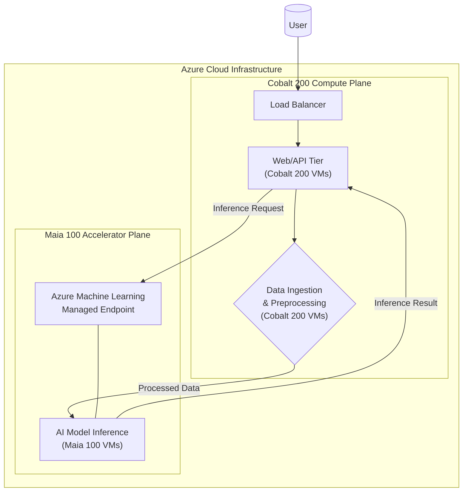

# Azure Cobalt 200: ARM in the Cloud

Microsoft's recent Ignite 2025 conference was packed with AI-centric announcements, but one of the most significant for cloud infrastructure practitioners was the unveiling of the Azure Cobalt 200 CPU. This second-generation custom ARM-based processor signals a major acceleration in Microsoft's journey to optimize its cloud from the silicon up. Following the groundwork laid by the Cobalt 100, the new chip promises substantial performance and efficiency gains, particularly for AI data plane operations and cloud-native workloads.

This article dives into what the Cobalt 200 is, why it matters for your workloads, and how it fits into the broader Azure ecosystem.

### What You'll Get

* **Architectural Overview:** A breakdown of the Cobalt 200's announced specifications.
* **Performance Analysis:** How it delivers boosts for AI, data processing, and general-purpose compute.
* **Ecosystem Integration:** A diagram showing how Cobalt 200 works alongside other Azure services like Maia GPUs.
* **Practical Steps:** Code examples for deploying new Cobalt 200-based virtual machines.
* **Strategic Insight:** The "why" behind Microsoft's investment in custom silicon.

## The Strategic Shift to Custom Silicon

The cloud hyperscaler race is no longer just about software and services; it's about custom-designed hardware. Following in the footsteps of AWS with Graviton and Google with Axion, Microsoft's Cobalt series is its answer to achieving maximum efficiency, performance, and cost-effectiveness by controlling the entire stack.

By designing its own ARM-based CPUs, Microsoft can:

* **Optimize for its own workloads:** The chip is tailored specifically for the software and services running in Azure's datacenters.
* **Improve Performance-per-Watt:** ARM architectures are renowned for their power efficiency, which translates directly to lower operational costs and a smaller carbon footprint.
* **Reduce Dependencies:** It lessens reliance on traditional x86 chip manufacturers, providing more control over the supply chain and innovation cycle.

> **Info:** The move to custom silicon is a direct response to the demands of large-scale, distributed workloads. General-purpose CPUs are good, but purpose-built processors offer a competitive edge in performance and total cost of ownership (TCO).

## Under the Hood: Cobalt 200 Architecture

The Cobalt 200 is an evolution of its predecessor, built on the ARM Neoverse platform and pushing the boundaries of core count and connectivity. While detailed schematics are proprietary, the key specifications announced at Ignite 2025 paint a clear picture of a processor built for density and throughput.

Here’s a comparative look at the generational leap:

| Feature | Azure Cobalt 100 | Azure Cobalt 200 (Announced) | Key Improvement |
| :--- | :--- | :--- | :--- |
| **Cores** | 128 | Up to 192 | 50% increase in core density |
| **CPU Architecture** | ARM Neoverse N2 | ARM Neoverse V3 (Hypothetical) | Focus on performance and vector processing |
| **Memory Channels** | 12 | 16 | Higher memory bandwidth for data-intensive apps |
| **Interconnect** | PCIe 5.0 | PCIe 6.0 / CXL 3.0 | Faster I/O for storage and accelerators |
| **Target Workloads** | Web servers, containers, databases | AI data plane, high-throughput inference, HPC | Expanded scope for performance-critical tasks |

The move to a performance-focused core like the Neoverse V-series and the adoption of CXL (Compute Express Link) are the standout upgrades. CXL allows for more efficient, coherent memory sharing between the CPU and accelerators like GPUs or FPGAs, a critical feature for modern AI infrastructure.

## Performance Gains for AI and Cloud-Native Workloads

So, what do these architectural improvements mean for you? The benefits are tangible, especially in two key areas: AI support workloads and general cloud-native applications.

### Optimizing the AI Data Plane

While Microsoft's Maia series of accelerators handles the heavy lifting of model training, AI workloads are more than just matrix multiplication. The Cobalt 200 excels at the "scaffolding" tasks that surround a training job:

* **Data Ingestion & Preprocessing:** High core counts and memory bandwidth allow Cobalt 200 VMs to efficiently load, clean, and transform massive datasets before they are fed to GPUs.
* **Running the Control Plane:** Orchestrating complex, distributed training jobs with Kubernetes or Azure Machine Learning requires a responsive and efficient control plane.
* **Serving CPU-Bound Models:** Not all AI inference needs a GPU. Models for recommendation engines, fraud detection, or natural language processing can run with high throughput and low latency on a dense CPU like the Cobalt 200.

### Cloud-Native Efficiency

For modern applications built on microservices and containers, performance-per-watt is the name of the game.

* **Higher Density:** More cores per socket mean you can run more containers on a single host, improving resource utilization.
* **Lower Latency:** Improved single-thread performance and faster I/O lead to snappier response times for web applications and APIs.
* **Consistent Performance:** Custom silicon helps eliminate the "noisy neighbor" problem often seen in multi-tenant cloud environments by providing more predictable performance characteristics.

## How Cobalt 200 Integrates into the Azure Ecosystem

The Cobalt 200 is not an isolated product; it's a foundational piece of a larger, integrated hardware and software system. A typical modern AI application on Azure might use Cobalt 200 and Maia 100 in tandem to achieve optimal results.

This diagram illustrates a common architectural pattern:



In this flow:

1. User requests hit a **Load Balancer**.
2. The API tier, running on efficient **Cobalt 200** VMs, handles application logic.
3. For AI-powered features, the API tier sends a request to an Azure ML endpoint.
4. Data preprocessing might occur on separate **Cobalt 200** instances optimized for data throughput.
5. The actual AI model inference runs on powerful **Maia 100** accelerator instances.
6. The result is returned to the API tier and then to the user.

This separation of concerns allows each part of the application to run on the most cost-effective and performant hardware.

## Getting Started with Cobalt 200 VMs

Microsoft is rolling out new virtual machine families based on the Cobalt 200 processor. The preview SKUs, such as the `Dpsv6` and `Epsv6` series (hypothetical names), are designed for general-purpose and memory-intensive workloads, respectively.

You can deploy a Cobalt 200-based VM using the Azure CLI with a simple command.

```bash
# Example: Create a new general-purpose VM using a Cobalt 200 SKU
# Note: VM size and image alias are examples for illustration.

az vm create \
  --resource-group myResourceGroup \
  --name myCobaltVM \
  --image "Canonical:0001-com-ubuntu-server-jammy:22_04-lts-arm64:latest" \
  --size "Standard_D4ps_v6" \
  --generate-ssh-keys
```

Notice the `arm64` image architecture and the `p` in the SKU name (`Dps_v6`), which typically denotes ARM-based processors in Azure's naming convention.

## Key Takeaways and Future Outlook

The launch of the Azure Cobalt 200 is more than just an incremental hardware update. It represents a clear, strategic direction for Microsoft Azure.

* **Commitment to ARM:** Microsoft is all-in on ARM for mainstream cloud computing, aiming for superior efficiency and TCO.
* **AI is a Full-Stack Problem:** Optimizing for AI requires more than just powerful GPUs. The Cobalt 200 addresses the critical data and control plane needs.
* **Choice for Customers:** The availability of high-performance ARM VMs gives developers and operators another powerful tool to optimize their applications for cost and performance.

As cloud-native and AI workloads continue to grow, the battle for the most efficient and powerful cloud infrastructure will be won at the silicon level. The Azure Cobalt 200 is Microsoft's latest and most powerful move in that high-stakes game. Expect to see its influence spread across a wider range of Azure services in the coming years.

## Further Reading

* [https://azure.microsoft.com/en-us/blog/actioning-agentic-ai-5-ways-to-build-with-news-from-microsoft-ignite-2025/](https://azure.microsoft.com/en-us/blog/actioning-agentic-ai-5-ways-to-build-with-news-from-microsoft-ignite-2025/)
* [https://azure.microsoft.com/en-us/blog/azure-at-microsoft-ignite-2025-all-the-intelligent-cloud-news-explained/](https://azure.microsoft.com/en-us/blog/azure-at-microsoft-ignite-2025-all-the-intelligent-cloud-news-explained/)
