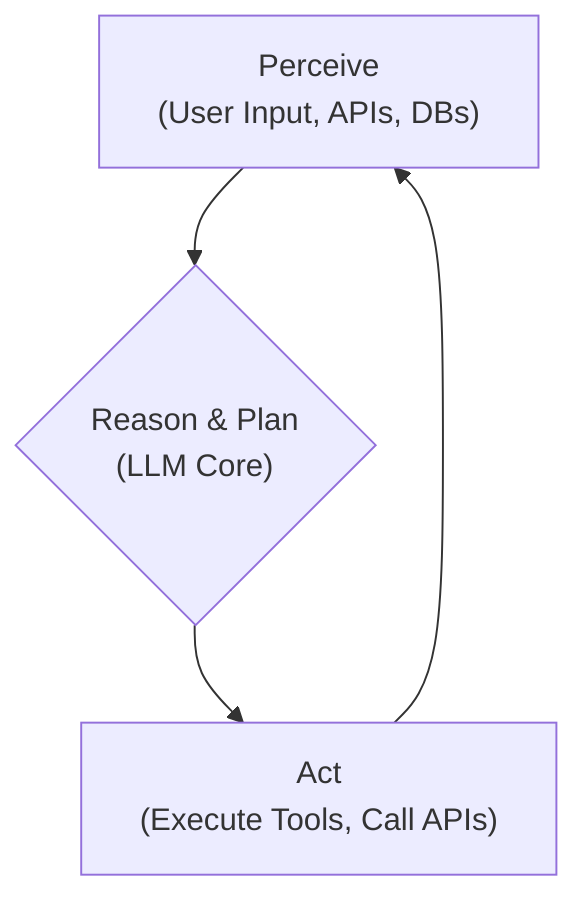
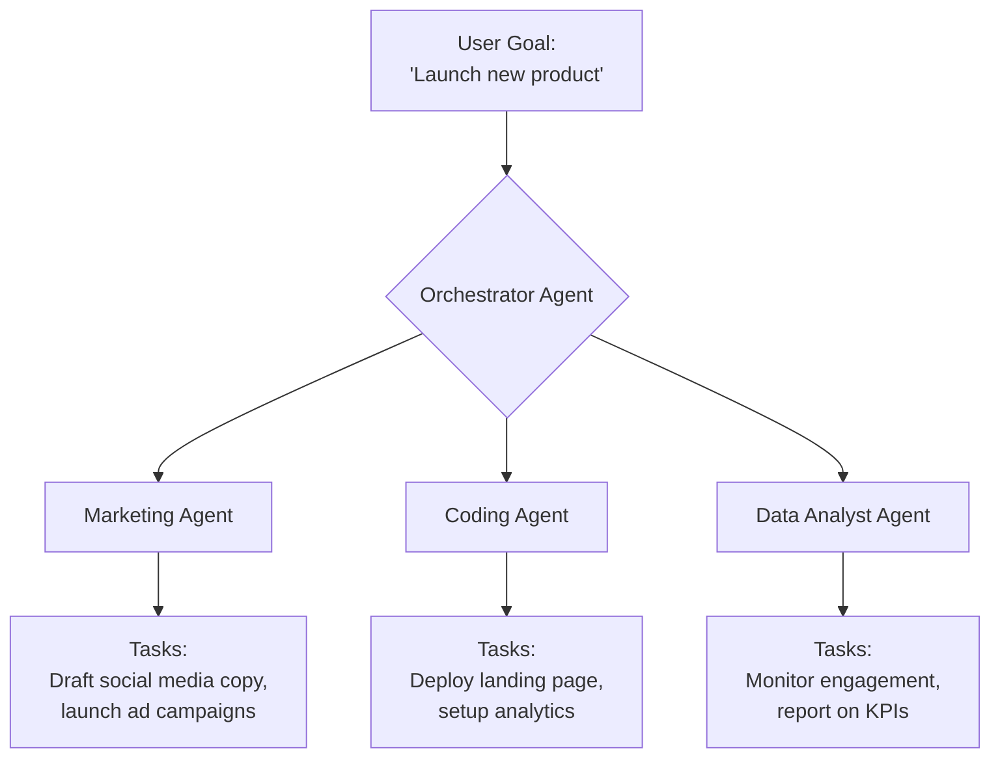

# The Death of the Chatbot: 2026 and the Rise of AI Agents

For years, the chatbot has been the face of conversational AI. We've built them for customer service, lead generation, and internal support. They can answer questions, follow scripts, and retrieve information. But their promise has always been limited by a fundamental constraint: chatbots are reactors, not actors. They talk, but they don't *do*.

A seismic shift is underway, moving from passive conversation to proactive action. By 2026, the term "chatbot" will feel as dated as "horseless carriage." The future belongs to AI Agents—autonomous systems that don't just chat with you but actively work on your behalf. This article breaks down this evolution, explaining the technology, the timeline, and what it means for every developer and product leader.

### What You'll Get

*   **Clear Distinction:** A breakdown of why AI Agents are fundamentally different from chatbots.
*   **Technical Anatomy:** An under-the-hood look at the components that power a modern AI Agent.
*   **The 2026 Tipping Point:** Key technological and economic drivers making this shift inevitable.
*   **Architectural Diagrams:** Mermaid diagrams illustrating core agentic loops and multi-agent systems.
*   **Actionable Insights:** How to prepare for a future where software is defined by autonomous agents.

---

## The Chatbot's Glass Ceiling

A traditional chatbot operates on a simple loop: listen, understand, and respond. Powered by Natural Language Understanding (NLU) and dialogue management, they excel at mapping user intent to predefined responses or knowledge base articles.

Think of a typical customer service chatbot. You ask, "What is your return policy?" It recognizes the "return-policy" intent and provides a pre-written answer. It's a conversational search engine.

However, its limitations become clear when tasks require multi-step reasoning or interaction with the outside world.
*   **Stateless by Nature:** Most chatbots have limited memory, treating each interaction as a new puzzle.
*   **Narrow Domain:** They are brittle and fail when conversations stray from their trained domain.
*   **Inability to Act:** A chatbot can *tell* you the return policy, but it can't *initiate the return for you* by interacting with the shipping, inventory, and finance APIs.

> This inability to perform actions in the digital world is the chatbot's glass ceiling. It's a helpful guide, but it can't walk the path for you.

## Enter the AI Agent: Beyond Conversation

An AI Agent is an autonomous system that perceives its environment, makes decisions, and takes actions to achieve specific goals. The conversation is merely one of many possible inputs or outputs—not the entire purpose of its existence.

The core of an agent is its ability to operate in a loop, often referred to as a reasoning loop. This empowers it to be proactive and persistent.



Unlike a chatbot that waits for your next query, an AI Agent can be given a high-level goal like, "Find the best-priced flight to Tokyo for the first week of December, book it using my saved credit card, add it to my calendar, and notify me." The agent will then autonomously:
1.  **Decompose the goal** into smaller steps.
2.  **Select and use tools** (e.g., Google Flights API, a calendar API).
3.  **Reason through obstacles** (e.g., a flight is sold out, so it looks for the next best option).
4.  **Execute the plan** until the goal is complete.

## The Anatomy of a Modern AI Agent

AI Agents are not monolithic; they are composite systems built from several key components. Understanding this architecture is crucial for building and deploying them.

### The Core LLM (The "Brain")

This is a powerful Large Language Model (like GPT-4, Llama 3, or Gemini) that provides the core reasoning and language capabilities. It's responsible for understanding user intent, decomposing problems, and formulating plans.

### The Tool Belt (The "Hands")

Agents are useless without the ability to act. Tools are functions or API endpoints that the agent can call to interact with the outside world. This is often enabled by the LLM's "function calling" or "tool use" capabilities.

A simple tool could be a `search_web` function or a `send_email` API call. The LLM's job is to determine *which* tool to use, with *what* parameters, and in *what* order.

```python
# Conceptual Python-like example of an agent's tool use
class TravelAgent:
    def __init__(self):
        self.llm = LanguageModel("gpt-4-turbo")
        self.tools = {
            "search_flights": self.search_flights,
            "book_flight": self.book_flight
        }

    def run(self, goal: str):
        plan = self.llm.create_plan(goal, self.tools)
        # Plan might be:
        # 1. call search_flights(destination="Tokyo", dates="...")
        # 2. call book_flight(flight_id="...", passenger_info="...")

        for step in plan:
            # Execute tool call
            result = self.tools[step.tool_name](**step.parameters)
            # Feed result back into the loop for re-planning if needed
```

### Memory (The "Context")

Memory allows an agent to maintain context and learn over time.
*   **Short-Term Memory:** The context of the current conversation or task (the "prompt window").
*   **Long-Term Memory:** A vector database or other storage mechanism where the agent can store and retrieve information from past interactions, documents, or successful task completions. This allows it to improve over time.

### Planning & Reasoning Engine

This is the logic that drives the agent's behavior. Instead of just responding, it plans. Popular frameworks like [LangChain](https://www.langchain.com/) and CrewAI use reasoning patterns like **ReAct (Reason + Act)**, where the LLM "thinks out loud" to decide its next action.

> **ReAct Example Thought Process:**
> **Thought:** The user wants to book a flight. First, I need to know the available flights. I should use the `search_flights` tool.
> **Action:** `search_flights(destination="Tokyo", date_range="2024-12-01 to 2024-12-07")`

## Why 2026 is the Tipping Point

The transition from chatbot to agent isn't happening overnight, but several converging trends are accelerating the timeline, making 2026 a realistic inflection point for mainstream adoption.

| Feature | Classic Chatbot | AI Agent |
| :--- | :--- | :--- |
| **Core Function** | Conversation | Goal Achievement |
| **Primary Mode** | Reactive | Proactive & Autonomous |
| **Scope** | Narrow, domain-specific | Broad, tool-augmented |
| **State** | Mostly stateless | Maintains long-term memory |
| **Primary Tech** | NLU, Dialogue Trees | LLM, Tool Use, Planning Engine |
| **User Interaction** | Asks questions | Given objectives |

Here are the key drivers:
1.  **LLM Reasoning Power:** Models are rapidly improving at complex reasoning, planning, and tool use. By 2026, these capabilities will be more reliable, faster, and cheaper.
2.  **Agentic Framework Maturity:** Frameworks like [CrewAI](https://www.crewai.com/) and Microsoft's [AutoGen](https://microsoft.github.io/autogen/) are standardizing the patterns for building single and multi-agent systems, drastically lowering the barrier to entry.
3.  **Ubiquitous API Access:** The world runs on APIs. This "API-ification" of services provides the digital environment for agents to perceive and act upon.
4.  **Economic Viability:** As the cost of high-quality LLM inference drops, running persistent, autonomous agents that perform complex tasks becomes economically feasible for businesses.

## The Future is Agentic: What to Expect

The ultimate evolution is the rise of **multi-agent systems**, where specialized agents collaborate to solve even more complex problems. Imagine giving a single high-level objective like, "Launch the marketing campaign for our new product."

This could trigger a system of collaborating agents:



In this model, the "user interface" might still look like a chat window, but the backend is a sophisticated, autonomous workforce executing a complex project.

## Conclusion: It's Not a Replacement, It's an Evolution

The chatbot isn't "dying" in the sense that it will vanish. Rather, its functionality is being absorbed and transcended by the far more capable AI Agent. The conversational interface will remain a primary way we interact with technology, but the intelligence behind that interface will shift from a reactive respondent to a proactive partner.

For developers and technical leaders, the time to start building with an agentic mindset is now. Stop asking "How can I answer this question?" and start asking, "What goal can I accomplish for my user?" That is the future, and it's arriving faster than you think.
