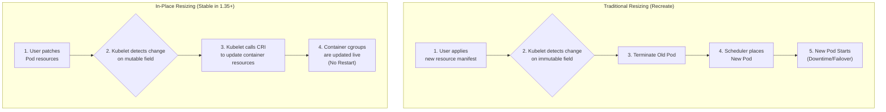

# In-Place Pod Resizing: K8s Autoscaling

For years, a simple resource adjustment for a Kubernetes Pod meant one thing: a restart. While acceptable for stateless applications, this was a significant operational hurdle for stateful workloads like databases, caches, and message queues. A restart could mean a dropped connection, a primary-secondary failover, or a lengthy data re-hydration process.

With Kubernetes 1.35, this paradigm shifts. The **In-Place Pod Vertical Scaling** feature, now stable, allows you to resize a Pod's CPU and memory resources *without a restart*. This is a game-changer for managing stateful applications, improving availability and reducing operational friction.

### What You'll Get

This deep dive will equip you with a practical understanding of this powerful feature. Here’s what we’ll cover:

* **Core Concepts:** The mechanism behind restart-free Pod resizing.
* **How It Works:** A look under the hood at the Container Runtime Interface (CRI) and Pod spec changes.
* **Practical Guide:** A step-by-step example of resizing a database Pod in-place.
* **Key Limitations:** What you need to know before implementing it.
* **Comparison:** How it stacks up against the traditional Vertical Pod Autoscaler (VPA).

---

## The Old Way vs. The New Way

Traditionally, changing a Pod's `resources.requests` or `resources.limits` was an immutable operation. The Kubernetes scheduler uses this information to place the Pod on a suitable node. To apply a change, the old Pod had to be terminated and a new one, with the updated resource values, was created in its place.

This "recreate" approach is disruptive by nature.

**In-Place Pod Resizing** changes this by allowing mutations to an existing Pod's resource allocations. The container's cgroup limits are updated on the node's kernel directly, providing the process with more (or less) CPU and memory on the fly.

This flow diagram illustrates the fundamental difference:



## How It Works Under the Hood

This seemingly magical feature is the result of careful coordination between the Kubernetes control plane and the container runtime on the node.

### The `resizePolicy` Field

The magic starts with a new field in the container spec: `resizePolicy`. This tells the Kubelet how to handle resource change requests for that specific container.

* `RestartNotRequired`: This is the key value. It enables in-place resizing for both CPU and memory. If the container runtime cannot fulfill the request live, the resize will fail, and the Pod will *not* be restarted.
* `Restart`: This is the default behavior, maintaining the traditional "recreate" workflow.

### The Pod Status Update

When a resize occurs, the Pod's `status` field provides visibility into the process. Two key fields are updated:

* **`resources`**: Shows the resources *allocated* to the Pod. After a successful in-place resize, this will reflect the new values.
* **`resize`**: Indicates the status of an in-place resize operation. It can be `InProgress`, `Pending`, or `Infeasible` if the node cannot accommodate the request.

The core of the operation relies on the Container Runtime Interface (CRI) supporting the `UpdateContainerResources` call. Runtimes like **containerd (v1.6.0+)** and **CRI-O (v1.28.0+)** implement this, allowing them to dynamically adjust the underlying cgroup configurations (`cpu.max`, `memory.high`, `memory.max`) for the running container.

> **Info Block:** For a deep technical dive, refer to the official [Kubernetes Enhancement Proposal (KEP-1287)](https://github.com/kubernetes/enhancements/tree/master/keps/sig-node/1287-in-place-pod-resize).

---

## Practical Example: Resizing a Database Pod

Let's walk through resizing a hypothetical PostgreSQL Pod without causing a restart.

### Prerequisites

* **Kubernetes Cluster:** Version 1.35 or newer.
* **Container Runtime:** A compatible version that supports in-place resize (e.g., containerd ≥ 1.6.0).
* **Feature Gate:** The `InPlacePodVerticalScaling` feature gate is enabled by default and stable since v1.35.

### Step 1: Define and Deploy the Pod

First, create a Pod manifest. Note the critical `resizePolicy` field set for our database container.

```bash
# pod-definition.yaml
apiVersion: v1
kind: Pod
metadata:
  name: postgres-db
spec:
  containers:
  - name: postgres
    image: postgres:15
    env:
    - name: POSTGRES_PASSWORD
      value: "mysecretpassword"
    resources:
      requests:
        cpu: "500m"
        memory: "1Gi"
      limits:
        cpu: "500m"
        memory: "1Gi"
    resizePolicy:
    - resourceName: "cpu"
      restartPolicy: "RestartNotRequired"
    - resourceName: "memory"
      restartPolicy: "RestartNotRequired"
```

Apply this manifest to your cluster:

```bash
kubectl apply -f pod-definition.yaml
```

### Step 2: Observe the Initial State

Check the running Pod. Pay close attention to the `Restarts` count and the resources.

```bash
kubectl describe pod postgres-db
```

The output will show the initial CPU and memory requests/limits and, most importantly, a restart count of `0`.

```
...
Containers:
  postgres:
    ...
    Limits:
      cpu:     500m
      memory:  1Gi
    Requests:
      cpu:      500m
      memory:   1Gi
...
Events:
  Type    Reason     Age   From               Message
  ----    ------     ----  ----               -------
  Normal  Scheduled  50s   default-scheduler  Successfully assigned default/postgres-db to my-node
  Normal  Pulled     49s   kubelet            Container image "postgres:15" already present on machine
  Normal  Created    49s   kubelet            Created container postgres
  Normal  Started    49s   kubelet            Started container postgres
```

### Step 3: Trigger the In-Place Resize

Now, let's increase the Pod's CPU and memory. We can do this with a `kubectl patch` command, which is ideal for automation. We will double the resources to 1 CPU and 2Gi of memory.

```bash
kubectl patch pod postgres-db --patch \
'{
  "spec": {
    "containers": [
      {
        "name": "postgres",
        "resources": {
          "requests": { "cpu": "1", "memory": "2Gi" },
          "limits": { "cpu": "1", "memory": "2Gi" }
        }
      }
    ]
  }
}'
```

### Step 4: Verify the Change

Immediately describe the Pod again.

```bash
kubectl describe pod postgres-db
```

You will notice several key changes in the output:

1. **No Restart:** The `Restarts` count remains `0`.
2. **Updated Resources:** The `Limits` and `Requests` sections now show the new values (`cpu: 1`, `memory: 2Gi`).
3. **New Status Field:** The `Allocated Resources` section shows the new values applied to the running container.
4. **Events:** A new event, `Resized`, confirms the operation was successful.

```
...
Containers:
  postgres:
    ...
    Limits:
      cpu:     1
      memory:  2Gi
    Requests:
      cpu:      1
      memory:   2Gi
...
Allocated Resources:
  Resource  Requests  Limits
  --------  --------  ------
  cpu       1         1
  memory    2Gi       2Gi
...
Events:
  Type    Reason     Age   From               Message
  ----    ------     ----  ----               -------
  ...
  Normal  Started    5m    kubelet            Started container postgres
  Normal  Resized    60s   kubelet            Container postgres was resized to requests: cpu="1", memory="2Gi", limits: cpu="1", memory="2Gi"
```

Success! The database pod now has double the resources without interrupting its operation.

---

## Key Considerations and Limitations

While powerful, in-place resizing isn't a silver bullet. Keep these points in mind:

* **Supported Resources:** Currently, only **CPU and memory** can be resized in-place. Other resources like ephemeral storage still require a restart.
* **Node Capacity:** The resize is only possible if the node has sufficient unallocated resources. If not, the resize will be in a `Pending` state until resources become available.
* **Resource Decreases:** While the mechanism supports decreasing resources, it can be risky for applications that don't handle memory reduction gracefully (e.g., JVM-based apps). The primary and safest use case is scaling *up*.
* **No VPA Automation:** The Vertical Pod Autoscaler (VPA) can *recommend* new resource sizes, but it does not yet use the in-place mechanism to apply them automatically. You can set VPA's `updateMode` to `"Off"` to get recommendations and then use a custom controller or manual script to apply them via `patch`.

## Comparison: In-Place vs. Traditional VPA

| Feature | In-Place Resizing (Manual Patch) | Traditional VPA (Recreate Mode) |
| :--- | :--- | :--- |
| **Restart Required?** | **No** (if `RestartNotRequired` is set) | **Yes** (Pod is evicted and recreated) |
| **Downtime** | Zero for the resize operation itself. | Brief downtime or failover event. |
| **Automation** | Manual or via a custom controller. | Fully automated by the VPA controller. |
| **Use Case** | Ideal for stateful, sensitive workloads. | Great for stateless apps, batch jobs. |
| **Control** | Precise, operator-driven control. | Declarative, policy-driven control. |
| **Resource Safety** | Fails if node lacks capacity; Pod keeps running. | Evicts Pod, which may become unschedulable. |

## Conclusion

In-Place Pod Vertical Scaling is a significant step forward for running stateful applications on Kubernetes. By eliminating the need for restarts during resource adjustments, it directly boosts availability and simplifies operations for critical components like databases and caches.

While full automation with the VPA is still on the horizon, the ability to manually or programmatically trigger a restart-free resize is an invaluable tool for any platform engineer or SRE. As you adopt Kubernetes 1.35 and beyond, integrating this feature into your operational playbooks for stateful workloads is a clear win.

## Further Reading

* [https://medium.com/@imranfosec/upgrades-everything-new-with-kubernetes-1-35-8a37fc7bcaa9](https://medium.com/@imranfosec/upgrades-everything-new-with-kubernetes-1-35-8a37fc7bcaa9)
* [https://palark.com/blog/kubernetes-1-35-release-features/](https://palark.com/blog/kubernetes-1-35-release-features/)
