# Physical AI: KubeCon Edge Recap

KubeCon North America 2025 in Salt Lake City was a pivotal moment for the cloud-native community. While cloud optimization and platform engineering remained core themes, the undeniable buzzword echoing through the halls was **Physical AI**. The conversation has decisively shifted from managing services in the cloud to orchestrating intelligent devices in the physical world. This recap distills the key trends, tools, and architectural patterns for running Kubernetes on factory floors, autonomous drones, and intelligent robots.

This wasn't just about IoT; it was about giving the physical world a cloud-native nervous system.

### What You'll Get

* **A Clear Definition:** Understand what "Physical AI" means in a cloud-native context.
* **Key Conference Takeaways:** The dominant themes from the edge and AI tracks.
* **Architectural Blueprints:** A high-level diagram for structuring physical AI deployments.
* **Tools in the Spotlight:** An overview of the CNCF projects and technologies leading the charge.
* **Future Challenges:** A look at the hard problems the community is now tackling.

***

## The Rise of Physical AI: More Than Just Edge Computing

For years, "Edge Computing" meant running small workloads closer to the user to reduce latency. Physical AI is the next evolutionary step. It's the convergence of three domains:

1. **Real-Time AI/ML:** Running inference models directly on devices to make instantaneous decisions.
2. **Physical Actuators:** The ability for software to effect change in the real world—moving a robot arm, adjusting a valve, or steering a vehicle.
3. **Cloud-Native Orchestration:** Using the Kubernetes control plane to manage this distributed, heterogeneous, and often disconnected fleet of devices.

> In essence, Physical AI is about moving from passive data collection at the edge to active, intelligent, real-world interaction, managed at scale. This is Kubernetes controlling not just pods, but physics.

The primary drivers are clear: the need for millisecond-level latency in industrial automation, the impracticality of sending petabytes of sensor data to the cloud, and the demand for autonomous systems that can function without a constant network connection.

## Key Takeaways from the Edge Track

Sessions and hallway talks revolved around a set of core principles for building these new systems.

* **Autonomy is the Default:** The assumption is no longer "always connected" but "intermittently connected." Systems must be designed for full autonomy, with the cloud serving as a declarative goal-state and data aggregation point, not a real-time controller.
* **Heterogeneous Hardware is the Norm:** Gone are the days of homogenous x86 clusters. The new edge consists of ARM64 SoCs, NVIDIA Jetson modules for AI, and even specialized FPGAs. Kubernetes is now expected to be a universal orchestrator for all of them.
* **GitOps is the Control Plane:** Managing tens of thousands of distributed, physically dispersed nodes is impossible without automation. GitOps, powered by tools like Flux and ArgoCD, was unanimously presented as the standard for declaring state and managing deployments across the entire fleet.
* **Security Beyond the Perimeter:** When a compromised node is a physical robot, security takes on a new meaning. Zero-trust principles, SPIFFE/SPIRE for workload identity, and encrypted local storage were non-negotiable topics in every architectural discussion.

## Architectural Patterns for the Physical Edge

A common architectural pattern emerged from various talks, focusing on a hierarchical or "hub-and-spoke" model. This approach balances centralized management with extreme edge autonomy.

A central control plane in the cloud manages the desired state, which is then synchronized to regional or on-premises hubs. These hubs, in turn, manage the "leaf" nodes on the factory floor or in the field.

```mermaid
graph TD
    subgraph Cloud
        CentralControlPlane["Cloud Management Plane<br/>(ArgoCD, Prometheus, Cluster API)"]
    end

    subgraph "On-Premises / Regional Hub"
        RegionalHub["Factory Data Center<br/>(Full Kubernetes Cluster)"]
    end

    subgraph "Far Edge (Physical Devices)"
        EdgeNode1["🤖 Robot Arm Controller<br/>(K3s Node, NVIDIA Jetson)"]
        EdgeNode2["📷 Vision System<br/>(K0s Node, ARM64)"]
        EdgeNode3["🚁 Drone Flight Controller<br/>(K3s Node, Disconnected)"]
    end

    CentralControlPlane -- "1. GitOps Sync (Desired State)" --> RegionalHub
    RegionalHub -- "2. Distribute Workloads" --> EdgeNode1
    RegionalHub -- "2. Distribute Workloads" --> EdgeNode2
    RegionalHub -- "2. Distribute Workloads" --> EdgeNode3
    EdgeNode1 -- "3. Real-time Control" --> Actuator["Physical Actuator"]
    EdgeNode2 -- "3. Sensor Data" --> Inference["Local ML Model"]
```



This model allows edge devices to continue operating even if the connection to the regional hub or the central cloud is severed.

## Tooling and Projects in the Spotlight

The CNCF landscape is adapting quickly to these new requirements. While the core Kubernetes API remains central, a new set of tools has become essential for the physical edge.

### Kubernetes Distributions for the Edge

A clear distinction was made between lightweight distributions suitable for resource-constrained devices.

| Project | Key Strengths | Use Case |
| :--- | :--- | :--- |
| **K3s** | Simplicity, single binary, low memory footprint. | Ideal for devices with 512MB+ RAM. General-purpose edge nodes. |
| **KubeEdge** | Robust edge-cloud communication, offline autonomy. | Perfect for managing nodes with unreliable network connections. |
| **MicroK8s** | Easy installation, rich addon ecosystem. | Great for developer workstations and slightly larger edge gateways. |

### Essential Supporting Projects

* **[Akri](https://akri.sh/):** A CNCF sandbox project that was frequently mentioned for its ability to detect and expose heterogeneous leaf devices (like cameras, USB devices, sensors) as resources in a Kubernetes cluster. This allows you to schedule workloads based on the availability of specific hardware.
* **[KubeVirt](https://kubevirt.io/):** For scenarios requiring legacy applications or specialized OS environments, KubeVirt enables running virtual machines alongside containers, managed by the same Kubernetes control plane.
* **WebAssembly (Wasm):** There was significant buzz around using Wasm as an even lighter-weight, more secure, and faster-starting alternative to containers for specific functions, particularly on the most resource-constrained devices.

Here's a look at how simple it is to get a K3s agent running and pointed to a master node, a common first step shown in many demos:

```bash
# On the K3s server node, get the token
cat /var/lib/rancher/k3s/server/node-token

# On the edge device (the agent)
export K3S_URL="https://myserver:6443"
export K3S_TOKEN="<your_token_from_server>"
curl -sfL https://get.k3s.io | sh -
```

This simplicity is key to bootstrapping thousands of devices in the field.

## Challenges and Forward-Looking Discussions

The community was refreshingly honest about the road ahead. The primary challenges are no longer just software-based.

* **Power Consumption:** Optimizing the Kubernetes stack for low-power modes and battery-constrained devices is a major area of ongoing research.
* **Physical Security:** How do you handle a compromised physical device? Discussions included remote kill-switches, hardware security modules (HSMs) for storing secrets, and automated device quarantine.
* **Data Gravity and Backhaul:** While local processing is paramount, valuable data (like model training inputs or failure analysis) must eventually be sent to the cloud. Strategies for intelligent data compression, aggregation, and opportunistic uploading were hot topics.
* **Networking in Hostile Environments:** Standard Ethernet and Wi-Fi don't work everywhere. The community is exploring protocols like LoRaWAN and 5G private networks, and how to integrate them seamlessly with CNI plugins.

## Final Thoughts

KubeCon NA 2025 marked an inflection point. Kubernetes has proven its dominance in the cloud and is now robust enough to take on the messy, unpredictable, and exciting world of physical systems. The focus on Physical AI isn't a niche—it's the natural evolution of computing, moving from data centers to the world around us. The tools are maturing, the patterns are emerging, and the community is actively building the control plane for the next generation of automation. The future of Kubernetes is not just in the cloud; it's in our factories, our fields, and our skies.

## Further Reading

* [https://events.linuxfoundation.org/kubecon-cloudnativecon-north-america/](https://events.linuxfoundation.org/kubecon-cloudnativecon-north-america/)
* [https://www.gartner.com/en/newsroom/press-releases/2025-10-20-gartner-identifies-the-top-strategic-technology-trends-for-2026](https://www.gartner.com/en/newsroom/press-releases/2025-10-20-gartner-identifies-the-top-strategic-technology-trends-for-2026)
