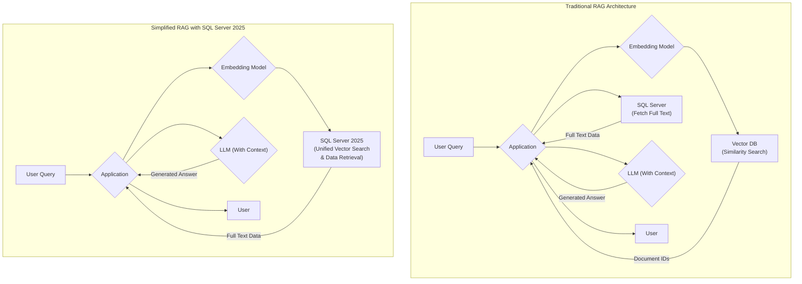

# SQL Server 2025: A New Era for AI with Native Vector Search

For years, building AI-powered applications, especially those using the Retrieval-Augmented Generation (RAG) pattern, meant wrestling with a fragmented data landscape. Your structured, operational data lived in SQL Server, while the vector embeddings crucial for semantic search were siloed in a specialized vector database. This architectural complexity introduced data synchronization challenges, increased costs, and added operational overhead.

Microsoft's announcement of SQL Server 2025 changes this dynamic entirely. By integrating native vector search capabilities directly into the database engine, SQL Server is evolving from a system of record into a comprehensive platform for building intelligent applications. This move promises to dramatically simplify AI development by unifying transactional data and vector embeddings under one roof.

### What You'll Get

In this article, we'll dive deep into what native vector support in SQL Server 2025 means for you.

* **Understand the Core Concepts:** A clear explanation of the new vector capabilities.
* **See the Architectural Shift:** A Mermaid diagram illustrating how RAG architecture is simplified.
* **Explore Practical Code:** Hypothetical T-SQL examples for creating and querying vector data.
* **Weigh the Pros and Cons:** A balanced look at the advantages and potential trade-offs.
* **The Bigger Picture:** How this feature fits into the broader Azure AI ecosystem.

---

## The Challenge: Data Silos in AI Applications

The typical RAG architecture involves a multi-step process to answer a user's query. The application must first convert the query into a vector embedding, search a dedicated vector database for similar vectors, retrieve the corresponding document IDs, and then fetch the full, readable text from a primary database like SQL Server.

This approach, while functional, creates several significant pain points:

* **Data Synchronization:** Keeping the vector database and SQL Server in sync is a constant challenge. Deletes or updates in one system must be meticulously replicated in the other.
* **Increased Complexity:** Developers have to learn, manage, and secure two different database systems with different APIs and operational characteristics.
* **Higher TCO:** Licensing, hosting, and maintaining a separate, specialized vector database adds significant cost and operational burden.
* **Transactional Integrity Issues:** It's difficult to maintain ACID-compliant transactions across two disparate systems. An update could succeed in SQL Server but fail during the vector update, leaving the systems inconsistent.

## SQL Server 2025's Game-Changing Solution

SQL Server 2025 tackles this problem head-on by integrating the vector store directly into the relational database. This isn't just about adding a new data type; it's a fundamental enhancement to the query engine.

### What is a Vector Embedding?

Quickly, a vector embedding is a numerical representation of data (like text, images, or audio). These vectors are arranged in a high-dimensional space where their proximity to one another represents semantic similarity. For example, the vectors for "king" and "queen" would be closer together than the vectors for "king" and "cabbage." This is the magic that powers semantic search.

### Core Components of the New Feature

While the final implementation details are emerging, the native vector support in SQL Server 2025 is expected to include three key components:

1. **A Native `VECTOR` Data Type:** A new, first-class data type for storing high-dimensional vector embeddings generated by models like OpenAI's `text-embedding-ada-002` or open-source alternatives.
2. **Efficient Vector Indexing:** To perform fast similarity searches over millions or billions of vectors, a specialized index is required. SQL Server will likely implement a state-of-the-art algorithm like **Hierarchical Navigable Small World (HNSW)**, which is known for its speed and accuracy.
3. **New T-SQL Functions:** New functions will be introduced to calculate the distance or similarity between vectors. We can expect functions like `COSINE_DISTANCE` or `DOT_PRODUCT` to become part of the T-SQL vocabulary.

> **Info Block:** This integration means you can now perform a `JOIN` between your structured customer data and unstructured product review embeddings, all within a single, ACID-compliant SQL query. This unlocks powerful analytical capabilities that were previously complex to achieve.

## Practical Application: Simplifying RAG Architecture

The most immediate impact of this feature is the radical simplification of the RAG pattern. The convoluted, multi-database dance becomes a streamlined, single-database query.

Here’s a high-level view of the architectural shift:



As the diagram shows, the separate calls to a vector DB and SQL Server are consolidated into a single, efficient operation.

## Getting Hands-On: A Glimpse into the Syntax

While the exact T-SQL syntax is subject to change before the final release, we can make educated guesses based on common database patterns. Here’s what it might look like.

*Disclaimer: The following code is hypothetical and for illustrative purposes only.*

### 1. Creating a Table with a Vector Column

First, you would define a table with a column of the new `VECTOR` type, specifying its dimensions. The dimensions must match the output of your chosen embedding model (e.g., `text-embedding-ada-002` uses 1536 dimensions).

```sql
CREATE TABLE ProductReviews (
    ReviewId INT PRIMARY KEY,
    ReviewText NVARCHAR(MAX),
    -- Assuming a 1536-dimension vector from an OpenAI model
    ReviewEmbedding VECTOR(1536)
);
```

### 2. Creating a Vector Index

To enable fast lookups, you would create a vector index on the embedding column, likely specifying the similarity metric.

```sql
CREATE VECTOR INDEX idx_reviews_embedding
ON ProductReviews(ReviewEmbedding)
WITH (SIMILARITY = COSINE);
```

### 3. Performing a Similarity Search

This is where the magic happens. Your application generates an embedding for the user's query and uses it to find the most relevant documents in a single SQL statement.

```sql
-- Assume @userQueryEmbedding is a variable holding the vector
-- for a user's search query, e.g., "durable coffee maker"

DECLARE @userQueryEmbedding VECTOR(1536) = [0.012, -0.008, ..., 0.021];

-- Find the top 5 most relevant product reviews
SELECT TOP 5
    r.ReviewId,
    r.ReviewText,
    -- New function to calculate the similarity score
    VECTOR_DISTANCE(r.ReviewEmbedding, @userQueryEmbedding) AS SimilarityScore
FROM
    ProductReviews r
ORDER BY
    SimilarityScore ASC; -- For distance, lower is better
```

This single query replaces the multiple network hops and complex application logic required in a dual-database architecture.

## The Strategic Advantage: Why This Matters

Adopting native vector search in SQL Server isn't just a technical convenience; it's a strategic decision.

| Feature             | Pros                                                                                                | Cons (Potential)                                                                                       |
| ------------------- | --------------------------------------------------------------------------------------------------- | ------------------------------------------------------------------------------------------------------ |
| **Unified Data**    | No data synchronization issues. ACID compliance across structured and vector data.                    | May not match the raw performance of a highly-specialized, in-memory vector DB for hyper-scale loads.  |
| **Reduced TCO**     | Eliminates the need for a separate vector database, reducing licensing, infrastructure, and ops costs. | The feature will likely be available in higher-end editions of SQL Server.                            |
| **Simplified Stack**  | Developers work with a single, familiar T-SQL interface. Reduced architectural complexity.            | The feature set at launch might be less mature than established, dedicated vector databases.         |
| **Security**        | Leverage SQL Server's robust security model (Row-Level Security, TDE) for your vector data.             | Misconfiguration of vector indexes could lead to performance issues.                                   |
| **Existing Skills** | Your team's existing SQL Server expertise is immediately applicable. No need to retrain for a new DB. | Teams may still need to learn the nuances of vector search and embedding management.                     |

## Beyond the Database: The Azure AI Integration

This feature doesn't exist in a vacuum. It's a key part of Microsoft's broader strategy to create an end-to-end intelligent data platform. You can expect deep integration with:

* **Azure AI Studio:** To streamline the process of generating embeddings and building RAG applications.
* **Microsoft Fabric:** Allowing for seamless AI-powered analytics over data from multiple sources.
* **Copilot:** Enabling natural language querying capabilities directly against your operational and vector data.

For more on the big picture, see the official announcements from Microsoft events like [Microsoft Ignite](https://azure.microsoft.com/en-us/blog/azure-at-microsoft-ignite-all-the-intelligent-cloud-news-explained/).

## Final Thoughts: A Paradigm Shift for SQL Server

The introduction of native vector search in SQL Server 2025 is arguably one of the most significant updates to the platform in years. It redefines the role of the relational database in the age of AI, transforming it into a powerful, unified engine for building the next generation of intelligent applications.

By bringing vector search home to where the data already lives, Microsoft is removing a major barrier to AI adoption. For developers, data scientists, and DBAs, this means simpler architectures, faster development cycles, and the ability to unlock new insights by combining structured and unstructured data in powerful ways. The future of AI-powered applications is here, and it runs on SQL.

## Further Reading

* [https://azure.microsoft.com/en-us/blog/azure-at-microsoft-ignite-2025-all-the-intelligent-cloud-news-explained/](https://azure.microsoft.com/en-us/blog/azure-at-microsoft-ignite-2025-all-the-intelligent-cloud-news-explained/)
