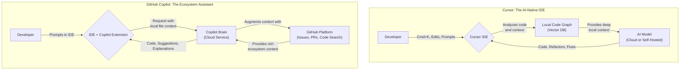

# Cursor vs Copilot: A 2026 Comparison

The year is 2026, and the debate over the best AI development tool is no longer about *if* you use one, but *which one* orchestrates your workflow. The initial novelty of AI-powered autocomplete has matured into a landscape of deeply integrated, context-aware coding partners. Two titans dominate this new era: **Cursor**, the AI-native IDE, and **GitHub Copilot**, the ubiquitous assistant deeply woven into the world's largest development ecosystem.

This article cuts through the noise to give you a practitioner's analysis of where these tools stand today, in 2026. We'll dissect their core philosophies, compare their most advanced features, and help you decide which one is the right copilot for your cockpit.

## What You'll Get From This Article

* **Core Philosophy:** Understand the fundamental difference between an integrated AI IDE and a universal AI assistant.
* **Feature Deep-Dive:** A detailed comparison of codebase context, autonomous agents, and enterprise readiness in 2026.
* **Visual Architecture:** A Mermaid diagram illustrating their distinct operational models.
* **Decision Matrix:** A clear table to help you choose the right tool for your specific needs.
* **Future Outlook:** A concise summary of their roles in the modern development loop.

## Core Philosophy: Integrated IDE vs. Ubiquitous Assistant

The primary difference between Cursor and Copilot in 2026 lies not in a single feature but in their foundational approach to software development.

**Cursor** is an *opinionated, AI-first Integrated Development Environment (IDE)*. It's built from the ground up with the assumption that an AI is a core part of the editing, debugging, and refactoring loop. Every feature, from its file tree to its terminal, is designed for seamless AI interaction. It's a complete, self-contained environment.

**GitHub Copilot**, on the other hand, is a *decentralized, ubiquitous AI assistant*. Its power comes from its deep, native integration across a vast ecosystem. It lives in VS Code, JetBrains IDEs, Neovim, and, most importantly, across the entire GitHub platform—from Issues and Pull Requests to Actions and Codespaces. Copilot doesn't replace your tools; it supercharges them.

## Feature Deep Dive: The 2026 Landscape

While both tools long ago achieved parity on basic code completion, the battleground has shifted to higher-level, context-aware tasks.

### Code Generation: Beyond Autocomplete

By 2026, single-line and function-level completions are commodity features. The differentiation is now in generating entire modules, test suites, and boilerplate from high-level prompts.

* **Cursor:** Excels at "in-editor" generation. Its famous `Cmd+K` prompt has evolved into a "Code Weaver" that can scaffold entire class structures, respecting existing architectural patterns it infers from the codebase. It feels like having a senior architect built into your editor.
* **Copilot:** Focuses on "scaffolding from intent." A developer can reference a GitHub Issue (`#42_add_auth_api`) in a comment, and Copilot will generate not just the API routes but also the corresponding controller logic, service stubs, and even a draft PR description.

> **In Practice:** For greenfield projects or major refactors within a single repository, Cursor's integrated generation feels faster. For work that spans multiple services or is tightly coupled to a project management workflow on GitHub, Copilot's ecosystem awareness is unparalleled.

### The Context is King: Full Codebase Awareness

This is where the most significant divergence occurs. Understanding the entire project is critical for meaningful AI assistance.

**Cursor's "Code Graph"**
Cursor has perfected its local-first, privacy-preserving indexing. It builds a vector database—what it calls a "Code Graph"—of your entire codebase on your machine.

* **How it works:** It indexes classes, functions, dependencies, and even documentation comments.
* **Advantage:** Blazing fast and completely private. When you ask it to "refactor the user authentication flow," it already understands every component involved without sending massive amounts of code to the cloud.
* **Limitation:** The context is primarily limited to the code open in the editor's workspace.

**Copilot Workspace**
GitHub Copilot's solution, "Copilot Workspace," leverages the power of the GitHub platform itself. It's less of a local index and more of a JIT (just-in-time) context-aggregator.

* **How it works:** When prompted, it intelligently pulls context not just from your repo files but from linked Issues, recent PR comments, and even relevant documentation found within the organization's other repositories.
* **Advantage:** Unmatched breadth of context. It can answer questions like, "How does the mobile team's new SDK affect our API?"
* **Limitation:** It relies on a connection to GitHub and can feel slightly slower for purely in-repo queries.

### Autonomous Agents: From Prompt to Pull Request

The most futuristic evolution is the rise of AI agents capable of handling complex, multi-step tasks.

A typical agent prompt might look like this:

```plaintext
@agent Implement feature described in #117.
This involves:
1. Creating a new database migration for a 'settings' table.
2. Adding a new API endpoint GET /api/v1/settings.
3. Fetching data and returning it.
4. Add basic integration tests.
5. Open a draft PR when complete.
```

* **Cursor Agents:** Operate within the IDE. The agent will open files, write code, run the built-in terminal to execute migrations and tests, and stage the changes. The developer watches this happen in real-time and can intervene at any step. It’s like watching an expert pair programmer take over your machine.
* **Copilot Agents:** Operate at the platform level, often powered by GitHub Actions. The agent's work is performed in a sandboxed cloud environment. You see the results as a series of commits pushed to a new branch, culminating in a pull request. It's more of a "fire and forget" delegation model.

### The Enterprise Battleground: Compliance and Customization

For professional teams, security, compliance, and customizability are non-negotiable.

* **Self-Hosting & Fine-Tuning:**
  * **Cursor:** Offers a straightforward, containerized self-hosting solution. Teams can fine-tune models on their private monorepos, ensuring the AI deeply understands their proprietary frameworks and coding standards. This is a major draw for companies in regulated industries.
  * **Copilot:** Leverages GitHub Enterprise Cloud and Server. Customization is done through "Organizational Contexts," allowing the model to be biased toward your organization's code without direct fine-tuning, preserving the integrity of the base model.
* **Security & Compliance:**
  * Both platforms offer robust security postures, including SOC 2 Type II compliance and data encryption at rest and in transit.
  * Copilot benefits from Microsoft's massive security infrastructure and inherits its compliance certifications (e.g., FedRAMP, HIPAA), a crucial factor for many large enterprises.

## Architectural Showdown: A Visual Guide

This diagram illustrates the core architectural difference. Cursor is a self-contained unit, while Copilot is a distributed brain connected to a larger ecosystem.



## 2026 Decision Matrix: Which Tool is for You?

| Criteria | Cursor | GitHub Copilot |
| :--- | :--- | :--- |
| **Ideal User** | "AI Purist" developer, startups, teams wanting a fully integrated experience. | "Pragmatic" developer, large enterprise teams, open-source contributors. |
| **Core Strength** | Deep, fast, local codebase context and a seamless in-editor AI workflow. | Unmatched integration with the entire software development lifecycle on GitHub. |
| **Learning Curve** | Moderate. Requires adopting a new IDE and its AI-centric workflows. | Low. Augments your existing IDE and workflow. |
| **Context Scope** | Excellent for single-repository, deep-dive tasks. | Superior for cross-repository, platform-aware tasks. |
| **Enterprise Readiness** | Strong, with excellent self-hosting and fine-tuning capabilities. | Exceptional, leveraging Microsoft's cloud and compliance infrastructure. |
| **Collaboration** | Good. Features like shared AI sessions are available. | Outstanding. Collaboration is native via GitHub Pull Requests, Issues, and Discussions. |

## Final Thoughts: A Symbiotic Future

The choice between Cursor and GitHub Copilot in 2026 is not about which AI is "smarter." Both leverage state-of-the-art models. The decision rests on your preferred development philosophy.

* **Choose Cursor** if you want an AI-first, all-in-one environment that provides the fastest and deepest possible context for the code directly in front of you. It's for the developer who wants their editor to be a true AI-powered workbench.
* **Choose GitHub Copilot** if your workflow is deeply embedded in the GitHub ecosystem. It's for the developer who sees coding as one part of a larger process involving issues, pull requests, and CI/CD, and wants an AI that is fluent in that entire language.

Ultimately, the market is large enough for both. These tools are no longer just about writing code faster; they are about offloading cognitive overhead, allowing developers to focus on what truly matters: building great software.

## Further Reading

* [https://byclaritytech.com/cursor-vs-github-copilot/](https://byclaritytech.com/cursor-vs-github-copilot/)
* [https://www.builder.io/blog/cursor-vs-github-copilot](https://www.builder.io/blog/cursor-vs-github-copilot)
