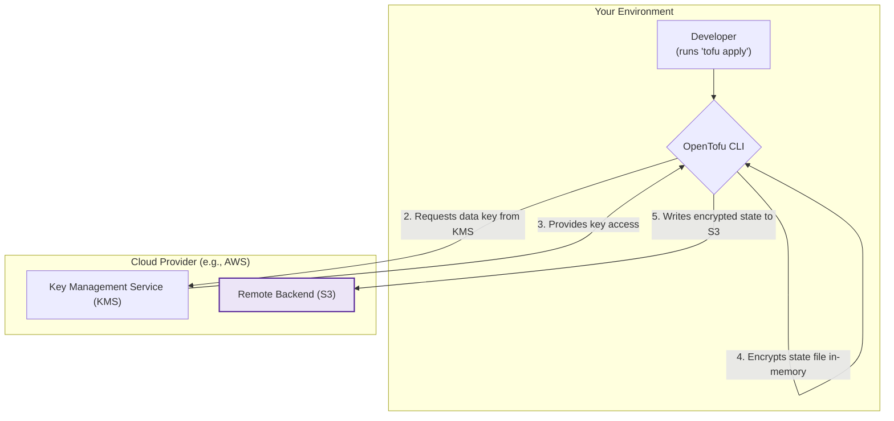

# OpenTofu Encryption at Rest: A Practical Security Guide

OpenTofu, like its predecessor, manages infrastructure through a state file. This file, typically `terraform.tfstate`, is a detailed map of your configuration to the real-world resources it provisions. While essential for operation, an unencrypted state file is a significant security liability, often containing sensitive data like database credentials, private keys, and API tokens in plaintext.

Protecting this file isn't optional; it's a critical security measure. This guide provides a hands-on approach for DevOps and platform engineers to implement state encryption, ensuring your infrastructure's secrets remain secret.

### What You'll Get

* **Understand the Risk:** A clear explanation of why plaintext state files are dangerous.
* **The Encryption Model:** A high-level view of how OpenTofu's client-side encryption works.
* **Step-by-Step Tutorial:** A practical example using AWS S3 and KMS for state encryption.
* **Multi-Cloud Reference:** Quick reference for configuring encryption on Azure and GCP.
* **Actionable Best Practices:** Hardened security practices to protect your state beyond just encryption.

---

## The Inherent Risk of Plaintext State Files

The OpenTofu state file is a JSON object that acts as the single source of truth for your managed infrastructure. It's how OpenTofu knows what it created, what its current configuration is, and how to plan changes.

However, this detailed mapping includes any sensitive values passed to your resources. Consider this common scenario:

```hcl
resource "aws_db_instance" "default" {
  # ... other configuration
  username = "dbadmin"
  password = var.db_password # A sensitive variable
}

resource "aws_iam_access_key" "user_key" {
  user = aws_iam_user.lb.name
}

output "access_key_secret" {
  value     = aws_iam_access_key.user_key.secret
  sensitive = true
}
```

Even if `db_password` is marked as sensitive, its value will be stored in the state file in clear text. The `sensitive` flag only prevents it from being shown in the CLI output. Anyone who gains access to the `terraform.tfstate` file can read:

* The database password.
* The generated IAM user's secret access key.
* Any other secrets required to build your infrastructure.

> **Security First:** A leaked state file can be a catastrophic event, giving an attacker the keys to your kingdom. Storing state in a remote, encrypted, and access-controlled backend is a non-negotiable practice for all production environments.

## How OpenTofu State Encryption Works

OpenTofu solves this problem with **client-side encryption**. The encryption and decryption of the state file happen on the machine running the `tofu` command, not on the backend storage service. The remote backend (like S3 or Azure Blob Storage) only ever stores the encrypted ciphertext.

This model ensures that the cloud storage provider cannot see the contents of your state file, and an attacker who compromises only the storage bucket still cannot read your secrets without also compromising the encryption key.

Here is a diagram of the workflow when you run `tofu apply`:



The key takeaway is the separation of concerns:

* **Storage Backend (S3):** Stores the encrypted blob. It has no knowledge of the encryption key.
* **Key Management Service (KMS):** Manages the encryption key and access policies. It never sees the state file data.
* **OpenTofu CLI:** Orchestrates the process, temporarily handling the plaintext state in memory before encrypting it for transit and rest.

## Practical Implementation: Encrypting State with AWS S3 and KMS

Let's walk through the most common setup: an S3 bucket for storage and AWS Key Management Service (KMS) for encryption.

### Prerequisites

1. **AWS Account:** With permissions to manage S3, DynamoDB, and KMS.
2. **S3 Bucket:** A dedicated, private S3 bucket to store the state.
3. **DynamoDB Table (Recommended):** For [state locking](https://opentofu.org/docs/language/settings/backends/s3/), to prevent concurrent runs from corrupting the state.
4. **KMS Key:** A customer-managed KMS key for encryption.

### Step 1: Create the KMS Key

First, create a KMS key that OpenTofu will use. You can do this via the AWS CLI or with OpenTofu itself. For simplicity, here's the AWS CLI command:

```bash
aws kms create-key --description "OpenTofu state file encryption key"
```

Note the `Arn` from the output. You will need it for the backend configuration.

> **Pro Tip:** Using a dedicated, customer-managed KMS key (not the default S3 key) gives you granular control. You can define specific IAM policies on the key to control who or what (e.g., a CI/CD pipeline role) can decrypt the state file.

### Step 2: Configure the OpenTofu Backend

Next, configure the `s3` backend in your OpenTofu project. Create a file like `backend.tf` and add the following configuration.

```hcl
terraform {
  backend "s3" {
    bucket         = "your-unique-opentofu-state-bucket-name"
    key            = "global/s3/terraform.tfstate" # A path within your bucket
    region         = "us-east-1"
    dynamodb_table = "your-opentofu-lock-table"

    # --- Encryption Configuration ---
    encrypt        = true
    kms_key_id     = "arn:aws:kms:us-east-1:123456789012:key/your-kms-key-id"
  }
}
```

Let's break down the crucial encryption arguments:

* `encrypt = true`: This is the master switch. It tells OpenTofu to expect the state file to be encrypted.
* `kms_key_id`: This is the ARN of the KMS key you created in the previous step. This tells OpenTofu *which* key to use for the encrypt/decrypt operations.

### Step 3: Initialize and Apply

With the configuration in place, run `tofu init`. OpenTofu will recognize the backend block and configure itself to use your S3 bucket.

```bash
tofu init
```

From this point on, every `tofu apply`, `tofu plan`, or any other command that writes to the state will automatically perform the client-side encryption before sending the data to S3. If you inspect the object in the S3 bucket, you'll see it has `Server-side encryption: AWS-KMS` and the content will be unreadable ciphertext.

## Supported Backends and Considerations

While S3 is popular, other major cloud backends offer similar native encryption capabilities.

| Backend | Key Service | Configuration Snippet Example |
| :--- | :--- | :--- |
| **AWS S3** | AWS KMS | `encrypt = true` <br/> `kms_key_id = "arn:..."` |
| **AzureRM** | Azure Key Vault | `use_azuread_auth = true` <br/> `key_vault_key_id = "https://..."` |
| **GCS** | Google Cloud KMS | `encryption_key = "projects/.../cryptoKeys/..."` |

> Find detailed configuration options in the [official OpenTofu documentation for backends](https://opentofu.org/docs/language/settings/backends/configuration/).

What if your backend doesn't support encryption? The `local` backend, for example, simply writes `terraform.tfstate` to your filesystem. In this case, responsibility shifts to you. You must ensure the disk where the state is stored is encrypted using OS-level tools (like BitLocker or LUKS). However, using the local backend is **strongly discouraged** for any collaborative or production workload.

## Best Practices for State Security

Encryption is the core of state security, but it's not the whole story. Harden your setup with these practices:

* **Use Least Privilege IAM:** The role or user running OpenTofu should have *only* the permissions it needs: `s3:GetObject`, `s3:PutObject` on the state file, `dynamodb:*` on the lock table, and `kms:Decrypt`, `kms:Encrypt`, `kms:GenerateDataKey` on the specific KMS key.
* **Enable Bucket Versioning:** On your S3 bucket, enable versioning. This acts as a safety net against accidental state deletion or corruption.
* **Block Public Access:** Ensure your S3 bucket is configured to block all public access. This should be the default, but it's crucial to verify.
* **Never Commit State to Git:** Add `*.tfstate` and `*.tfstate.*` to your project's `.gitignore` file immediately. Git is not a secure or appropriate place for state files.
* **Audit Access:** Use cloud-native logging (like CloudTrail) to monitor who is accessing the state file and the KMS key. Set up alerts for suspicious activity.

## Summary

Treating your OpenTofu state file as a high-value asset is fundamental to secure infrastructure management. By leveraging client-side encryption with a remote backend, you effectively mitigate the risk of secret exposure. The configuration is straightforward, supported by all major cloud providers, and provides a powerful layer of defense.

Implementing state encryption isn't just a best practice—it's an essential step in building a robust and secure automated infrastructure pipeline.

## Further Reading

* [https://www.harness.io/blog/late-to-opentofu](https://www.harness.io/blog/late-to-opentofu)
* [https://opentofu.org/](https://opentofu.org/)
