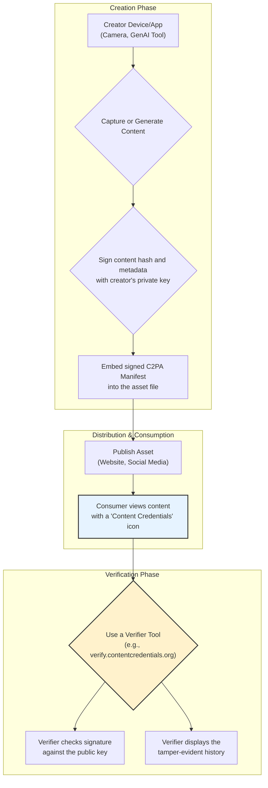

# Digital Provenance: Trusting Content in a Generated World

The digital landscape is undergoing a seismic shift. By 2026, generative AI will be a primary author of everything from marketing copy and news articles to software code and enterprise data. This creative explosion brings a critical challenge: the erosion of trust. When anything can be generated, how can we verify the authenticity, origin, and history of digital content? The answer lies in establishing **Digital Provenance**.

This article dives into the technical standards and practical tools that form the bedrock of a more trustworthy digital future. We'll explore why this isn't just a theoretical problem but a practical necessity for every developer, creator, and consumer interacting with digital information.

### What You'll Get

*   **The 'Why Now':** Understand why digital provenance is a critical technological trend for 2026.
*   **C2PA Explained:** A clear breakdown of the Coalition for Content Provenance and Authenticity (C2PA) standard.
*   **The Workflow:** A visual guide to how provenance data is created, attached, and verified.
*   **Provenance for Code:** How these concepts extend beyond images to secure the software supply chain.
*   **Tools & Limitations:** An overview of practical tools and a realistic look at the challenges ahead.

---

## Why Digital Provenance Matters in 2026

The ability to distinguish between authentic and manipulated or AI-generated content is no longer a niche concern. Industry analysts like Gartner have highlighted "AI Trust, Risk and Security Management" as a top strategic trend, emphasizing the need for robust governance and reliability in AI-driven systems.

The core problem is the collapse of the cost of creation. Sophisticated deepfakes, flawless AI-generated articles, and subtly bug-ridden code snippets can be produced in seconds. This new reality creates significant risks:

*   **Misinformation:** Malicious actors can generate realistic but false content to manipulate public opinion or markets.
*   **Security Vulnerabilities:** Developers might unknowingly use AI-generated code with hidden security flaws or non-compliant licenses.
*   **Erosion of Evidence:** In legal and journalistic contexts, proving the authenticity of a photo or document becomes nearly impossible without a verifiable trail.

> **Digital Provenance** is the verifiable, tamper-evident record of a digital object's history. It answers the questions: Who created this? When was it made? What tools were used? How has it been modified?

## Introducing C2PA: A Standard for Digital Provenance

To address this challenge, a consortium of tech and media giants including Adobe, Microsoft, Intel, and the BBC formed the **Coalition for Content Provenance and Authenticity (C2PA)**. It's an open technical standard designed to provide a universal framework for digital provenance.

### What is C2PA?

C2PA is not a tool or a platform; it's a specification. It details how to create and attach secure metadata—called **Content Credentials**—to digital assets. This metadata acts as a signed, tamper-evident nutrition label for content.

### Core Principles of C2PA

*   **Cryptographic Binding:** Content Credentials are cryptographically signed and bound to the digital asset, ensuring they cannot be easily separated or altered.
*   **Tamper-Evident History:** Each significant modification (e.g., an edit in Photoshop, a change by a generative AI tool) can be recorded as a new, signed "assertion" in the asset's history.
*   **Secure Metadata:** The manifest contains details about the creator, creation tools, and a timeline of changes.
*   **Interoperability:** As an open standard, it's designed to work across a wide range of hardware, software, and online platforms.

## The C2PA Workflow: From Creation to Verification

The C2PA process establishes a chain of trust from the moment of capture or creation. This workflow ensures that provenance information is secure and accessible at every stage of the content's lifecycle.

Here is a high-level overview of the process:



When a user views a C2PA-compliant asset, they can inspect its Content Credentials to see who created it, what tools were used (including specific AI models), and a log of any subsequent edits.

## Provenance for Developers: Verifying AI-Generated Code

The need for provenance extends far beyond images and videos. As developers increasingly rely on AI coding assistants, the risk of incorporating insecure, inefficient, or improperly licensed code grows.

Applying provenance principles to code involves attaching verifiable metadata to code snippets, commits, or entire repositories. This metadata could certify:
*   The AI model and version that generated the code.
*   The prompts used to generate it.
*   The results of automated security and style scans.
*   The detected software license.

While C2PA is primarily focused on media, similar principles are at the heart of software supply chain security projects like **Sigstore**. Sigstore enables developers to sign software artifacts using keyless methods, creating a verifiable log of a package's origin and integrity.

### A Hypothetical Code Manifest

Imagine a code block accompanied by a signed JSON manifest. This provides immediate context and a basis for trust.

```json
{
  "provenance": {
    "generator": "SecureCode-AI v3.1",
    "model_id": "sc-a7b3-9c1f-v3.1",
    "timestamp": "2026-04-22T14:00:00Z",
    "prompt_hash": "sha256-a1b2c3d4e5f6...",
    "security_scan": {
      "result": "passed",
      "scanner_version": "vuln-scanner-1.5"
    },
    "license_detected": "Apache-2.0"
  },
  "signature": {
    "algorithm": "ES256",
    "publicKey": "...",
    "value": "..."
  }
}
```
This verifiable metadata allows development platforms and CI/CD pipelines to automatically enforce policies, such as rejecting code generated by outdated models or those with failed security scans.

## Tools of the Trade: Implementing and Verifying Provenance

The digital provenance ecosystem is growing, with tools emerging for both creation and verification.

### For Creators and Developers

*   **C2PA Tool (`c2pa-tool`):** An open-source, command-line tool for creating, inspecting, and validating C2PA manifests in various file types.
*   **SDKs and APIs:** C2PA provides open-source Rust and JavaScript SDKs for developers to integrate provenance capabilities directly into their applications.
*   **Application Support:** Major software like Adobe Photoshop now includes built-in support for attaching Content Credentials upon export.

### For Consumers

*   **Content Credentials Verify:** A public website where anyone can upload a file to inspect its C2PA manifest.
*   **Browser Extensions:** Extensions are being developed to automatically detect and display Content Credentials for images viewed online.
*   **Platform Integration:** Social platforms like Behance are beginning to display Content Credentials icons on uploaded assets.

### Comparing Provenance Technologies

| Tool / Standard      | Primary Use Case              | Verification Method                | Key Feature                           |
| -------------------- | ----------------------------- | ---------------------------------- | ------------------------------------- |
| **C2PA**             | Digital Media (Images, Video) | Cryptographic Signatures           | Standardized, tamper-evident history  |
| **Sigstore**         | Software Supply Chain         | OIDC & Public Transparency Log     | Frictionless, keyless signing for code|
| **PGP/GPG**          | Document/Code Integrity       | Public Key Infrastructure (PKI)    | Establishes individual identity/trust |

## Challenges and the Path Forward

Despite its promise, digital provenance is not a silver bullet. The path to widespread adoption faces several hurdles:

*   **Adoption:** Its effectiveness depends on a critical mass of support from device manufacturers, software developers, and online platforms.
*   **Metadata Stripping:** Many platforms automatically strip metadata from uploaded files to save space, which would break the C2PA chain. The standard includes methods to mitigate this, but it requires platform cooperation.
*   **Privacy Concerns:** Provenance data, if not managed carefully, could expose sensitive information about creators' locations, devices, or workflows.
*   **The "Liar's Dividend":** Bad actors may falsely claim that authentic content is fake because it *lacks* a C2PA manifest, especially during the early adoption phase.

Ultimately, digital provenance is about re-establishing a layer of trust in a world of synthetic reality. Standards like C2PA provide the fundamental building blocks. By 2026, interacting with a digital asset without verifiable provenance may feel as risky as clicking a link from an unknown email. Building and embracing these tools is no longer optional—it's essential for a secure and authentic digital future.


## Further Reading

- [https://www.gartner.com/en/newsroom/press-releases/2025-10-20-gartner-identifies-the-top-strategic-technology-trends-for-2026](https://www.gartner.com/en/newsroom/press-releases/2025-10-20-gartner-identifies-the-top-strategic-technology-trends-for-2026)
- [https://medium.com/@kyanon.digital/top-10-tech-trends-2026-by-gartner-2a58a45fc28b](https://medium.com/@kyanon.digital/top-10-tech-trends-2026-by-gartner-2a58a45fc28b)
