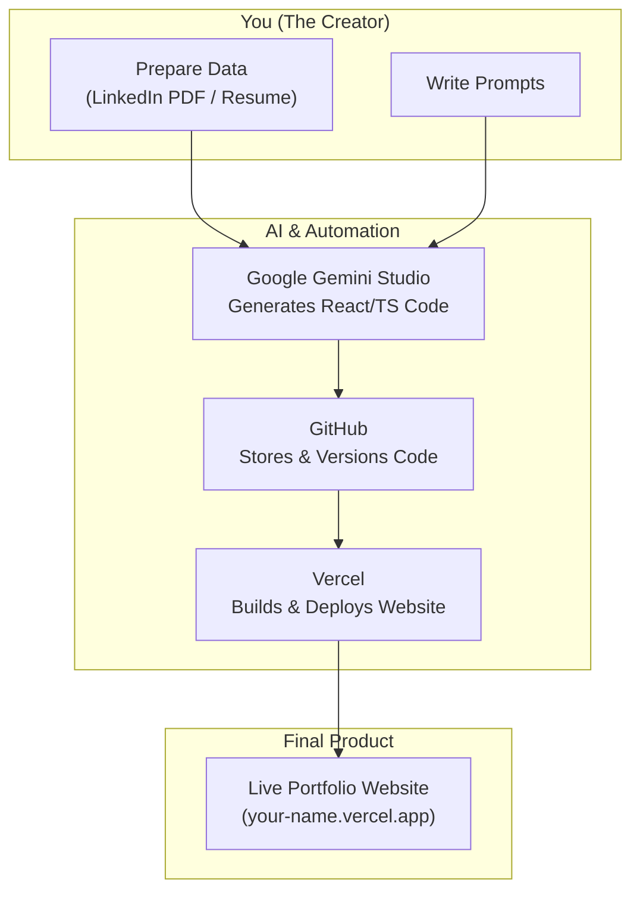

# Build Your AI-Powered Portfolio: Gemini Studio to Vercel (No Code)

In today's competitive landscape, a strong online presence is non-negotiable. A personal portfolio is your digital handshake, showcasing your skills, experience, and personality. But what if you're not a developer? What if you don't have time to learn React or CSS?

This guide demonstrates how to build and deploy a professional, modern portfolio website from scratch using AI, without writing a single line of code. We will leverage Google's Gemini Studio to generate the application, GitHub to store it, and Vercel to deploy it globally for free.

### What You'll Get

By following this guide, you will have:

* A fully functional, AI-generated portfolio website built with React and TypeScript.
* A repeatable workflow for generating and updating web applications using prompts.
* A live, publicly accessible URL for your portfolio, hosted for free.
* Knowledge of how to connect a contact form without needing a backend server.
* A clear, step-by-step process from idea to deployment.

## The No-Code AI Stack

Our entire workflow relies on a few powerful, free-tier services working in concert. This process outsources the coding, version control, and hosting, letting you focus purely on the design and content.

Here is a high-level overview of our process:



## Step 1: Prepare Your Content Source

Gemini needs information about you to build your portfolio. The easiest way to provide this is with a document you already have. You have two primary options:

1. **Your Resume:** If you have a resume in PDF format, use that. It's concise and contains all the relevant professional information.
2. **Your LinkedIn Profile:** If your resume isn't handy, you can download your LinkedIn profile as a PDF.
    * Go to your LinkedIn profile.
    * Click the **More** button below your profile headline.
    * Select **Save to PDF**.

This downloaded PDF will serve as the knowledge base for the AI.

## Step 2: Generate the Website with Gemini Studio

This is where the magic happens. We'll instruct Gemini Studio to act as our developer.

### Set Up the Project

First, navigate to [Google AI Studio (formerly Gemini Studio)](https://aistudio.google.com/). Click **Build** to start a new project.

Before we start prompting, let's configure the environment for the best results.

### Configure System Instructions

System instructions are persistent rules that the AI follows for every prompt you send. This ensures consistency and quality.

1. In the left panel, find **System instructions**.
2. Paste the following configuration. This tells the AI to create a clean, modern, and maintainable project structure.

```txt
- Keep data/config files separate from logic (JS/TS/CSS/HTML).
- Build the application using a component-based architecture, favoring small micro-components.
- Use TypeScript (TS) only; do not use JavaScript (JS).
- Prioritize using modern, well-established libraries for any complex features instead of writing them from scratch.
```

> **Why these rules?** Separating data makes your site easier to update. Component-based architecture is a modern web development standard, and TypeScript adds safety and predictability to the code, even though we aren't writing it ourselves.

1. Under the prompt box, select the output format as **React (TypeScript)**.

### Craft the Initial Prompt

Now, tell the AI what you want. Be descriptive. The more detail you provide, the better the initial result.

Here is a great starting prompt. You can customize the design keywords (`glassmorphism`, `bento grids`, `dark mode`) to your liking.

> Create a professional portfolio website for me using the information in the attached file.
>
> **Design & Layout:**
>
> * Use a **glassmorphism** aesthetic for components.
> * Organize content sections using **bento grids**.
> * The site should have a **dark mode** theme by default.
> * Ensure the design is clean, modern, and fully responsive.
>
> **Sections:**
>
> * Home/Hero section
> * Professional Experience
> * Education
> * Skills / Focus Areas
> * Certifications
> * A "Get in Touch" contact form.

After writing your prompt, click the **Upload files** button and select the PDF of your resume or LinkedIn profile. Click **Build**.

### Iterate and Refine

Gemini will generate a preview of your website on the right. It might not be perfect on the first try. This is normal.

Treat the AI as your design partner. If you don't like something, tell it specifically what to change.

* **Example Feedback:** "The 'Focus Areas' section is too large and the text is exaggerated. Make it more compact and use a smaller font."
* **Example Feedback:** "The color scheme is too bright. Use a more subdued palette of blues and grays."
* **Example Feedback:** "Add a navigation bar at the top with links to each section."

Continue providing feedback in the prompt box until you are happy with the result.

## Step 3: Store Your Code on GitHub

Once you're satisfied with the design, you need a place to store the generated code. [GitHub](https://github.com/) is the industry standard for code storage and version control.

1. **Create a GitHub Account:** If you don't have one, sign up for a free account.
2. **Connect Gemini to GitHub:** In Gemini Studio, click the **GitHub icon** in the top right. You'll be prompted to authorize access to your GitHub account.
3. **Create a Repository:**
    * After connecting, you'll be prompted to create a new repository (think of it as a project folder).
    * Give it a name, like `my-ai-portfolio`.
    * Set the visibility to **Public**.
    * Click **Create Git Repo**.
4. **Commit Your Changes:** Gemini will show you all the files it has created. Click **Commit all changes**. This saves the first version of your website's code to your new GitHub repository.

## Step 4: Deploy to the World with Vercel

Now it's time to make your portfolio live. We'll use [Vercel](https://vercel.com/), a platform designed for deploying modern web applications with zero configuration.

### Connect Vercel to GitHub

1. Sign up for a free Vercel account, choosing to **Continue with GitHub**. This automatically links both services.
2. On your Vercel dashboard, click **Add New...** > **Project**.
3. Vercel will display your GitHub repositories. Find your `my-ai-portfolio` repository and click **Import**.

### Configure and Deploy

Vercel is smart enough to recognize a React/TypeScript project and configure everything automatically.

* **Framework Preset:** Should be `Vite` or `Next.js`. Leave it as detected.
* **Root Directory:** Leave as is.
* **Build and Output Settings:** Leave the defaults.

You don't need to change anything. Just click **Deploy**.

Vercel will now build your project. This process takes a minute or two. Once complete, you'll be presented with a public URL (e.g., `my-ai-portfolio.vercel.app`). Congratulations, your portfolio is live!

### Troubleshooting: The Blank Page Issue

Sometimes, the initial deployment might show a blank white page. This is often due to a missing configuration file that tells Vercel how to handle routing.

Don't worry, the fix is simple. Go back to Gemini Studio and enter this prompt:
> My Vercel deployment is showing a blank page. Could you add a `vercel.json` file to the project to correctly configure it for a React application?

Gemini will create and configure the necessary file. Once it's done, **commit the change** to GitHub. Vercel will automatically detect the new commit and start a new deployment. This new version should work correctly.

## Step 5: Add Advanced Features

Let's add a few final touches to make your portfolio truly professional.

### A Functional Contact Form

The default contact form doesn't actually send emails. We can fix this without a backend using a service called [Web3Forms](https://web3forms.com/).

1. Go to Web3Forms and click **Create Your Form**.
2. Enter your email address where you want to receive messages.
3. Complete the sign-up. You'll be given an **Access Key**. Copy it.
4. Return to Gemini Studio and use the following prompt:

> Here is my Web3Forms access key: `YOUR_ACCESS_KEY_HERE`. Please integrate it with the "Get in Touch" form so that I can receive emails without a backend.

Commit the changes to GitHub, and your contact form will now be fully functional.

### Add a Custom Favicon

The little icon in the browser tab is called a favicon. You can ask Gemini to create one for you.

> Please add a simple SVG favicon to my website based on my initials.

If you have your own logo or image, you can:

1. In Gemini Studio, click **Upload files** to add your image (e.g., `favicon.png`).
2. Prompt: "Use the uploaded `favicon.png` as the website's favicon."

Commit the changes, and your site will have a professional favicon.

## Maintaining Your Portfolio

The best part about this workflow is how easy it is to maintain. Need to add a new job or project?

1. Go back to your Gemini Studio project.
2. Enter a prompt like, "Add a new role to my Professional Experience: Senior Gizmo Engineer at Acme Corp from 2023-Present."
3. Review the changes in the preview.
4. Commit the update to GitHub.

Vercel will automatically redeploy your site with the new information. Your portfolio stays current with just a few sentences.
