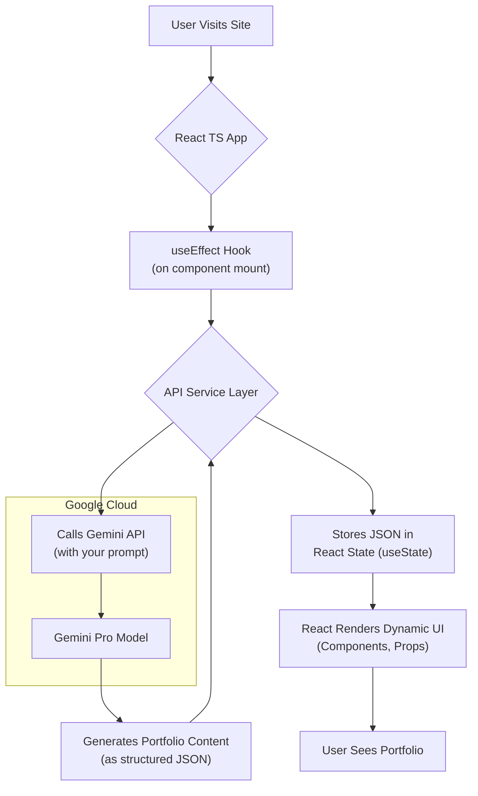

# Build a Modern Portfolio with Gemini Studio & React TS

Static, manually updated portfolios are a thing of the past. In an era of powerful Large Language Models (LLMs), you can create a portfolio that's not only visually appealing but also a demonstration of your modern development skills. This guide will walk you through building a dynamic portfolio where the content—your bio, skills, and project descriptions—is generated on the fly by Google's Gemini Pro.

We'll use Google AI Studio for rapid prompt engineering, the Gemini API for content generation, and a robust React with TypeScript frontend to display it all beautifully. Let's build something that stands out.

### What You'll Get

* A step-by-step guide to integrate Google's Gemini API into a React app.
* Actionable code snippets for setting up a React TS project from scratch.
* A high-level architecture diagram to visualize the data flow.
* A proven strategy for prompting Gemini to generate structured JSON data.
* A clear breakdown of the pros and cons of this AI-driven approach.

## The Core Idea: An AI-Powered Portfolio

The concept is simple yet powerful. Instead of hardcoding your professional summary, skills, and project details into your React components, you'll prompt the Gemini API to generate this content for you in a clean JSON format. Your React application will then fetch this JSON and render the UI.

This approach turns your portfolio from a static page into a live demonstration of your ability to integrate cutting-edge AI services.

Here’s a look at the high-level architecture:



## Prerequisites and Setup

Before we start coding, ensure you have the following tools installed and ready:

* **Node.js:** v18 or later.
* **A code editor:** Visual Studio Code is highly recommended.
* **A Google Account:** To access Google AI Studio and generate an API key.

### Setting Up Your React TS Project

We'll use Vite for a fast and modern development experience. Open your terminal and run the following command to bootstrap a new React project with TypeScript.

```bash
npm create vite@latest my-ai-portfolio -- --template react-ts
```

Navigate into your new project directory and install the dependencies:

```bash
cd my-ai-portfolio
npm install
```

Your project is now ready. You can start the development server with `npm run dev`.

### Acquiring Your Gemini API Key

Your application needs credentials to communicate with the Gemini API.

1. Navigate to [Google AI Studio](https://aistudio.google.com/).
2. Sign in with your Google account.
3. On the left-hand menu, click **"Get API key"**.
4. Click **"Create API key in new project"**.
5. Copy the generated key. **Treat this key like a password—do not commit it to your repository.**

To use the key securely, we'll use environment variables. Create a file named `.env` in the root of your project:

```
VITE_GEMINI_API_KEY="YOUR_API_KEY_HERE"
```

> **Important:** Vite exposes environment variables prefixed with `VITE_` to your client-side code. Never expose a key without this prefix, as it could leak from your server. Access your key in the code via `import.meta.env.VITE_GEMINI_API_KEY`.

## Prompt Engineering in Google AI Studio

The quality of your portfolio's content depends entirely on the quality of your prompt. Google AI Studio is the perfect playground for crafting and testing prompts before you write a single line of integration code.

### Designing the "Portfolio Generator" Prompt

Our goal is to receive a predictable JSON object. We need to be explicit with the model about the structure, data types, and content we expect.

In Google AI Studio, create a new "Freeform prompt" and use the following as a template. Customize the details in the `[brackets]` to fit your own experience.

```text
Act as a senior career coach and expert web developer portfolio creator.

Based on the following professional context, generate a full portfolio as a single, clean JSON object. Do not include any text or markdown formatting before or after the JSON.

My Professional Context:
- Role: Full-Stack Developer
- Years of Experience: 5
- Core Technologies: React, TypeScript, Node.js, PostgreSQL, Docker, AWS
- Personal Interests: Building scalable APIs, clean front-end architecture, and mentoring junior developers.

Generate the JSON with the following exact structure:
{
  "bio": "A concise and engaging professional summary, written in the first person.",
  "skills": [
    { "name": "Skill Name", "proficiency": "Expert" },
    { "name": "Another Skill", "proficiency": "Advanced" }
  ],
  "projects": [
    {
      "title": "Project Title",
      "description": "A compelling 2-3 sentence description of the project, highlighting the problem solved and the technologies used.",
      "tech": ["Tech 1", "Tech 2", "Tech 3"]
    }
  ]
}

Ensure the skills and projects are relevant to the provided context. Generate 3 projects and at least 5 skills.
```

Run this prompt in the studio. You should see a well-formed JSON object as the output. Refine the prompt until you are satisfied with the results.

## Integrating Gemini into Your React App

Now that we have a working prompt, it's time to bring it into our React application.

### Installing the Google Generative AI SDK

First, add the official Google AI SDK to your project.

```bash
npm install @google/generative-ai
```

### Creating an API Service

It's a best practice to isolate API logic from your UI components. Create a new file at `src/services/geminiService.ts`.

This service will initialize the Gemini client and export a function to fetch our portfolio data.

```tsx
// src/services/geminiService.ts
import { GoogleGenerativeAI } from "@google/generative-ai";

const apiKey = import.meta.env.VITE_GEMINI_API_KEY;
if (!apiKey) {
  throw new Error("VITE_GEMINI_API_KEY is not defined");
}

const genAI = new GoogleGenerativeAI(apiKey);

// Define TypeScript interfaces for our expected JSON structure
export interface Skill {
  name: string;
  proficiency: "Expert" | "Advanced" | "Intermediate";
}

export interface Project {
  title: string;
  description: string;
  tech: string[];
}

export interface PortfolioData {
  bio: string;
  skills: Skill[];
  projects: Project[];
}

export async function fetchPortfolioData(): Promise<PortfolioData> {
  const model = genAI.getGenerativeModel({ model: "gemini-pro" });

  const prompt = `
  Act as a senior career coach and expert web developer portfolio creator...
  // PASTE YOUR FULL, REFINED PROMPT FROM AI STUDIO HERE
  `;

  try {
    const result = await model.generateContent(prompt);
    const response = await result.response;
    const text = response.text();
    
    // Clean the response to ensure it's valid JSON
    const jsonString = text.replace(/```json/g, "").replace(/```/g, "").trim();
    
    return JSON.parse(jsonString) as PortfolioData;
  } catch (error) {
    console.error("Error fetching portfolio data:", error);
    // Return a default or fallback object in case of an error
    return {
      bio: "Failed to load data. Please try again later.",
      skills: [],
      projects: [],
    };
  }
}
```

### Fetching Data in a Component

Now, let's call this service from our main `App` component. We'll use the `useState` hook to store the portfolio data and the `useEffect` hook to fetch it when the component mounts.

```tsx
// src/App.tsx
import { useState, useEffect } from 'react';
import { fetchPortfolioData, PortfolioData } from './services/geminiService';
import './App.css';

function App() {
  const [portfolio, setPortfolio] = useState<PortfolioData | null>(null);
  const [loading, setLoading] = useState(true);

  useEffect(() => {
    const getData = async () => {
      try {
        setLoading(true);
        const data = await fetchPortfolioData();
        setPortfolio(data);
      } catch (error) {
        console.error("Failed to get portfolio data", error);
      } finally {
        setLoading(false);
      }
    };

    getData();
  }, []); // Empty dependency array means this runs once on mount

  if (loading) {
    return <div>Loading your AI-powered portfolio...</div>;
  }

  if (!portfolio) {
    return <div>Could not load portfolio data.</div>;
  }

  return (
    <div className="portfolio-container">
      <header>
        <h1>My AI-Generated Portfolio</h1>
        <p>{portfolio.bio}</p>
      </header>
      
      {/* We will build these components next */}
      {/* <SkillsList skills={portfolio.skills} /> */}
      {/* <ProjectsGrid projects={portfolio.projects} /> */}
    </div>
  );
}

export default App;
```

## Building the UI Components

With the data flowing, rendering the UI is standard React work. Breaking the UI into smaller, dedicated components is a great practice for maintainability.

### The Skills List Component

Create `src/components/SkillsList.tsx`:

```tsx
// src/components/SkillsList.tsx
import { Skill } from '../services/geminiService';

interface SkillsListProps {
  skills: Skill[];
}

export default function SkillsList({ skills }: SkillsListProps) {
  return (
    <section>
      <h2>Core Skills</h2>
      <ul>
        {skills.map((skill) => (
          <li key={skill.name}>
            <strong>{skill.name}</strong> ({skill.proficiency})
          </li>
        ))}
      </ul>
    </section>
  );
}
```

### The Project Card Component

Create `src/components/ProjectCard.tsx`:

```tsx
// src/components/ProjectCard.tsx
import { Project } from '../services/geminiService';

interface ProjectCardProps {
  project: Project;
}

export default function ProjectCard({ project }: ProjectCardProps) {
  return (
    <div className="project-card">
      <h3>{project.title}</h3>
      <p>{project.description}</p>
      <div>
        {project.tech.map(t => <span key={t} className="tech-tag">{t}</span>)}
      </div>
    </div>
  );
}
```

Now, update `App.tsx` to import and use these new components to display the full portfolio.

## Pros, Cons, and Next Steps

This approach is powerful, but it's important to understand the trade-offs.

| Pros                                 | Cons                                                 |
| ------------------------------------ | ---------------------------------------------------- |
| **Dynamic Content**                  | **API Costs** (though a generous free tier exists)   |
| **Impressive Tech Stack**            | **Rate Limiting** on the API                           |
| **Easy Updates via Prompt**          | **Inconsistent Output** (AI can be unpredictable)    |
| **Excellent Learning Project**       | **Slower Initial Load** due to the API call          |

### Next Steps

This project is a fantastic starting point. Here are some ideas to take it further:

* **Caching:** Implement caching (e.g., using `localStorage` or a service like Vercel KV) to avoid hitting the Gemini API on every page load. This will improve speed and reduce costs.
* **Styling:** Use a modern CSS framework like Tailwind CSS or a component library like Chakra UI to make your portfolio visually stunning.
* **User-Driven Prompts:** Add a UI element that allows *you* to change the prompt directly from the portfolio and regenerate the content.
* **Deployment:** Deploy your application to a platform like Vercel or Netlify for easy, continuous deployment.

By integrating a powerful LLM like Gemini, you’ve not only built a portfolio but also a testament to your skills as a forward-thinking developer. Happy coding
